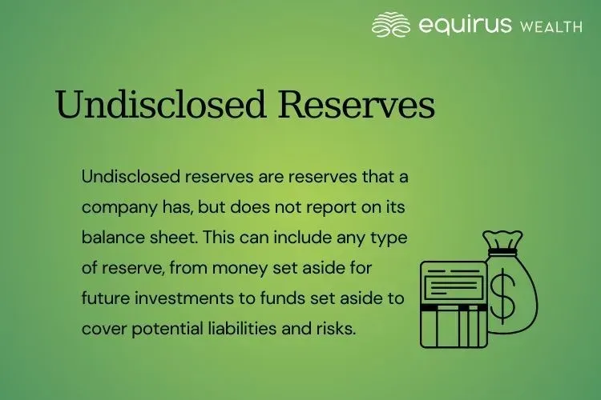

## Table of Contents

## What are undisclosed reserves?

Undisclosed reserves are profits that a company keeps hidden and does not show on its financial statements. Companies might do this to make their financial situation look less strong than it really is. This can be useful for keeping a competitive edge, as other businesses won't know how much money the company really has.

These reserves are more common in some countries than others, and they are often used in industries like banking and insurance. While having undisclosed reserves is not illegal in places where it's allowed, it can make it harder for investors and analysts to understand the true financial health of a company. This lack of transparency can lead to mistrust and make it difficult for people to make informed decisions about investing in the company.

## Why do companies use undisclosed reserves?

Companies use undisclosed reserves to keep their financial strength a secret. By not showing all their profits, they can make it look like they are not doing as well as they really are. This can be helpful in business because it keeps competitors from knowing how much money the company has. If other businesses think a company is weaker than it really is, they might not see it as a big threat. This can give the company an advantage in the market.

Another reason companies use undisclosed reserves is to prepare for tough times. If a company hides some of its profits, it can use that money later if things get hard, like during an economic downturn. This hidden money can help the company keep going when others might struggle. However, using undisclosed reserves can also make it hard for investors and analysts to trust the company, because they can't see the full picture of its finances.

## How are undisclosed reserves different from disclosed reserves?

Undisclosed reserves are profits that a company keeps secret and does not show on its financial statements. They are hidden from the public and other businesses, so no one knows how much money the company really has. Companies use undisclosed reserves to make themselves look weaker than they are, which can help them keep a competitive edge. By hiding their true financial strength, they can surprise competitors and do better in the market.

Disclosed reserves, on the other hand, are profits that a company shows on its financial statements. Everyone can see these reserves because the company reports them openly. Disclosed reserves are used to show how strong a company is financially, which can help build trust with investors and analysts. When a company uses disclosed reserves, it is being transparent about its money, which makes it easier for people to understand the company's financial health.

## What are the legal requirements for using undisclosed reserves?

The legal requirements for using undisclosed reserves depend on the country where the company is based. In some countries, like Germany and Switzerland, it is legal for companies to have undisclosed reserves. These countries allow companies to keep some of their profits hidden as long as they follow certain rules. For example, they might need to tell their auditors about the undisclosed reserves, even if they don't show them on their public financial statements.

In other countries, like the United States and the United Kingdom, it is not allowed to have undisclosed reserves. These countries have strict rules about financial transparency, which means companies must show all their profits on their financial statements. If a company in these countries tries to hide its profits, it could be breaking the law and might face fines or other penalties. So, companies need to know the rules in their country before they decide to use undisclosed reserves.

## Can you give examples of companies that use undisclosed reserves?

Some big banks in Germany, like Deutsche Bank, have used undisclosed reserves in the past. They do this to keep their financial strength a secret from other banks and businesses. By hiding some of their profits, they can make it look like they are not doing as well as they really are. This can help them surprise their competitors and do better in the market.

Insurance companies in Switzerland, like Swiss Re, also use undisclosed reserves. They keep some of their profits hidden so they can use that money during tough times, like when there are a lot of insurance claims. By not showing all their profits, they can make their financial situation look less strong than it really is, which can help them keep a competitive edge.

## How do undisclosed reserves affect a company's financial statements?

Undisclosed reserves do not show up on a company's financial statements. This means that when people look at the company's balance sheet, income statement, or cash flow statement, they won't see the hidden profits. The company keeps these reserves secret, so the financial statements only show the profits and assets that the company wants people to see. This can make the company look weaker than it really is, because the hidden money is not included in the numbers that everyone can see.

Because undisclosed reserves are not on the financial statements, they can make it hard for investors and analysts to understand the true financial health of the company. If people think the company is not doing as well as it really is, they might not want to invest in it. This lack of transparency can lead to mistrust, because people can't see the full picture of the company's money. However, in countries where undisclosed reserves are allowed, companies can use them to keep a competitive edge by hiding their real financial strength.

## What are the advantages of using undisclosed reserves?

Using undisclosed reserves can help a company keep a secret advantage over its competitors. By hiding some of their profits, a company can make it look like they are not doing as well as they really are. This can trick other businesses into thinking the company is weaker than it is. If competitors think the company is not strong, they might not see it as a big threat. This can help the company surprise its competitors and do better in the market.

Another advantage of undisclosed reserves is that they can help a company get ready for tough times. If a company hides some of its profits, it can use that money later if things get hard, like during an economic downturn. This hidden money can help the company keep going when other businesses might struggle. By having this secret money, the company can be more prepared for problems and keep its business strong.

## What are the potential risks or disadvantages of undisclosed reserves?

Using undisclosed reserves can make it hard for investors and analysts to trust a company. When a company hides some of its profits, people can't see the full picture of its money. This lack of transparency can lead to mistrust because investors and analysts need to know the true financial health of a company to make good decisions. If they think the company is hiding something, they might not want to invest in it. This can make it harder for the company to get the money it needs to grow.

Another risk of undisclosed reserves is that they can be against the law in some countries. In places like the United States and the United Kingdom, companies must show all their profits on their financial statements. If a company tries to hide its profits in these countries, it could get in trouble and face fines or other penalties. Even in countries where undisclosed reserves are allowed, companies need to be careful to follow the rules. If they don't, they could still face legal problems.

## How do undisclosed reserves impact shareholders and investors?

Undisclosed reserves can make it hard for shareholders and investors to trust a company. When a company hides some of its profits, people can't see the full picture of its money. This lack of transparency can lead to mistrust because investors need to know the true financial health of a company to make good decisions. If they think the company is hiding something, they might not want to invest in it or might sell their shares. This can make the company's stock price go down and make it harder for the company to get the money it needs to grow.

In some countries, undisclosed reserves are against the law. In places like the United States and the United Kingdom, companies must show all their profits on their financial statements. If a company tries to hide its profits in these countries, it could get in trouble and face fines or other penalties. Even in countries where undisclosed reserves are allowed, like Germany and Switzerland, companies need to be careful to follow the rules. If they don't, they could still face legal problems, which can hurt the company's reputation and make shareholders and investors even more worried.

## What are the international accounting standards related to undisclosed reserves?

International accounting standards, set by the International Accounting Standards Board (IASB), do not allow undisclosed reserves. The IASB's rules, known as International Financial Reporting Standards (IFRS), require companies to show all their profits and assets clearly on their financial statements. This means that companies following IFRS must be transparent about their money and cannot hide any profits. The goal of these standards is to make sure that investors and analysts can trust the financial information they see.

However, some countries have their own accounting rules that allow undisclosed reserves. For example, in Germany and Switzerland, companies can follow local Generally Accepted Accounting Principles (GAAP) that let them keep some profits hidden. These countries have different rules because they believe that undisclosed reserves can help companies keep a competitive edge. But, if a company wants to follow IFRS, which is used in many countries around the world, they must show all their profits and cannot use undisclosed reserves.

## How can undisclosed reserves be detected in financial analysis?

Detecting undisclosed reserves in financial analysis can be tough because they are hidden on purpose. But, analysts can look for clues by comparing a company's financial statements over time. If a company's profits seem to change a lot without a clear reason, it might be hiding some of its money. Also, if the company's financial statements show less profit than what people expect based on how the business is doing, that could be a sign of undisclosed reserves.

Another way to spot undisclosed reserves is by looking at how the company acts in the market. If a company seems to be doing better than its financial statements suggest, it might be using hidden profits to help it. For example, if a company can keep going strong during tough times without showing where the money is coming from, it might have undisclosed reserves. Analysts need to be careful and use all the information they can find to figure out if a company is hiding some of its profits.

## What are the ethical considerations surrounding the use of undisclosed reserves?

The use of undisclosed reserves raises important ethical questions about honesty and fairness. When a company hides some of its profits, it is not being open with its investors, employees, and the public. This lack of transparency can lead to mistrust, because people need to know the true financial health of a company to make good decisions. If investors feel that a company is not telling the whole truth, they might not want to invest in it, which can hurt the company's ability to grow and succeed.

On the other hand, some people argue that undisclosed reserves can be good for a company and its stakeholders. By keeping some profits hidden, a company can protect itself from competitors and be better prepared for tough times. This can help the company stay strong and keep its employees' jobs safe. However, even if undisclosed reserves are allowed in some countries, companies need to think carefully about the ethical impact of hiding money and make sure they are following the rules.

## References & Further Reading

[1]: Dye, R. A. (1985). ["Disclosure of Nonproprietary Information."](https://www.jstor.org/stable/2490910) Journal of Accounting Research, 23(1), 123-145.

[2]: Goffard, C. & Wouters, J. (2019). ["Assessing the Role of Conservatism in Banks’ Loan Loss Provisioning."](https://www.sciencedirect.com/science/article/pii/S0165410119300035) European Journal of Economics and Economic Policies: Intervention, 45(1).

[3]: Basu, S. (1997). ["The Conservatism Principle and the Asymmetric Timeliness of Earnings."](https://www.sciencedirect.com/science/article/pii/S0165410197000141) Journal of Accounting and Economics, 24(1), 3-37.

[4]: Fortin, R. & Goldman, A. (2012). ["Algorithmic Trading and Its Implications on Financial Markets."](https://www.researchgate.net/publication/378548435_Algorithmic_Trading_and_AI_A_Review_of_Strategies_and_Market_Impact) Journal of Economics and Business, 64(2), 165-178.

[5]: ["Financial Shenanigans: How to Detect Accounting Gimmicks & Fraud in Financial Reports"](https://www.amazon.com/Financial-Shenanigans-Accounting-Gimmicks-Reports/dp/0071703071) by Howard M. Schilit and Jeremy Perler

[6]: Fama, E. F. & Jensen, M. C. (1983). ["Separation of Ownership and Control."](https://www.jstor.org/stable/725104) Journal of Law and Economics, 26(2), 301-325.

[7]: Kim, Y. S. & Lee, J. H. (2010). ["Understanding the Use of Algorithmic Trading in Financial Markets."](https://chemistry-europe.onlinelibrary.wiley.com/doi/abs/10.1002/cphc.201402810) Financial Markets and Portfolio Management, 24(2), 145-156.

[8]: Laux, C. & Leuz, C. (2009). ["The Crisis of Fair-Value Accounting: Making Sense of the Recent Debate."](https://www.sciencedirect.com/science/article/pii/S0361368209000439) Accounting, Organizations and Society, 34(6-7), 826-834.