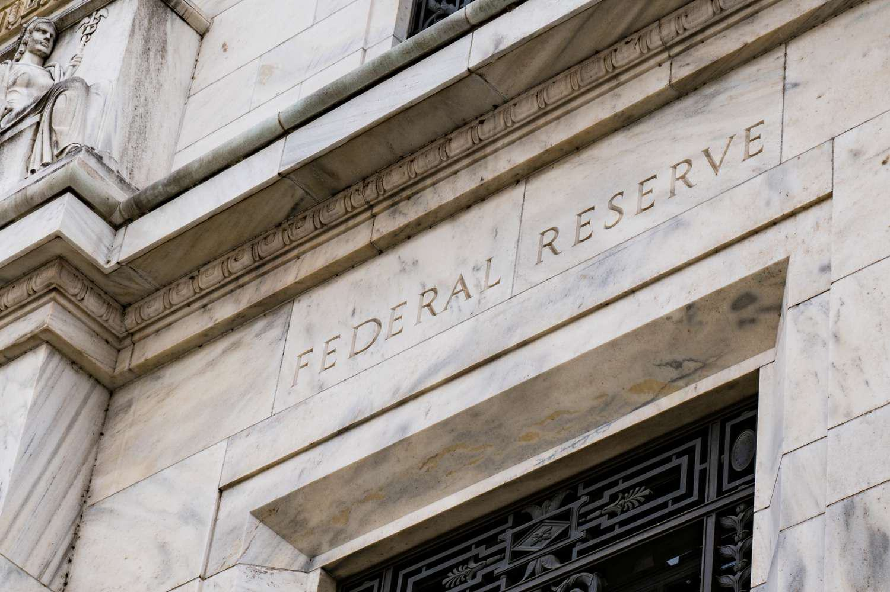

This article explores the complex interplay between undisclosed reserves, accounting practices, financial reserves, and algorithmic trading. At the heart of financial management are undisclosed reserves, which consist of financial assets not reported on public financial statements. These reserves often serve as strategic tools for companies, offering ways to manage financial health without revealing full details to the public. The hidden nature of these reserves provides advantages such as enhanced financial stability and flexibility in financial planning, but they also carry significant implications for transparency and trust.

For investors, analysts, and regulators, understanding the existence and impact of undisclosed reserves is crucial. These stakeholders rely on accurate financial data to make informed decisions, assess company valuations, and regulate market practices. The opacity associated with undisclosed reserves can pose challenges in accurately evaluating a company's financial status, potentially influencing investment decisions and regulatory assessments.

Algorithmic trading, a fundamental component of modern financial markets, underscores the necessity for transparency in financial reporting. Algorithms depend heavily on accurate and timely data to execute transactions and implement trading strategies efficiently. Inaccurate or incomplete data stemming from undisclosed financial reserves can disrupt these algorithms, leading to inefficiencies and potentially misleading market signals.

This introduction highlights the critical issues surrounding undisclosed reserves, setting the stage for a detailed examination of their benefits, challenges, and ethical considerations. Emphasizing the importance of balancing strategic financial management with transparency, the article aims to provide a comprehensive view of the interplay between these elements in the financial landscape.

## Table of Contents

## What Are Undisclosed Reserves?

Undisclosed reserves represent financial assets or reserves that are not listed on a company’s publicly available financial statements, such as balance sheets or income statements. These reserves, by their very nature, are hidden from investors, analysts, and sometimes even from certain internal stakeholders. The creation and maintenance of undisclosed reserves often result from conservative accounting practices, where companies opt to understate their assets or overstate liabilities to build financial cushions. This method, while not illegal, hinges on the judgment and discretion of accounting professionals, making it a subject of scrutiny and ethical debate.

The generation of undisclosed reserves typically involves recording expenses or losses sooner than required and deferring revenue recognition. For example, companies might use accelerated depreciation methods or create excessive provisions for future contingencies that might not materialize. Such practices aim to manage earnings over time, offering protection against future uncertainties. By not accurately reflecting these reserves, companies can stabilize their reported earnings, thereby projecting a less volatile and more financially stable image to investors.

There are several potential advantages to maintaining undisclosed reserves. Chiefly, these reserves allow companies to navigate economic downturns without significantly impacting their publicly reported profits. By having financial buffers, firms can manage cash flow and strategic investments more effectively, providing a stronger footing during financial distress. Additionally, undisclosed reserves can serve as a strategic tool in mergers and acquisitions, enabling companies to present a more favorable financial position when negotiating deals.

However, the ethical and regulatory implications of undisclosed reserves cannot be overlooked. From an ethical standpoint, the lack of transparency poses significant questions about the fairness and integrity of financial reporting. Stakeholders rely on financial statements to make informed decisions, and undisclosed reserves can undermine this trust. Regulators across various jurisdictions have established frameworks to ensure financial transparency, but these regulations can vary widely. For instance, in some countries, the accounting standards allow more flexibility in reserve accounting, leading to higher risks of misreporting.

In summary, while undisclosed reserves can provide financial stability and strategic advantages to companies, they pose challenges related to transparency and ethical considerations. The delicate balance between maintaining necessary financial buffers and ensuring honest financial representation remains a contentious issue in accounting and financial reporting.

## Accounting Practices in Managing Reserves

Accounting practices play a significant role in the creation and management of undisclosed reserves. These reserves, not listed in public financial statements, can be influenced by various accounting methods that focus on conservatism and financial prudence.

One primary technique is conservative accounting, an approach where companies recognize potential losses or liabilities sooner rather than later. This method involves deliberately understating assets or overstating liabilities to create a financial buffer. For example, when estimating the potential loss from bad debts, a company might assume a higher percentage of receivables as uncollectible than historical trends suggest. By doing so, it creates a reserve that remains undisclosed, providing a safety net for future uncertainties. This conservative stance can lead to the accumulation of undisclosed reserves, which serve as a hedge against economic downturns or unexpected expenses, ultimately contributing to a company's financial stability.

The implementation of conservative accounting practices has direct implications for financial transparency and market perception. On one hand, these practices enhance financial stability by ensuring that a company is well-prepared for future liabilities. On the other hand, they can obscure the true financial health of a company, leading to potential misvaluation in the market. Analysts and investors may find it challenging to accurately assess a company's performance without full visibility into its financial reserves.

Furthermore, the opacity created by undisclosed reserves poses a challenge to financial transparency. While these reserves can provide a cushion against future risks, their undisclosed nature means that stakeholders, including investors and regulators, might not have a complete understanding of a company's financial position. This lack of transparency can result in decreased market confidence and could potentially skew market perception, leading to a misalignment between a company's reported performance and its actual financial situation.

Conservative accounting practices aimed at managing reserves highlight the delicate balance between maintaining financial prudence and ensuring transparency. By understanding these practices, stakeholders can better grasp the underlying financial strategies employed by companies and make more informed decisions. However, it remains crucial for companies to navigate these practices with an eye toward ethical and regulatory standards, ensuring that while financial stability is maintained, transparency is not compromised.

## Impact of Undisclosed Reserves on Company Valuation

Undisclosed reserves, financial assets that remain off official balance sheets, can significantly impact the valuation of a company. These reserves may provide a hidden cushion, ultimately affecting how a company's financial health and value are perceived by investors and analysts.

The presence of substantial undisclosed reserves can lead to a reassessment or revaluation of a company's worth. When a firm possesses hidden assets, investors may undervalue the company if these reserves are not eventually disclosed or discovered. Conversely, revelation of these reserves could lead to an upward revaluation as the company's true financial strength comes to light. For instance, a company undergoing an acquisition process might disclose reserves to demonstrate stronger financial health, thereby potentially increasing its market valuation.

However, the lack of transparency pertaining to undisclosed reserves introduces significant risks of misvaluation. Investors may not have a full picture of the company's financial positioning, which can lead to overestimations or underestimations of the company's worth. Such mispricing can influence stock prices, investment decisions, and capital allocation. The discrepancies between perceived and actual company value underscore the importance of accurate and transparent financial reporting. 

To illustrate these concepts further, consider a hypothetical example where Company X holds substantial undisclosed reserves in the form of depreciated assets. If these reserves are not factored into financial analyses, the company's equity valuation formula, $\text{Equity} = \text{Assets} - \text{Liabilities}$, could reflect a lower equity value. Upon disclosure, the actual asset value increases, thereby prompting a revaluation and boosting the company's market price.

The potential for misvaluation due to undisclosed reserves emphasizes the necessity for rigorous financial transparency and standard reporting practices. Such openness ensures that all stakeholders, including investors, regulators, and market analysts, can make informed decisions based on a comprehensive understanding of a company's financial reality.

## Algorithmic Trading and Financial Reserves

Algorithmic trading, a predominant mechanism in modern financial markets, relies heavily on precise and comprehensive financial data to formulate and execute trading strategies. These algorithm-based systems are designed to make rapid decisions based on preset criteria, which often includes analyzing market trends, financial statements, and economic indicators. The role of accurate and transparent financial reporting cannot be overstated, as any discrepancies or hidden elements, like undisclosed reserves, can significantly mislead these algorithms, leading to suboptimal trading decisions.

Undisclosed reserves, being financial assets not openly reported, introduce an element of uncertainty into markets. These hidden reserves can distort a company's apparent financial health and valuation, leading [algorithmic trading](/wiki/algorithmic-trading) systems to make decisions based on incomplete or inaccurate information. The presence of undisclosed reserves can result in market mispricing, as the algorithms might undervalue or overvalue a company's stock, impacting the overall efficiency of financial markets.

For instance, consider an algorithm designed to conduct trades based on a company's [liquidity](/wiki/liquidity-risk-premium) metrics and capital reserves. If a company maintains substantial undisclosed reserves, the algorithm might perceive the company as having lower liquidity than it actually possesses, potentially resulting in missed investment opportunities or unnecessary sell-offs. This example highlights how significant the impact of undisclosed reserves can be on algorithmic trading.

A consistent and transparent financial reporting framework is crucial to support effective algorithmic trading. Transparency ensures that all pertinent information, including reserves, is available for fair analysis, allowing algorithms to execute decisions on accurate data reflecting true company health and market conditions. This transparency not only benefits algorithms but also strengthens market integrity by reducing informational asymmetries.

For the development of robust trading strategies, consistency in financial reporting is essential. Standardized reporting practices enable algorithms to compare and predict financial outcomes across different companies effectively. Inconsistent information regarding reserves can lead to unpredictable algorithmic responses, causing unnecessary market [volatility](/wiki/volatility-trading-strategies). Therefore, regulatory measures promoting uniform disclosure of financial data, including reserves, are essential for enhancing the reliability of algorithmic trading systems.

In conclusion, the intricate relationship between algorithmic trading and financial reserves underscores the need for precision and clarity in financial reporting. By ensuring consistent and transparent reporting practices, companies can facilitate more efficient algorithmic trading, while also promoting a trustworthy financial environment conducive to informed investment decisions.

## Regulatory and Ethical Considerations

Regulatory frameworks governing the use and disclosure of financial reserves are essential to maintaining market integrity and protecting stakeholder interests. These frameworks vary significantly across jurisdictions, influencing how companies manage undisclosed reserves.

Global variations in regulations have a profound impact on undisclosed reserves. In the United States, the Securities and Exchange Commission (SEC) mandates strict disclosure requirements to ensure transparency and protect investors. Companies are obligated to provide detailed financial statements, which reduces the probability of maintaining significant undisclosed reserves. In contrast, other jurisdictions may have more lenient regulations, allowing greater discretion in financial reporting. For instance, in some European countries, national accounting standards may offer latitude in how reserves are reported, leading to potential inconsistencies in financial transparency.

Ethical implications of managing undisclosed reserves are significant. Companies have a responsibility to their stakeholders, including investors, employees, and the broader community. Ethical management of undisclosed reserves necessitates transparency and honesty in financial reporting. The concealment of financial assets can lead to a misrepresentation of a company’s financial health, risking stakeholder trust and potentially leading to financial misjudgments by investors. An ethical approach requires companies to balance internal financial strategies with the obligation to provide clear and accurate information to stakeholders.

Overall, the regulatory environment and ethical considerations play a fundamental role in shaping the management and disclosure of financial reserves. Companies must navigate these complexities carefully, balancing strategic financial management with the need for transparency and accountability. As financial markets evolve, regulators and companies alike must adapt to ensure that ethical standards and regulatory requirements continue to protect and inform stakeholders effectively.

## Case Studies and Real-World Examples

Undisclosed reserves have played significant roles in numerous corporate histories, offering valuable lessons on their implications for market trust and investor decisions. An examination of notable companies reveals diverse outcomes influenced by the use of such reserves.

### Notable Companies and Their Use of Undisclosed Reserves

Historically, several companies have engaged in the practice of maintaining undisclosed reserves, impacting their financial reporting and stakeholder relations. For instance, German universal banks like Deutsche Bank have historically utilized undisclosed reserves to buffer against economic fluctuations. These reserves were often accumulated through prudent accounting practices and occasionally involved underreporting profits in good years to smooth out financial performance in tougher times. This approach, while aimed at financial stability, sometimes led to criticism from investors who demanded greater transparency.

Another example includes the energy giant Enron, where complex financial reserves and accounting tricks were used to obscure the company's true financial position. Although not all Enron's undisclosed reserves were illegal, the lack of transparency contributed significantly to its eventual collapse, shaking investor trust and prompting regulatory reform.

### Impact on Market Trust and Investor Decisions

The existence of undisclosed reserves can significantly influence market perception and investor decisions. When reserves are eventually disclosed, they can either lead to positive revaluation, as in the case of banks unveiling previously hidden strengths, or, conversely, trigger a crisis of confidence if such reserves mask underlying financial weaknesses.

For investors, undisclosed reserves pose a dual-edged sword: they can stabilize company performance, thereby ensuring consistent returns, or they can create a false sense of security, leading to poor investment decisions. The key [factor](/wiki/factor-investing) determining market trust is the transparency with which these reserves are managed and disclosed.

### Lessons Learned from Historical Cases

Historical cases underline several lessons regarding the management and disclosure of undisclosed reserves. First, transparency is paramount; without it, even well-intentioned reserves can lead to market misinterpretations and investor unrest. The fallout from incidents like the Enron scandal led to stricter regulations, such as the Sarbanes-Oxley Act, emphasizing the importance of full disclosure and integrity in financial reporting.

Moreover, the practice highlighted the necessity for robust regulatory frameworks that mandate clear guidelines on reserve disclosures to balance financial stability with market transparency. Regulators around the world have since developed better mechanisms for monitoring and enforcing disclosure policies to prevent the misvaluation of companies.

In conclusion, studies of companies that have utilized undisclosed reserves demonstrate the critical importance of balancing financial strategy with transparency and regulatory compliance. Such cases continue to shape policies and practices, ensuring that future financial management better aligns with investor expectations and market stability.

## Conclusion

This article has highlighted the intricate relationship between undisclosed reserves, accounting practices, financial reserves, and algorithmic trading, underscoring each component's profound impact on financial markets. A key takeaway is the necessity for corporations to balance their strategic financial management with transparency. Undisclosed reserves, while offering stability and a buffer against unforeseen financial disturbances, pose potential ethical and regulatory challenges. Through conservative accounting practices, these reserves are established but require careful scrutiny to ensure market perception aligns with reality.

Algorithmic trading, heavily reliant on precise financial information, necessitates transparency to operate efficiently. Inaccurate reporting due to undisclosed reserves can lead to misinformed trading strategies, affecting overall market dynamics.

Looking ahead, as financial systems evolve, integrating advanced technologies like [machine learning](/wiki/machine-learning) and AI in trading, the demand for transparent and accurate financial reporting will only intensify. Regulatory bodies are likely to tighten their frameworks to address these evolving challenges, ensuring a level playing ground for stakeholders and safeguarding market integrity. Balancing this transparency with strategic reserve management will remain a critical task for businesses aiming to maintain investor confidence and market stability.

## References & Further Reading

[1]: Dye, R. A. (1985). ["Disclosure of Nonproprietary Information."](https://www.jstor.org/stable/2490910) Journal of Accounting Research, 23(1), 123-145.

[2]: Goffard, C. & Wouters, J. (2019). ["Assessing the Role of Conservatism in Banks’ Loan Loss Provisioning."](https://www.sciencedirect.com/science/article/pii/S0165410119300035) European Journal of Economics and Economic Policies: Intervention, 45(1).

[3]: Basu, S. (1997). ["The Conservatism Principle and the Asymmetric Timeliness of Earnings."](https://www.sciencedirect.com/science/article/pii/S0165410197000141) Journal of Accounting and Economics, 24(1), 3-37.

[4]: Fortin, R. & Goldman, A. (2012). ["Algorithmic Trading and Its Implications on Financial Markets."](https://www.researchgate.net/publication/378548435_Algorithmic_Trading_and_AI_A_Review_of_Strategies_and_Market_Impact) Journal of Economics and Business, 64(2), 165-178.

[5]: ["Financial Shenanigans: How to Detect Accounting Gimmicks & Fraud in Financial Reports"](https://www.amazon.com/Financial-Shenanigans-Accounting-Gimmicks-Reports/dp/0071703071) by Howard M. Schilit and Jeremy Perler

[6]: Fama, E. F. & Jensen, M. C. (1983). ["Separation of Ownership and Control."](https://www.jstor.org/stable/725104) Journal of Law and Economics, 26(2), 301-325.

[7]: Kim, Y. S. & Lee, J. H. (2010). ["Understanding the Use of Algorithmic Trading in Financial Markets."](https://chemistry-europe.onlinelibrary.wiley.com/doi/abs/10.1002/cphc.201402810) Financial Markets and Portfolio Management, 24(2), 145-156.

[8]: Laux, C. & Leuz, C. (2009). ["The Crisis of Fair-Value Accounting: Making Sense of the Recent Debate."](https://www.sciencedirect.com/science/article/pii/S0361368209000439) Accounting, Organizations and Society, 34(6-7), 826-834.