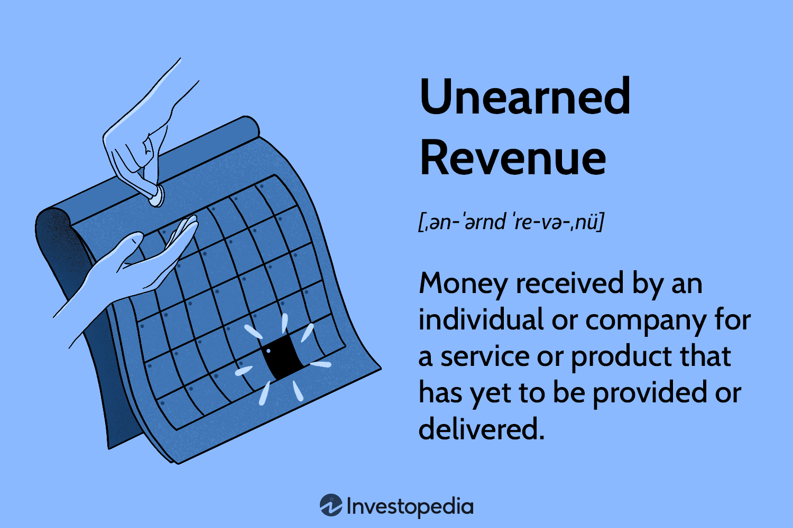

The convergence of financial accounting and algorithmic trading marks a significant evolution in the financial sector, blending the precision of data analytics with the strategic management of financial liabilities. Financial accounting is fundamental to tracking and reporting a company's economic activities, providing insights into its financial position and performance. Algorithmic trading, on the other hand, utilizes computational algorithms to execute trades at speeds and efficiencies beyond human capability. In recent years, these two domains have increasingly intersected, underscoring the need for an integrated approach to financial analysis and trading strategies.

Central to the intersection of accounting and trading is the concept of unearned revenue, also referred to as deferred revenue. Unearned revenue is critical for understanding how a company accounts for transactions where payment has been received before the delivery of goods or services. It influences a company's cash flow and balance sheet dynamics, necessitating accurate financial reporting to reflect true financial health and obligations.



For modern financial analysts and traders, understanding both unearned revenue and the intricacies of financial reporting is essential for making informed decisions. Algorithmic trading systems can leverage this financial data, incorporating metrics like deferred revenue to refine trading models and enhance decision-making processes. This integration illustrates the potential for sophisticated algorithms to factor in accounting information when determining trading strategies, thus enhancing the connection between financial health and market behavior.

This article will explore how financial accounting principles, like those governing unearned revenue, interrelate with sophisticated algorithmic trading in financial markets. By examining these intersections, we aim to illuminate how evolving practices in financial reporting and trading technologies stand to transform market analysis and operations.

## Table of Contents

## Understanding Unearned Revenue

Unearned revenue, often termed deferred revenue, pertains to funds that a company receives in advance for goods or services that are yet to be delivered. This concept holds significant importance in accounting as it directly affects how a company reports its financial health and obligations. In essence, unearned revenue is considered a liability on the company’s balance sheet, as it represents an obligation to provide goods or services in the future.

To illustrate, when a business receives payment before fulfilling its contractual obligations, it incurs a liability, as it owes the services or goods to the client. Thus, unearned revenue is not recognized as earned income until the delivery or performance has been completed. This approach ensures that the financial statements accurately reflect the company's current obligations and financial status.

Common instances of unearned revenue can be found in subscription-based services or prepayment models. For example, a software company offering a yearly subscription will receive payment upfront, and throughout the subscription duration, it recognizes this revenue incrementally as the service is delivered. Similarly, companies in industries such as airlines or magazine publishers often receive payments in advance, which they record as unearned revenue until the service or product is delivered.

The accounting treatment for unearned revenue typically involves two journal entries—initially recording the receipt of funds:

1. **Debit**: Cash (increasing asset)
2. **Credit**: Unearned Revenue (increasing liability)

As the company provides the goods or services, periodic adjustments occur to recognize the revenue:

1. **Debit**: Unearned Revenue (decreasing liability)
2. **Credit**: Revenue (increasing income)

This systematic recognition is consistent with the revenue recognition principle, ensuring revenue is realized in the accounting period it is earned. Proper management and reporting of unearned revenue are vital, as they affect not only cash flow statements but also stakeholders’ perceptions of financial stability and performance within the company.

## Financial Reporting and Unearned Revenue

Accurate financial reporting of unearned revenue is essential for comprehensively understanding a company's financial health. Unearned revenue, often labeled as deferred revenue, represents an obligation on the part of the company to deliver goods or services in the future. This financial component is reported as a liability on the balance sheet until the service is provided or the product is delivered, at which point it is recognized as revenue.

Companies must adhere to specific accounting principles and regulatory standards when reporting unearned revenue. The guidelines provided by the Generally Accepted Accounting Principles (GAAP) in the United States or the International Financial Reporting Standards (IFRS) globally, offer frameworks that ensure the financial statements accurately reflect the company's financial position and performance. These standards require that transactions involving unearned revenue are recorded at the time of payment, not at the time of service delivery, to accurately depict the company's current liabilities.

In accounting practice, there are two primary methods used to record unearned revenue: the liability method and the income method. 

1. **The Liability Method**: This approach is the more traditional and widely used method. Under the liability method, unearned revenue is initially recorded as a liability on the balance sheet. As the goods or services are delivered, the liability reduces, and revenue is recognized in the income statement. For instance, if a company receives a $1,000 payment for an annual subscription service, it records this amount as a liability. Each month, as one-twelfth of the service is delivered, the company decreases the liability by approximately $83.33 and recognizes this amount as earned revenue.

2. **The Income Method**: Although less common, the income method is another approach where the full amount is initially recorded as income, and then reduced over time as the product or service is provided. While this method can simplify the initial recording process, it is generally not preferred due to the potential for overstating income in early periods before the service is rendered. Such practices could mislead stakeholders regarding the actual financial health of the company.

Accurate reporting of unearned revenue, therefore, involves a careful allocation of revenue recognition over time, aligning financial reporting with the actual provision of goods or services. This ensures transparency and accountability, enabling stakeholders to gauge a company's true financial position. Proper management of unearned revenue is crucial for any business, particularly those with significant deferred income from subscription services, prepayments, or long-term contracts.

## Algorithmic Trading in Financial Markets

Algorithmic trading, often referred to as automated or algo trading, employs computerized systems to execute trades at speeds and frequencies that human traders cannot achieve. These systems operate based on pre-defined criteria, which can include timing, price, quantity, and various mathematical models. The main advantage of [algorithmic trading](/wiki/algorithmic-trading) lies in its ability to swiftly process vast datasets, identify trading signals, and execute trades with precision.

The rise of high-frequency trading ([HFT](/wiki/high-frequency-trading-strategies)), a subset of algorithmic trading, exemplifies the impact of computational power on trading dynamics. HFT strategies typically involve holding positions for very short durations, thereby enabling firms to capitalize on minute price discrepancies. This approach relies on the ability to execute orders in microseconds, highlighting a dependence on both algorithm sophistication and low-latency execution platforms.

Algorithmic trading strategies can be categorized into several types, including market-making, [trend following](/wiki/trend-following), and statistical [arbitrage](/wiki/arbitrage). Market-making algorithms, for instance, aim to provide [liquidity](/wiki/liquidity-risk-premium) to the market by continuously quoting buy and sell prices, profiting from the spread. Trend-following strategies, on the other hand, attempt to capture gains through the analysis of market trends, capitalizing on the [momentum](/wiki/momentum) in asset prices. Statistical arbitrage strategies exploit price inefficiencies between related financial instruments.

The implementation of algorithmic trading requires an architecture capable of handling large-scale data analysis and real-time decision-making. Algorithms often utilize [machine learning](/wiki/machine-learning) techniques to improve their accuracy and adaptability. For instance, they might employ advanced neural networks to evaluate historical pricing data, detecting patterns that indicate future market movements.

A basic Python implementation for a mean-reversion strategy, a common type of [quantitative trading](/wiki/quantitative-trading) strategy, could look like the following:

```python
import numpy as np
import pandas as pd

# Assuming price_data is a pandas DataFrame with a 'Close' column
def simple_moving_average(prices, window):
    return prices.rolling(window=window).mean()

def mean_reversion_strategy(prices, short_window, long_window):
    signals = pd.DataFrame(index=prices.index)
    signals['price'] = prices
    signals['short_mavg'] = simple_moving_average(prices, short_window)
    signals['long_mavg'] = simple_moving_average(prices, long_window)
    signals['signal'] = 0.0
    signals['signal'][short_window:] = np.where(signals['short_mavg'][short_window:] > signals['long_mavg'][short_window:], 1.0, 0.0)
    signals['positions'] = signals['signal'].diff()
    return signals

# Example usage
price_data = pd.DataFrame({'Close': [150, 152, 148, 145, 147, 149, 151, 156, 158]})
strategy_signals = mean_reversion_strategy(price_data['Close'], short_window=3, long_window=7)
```

The significance of algorithmic trading in today's markets cannot be overstated. It contributes to market liquidity and efficiency, though it also raises concerns regarding market [volatility](/wiki/volatility-trading-strategies) and systemic risks, particularly during turbulent market conditions. As regulatory frameworks evolve, they aim to balance the benefits of efficiency and speed with the risks of market manipulation and flash crashes.

## Integration of Financial Reporting with Algorithmic Trading

The integration of financial reporting with algorithmic trading is a pivotal development in modern financial markets. A crucial element at this intersection is the impact of unearned revenue on cash flow, subsequently influencing trading strategies. Unearned revenue, recorded as a liability, represents an obligation for a company, which can affect its financial health and liquidity. For algorithmic trading systems, understanding these nuances is essential to make informed trading decisions.

Sophisticated trading algorithms are designed to incorporate various financial reporting metrics, including those related to unearned revenue, within their decision-making models. These algorithms utilize advanced data analytics and machine learning techniques to analyze and predict market trends based on financial statements. For instance, changes in a company's unearned revenue figures can signal future cash inflows or outflows, affecting a stock's short-term and long-term valuation.

Trading algorithms process these financial signals using pre-defined criteria, which can include ratios and financial health indicators derived from financial statements. For example, unearned revenue ratios can act as a metric for evaluating a company's potential liquidity. A high unearned revenue figure might imply better future revenue realization, which, with positive market sentiment, could be interpreted as a bullish signal by an algorithm. Python code showcasing a simple evaluation might look like this:

```python
def evaluate_uneanred_revenue_ratio(unearned_revenue, total_assets):
    return unearned_revenue / total_assets

unearned_revenue = 50000  # Example unearned revenue
total_assets = 200000     # Example total assets

ratio = evaluate_uneanred_revenue_ratio(unearned_revenue, total_assets)
if ratio > 0.2:
    decision = "Bullish"
else:
    decision = "Neutral"

print(f"Unearned Revenue Ratio: {ratio}, Trading Decision: {decision}")
```

The code above calculates an unearned revenue ratio and uses it to inform a trading decision, simulating how an algorithm might incorporate financial reporting metrics into its process.

A critical aspect of these algorithms is their ability to [factor](/wiki/factor-investing) in the timing and recognition of revenue. Deferred revenue must be recognized over time, affecting financial metrics such as earnings per share (EPS) and potentially influencing stock price forecasts. Algorithms optimized for real-time trading can react to these changes faster than human traders, offering a competitive advantage in fast-paced markets.

In summary, the integration of financial reporting elements like unearned revenue into algorithmic trading models represents a significant advancement. It combines the precision of automated trading systems with a nuanced understanding of financial statements, enhancing the capability to make timely and informed trading decisions.

## Challenges and Opportunities

Balancing the principles of accurate financial reporting with the rapid decision-making required in algorithmic trading presents several challenges and opportunities for financial professionals and developers alike. 

### Challenges

One of the core challenges is the inherent conflict between the precision required in financial accounting and the speed demanded by algorithmic trading. Financial reporting processes are traditionally designed to ensure accuracy, compliance, and transparency. These processes often involve meticulous checks, reconciliations, and adherence to regulatory standards such as the Generally Accepted Accounting Principles (GAAP) or International Financial Reporting Standards (IFRS). However, the fast-paced nature of algorithmic trading, which relies on split-second decision-making, cannot afford delays caused by stringent reporting procedures.

Furthermore, integrating comprehensive financial data into trading algorithms can be complex. For instance, uneven, deferred, or unearned revenue figures might affect metrics such as cash flow and net income, which are vital for assessing a company's financial health. Misrepresentation or delayed recognition of these figures could lead to flawed algorithmic decisions, impacting trading strategies and outcomes.

### Opportunities

Despite these challenges, significant opportunities arise from the integration of financial data analytics within algorithmic trading platforms. By using advanced analytics, traders can enhance both financial reporting and trading accuracy, leading to more informed decision-making. For example, machine learning algorithms can be utilized to parse large sets of financial data, extracting actionable insights that improve trade execution efficiency and accuracy.

Consider the following example using Python, which demonstrates how historical revenue data can be processed to identify trends that inform trading algorithms:

```python
import pandas as pd
import numpy as np
from sklearn.linear_model import LinearRegression

# Load historical financial data
data = pd.read_csv('financial_data.csv')

# Feature selection: Using revenue and deferred revenue as predictors
X = data[['revenue', 'deferred_revenue']]
y = data['stock_price']

# Linear regression model to predict stock price based on revenue data
model = LinearRegression()
model.fit(X, y)

# Predicting stock prices
predicted_prices = model.predict(X)

# Output predicted stock prices
print(predicted_prices)
```

Strategic collaboration between accountants and developers is pivotal in bridging the gap between financial integrity and trading agility. By working together, these professionals can develop trading systems that not only harness sophisticated algorithmic techniques but also accurately reflect financial realities. This collaboration can lead to enhanced risk management, better prediction of market movements, and ultimately, more robust and resilient trading systems that account for various financial health indicators.

In conclusion, while the interplay between financial reporting and algorithmic trading introduces challenges, it also offers numerous opportunities for innovation and improvement in financial analysis and market efficiency. By leveraging the strengths of both fields, businesses can develop more accurate, responsive, and adaptable financial strategies.

## Conclusion

Incorporating unearned revenue into financial reports is essential for accurately depicting a company's current and future financial landscape. Unearned revenue, recognized as a liability, reflects obligations that a company has yet to fulfill but has already received payment for, offering investors and stakeholders a more complete view of the company's financial commitments and revenue-generating potential. This accounting practice ensures transparency and helps in informed decision-making by those analyzing the financial health of the company.

Simultaneously, algorithmic trading has emerged as a transformative force in financial markets, revolutionizing how trades are executed through the implementation of advanced technologies. This method harnesses the power of automation and big data analytics to enhance the speed, efficiency, and accuracy of trading strategies, ultimately optimizing outcomes by making real-time decisions based on vast datasets.

Continued advancements in both financial reporting and algorithmic trading technologies promise substantial improvements in financial analysis and market efficiency. As financial reporting becomes more precise with the correct integration of deferred revenues, it allows algorithmic trading systems to incorporate such robust and reliable data, exponentially increasing the potential for superior market insights and strategies. This synergy between technological progress and accurate financial representation stands to elevate the standards of market operations, paving the way for innovative approaches in finance.

## References & Further Reading

[1]: ["Revenue from Contracts with Customers (Topic 606)"](https://fasb.org/page/PageContent?pageId=/projects/recentlycompleted/revenue-from-contracts-with-customers-topic-606-and-leases-topic-842effective-dates-postissuance-summary.html&isstaticpage=true) by Financial Accounting Standards Board (FASB)

[2]: ["Advances in Financial Machine Learning"](https://www.amazon.com/Advances-Financial-Machine-Learning-Marcos/dp/1119482089) by Marcos Lopez de Prado

[3]: ["Quantitative Finance For Dummies"](https://www.amazon.com/Quantitative-Finance-Dummies-Steve-DPhil/dp/1118769465)
by Daniel J. Duffield and Vanessa Gordon

[4]: Pereiro, L.E. (2019). ["Machine Learning in Finance: From Theory to Practice with Python."](https://link.springer.com/book/10.1007/978-3-030-41068-1)

[5]: ["Federal Trade Commission & Securities and Exchange Commission Statement concerning Non-GAAP Financial Measures"](https://quizlet.com/450599590/chapter-12-financial-reporting-and-the-securities-and-exchange-commission-flash-cards/)

[6]: ["Quantitative Trading: How to Build Your Own Algorithmic Trading Business"](https://github.com/LucindaYa/quant-resources/blob/master/Quantitative%20Trading%20How%20to%20Build%20Your%20Own%20Algorithmic%20Trading%20Business.pdf) by Ernest P. Chan