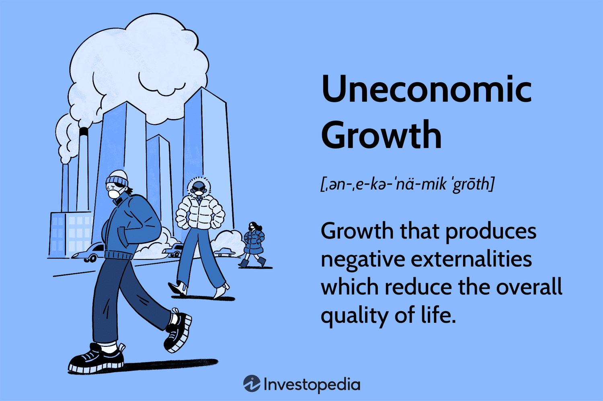

In recent years, significant changes have emerged in the approaches to economic growth and investment strategies, reflecting the evolving priorities of a global economy increasingly attuned to sustainability. These shifts are marked by a growing recognition of the limitations of traditional economic metrics, such as Gross Domestic Product (GDP), which often fail to account for the environmental and social costs of growth. The concept of uneconomic growth has gained traction, highlighting scenarios where economic expansion leads to deteriorating quality of life due to negative externalities.

Simultaneously, algorithmic trading has transformed financial markets by leveraging technology to execute trades with high speed and efficiency. This advancement questions the existing dynamics of market operations, influencing both market liquidity and systemic stability. The role of algorithms extends beyond mere transaction facilitation, as they increasingly incorporate principles of sustainable finance and environmental, social, and governance (ESG) criteria into their operations. 



This article provides a comprehensive overview of the intersection between economic theory and sustainability, interrogating the conventional wisdom that prioritizes GDP growth over ecological and societal well-being. We will explore how sustainable growth models seek to mitigate the adverse effects of uneconomic growth by integrating ecological considerations into economic planning. Furthermore, the article will examine the mechanics of algorithmic trading, its impact on market behavior, and its potential to either support or undermine sustainability objectives through its extensive reach and influence.

Our investigation seeks to enhance understanding of how these fields converge and interact in today's global economy, offering insights for policymakers, investors, and financial institutions striving to align economic frameworks with sustainability goals. Recognizing the interconnectedness of economic growth, sustainability, and technological advancement is crucial for navigating and shaping future developments in modern economic systems.

## Table of Contents

## Understanding Uneconomic Growth

Uneconomic growth is a term coined by economist Herman Daly to describe a scenario where economic expansion leads to negative externalities that degrade the overall quality of life. Daly's concept underscores a critical reassessment of traditional economic growth paradigms, particularly those relying heavily on Gross Domestic Product (GDP) as a primary success metric.

Historically, GDP has served as the dominant indicator of economic progress. However, it falls short in accounting for environmental degradation, resource depletion, and other negative consequences of unchecked growth. Uneconomic growth becomes evident when the social and ecological costs of expansion outweigh the economic benefits, leading to a net decline in societal well-being.

Daly's work highlights the limitations of GDP, proposing that beyond a certain point, further growth results in diminishing returns in terms of human welfare. This challenges the conventional wisdom that continuous economic growth is invariably beneficial, calling for a shift towards more nuanced, sustainable growth models. Traditional economic approaches often overlook the long-term ecological and social impacts, focusing instead on short-term financial gains. Uneconomic growth brings attention to the need for models that incorporate sustainability principles, ensuring that development enhances rather than diminishes quality of life.

The imperative for sustainable growth models arises from the need to address these adverse effects. Such models aim to balance economic expansion with ecological and social considerations. They incorporate alternative metrics and frameworks, such as the Genuine Progress Indicator (GPI) or the Human Development Index (HDI), which better reflect the complexities of economic success. By integrating environmental health and social equity into the equation, sustainable growth strategies can mitigate the downsides of uneconomic growth.

In today's ecological and social contexts, the relevance of uneconomic growth is increasingly apparent. The global challenges of climate change, biodiversity loss, and resource scarcity underscore the insufficiency of GDP-centered growth strategies. Sustainable development goals (SDGs) and international environmental agreements mark a shift towards prioritizing ecological and social balance alongside economic objectives. By embracing sustainable growth models, it becomes possible to navigate the delicate balance between development and preservation, reducing the risk of uneconomic growth and fostering a more resilient global economy.

## Economic Theory and Sustainability

In addressing the evolving needs of modern economies, traditional economic theories often come under scrutiny as they are challenged by sustainability-driven models. Conventional economic models typically focus on gross domestic product (GDP) as a primary metric for assessing economic success. However, this focus on GDP growth can lead to outcomes that compromise environmental integrity and social equity, which are key components of sustainable development.

Economic policies centered around GDP growth frequently clash with sustainability goals. For instance, the emphasis on increasing production and consumption can heighten resource depletion and environmental degradation. Industries might prioritize short-term economic gains over long-term ecological balance, leading to unsustainable practices that threaten biodiversity and contribute to climate change. Moreover, GDP as a metric does not account for income inequality or social well-being, which are critical dimensions of sustainable societies.

To better align economic activities with sustainability objectives, alternative metrics and frameworks have been proposed. One such framework is the Genuine Progress Indicator (GPI), which adjusts GDP by including positive contributions, like volunteer work and education, and subtracting negative aspects, such as pollution and crime. Another approach is the Human Development Index (HDI), which combines indicators like life expectancy, education level, and per capita income to provide a more comprehensive view of human progress.

A further step towards integrating sustainability is the adoption of policies that focus on the Triple Bottom Line (TBL) approach, emphasizing social, environmental, and financial performance. This model encourages businesses to pursue not just profit, but also positive social and environmental impacts. By adopting these alternative metrics, policymakers and economists can develop strategies that promote economic growth while ensuring ecological well-being and social equity.

Sustainability-driven economic models often employ systems thinking and long-term planning to mitigate the adverse effects of economic activities on the environment. This includes promoting renewable energy resources, circular economies, and sustainable agriculture practices. Economists advocating for sustainability highlight the importance of policies that internalize externalities; for example, carbon pricing initiatives aim to make polluters financially accountable for their environmental impact, encouraging cleaner production methods.

In summary, the clash between traditional economic theory and sustainability goals is driving the need for alternative metrics that better reflect ecological and social outcomes. By transitioning to these frameworks, policymakers can aim to balance economic growth with the preservation of natural resources and the promotion of social welfare, fostering a more sustainable future for global economies.

## Algorithmic Trading: Mechanics and Impact

Algorithmic trading, a technology-driven approach to executing trades, has transformed financial markets by utilizing complex algorithms to assist in making trading decisions. These algorithms systematically follow programmed instructions—often based on timing, price, quantity, or any mathematical model—to execute orders at speeds and frequencies that are impossible for human traders.

### Mechanics of Algorithmic Trading

At its core, [algorithmic trading](/wiki/algorithmic-trading) relies on computer programs to identify trading opportunities and execute orders. The algorithms can process a vast amount of data across numerous markets, analyzing factors such as historical pricing, [volume](/wiki/volume-trading-strategy) trends, and technical indicators. A typical algorithm might be structured as follows:

1. **Data Collection**: Algorithms collect and process data inputs, such as historical prices and trading volumes.

2. **Signal Generation**: Using statistical models or machine learning techniques, the algorithm predicts future price movements based on the collected data.

3. **Trade Execution**: Once a trading signal is generated, the algorithm executes the trade, dictating both the timing and size of transactions.

For instance, a simple moving average crossover strategy may be used. In Python, this could be implemented as follows:

```python
import numpy as np
import pandas as pd

def moving_average_strategy(prices, short_window=40, long_window=100):
    signals = pd.DataFrame(index=prices.index)
    signals['price'] = prices
    signals['short_mavg'] = prices.rolling(window=short_window, min_periods=1).mean()
    signals['long_mavg'] = prices.rolling(window=long_window, min_periods=1).mean()
    signals['signal'] = 0.0
    signals['signal'][short_window:] = np.where(signals['short_mavg'][short_window:] > signals['long_mavg'][short_window:], 1.0, 0.0)   
    signals['positions'] = signals['signal'].diff()
    return signals
```

This simple algorithm buys when the short-term average price exceeds the long-term average and sells when the opposite occurs.

### Impact on Market Efficiency and Liquidity

Algorithmic trading enhances market efficiency by exploiting price discrepancies, which contribute to reducing [arbitrage](/wiki/arbitrage) opportunities and aligning prices across different markets. Its high-speed nature also increases market [liquidity](/wiki/liquidity-risk-premium) by ensuring that orders are quickly matched, reducing bid-ask spreads. This leads to lower transaction costs and more stable markets.

### Economic Implications

While algorithmic trading increases efficiency, it also leads to significant economic implications. It can influence asset prices and contribute to market [volatility](/wiki/volatility-trading-strategies) due to the rapid execution of large volume trades. Additionally, the competitive edge gained through technology could deepen the divide between those with access to advanced trading systems and those without.

### Ethical Considerations and Systemic Risks

Despite its advantages, algorithmic trading raises ethical concerns and systemic risks. 

1. **Market Manipulation**: High-frequency trading (HFT) has been criticized for practices like spoofing—where traders place orders they intend to cancel, creating false impressions of demand or supply.

2. **Systemic Risk**: Algorithms can malfunction, leading to erroneous trades that disrupt markets. The Flash Crash in May 2010, where the U.S. stock market plunged and recovered sharply within minutes, exemplifies such risk.

3. **Transparency and Fairness**: The proprietary nature of these algorithms means they lack transparency, raising issues about fairness and regulatory oversight.

Addressing these concerns requires robust regulatory frameworks to ensure fairness, prevent abuse, and mitigate systemic risks associated with algorithmic trading. Enhanced transparency, rigorous testing, and monitoring of trading algorithms are crucial steps in ensuring a stable financial ecosystem. 

In conclusion, while algorithmic trading offers substantial benefits in terms of efficiency and liquidity, it also presents challenges that must be managed to safeguard market integrity and stability.

## Algorithmic Trading and Sustainable Finance

The integration of [artificial intelligence](/wiki/ai-artificial-intelligence) (AI) in algorithmic trading offers significant prospects for advancing sustainable finance. Algorithmic trading systems, which execute trades based on pre-set rules and data analysis, are increasingly adopting Environmental, Social, and Governance ([ESG](/wiki/esg-investing)) principles, making them more aligned with sustainability objectives.

**Sustainable Pairs Trading**

Pairs trading, a strategy that involves trading long and short positions on correlated stock pairs, is being adapted for sustainability by incorporating ESG criteria. The traditional pairs trading model uses [statistical arbitrage](/wiki/statistical-arbitrage) to exploit price discrepancies between pairs of assets. In a sustainable context, this can be redefined to prioritize pairs where at least one asset adheres to or exceeds specific ESG standards. For instance, consider a pair of companies, A and B, in the same industry. If company A has a higher ESG score than company B, an ESG-focused algorithm might initiate a long position in A and a short position in B, anticipating that the market will eventually favor the more sustainable company as ESG considerations gain importance.

**Incorporating ESG Principles**

Algorithmic models can integrate ESG data, which evaluates companies based on their environmental impact, social responsibility, and governance practices. By linking ESG scores with financial performance indicators, algorithms can prioritize investments in companies with superior sustainability profiles. This integration can be facilitated by accessing vast data streams and using [machine learning](/wiki/machine-learning) models to predict the future performance of companies based on their ESG credentials. An example algorithm might use a logistic regression model to classify potential trades, taking ESG scores as inputs to optimize for sustainability alongside traditional financial metrics.

```python
from sklearn.linear_model import LogisticRegression
import numpy as np

# Example ESG and Financial Feature Sets
esg_scores = np.array([[0.8, 0.6, 0.7], [0.5, 0.4, 0.6], [0.9, 0.7, 0.8]])  # E, S, G scores
financial_metrics = np.array([[1.2, 0.9], [0.8, 0.6], [1.5, 1.3]])          # Example financial ratios

# Concatenate ESG and financial features
features = np.concatenate((esg_scores, financial_metrics), axis=1)

# Target values indicating sustainable investment performance
target = np.array([1, 0, 1])  # 1: Sustainable, 0: Not sustainable

# Logistic Regression Model
model = LogisticRegression()
model.fit(features, target)

# Predict sustainability
sustainable_investment_prediction = model.predict(features)
```

**Benefits and Challenges of AI-Driven Sustainable Trading**

AI-driven sustainable trading offers multiple benefits, including enhanced decision-making capabilities through predictive analytics, improved portfolio alignment with long-term environmental and social goals, and mitigation of risks associated with unsustainable business practices. It can help traders and investors identify potential greenwashing, where companies falsely claim superior sustainability practices.

However, challenges persist. The quality and consistency of ESG data remain a concern, as companies might report ESG metrics using different standards. The risk of overfitting models to past ESG performance, without capturing future potential or changes in company practices, must also be managed. Additionally, balancing short-term financial returns with long-term sustainability goals creates a complex trade-off scenario for AI models.

Overall, integrating AI within algorithmic trading enhances the capacity to align financial operations with sustainability targets. By embedding ESG factors into the foundational elements of trading algorithms, financial markets can more effectively contribute to sustainable economic growth.

## Linking Uneconomic Growth and Algorithmic Trading

The intersection of uneconomic growth and algorithmic trading represents a complex dynamic in today's financial landscape. Uneconomic growth, characterized by economic expansion that harms societal well-being and ecological balance with negative externalities, challenges the sustainability of traditional growth models. Algorithmic trading, driven by sophisticated computational models and rapid execution capabilities, can either exacerbate or alleviate these adverse effects.

Algorithmic trading strategies have the potential to exacerbate uneconomic growth when they prioritize short-term gains over long-term sustainability. High-frequency trading ([HFT](/wiki/high-frequency-trading-strategies)) can lead to increased market volatility, promoting speculative behavior that disregards the environmental and social consequences of investment activities. For instance, algorithms that solely focus on exploiting price inefficiencies may contribute to uneconomic growth by amplifying market fluctuations, thereby perpetuating cycles of boom and bust without regard for sustainable development goals.

In contrast, algorithmic trading can mitigate the effects of uneconomic growth by integrating Environmental, Social, and Governance (ESG) criteria into trading models. By prioritizing ESG metrics, algorithms can shift capital towards more sustainable investments, encouraging companies to adopt eco-friendly practices and improve social responsibility. This alignment of trading strategies with sustainability objectives can promote positive externalities, fostering economic activities that enhance rather than degrade quality of life.

The role of regulatory frameworks is crucial in steering algorithmic trading towards sustainability. Effective regulations can ensure that trading activities align with broader economic and environmental goals. For example, imposing transaction taxes or limits on certain trading practices that are deemed harmful to economic stability and ecological well-being could be a way to counteract the potential negative effects of algorithmic trading.

Additionally, transparent reporting standards and enhanced disclosures for investment products can support the integration of ESG factors into algorithmic trading. Policymakers can encourage innovation in sustainable finance by providing incentives for firms that develop and implement trading algorithms aimed at reducing negative externalities associated with uneconomic growth.

In conclusion, the relationship between algorithmic trading and uneconomic growth is shaped by the strategies employed and the regulatory environment. Striking a balance where algorithmic models support sustainable economic development requires a concerted effort from regulators, investors, and the financial community to align economic interests with ecological and social priorities.

## Conclusion

The synthesis of sustainability, uneconomic growth, economic theory, and algorithmic trading provides a multifaceted view of the modern economic landscape. Sustainability increasingly calls for a reevaluation of growth metrics traditionally centered around GDP, advocating for models that respect ecological boundaries and promote social well-being. Uneconomic growth challenges the notion of perpetual economic expansion, highlighting its adverse effects on quality of life and ecosystem health. As economic theory grapples with these challenges, the shift towards sustainability-focused models becomes imperative.

Algorithmic trading has emerged as a significant force within financial markets, leveraging computational algorithms to enhance efficiency and liquidity. However, its rapid evolution necessitates careful consideration of ethical, systemic, and environmental impacts. When aligned with sustainability objectives, algorithmic trading can be instrumental in fostering ecological integrity, as evidenced by the integration of Environmental, Social, and Governance (ESG) criteria into trading strategies.

The overlapping nature of these concepts necessitates a coordinated approach by policymakers, investors, and financial institutions. Policymakers should advocate for frameworks that prioritize long-term ecological and economic goals over short-term gains. For investors, incorporating ESG criteria and other sustainable benchmarks into investment decisions could promote more responsible capital allocation. Financial institutions should enhance transparency and promote innovative solutions that marry algorithmic trading with sustainability metrics.

Looking ahead, the integration of artificial intelligence and machine learning in sustainable finance holds promise for optimizing trading strategies and achieving a balance between growth and sustainability. The development of robust regulatory frameworks and industry standards will be crucial in guiding these advancements. Encouraging interdisciplinary collaboration is essential to navigate the complexities of aligning economic models with sustainability goals, paving the way for a more sustainable global financial system.

## References & Further Reading

[1]: Daly, Herman E. (1991). "Steady-State Economics: Second Edition With New Essays." Island Press.

[2]: [United Nations. "What are the Sustainable Development Goals?"](https://sdgs.un.org/goals)

[3]: Bandyopadhyay, S. & De, A. (2014). "Algorithmic Trading: A Conceptual Overview." The Journal of Asset Management, 15(3).

[4]: Pistor, K. (2019). "The Code of Capital: How the Law Creates Wealth and Inequality." Princeton University Press.

[5]: Wackernagel, M. & Rees, W.E. (1996). "Our Ecological Footprint: Reducing Human Impact on the Earth." New Society Publishers.

[6]: Litterman, R. (2011). "Pricing Climate Change Risks: A Conference Report." National Bureau of Economic Research, DOI: 10.3386/w17481