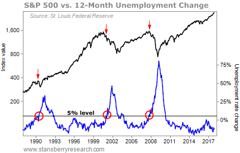

## Table of Contents

## What is the unemployment rate and how is it calculated?

The unemployment rate is a number that shows what percentage of people who want to work cannot find a job. It is usually given as a percentage and is used to understand how well the economy is doing. If the unemployment rate is high, it means many people are out of work, which can be bad for the economy. If it is low, it means most people who want to work have jobs, which is generally good for the economy.

To calculate the unemployment rate, you need two pieces of information: the number of people in the labor force and the number of people who are unemployed. The labor force includes everyone who is either working or actively looking for work. The unemployed are those in the labor force who do not have a job but are actively seeking one. To find the unemployment rate, you divide the number of unemployed people by the total number of people in the labor force and then multiply by 100 to get a percentage. For example, if there are 100 people in the labor force and 5 of them are unemployed, the unemployment rate would be (5/100) * 100 = 5%.

## What are stock market returns and how are they measured?

Stock market returns are the gains or losses that investors make from buying and selling stocks. When you buy a stock, you hope its price will go up so you can sell it for more money than you paid. The return is the difference between what you sell the stock for and what you paid for it, plus any dividends you received while you owned the stock. Dividends are payments that some companies give to their shareholders.

To measure stock market returns, people often use the percentage change in the stock's price over a certain period. For example, if you bought a stock for $100 and sold it for $110, your return would be 10%. If the stock also paid you a $2 dividend during that time, your total return would be 12%. People also look at indexes like the S&P 500 to see how the overall market is doing. These indexes show the average performance of a group of stocks, giving a broader picture of market returns.

## How does the unemployment rate affect the overall economy?

The unemployment rate has a big impact on the economy. When a lot of people are out of work, it means they are not [earning](/wiki/earning-announcement) money to spend on things like food, clothes, and entertainment. This can hurt businesses because they make less money when fewer people are buying their products. When businesses make less money, they might have to cut back on spending or even lay off more workers, which can make the unemployment rate go up even more. This can start a cycle that makes the economy weaker.

On the other hand, when the unemployment rate is low, more people have jobs and are earning money. This means they can spend more on goods and services, which helps businesses grow and hire more people. When businesses do well, they often invest more in their operations, which can lead to even more jobs and a stronger economy. A low unemployment rate can create a positive cycle where the economy keeps getting better.

## Can changes in the unemployment rate influence stock market performance?

Yes, changes in the unemployment rate can affect how the stock market does. When unemployment goes down, it usually means more people have jobs and are making money. This makes people feel good about the economy, so they might spend more money and invest more in stocks. Companies also do better when more people are buying their products, so their stock prices can go up. This makes the whole stock market go up too.

But, when unemployment goes up, it can be bad for the stock market. If a lot of people lose their jobs, they have less money to spend. This can hurt companies because they sell fewer things, and their profits go down. When companies don't do well, their stock prices can drop, and this can make the whole stock market go down. So, the unemployment rate can really change how the stock market performs.

## What historical data exists on the correlation between unemployment rates and stock market returns?

Over the years, people have studied how changes in the unemployment rate affect stock market returns. They have found that when unemployment goes down, it usually means the economy is doing well. When the economy is strong, people feel more confident about spending money and investing in the stock market. This can lead to higher stock prices and better returns for investors. For example, during the economic boom of the late 1990s, unemployment rates were very low, and the stock market, especially the tech sector, saw huge gains.

However, when unemployment goes up, it often signals that the economy is struggling. High unemployment can make people worried about their jobs and less likely to spend money or invest in stocks. This can lead to lower stock prices and worse returns for investors. A good example of this was during the Great Recession of 2007-2009, when unemployment rates spiked and the stock market crashed. Overall, while there are many factors that affect the stock market, the unemployment rate is an important one to watch.

## How do investors use unemployment data to make investment decisions?

Investors pay close attention to unemployment data because it tells them a lot about how the economy is doing. When the unemployment rate goes down, it means more people have jobs and are earning money. This makes people feel good about the economy, so they might spend more and invest more in stocks. Companies also do better when more people are buying their products, so their stock prices can go up. Investors see this as a good sign and might decide to buy more stocks, hoping to make money as the market goes up.

On the other hand, when the unemployment rate goes up, it can be a warning sign for investors. If a lot of people are out of work, they have less money to spend. This can hurt companies because they sell fewer things, and their profits go down. When companies don't do well, their stock prices can drop. Investors might see this as a bad sign and decide to sell some of their stocks to avoid losing money. So, by keeping an eye on unemployment data, investors can make smarter choices about when to buy or sell stocks.

## What are the leading theories explaining the relationship between unemployment and stock market returns?

One of the main theories explaining the relationship between unemployment and stock market returns is the consumer confidence theory. When unemployment goes down, people feel more secure about their jobs and more confident about the economy. They are more likely to spend money on things they want and need, which helps businesses make more money. When businesses do well, their stock prices go up, and this can make the whole stock market go up too. So, lower unemployment can lead to higher stock market returns because people feel good about spending and investing.

Another theory is the business cycle theory. This theory says that the economy goes through ups and downs, called cycles. When the economy is growing, unemployment usually goes down because companies need more workers to meet the demand for their products. This growth phase can make stock prices go up because investors see it as a good time to buy stocks. But when the economy starts to slow down, unemployment can go up as companies cut jobs to save money. During these slowdowns, stock prices can go down because investors are worried about the future. So, the business cycle theory explains how unemployment and stock market returns move together as part of the bigger picture of the economy.

## How do different sectors of the stock market respond to changes in unemployment rates?

Different parts of the stock market can react differently to changes in unemployment rates. For example, when unemployment goes down, people have more money to spend. This can be good for companies that sell things people want but don't need, like clothes or electronics. These companies are often in sectors like consumer discretionary. When people feel good about their jobs and the economy, they might buy more of these things, so the stock prices for these companies can go up. On the other hand, if unemployment goes up, people might cut back on buying things they don't need, and the stock prices for these companies can go down.

Another sector that can be affected by unemployment rates is the financial sector. When unemployment is low, banks and other financial companies might lend more money because people feel more confident about borrowing. This can make their profits go up, and their stock prices can rise too. But when unemployment is high, people might be scared to take out loans, and banks might not lend as much. This can hurt their profits, and their stock prices can go down. So, the financial sector can be sensitive to changes in unemployment rates, with lower rates often leading to higher stock prices and higher rates leading to lower stock prices.

Lastly, sectors like utilities and healthcare, which are considered more stable, might not react as strongly to changes in unemployment rates. People need electricity, water, and healthcare no matter what the economy is doing. So, even if unemployment goes up or down, these sectors can stay pretty steady. Their stock prices might not go up as much when unemployment is low, but they also might not go down as much when unemployment is high. This makes them a safer bet for investors who want to avoid big swings in the market.

## What are the limitations of using unemployment rate as an indicator for stock market predictions?

Using the unemployment rate to predict how the stock market will do has some problems. The unemployment rate is just one part of the economy, and there are many other things that can affect the stock market. For example, things like interest rates, how much money people are spending, and what's happening in other countries can also make stock prices go up or down. So, even if the unemployment rate is going down, the stock market might not go up if other things are not going well.

Another problem is that the unemployment rate doesn't always show the whole picture. Sometimes, people might stop looking for work and not be counted as unemployed anymore, even if they still want a job. Also, the unemployment rate doesn't tell us how many people are working part-time but want full-time jobs, or how much money people are making. These things can also affect how the economy and the stock market do, but they aren't shown in the unemployment rate. So, while the unemployment rate can give us some clues about the economy, it's not perfect for predicting what will happen in the stock market.

## How does global unemployment affect international stock markets?

When unemployment goes up or down in different countries, it can change how stock markets around the world do. If a big country like the United States has a lot of people out of work, it can hurt its own economy. When people in the U.S. have less money to spend, companies there might sell fewer things and make less money. This can make stock prices in the U.S. go down. Because the U.S. economy is so big, when its stock market goes down, it can make other countries' stock markets go down too. People all over the world might start to worry about their own economies and sell their stocks, making stock prices drop everywhere.

On the other hand, if unemployment goes down in many countries at the same time, it can be good for stock markets around the world. When more people have jobs, they have more money to spend on things they want and need. This helps companies in different countries make more money, and their stock prices can go up. When stock markets in one country do well, it can make investors feel good about investing in other countries too. So, lower unemployment in many places can help stock markets everywhere go up. But, because the world is connected, changes in unemployment in one country can affect stock markets in many other countries.

## What advanced statistical models are used to analyze the relationship between unemployment rates and stock market returns?

People use different kinds of advanced math models to study how unemployment rates and stock market returns are connected. One popular model is called the Vector Autoregression (VAR) model. This model looks at how different things in the economy, like unemployment and stock prices, affect each other over time. It can show if a change in unemployment today might lead to a change in stock prices tomorrow. Another model is the Generalized Method of Moments (GMM), which is good at figuring out how different parts of the economy work together, even when there's a lot of complicated data.

Another model that's often used is the Autoregressive Distributed Lag (ARDL) model. This model is good at understanding how changes in unemployment rates can have both quick and slow effects on stock market returns. It can help see if a drop in unemployment this month will make stock prices go up right away or if it will take a few months. These models are really helpful because they can handle a lot of data and give us a better idea of how unemployment and stock market returns are linked. But remember, even with these fancy models, there's still a lot we don't know about the economy, and other things can change how stocks do too.

## How can policy changes aimed at unemployment impact stock market trends and investor behavior?

When the government makes new rules or changes old ones to help lower unemployment, it can change how the stock market does. If the new rules make it easier for people to find jobs, like giving money to businesses to hire more workers, more people will start working. This means they will have more money to spend on things they want and need. When people spend more, companies make more money, and their stock prices can go up. Investors see this as a good sign and might buy more stocks, hoping to make money as the market goes up.

But if the government's new rules don't work well, or if they make it harder for businesses to hire people, unemployment might go up. When more people are out of work, they have less money to spend. This can hurt companies because they sell fewer things, and their profits go down. When companies don't do well, their stock prices can drop. Investors might see this as a bad sign and decide to sell some of their stocks to avoid losing money. So, the way the government tries to change unemployment can really affect how investors behave and how the stock market does.

## What is the conclusion?

Understanding the relationship between unemployment rates and stock market performance equips traders with strategic advantages in [algorithmic trading](/wiki/algorithmic-trading). By incorporating unemployment data into trading models, traders can develop strategies that are more responsive to economic shifts. This information enables the anticipation of market movements that correlate with employment trends.

The use of unemployment data as a key input in algorithmic trading involves constructing models that are sensitive to changes in this economic indicator. By accounting for variations in unemployment rates, these models can adapt trading decisions, optimizing buy and sell actions accordingly. This can be expressed in a simplified trading model where:

$$
\text{Signal} = \alpha \cdot \text{UnemploymentRateChange} + \beta
$$

In this formula, $\alpha$ represents the sensitivity of the trading strategy to changes in unemployment rates, and $\beta$ is a constant that could adjust for other factors or biases in the model.

Research and innovation play a crucial role in enhancing these trading strategies. They allow traders to refine algorithms by integrating additional economic indicators alongside unemployment data. Improvements in [machine learning](/wiki/machine-learning) and data analytics offer new avenues to enhance the predictive accuracy of models. For instance, using Python, traders can deploy libraries such as sklearn for regression analysis on unemployment data to predict potential market reactions.

Here is a simple Python code snippet to demonstrate the integration of unemployment data:

```python
import numpy as np
from sklearn.linear_model import LinearRegression

# Sample unemployment rate changes and market performances
unemployment_rate_changes = np.array([[0.01], [-0.02], [0.03], [-0.015]])
market_performance = np.array([0.02, -0.03, 0.04, -0.015])

# Initialize and fit the regression model
model = LinearRegression()
model.fit(unemployment_rate_changes, market_performance)

# Coefficients represent alpha and beta
alpha = model.coef_[0]
beta = model.intercept_

print(f"Alpha: {alpha}, Beta: {beta}")
```

This approach fosters a comprehensive understanding of market dynamics led by employment trends, allowing traders to make informed, data-driven decisions. Continuous research and the exploration of new techniques ensure that algorithmic models remain robust, adaptable, and capable of navigating the complexities of modern financial markets.

## References & Further Reading

[1]: Bergstra, J., Bardenet, R., Bengio, Y., & Kégl, B. (2011). ["Algorithms for Hyper-Parameter Optimization."](https://papers.nips.cc/paper/4443-algorithms-for-hyper-parameter-optimization) Advances in Neural Information Processing Systems 24.

[2]: ["Advances in Financial Machine Learning"](https://www.amazon.com/Advances-Financial-Machine-Learning-Marcos/dp/1119482089) by Marcos Lopez de Prado

[3]: ["Evidence-Based Technical Analysis: Applying the Scientific Method and Statistical Inference to Trading Signals"](https://www.amazon.com/Evidence-Based-Technical-Analysis-Scientific-Statistical/dp/0470008741) by David Aronson

[4]: ["Machine Learning for Algorithmic Trading"](https://github.com/stefan-jansen/machine-learning-for-trading) by Stefan Jansen

[5]: ["Quantitative Trading: How to Build Your Own Algorithmic Trading Business"](https://www.amazon.com/Quantitative-Trading-Build-Algorithmic-Business/dp/1119800064) by Ernest P. Chan