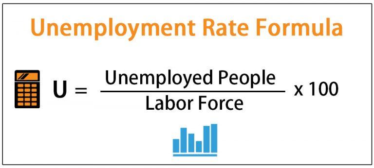

Understanding the labor market is critical for various stakeholders, including economists, policymakers, and traders. The labor market encompasses the supply and demand for labor, where employees provide the workforce, and employers generate the demand. This complex interaction determines wage levels, employment rates, and overall economic productivity. A key indicator within this system is unemployment, which serves as a barometer of economic health. High unemployment rates typically signal economic distress, leading to reduced consumer spending, lower production, and potentially a contracting economy. Conversely, low unemployment rates suggest economic expansion, as more individuals have income to spend, thereby stimulating demand for goods and services.

Economic indicators play an equally important role by providing data that reflects economic conditions and trends. Metrics such as Gross Domestic Product (GDP), inflation rates, and employment statistics offer insights into the current economic situation and future expectations. These indicators help stakeholders make informed decisions. In financial markets, the intersection of labor market dynamics and economic indicators has paved the way for algorithmic trading, which uses computer algorithms to execute trading strategies based on these data insights. Algorithmic trading capitalizes on the efficiency of real-time data analysis and decision-making, allowing traders to respond swiftly to labor market changes and economic shifts.



This article examines the interplay between unemployment, economic indicators, and algorithmic trading within modern finance. By exploring how these elements influence each other, we gain a deeper understanding of their collective impact on economic stability and market performance.

## Table of Contents

## Unemployment as a Core Economic Indicator

Unemployment is a key economic indicator that provides insight into the health and efficiency of an economy. It refers to the number of people who are actively seeking work but are unable to find employment. This is not just a matter of concern for those without jobs; it significantly impacts the economic environment as a whole. Various types of unemployment include frictional, structural, cyclical, and seasonal unemployment, each with unique characteristics. Frictional unemployment comprises individuals who are temporarily without work while transitioning between jobs. Structural unemployment occurs when there is a mismatch between the skills of the labor force and the demands of the job market. Cyclical unemployment is linked to the natural ebb and flow of the economy, often rising during economic downturns and falling during expansions. Seasonal unemployment affects industries that see fluctuations in demand at certain times of the year, such as agriculture or tourism.

Unemployment rates serve as a vital metric for assessing economic health. High unemployment rates can signal economic distress, whereas low rates often indicate a robust economy. Policymakers, businesses, and investors closely watch these rates, as they help gauge potential inflation pressures and guide monetary policy. Rising unemployment rates could reduce disposable income, curtail consumer spending, and diminish economic growth. Conversely, decreasing unemployment can lead to increased consumer spending and confidence, stimulating economic growth and investment opportunities.

There is a strong connection between unemployment and consumer confidence. Consumer confidence reflects the economic outlook of households; when unemployment rises, this confidence tends to dwindle as uncertainty about job security and income stability increases. On the other hand, low unemployment can boost consumer confidence, encouraging spending and investment, which in turn fuels economic growth.

Traditional methods of measuring unemployment typically involve household surveys, such as the Current Population Survey in the United States. This survey collects data on the labor force, employment status, and demographic characteristics of individuals. Unemployment is calculated as a percentage of the labor force, often represented by the formula:

$$
\text{Unemployment Rate} = \left( \frac{\text{Number of Unemployed}}{\text{Labor Force}} \right) \times 100
$$

This approach, while comprehensive, may miss certain nuances, such as underemployment and discouraged workers who have stopped looking for work. Despite these limitations, unemployment metrics remain fundamental for economic analysis, aiding in the formulation of fiscal and monetary policies aimed at stabilizing and promoting economic growth.

## The Role of Economic Indicators in the Labor Market

Economic indicators are crucial in shaping the labor market landscape as they provide significant insights into the state of an economy. Key indicators such as Gross Domestic Product (GDP), inflation, and employment rates are instrumental in understanding labor market conditions and forecasting economic trends.

Gross Domestic Product (GDP) is a measure of the economic output of a country and reflects its economic health. A growing GDP typically signifies an expanding economy with potential job creation, as increased production often requires more labor. Conversely, a shrinking GDP might indicate economic contraction, where businesses may reduce their workforce due to lower demand for goods and services.

Inflation, which measures the rate at which the general level of prices for goods and services rises, can have a dual impact on the labor market. Moderate inflation can stimulate spending and production, resulting in job creation. However, high inflation can erode purchasing power and lead employers to curtail hiring or lay off workers to manage costs. The balance between inflation and unemployment is often analyzed through the Phillips Curve, which posits an inverse relationship between the two.

Employment rates, including metrics like the unemployment rate and labor force participation rate, directly reflect labor market conditions. High employment rates often correlate with strong economic performance, while rising unemployment rates may indicate economic downturns. These [statistics](/wiki/bayesian-statistics) not only measure the availability of jobs but also influence consumer confidence and spending.

Economic indicators also play a predictive role in labor market shifts and trends. For example, leading indicators such as manufacturing orders can forecast future employment by signaling upcoming demand for labor. Similarly, consumer confidence indices can anticipate changes in spending behavior, thereby affecting job creation in consumer-dependent sectors.

However, accurately interpreting these indicators poses challenges. Economic data can be subject to revisions, and short-term fluctuations may not reflect long-term trends. Moreover, global economic dynamics, policy changes, and unforeseen events like natural disasters or pandemics can significantly alter the implications of these indicators.

In conclusion, economic indicators are indispensable tools for assessing and predicting labor market dynamics. Understanding their impact and limitations enables policymakers, businesses, and investors to make informed decisions that influence employment levels and economic growth.

## The Intersection of Labor Market Dynamics and Algorithmic Trading

Algorithmic trading, or algo trading, refers to the use of computer algorithms to execute trading strategies in financial markets with minimal human intervention. Its prominence has grown significantly due to advancements in technology, allowing for rapid data processing and execution of trades. These algorithms are designed to exploit market efficiencies by analyzing vast amounts of data for patterns that indicate potential trading opportunities.

Labor market data is a critical component in the arsenal of data points used by trading algorithms. Unemployment figures, job creation statistics, and other labor-related data points provide insight into the economic outlook, influencing investor sentiment and consequently, market movements. Algorithms can be programmed to take such data into account when executing trades, thereby potentially capitalizing on anticipated economic shifts.

The real-time analysis of labor market indicators is a key feature in modern [algorithmic trading](/wiki/algorithmic-trading). With the availability of high-frequency data and sophisticated analytical tools, algorithms can process labor market information almost instantaneously, responding to economic changes faster than human traders. For instance, an unexpected spike in unemployment might be promptly factored into the pricing models of an algorithm, allowing it to adjust positions based on anticipated market reactions.

The predictive potential of algorithmic trading with labor data presents an opportunity to forecast market movements more accurately. By using advanced [machine learning](/wiki/machine-learning) techniques and data analytics, these algorithms can develop predictive models that anticipate how labor market trends might affect financial markets. For example, a pattern of decreasing unemployment rates over several months might lead algorithms to predict an upturn in consumer spending, encouraging bullish strategies in retail sector stocks.

However, integrating labor market data into algorithmic trading comes with its challenges. The complexity of labor market dynamics means that raw data must be finely processed to extract meaningful insights. Moreover, labor data may not always be clear-cut due to revisions and data lags. Algorithms must also be designed to handle anomalies and sudden changes in data that could lead to erratic trading behavior.

Despite these challenges, the integration of labor market information into algorithmic trading strategies offers numerous opportunities. It enhances the capacity of traders to react swiftly and efficiently to economic trends, providing a competitive edge in the fast-paced financial markets. As technology advances, further opportunities will emerge to refine these strategies, enabling more nuanced and accurate predictions and responses to labor market developments.

## Insights from Algorithmic Trading on Labor Market Predictions

Algorithmic trading, characterized by the use of computer algorithms to manage trading strategies, has significantly advanced economic forecasting and labor market predictions. These enhancements stem from the ability of algorithms to process large volumes of data and identify patterns that may not be visible through conventional analysis.

### Enhancing Economic Forecasting

Algorithmic trading utilizes machine learning models and statistical techniques to analyze unemployment data and other economic indicators. The integration of these datasets allows for more accurate economic forecasts by identifying trends and anomalies that may influence market dynamics. For instance, a machine learning model could be developed using Python as follows:

```python
from sklearn.ensemble import RandomForestRegressor
from sklearn.model_selection import train_test_split
import pandas as pd

# Assume `data` is a DataFrame loaded with economic indicators
features = data[['GDP', 'unemployment_rate', 'inflation']]
target = data['market_trends']

X_train, X_test, y_train, y_test = train_test_split(features, target, test_size=0.2, random_state=42)
model = RandomForestRegressor(n_estimators=100, random_state=42)
model.fit(X_train, y_train)
predictions = model.predict(X_test)
```

This model uses multiple economic indicators, including unemployment rates, to predict market trends, showcasing the sophistication of algorithmic trading.

### Successful Trading Strategies

Case studies have demonstrated the efficacy of algorithmic trading strategies derived from unemployment data. For example, during periods of declining unemployment, algorithms might predict increased consumer spending, informing buying pressure in specific market sectors. Quantitative trading firms often rely on [backtesting](/wiki/backtesting) historical unemployment data against asset prices to refine their trading strategies, thus maximizing returns while minimizing risk.

### Cutting-Edge Technologies

The advancement of [deep learning](/wiki/deep-learning), natural language processing (NLP), and big data analytics is propelling algorithmic trading into new frontiers. High-frequency trading ([HFT](/wiki/high-frequency-trading-strategies)) systems benefit from these technologies, as they process news releases about employment reports and other economic indicators in real-time, executing trades with minimal latency. This capability provides traders with a significant competitive edge in volatile markets.

### Accuracy and Reliability

The accuracy of algorithmic predictions in employment trends largely depends on the quality of data and the robustness of models used. While models can deliver precise forecasts, they may be prone to overfitting or bias if not properly validated. Continuous improvement through approaches like cross-validation and testing against out-of-sample data helps enhance reliability.

### Potential Risks

Despite the potential of algorithmic trading, reliance on algorithmic insights for economic predictions poses several risks. Market [volatility](/wiki/volatility-trading-strategies), driven by rapid algorithmic trades, can lead to flash crashes or exacerbate financial instability. There is also a risk of model drift, where the algorithm’s performance deteriorates over time due to changing economic conditions or unforeseen market events.

In conclusion, algorithmic trading significantly contributes to the refinement of labor market predictions through advanced technologies and analytical techniques. While the prospects are promising, it is crucial to remain vigilant about the associated risks to harness the full potential of these innovations in economic forecasting.

## Future Outlook: Evolving Dynamics Between Labor Markets and Algorithmic Trading

As we examine the evolving dynamics between labor markets and algorithmic trading, future trends in unemployment provide critical insights into economic health. Unemployment is anticipated to fluctuate due to technological advancements, global economic shifts, and policy changes. Technological innovations, particularly in automation and [artificial intelligence](/wiki/ai-artificial-intelligence), could redefine traditional employment structures, potentially leading to both job displacement and the creation of new roles.

Advancements in algorithmic trading, particularly those leveraging labor market data, are poised to transform financial markets. Algorithms are becoming more sophisticated, integrating real-time labor data to forecast economic conditions more accurately. These advancements enable traders to respond swiftly to shifts in employment trends, potentially increasing market efficiency. For instance, machine learning algorithms can analyze vast datasets to identify patterns that predict labor market outcomes, thereby allowing traders to capitalize on anticipated economic shifts.

From a policy perspective, there is a growing need to balance automation with employment levels. Policymakers must address the potential for automation to displace jobs while also fostering environments where technology can create new opportunities. This involves investments in education and training to equip the workforce with skills requisite for emerging industries. Policies may need to focus on social safety nets and retraining programs to mitigate the impacts of unemployment caused by technological disruptions.

Artificial intelligence and machine learning are at the forefront of revolutionizing labor market analysis. These technologies enhance the accuracy of labor market predictions, providing tools for both economists and traders. By analyzing patterns and trends from historical data, AI-driven models can offer forecasts with improved precision. For example, by implementing AI algorithms, we can predict employment rates with models such as:

```python
from sklearn.linear_model import LinearRegression
import numpy as np

# Simulated historic data
X = np.array([[1], [2], [3], [4], [5]])  # Time
y = np.array([10, 20, 30, 40, 50])  # Employment Rate

model = LinearRegression().fit(X, y)
future_time = np.array([[6]])
future_employment_rate = model.predict(future_time)

print("Predicted Employment Rate for time 6:", future_employment_rate[0])
```

The anticipated impact of emerging technologies on the labor market is substantial. As AI and machine learning continue to develop, they provide significant opportunities for enhancing economic forecasting and labor market efficiency. However, this emerging landscape also presents challenges, such as addressing the ethical implications of automation and ensuring equitable access to technology-driven advancements. The labor market is poised to experience profound changes, and stakeholders must navigate these shifts thoughtfully to harness the benefits of technological progress while mitigating associated risks.

## Conclusion

The interconnectedness of unemployment rates, economic indicators, and algorithmic trading underlines the complexity of modern financial markets. Unemployment serves as a critical barometer for assessing economic health, offering insights into consumer confidence and potential future spending patterns. As such, fluctuations in unemployment rates can have broad implications, influencing everything from fiscal policy decisions to market sentiment.

Algorithmic trading has transformed the way labor market data is analyzed and utilized, offering the potential to refine economic forecasts and enhance predictions. By leveraging real-time data and sophisticated algorithms, trading systems can respond swiftly to changes in labor market conditions, potentially leading to more efficient market outcomes. However, this capability also demands continued research to improve accuracy and reliability, ensuring these systems can adapt to unforeseen socio-economic challenges or data anomalies.

As we look to the future, the evolving dynamics between labor markets and algorithmic trading present both opportunities and challenges. There is significant potential for advancements in artificial intelligence and machine learning to deepen our understanding of labor markets and refine predictive models. Yet, this progression must be balanced with considerations of employment impacts and regulatory frameworks to ensure equitable growth and stability.

The need for ongoing research is evident, as is an adaptation to leverage these insights effectively. The ability to harness these advancements will define the future landscape of economic analysis and market operations, highlighting the importance of staying at the forefront of technological and analytical developments in this field.

## References & Further Reading

[1]: Bergstra, J., Bardenet, R., Bengio, Y., & Kégl, B. (2011). ["Algorithms for Hyper-Parameter Optimization."](https://dl.acm.org/doi/10.5555/2986459.2986743) Advances in Neural Information Processing Systems 24.

[2]: ["Advances in Financial Machine Learning"](https://www.amazon.com/Advances-Financial-Machine-Learning-Marcos/dp/1119482089) by Marcos Lopez de Prado

[3]: ["Evidence-Based Technical Analysis: Applying the Scientific Method and Statistical Inference to Trading Signals"](https://www.amazon.com/Evidence-Based-Technical-Analysis-Scientific-Statistical/dp/0470008741) by David Aronson

[4]: ["Machine Learning for Algorithmic Trading"](https://github.com/PacktPublishing/Machine-Learning-for-Algorithmic-Trading-Second-Edition) by Stefan Jansen

[5]: ["Quantitative Trading: How to Build Your Own Algorithmic Trading Business"](https://books.google.com/books/about/Quantitative_Trading.html?id=j70yEAAAQBAJ) by Ernest P. Chan