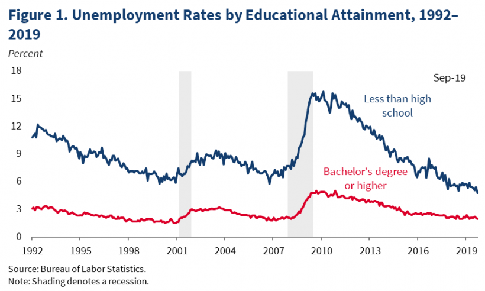

## Table of Contents

## What is unemployment rate and how is it calculated?

The unemployment rate is the percentage of people in the labor force who are not working but are actively looking for a job. It's like a measure of how many people want to work but can't find a job. Governments and economists use this number to understand how well the job market is doing.

To calculate the unemployment rate, you need two numbers: the number of unemployed people and the total labor force. The labor force includes everyone who is either working or actively looking for work. You divide the number of unemployed people by the total labor force and then multiply by 100 to get a percentage. For example, if 5 million people are unemployed and the labor force is 100 million, the unemployment rate would be (5 million / 100 million) * 100 = 5%.

## How often is the unemployment rate reported in the United States?

In the United States, the unemployment rate is reported every month. The data is collected and released by the Bureau of Labor Statistics, which is part of the U.S. Department of Labor. They usually release the new unemployment numbers on the first Friday of each month.

This monthly report is important because it helps people understand how the job market is doing. It shows if more people are finding jobs or if more people are losing their jobs. Businesses, the government, and everyday people use this information to make decisions about the economy.

## Which U.S. government agency is responsible for publishing unemployment statistics?

The U.S. government agency responsible for publishing unemployment statistics is the Bureau of Labor Statistics (BLS). The BLS is part of the U.S. Department of Labor. They collect data about jobs and the economy and share it with the public.

The BLS releases the unemployment rate every month. They do this on the first Friday of the month. This helps people know how many are out of work and looking for jobs. It's important information for understanding the economy.

## Can you list the presidents of the United States in chronological order starting from a specific year?

Starting from the year 2000, the presidents of the United States have been George W. Bush, Barack Obama, Donald Trump, and Joe Biden. George W. Bush was president from 2001 to 2009. He was in office during the September 11 attacks and started the wars in Afghanistan and Iraq. Barack Obama became president in 2009 and served until 2017. He was the first African American president and worked on healthcare reform with the Affordable Care Act.

Donald Trump was president from 2017 to 2021. He focused on tax cuts and deregulation but was also known for his controversial policies and statements. Joe Biden took office in 2021 and is the current president. He has focused on issues like climate change, infrastructure, and managing the response to the COVID-19 pandemic.

## What were the average unemployment rates during each presidential administration since a certain year?

Starting from the year 2000, the average unemployment rates during each presidential administration have varied. During George W. Bush's presidency from 2001 to 2009, the average unemployment rate was about 5.3%. His time in office saw a big increase in unemployment towards the end due to the 2008 financial crisis. When Barack Obama took over in 2009, the unemployment rate was very high at the start. Over his two terms until 2017, the average unemployment rate was around 7.4%. Obama's administration worked to recover from the financial crisis, and unemployment slowly went down.

Donald Trump's presidency from 2017 to 2021 had an average unemployment rate of about 4.2%. His time in office saw a strong economy and low unemployment until the COVID-19 pandemic hit in 2020, causing unemployment to spike. Joe Biden, who became president in 2021, has faced the challenge of managing the economic recovery from the pandemic. During his first few years in office, the average unemployment rate has been around 4.0%. These numbers show how the economy and job market can change a lot depending on what's happening in the world and the policies of each president.

## How do economic policies of different presidents affect unemployment rates?

Economic policies from different presidents can change unemployment rates in big ways. When a president makes new laws about taxes, spending, and how businesses work, these can affect how many jobs there are. For example, if a president cuts taxes for businesses, it might help them grow and hire more people, which can lower unemployment. But if a president raises taxes or adds more rules for businesses, it might make them less likely to hire, and unemployment could go up. Also, if a president spends a lot on projects like building roads or schools, it can create jobs right away and lower unemployment.

Sometimes, things outside of a president's control can change unemployment too. Big events like the 2008 financial crisis or the COVID-19 pandemic can make unemployment go up no matter what the president does. But how a president responds to these events can still affect unemployment. For example, during a crisis, a president might give money to people or businesses to help them stay afloat, which can keep unemployment from getting even worse. So, while a president's policies matter a lot, other big events can also play a big role in how many people are out of work.

## What are the major economic events or crises that influenced unemployment rates during specific administrations?

During George W. Bush's time as president, a big event that affected unemployment was the 2008 financial crisis. This crisis started because many people couldn't pay back their home loans, and it caused big banks to fail. As a result, many businesses closed or stopped hiring, which made unemployment go up a lot. By the end of Bush's term, the unemployment rate was very high, around 7.2%. 

When Barack Obama became president, he had to deal with the aftermath of the financial crisis. At the start of his term, unemployment was at a peak of over 10%. Obama's administration passed a big stimulus package to help the economy recover, which slowly brought unemployment down over time. By the end of his term, the unemployment rate had dropped to about 4.7%, but it took many years to get there.

During Donald Trump's presidency, the economy was doing well until the COVID-19 pandemic hit in 2020. Before the pandemic, unemployment was low, around 3.5%. But when the virus spread, many businesses had to close, and unemployment shot up to over 14% at its highest point. Trump's administration tried to help with money for people and businesses, but it was a tough time. Joe Biden took over in 2021 and continued efforts to recover from the pandemic, and unemployment started to go down again.

## How do demographic factors like age, gender, and ethnicity impact unemployment rates under different presidencies?

Demographic factors like age, gender, and ethnicity can change how unemployment rates look under different presidents. For example, young people often have higher unemployment rates than older people. This is because they are just starting their careers and might not have as much experience. During Barack Obama's time, the unemployment rate for young people was very high at the start because of the financial crisis. But it got better over time. Women and men can also have different unemployment rates. Sometimes, women's unemployment rates are higher, especially if they are taking care of family and can't work as much. Ethnicity also matters. Black and Hispanic people often have higher unemployment rates than white people. This was true during all the presidencies since 2000, but the gap got smaller during some times.

During Donald Trump's presidency, the economy was strong before the COVID-19 pandemic. But even then, young people, women, and certain ethnic groups still had higher unemployment rates than others. When the pandemic hit, these groups were hit harder. For example, many young people lost their jobs in restaurants and stores, and women often had to stay home to take care of kids when schools closed. Black and Hispanic people also had higher unemployment rates during the crisis. Joe Biden's administration has been working to help these groups recover. While unemployment rates have been going down for everyone, young people, women, and people from certain ethnic groups still face higher unemployment than others.

## What methodologies are used to compare unemployment rates across different presidential administrations?

To compare unemployment rates across different presidential administrations, economists use data from the Bureau of Labor Statistics (BLS). They look at the monthly unemployment numbers and calculate the average rate for each president's time in office. This helps them see how unemployment changed over time. They also adjust the numbers to account for things like population growth and changes in how the data is collected. This way, they can make fair comparisons between different time periods.

Another method is to look at how unemployment rates changed for different groups of people, like young people, women, and different ethnic groups. This helps show if a president's policies helped or hurt certain groups more than others. Economists also consider big events like financial crises or pandemics that happened during a president's term. They try to figure out how much these events affected unemployment and how well the president's policies worked to fix the problems. By looking at all these things, they can get a better picture of how each president did with unemployment.

## How reliable are the unemployment statistics provided by the government, and what are the potential sources of bias?

The unemployment statistics from the U.S. government are pretty reliable because they come from the Bureau of Labor Statistics (BLS), which is a part of the U.S. Department of Labor. The BLS uses a big survey called the Current Population Survey (CPS) to collect data. They talk to a lot of people every month to find out if they are working or looking for a job. This helps them figure out the unemployment rate. The BLS also checks their numbers carefully and makes sure they are as accurate as possible. But, like any big survey, there can be small mistakes or changes that can make the numbers a bit off.

There can be some sources of bias in unemployment statistics. One problem is that the numbers only count people who are actively looking for work. If someone gives up looking for a job, they are not counted as unemployed anymore, even though they still don't have a job. This can make the unemployment rate seem lower than it really is. Another issue is that the survey might not reach everyone, especially people who move a lot or don't have a stable home. This can leave out certain groups of people and make the numbers less accurate. But overall, the BLS tries hard to make sure their data is as fair and accurate as possible.

## What role do global economic conditions play in influencing U.S. unemployment rates during different presidencies?

Global economic conditions can have a big impact on U.S. unemployment rates during different presidencies. When the world economy is doing well, other countries buy more things from the U.S., which can help American businesses grow and hire more people. This can lower unemployment. But if the world economy is struggling, like during a global financial crisis, it can hurt the U.S. too. Other countries might buy fewer things from the U.S., causing businesses to lay off workers and unemployment to go up. For example, the 2008 financial crisis started in the U.S. but quickly spread around the world, making it harder for President George W. Bush and then President Barack Obama to lower unemployment.

The global economy also affects U.S. unemployment through events like the COVID-19 pandemic. When the virus started spreading in early 2020, it caused problems all over the world. Many countries closed their borders and stopped trading as much, which hurt the U.S. economy. This led to a sharp increase in unemployment during Donald Trump's presidency. Even after Joe Biden took office, the global recovery from the pandemic has continued to influence U.S. unemployment rates. So, while presidents can make policies to help the job market, big global events can change things a lot and make it harder for them to keep unemployment low.

## How can advanced statistical models be used to predict future unemployment trends based on historical presidential administration data?

Advanced statistical models can help predict future unemployment trends by looking at data from past presidential administrations. These models use lots of information, like unemployment rates, economic policies, and big events that happened during different presidents' times in office. They can find patterns in how unemployment changed in the past and use those patterns to guess what might happen in the future. For example, if a model sees that unemployment went up a lot during a financial crisis, it might predict that unemployment could go up again if another big crisis happens.

These models can also look at how different groups of people, like young people or certain ethnic groups, were affected by unemployment in the past. By understanding these patterns, the models can make better predictions about how unemployment might change for these groups in the future. But it's important to remember that these predictions are not perfect. Unexpected events, like a new global crisis, can change things a lot. So, while these models can give us good guesses about future unemployment trends, they can't tell us exactly what will happen.

## What is the understanding of U.S. Unemployment?

Unemployment is a vital statistic reflecting the economic well-being of a nation. In the United States, it is primarily categorized into two main types: cyclical and structural unemployment. The U.S. Bureau of Labor Statistics (BLS) is tasked with the critical role of collecting and disseminating monthly updates on these figures, contributing an essential tool for economic assessment and policy development.

**Cyclical unemployment** is directly correlated to the macroeconomic cycles of expansion and contraction within an economy. During periods of economic downturn or recession, demand for goods and services decreases, leading businesses to reduce their workforce, thereby increasing unemployment. Conversely, in phases of economic growth, the demand rebounds, businesses expand, and unemployment typically decreases. This relationship indicates how sensitive unemployment rates can be to changes in economic activity.

**Structural unemployment**, on the other hand, arises due to shifts in the economy that change the demand for certain skills or the location of jobs. This type often reflects more profound changes within the economy, such as technological advancements or globalization, which may render certain job skills obsolete and necessitate re-skilling or geographic movement for affected workers.

Unemployment rates are influenced by broader economic conditions and may fluctuate due to external factors such as technological innovation, policy changes, or major economic events. These fluctuations can be closely monitored using economic models to predict future trends. An understanding of the unemployment rate involves examining both the unemployment inflow (individuals losing jobs or entering the workforce) and outflow (individuals gaining employment or exiting the workforce), typically represented by the following equation:

$$
\text{Unemployment Rate} = \frac{\text{Number of Unemployed}}{\text{Labor Force}} \times 100
$$

The unemployment rate is an important metric for understanding the efficiency of the labor market and is used extensively in economic forecasting and policy development. By analyzing patterns and trends within this data, economists and policymakers can better gauge the overall health of the economy and implement strategies to foster job growth and economic stability.

## References & Further Reading

[1]: Colander, D. C. (2016). ["Macroeconomics"](https://www.mheducation.com/highered/product/macroeconomics-colander/M9781266394973.html). McGraw-Hill Education.

[2]: Friedman, M. (1968). ["The Role of Monetary Policy."](https://www.aeaweb.org/aer/top20/58.1.1-17.pdf) The American Economic Review, 58(1), 1-17.

[3]: Lopez de Prado, M. (2018). ["Advances in Financial Machine Learning"](https://www.amazon.com/Advances-Financial-Machine-Learning-Marcos/dp/1119482089). John Wiley & Sons, Inc.

[4]: Bureau of Labor Statistics. ["Unemployment Rate"](https://www.bls.gov/charts/employment-situation/civilian-unemployment-rate.htm). U.S. Department of Labor.

[5]: Carlin, W., & Soskice, D. (2006). ["Macroeconomics: Imperfections, Institutions, and Policies."](https://www.inet.ox.ac.uk/publications/macroeconomics-imperfections-institutions-and-policies) Oxford University Press.

[6]: Aronson, D. (2006). ["Evidence-Based Technical Analysis: Applying the Scientific Method and Statistical Inference to Trading Signals."](https://www.amazon.com/Evidence-Based-Technical-Analysis-Scientific-Statistical/dp/0470008741) John Wiley & Sons, Inc.

[7]: Harcourt, G. C. (2006). ["The Structure of Post-Keynesian Economics: The Core Contributions of the Pioneers."](https://www.nuevatribuna.es/media/nuevatribuna/files//2013/03/12/harcourt_structureofpost-keynesianeconomics.pdf) Cambridge University Press.