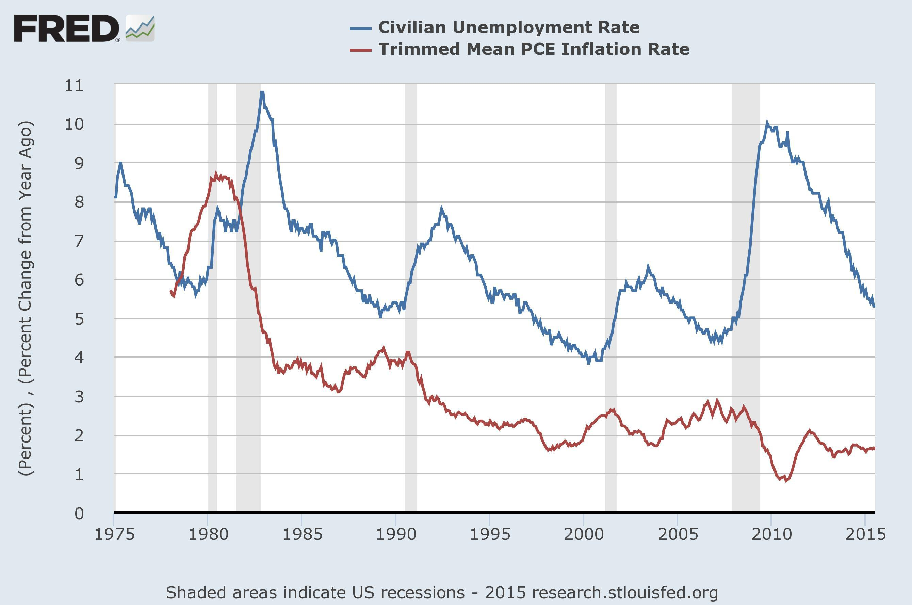

The intersections between presidential policies, economic statistics, and unemployment can have profound impacts on the U.S. economy. The decisions made within the confines of the Oval Office resonant far beyond politics, touching on the financial well-being of millions of Americans. By analyzing how different U.S. presidents have implemented economic strategies to tackle unemployment, one gains insight into the intricate ties between policy directives and employment figures. This exploration extends from historical administrations to contemporary presidencies, illustrating the varying approaches and outcomes related to job creation and job loss.

The evolution of technology, particularly algorithmic trading, has transformed how unemployment trends are interpreted and addressed in real time. Algorithmic trading, with its roots in high-frequency trading and complex mathematical models, serves as a responsive mechanism to shifts in economic indicators like unemployment statistics. This real-time analysis capability empowers investors and policymakers to adapt swiftly in response to changing economic climates.



Through a detailed examination of these elements, this article provides a comprehensive overview of how presidential policies intersect with economic health. It examines historical trends, the political economy influencing employment, and the evolving role of technology, offering a nuanced understanding of these multifaceted relationships. This analysis is crucial for formulating informed economic strategies that effectively balance employment, inflation, and growth.

## Table of Contents

## Understanding U.S. Unemployment

Unemployment is a vital statistic reflecting the economic well-being of a nation. In the United States, it is primarily categorized into two main types: cyclical and structural unemployment. The U.S. Bureau of Labor Statistics (BLS) is tasked with the critical role of collecting and disseminating monthly updates on these figures, contributing an essential tool for economic assessment and policy development.

**Cyclical unemployment** is directly correlated to the macroeconomic cycles of expansion and contraction within an economy. During periods of economic downturn or recession, demand for goods and services decreases, leading businesses to reduce their workforce, thereby increasing unemployment. Conversely, in phases of economic growth, the demand rebounds, businesses expand, and unemployment typically decreases. This relationship indicates how sensitive unemployment rates can be to changes in economic activity.

**Structural unemployment**, on the other hand, arises due to shifts in the economy that change the demand for certain skills or the location of jobs. This type often reflects more profound changes within the economy, such as technological advancements or globalization, which may render certain job skills obsolete and necessitate re-skilling or geographic movement for affected workers.

Unemployment rates are influenced by broader economic conditions and may fluctuate due to external factors such as technological innovation, policy changes, or major economic events. These fluctuations can be closely monitored using economic models to predict future trends. An understanding of the unemployment rate involves examining both the unemployment inflow (individuals losing jobs or entering the workforce) and outflow (individuals gaining employment or exiting the workforce), typically represented by the following equation:

$$
\text{Unemployment Rate} = \frac{\text{Number of Unemployed}}{\text{Labor Force}} \times 100
$$

The unemployment rate is an important metric for understanding the efficiency of the labor market and is used extensively in economic forecasting and policy development. By analyzing patterns and trends within this data, economists and policymakers can better gauge the overall health of the economy and implement strategies to foster job growth and economic stability.

## Economic Policies and Presidential Impact

Presidential administrations have wielded considerable influence over unemployment rates in the United States through a variety of economic policies. These policies often aim to stimulate economic growth, incentivize job creation, or stabilize economic fluctuations, all of which can impact employment levels in distinct ways.

Historically, certain presidencies have been marked by notable unemployment trends. For example, during Lyndon B. Johnson's administration, the U.S. experienced low unemployment rates, which can be partially attributed to his Great Society programs that focused on extensive social welfare reforms, including job training and education initiatives. Conversely, Gerald Ford's presidency saw a spike in unemployment rates amid economic challenges like the 1973 oil crisis and subsequent inflation. Ford responded with measures such as the Economic Policy Board, aimed at tackling economic instability, yet unemployment remained high during his tenure.

Various policies have been implemented across different administrations to manage and mitigate unemployment. These policies generally include:

1. **Tax Incentives:** Presidents have frequently used tax cuts or credits as tools to stimulate economic activity. By reducing the tax burden on individuals and businesses, administrations aim to encourage spending and investment, leading to job creation. For example, the Economic Recovery Tax Act of 1981 under Ronald Reagan included significant tax cuts intended to spur economic growth and reduce unemployment.

2. **Federal Aid and Public Works Programs:** Direct government intervention through federal aid and public works projects has been another strategy to combat unemployment. Public works programs, such as those initiated during Franklin D. Roosevelt's New Deal, created numerous jobs in infrastructure and construction during the Great Depression.

3. **Employment Acts and Policies:** Specific legislative acts have been enacted to address employment directly. The Employment Act of 1946 under President Harry Truman is a notable example, establishing the federal government's role in promoting maximum employment, production, and purchasing power.

The effectiveness of these policies can vary based on the broader economic context and execution. While some measures result in immediate job creation, others may influence employment levels over a longer term. The interplay between fiscal policies and unemployment underscores the importance of strategic decision-making in addressing economic challenges.

These historical examples illustrate how presidential policies have directly and indirectly shaped unemployment rates, reflecting the complexity of economic management in response to both domestic and international pressures. Understanding these influences is crucial for developing future strategies to maintain a healthy job market and overall economic stability.

## Algorithmic Trading and Economic Parameters

Algorithmic trading, a cornerstone in modern financial markets, leverages sophisticated mathematical models and computational power to execute trades in fractions of a second. This practice critically assesses various economic indicators, including unemployment data, to forecast market trends and guide trading strategies. 

Algorithmic systems monitor unemployment [statistics](/wiki/bayesian-statistics) provided by entities such as the U.S. Bureau of Labor Statistics (BLS). These statistics reveal key economic conditions, enabling traders to predict potential market movements based on employment trends. For instance, an unexpected rise in unemployment might signal a weakening economy, potentially leading to a bearish market outlook. Conversely, a drop in unemployment can be interpreted as economic growth, prompting bullish trading strategies.

Algorithms use statistical methods such as moving averages, regression analysis, and [machine learning](/wiki/machine-learning) models to process massive datasets. These techniques identify patterns and correlations between unemployment rates and asset prices. For example, a simple moving average (SMA) might help identify trends by smoothing out short-term fluctuations in unemployment data, providing a clearer picture of long-term trends.

```python
def simple_moving_average(data, window):
    return [sum(data[i:i+window])/window for i in range(len(data)-window+1)]

# Example data: unemployment rates over several months
unemployment_rates = [4.7, 4.8, 4.6, 4.9, 5.0, 4.8]
sma = simple_moving_average(unemployment_rates, 3)
```

Machine learning models go further by predicting future market conditions. These models ingest historical data and continuously learn from it, improving their predictions over time. Techniques like linear regression or more complex neural networks can map how changes in unemployment influence stock prices or bond yields.

Additionally, [algorithmic trading](/wiki/algorithmic-trading) platforms incorporate broader economic indicators, such as GDP growth and inflation rates, to refine their strategies. Integrating multifaceted data streams allows these platforms to respond to economic changes swiftly, maintaining competitive advantages in the marketplace.

In sum, algorithmic trading melds mathematical precision with economic analysis. By harnessing unemployment data and other key economic parameters, it enables traders to make informed and timely investment decisions, capitalizing on market efficiencies and anticipatory trading actions.

## Case Studies: Presidential Impact on Unemployment

From Harry S. Truman to Joe Biden, U.S. presidents have often faced the formidable challenge of managing unemployment through various policy decisions. Each administration, confronted with its own set of unique economic circumstances, has implemented strategies to either stimulate job growth or mitigate job losses. This section investigates into specific case studies illustrating how presidential decisions have significantly impacted the U.S. job market.

### Truman to Nixon: Post-War Adjustments and Economic Growth

Harry S. Truman's presidency (1945-1953) was marked by post-World War II adjustments. Truman's administration faced the challenge of transitioning from a wartime to a peacetime economy, managing demobilization, and reintegrating veterans into the workforce. The introduction of the GI Bill was instrumental in this transition, providing educational benefits to veterans and thereby influencing the labor market positively over the long term.

Under Dwight D. Eisenhower (1953-1961), the U.S. experienced economic stability and low unemployment rates. Eisenhower's focus on infrastructure development, particularly the Interstate Highway System, created numerous jobs and stimulated economic growth.

John F. Kennedy and Lyndon B. Johnson's administrations (1961-1969) emphasized federal intervention in economic affairs to combat unemployment. Johnson's "Great Society" programs aimed to eliminate poverty and racial injustice, indirectly supporting employment through increased public sector jobs and social programs. The Economic Opportunity Act of 1964 played a critical role.

### Ford to Carter: Economic Challenges and Responses

Gerald Ford (1974-1977) and Jimmy Carter (1977-1981) presided over a period characterized by "stagflation," an economic conundrum of stagnant growth and high inflation. Ford's "WIN" (Whip Inflation Now) program attempted to control inflation, but had limited success in reducing unemployment. Carter's response included the establishment of the Department of Energy and efforts to improve government efficiency, though unemployment remained a persistent challenge.

### Reagan to Clinton: Market Reforms and Economic Expansion

Ronald Reagan's administration (1981-1989) set a crucial precedent with supply-side economic policies, commonly known as "Reaganomics," which included tax cuts, deregulation, and budgetary cuts on social spending. While initially leading to a rise in unemployment, the subsequent economic expansion significantly reduced unemployment rates.

During Bill Clinton's presidency (1993-2001), the U.S. experienced significant job growth. Clinton's focus on technology and education, alongside balanced budgets and welfare reform, helped lower unemployment to historically low levels by the end of his second term. The North American Free Trade Agreement (NAFTA) also played a role in reshaping the job market.

### Bush to Biden: Navigating Crises

The presidency of George W. Bush (2001-2009) was marked by the Great Recession, triggered by the financial crisis of 2007-2008. Bush's administration enacted the Emergency Economic Stabilization Act, which aimed to stabilize the financial system through the Troubled Asset Relief Program (TARP). Despite these efforts, unemployment peaked post-presidency due to the recession's aftermath.

Barack Obama's administration (2009-2017) inherited high unemployment due to the recession. The American Recovery and Reinvestment Act of 2009 was pivotal in creating jobs and providing relief. By the end of Obama's tenure, unemployment had steadily decreased, signaling a recovery.

Donald Trump's presidency (2017-2021) initially saw a continuation of low unemployment rates until the COVID-19 pandemic in 2020 led to unprecedented job losses. The Coronavirus Aid, Relief, and Economic Security (CARES) Act, which included provisions for unemployment benefits and small business loans, was critical in mitigating some economic fallout.

Under Joe Biden's administration (2021-present), efforts to address unemployment amidst pandemic recovery have included the American Rescue Plan, targeting job creation and economic stabilization.

### Conclusion

Each presidential administration from Truman to Biden has navigated unique economic scenarios that required bespoke solutions to unemployment. The strategic decisions made, particularly during times of crisis, emphasize the critical interplay between government policy and employment trends. A thorough understanding of these historical contexts provides valuable insights for navigating present and future economic challenges.

## The Future of U.S. Employment and Economic Strategy

Potential strategies for future presidential administrations to address unemployment encompass a blend of policy innovation, technological integration, and economic foresight. In a rapidly evolving global economy, presidents may prioritize workforce skill development, promoting education and retraining programs tailored to meet the demands of a digital economy. By investing in education systems that focus on STEM (Science, Technology, Engineering, and Mathematics) disciplines, future administrations can equip the labor force with the necessary skills to thrive in new and emerging industries.

Technological advancements, particularly in [artificial intelligence](/wiki/ai-artificial-intelligence) (AI) and algorithmic trading, represent transformative tools that could significantly influence economic policies. AI technologies offer the potential to enhance productivity across sectors, leading to job creation in tech-driven industries. Future policies might focus on incentivizing technology-driven growth while also mitigating the job displacement risks associated with automation. Properly addressing this balance will require adaptive training programs and proactive measures to foster new employment opportunities in tech-enhanced fields.

Algorithmic trading, by utilizing large-scale data analysis and predictive modeling, can refine economic strategies. For instance, real-time data on unemployment rates and other economic indicators provide a dynamic basis for decision-making, helping to anticipate market shifts and inform fiscal policy. Incorporating such technologies would enable policymakers to react swiftly to economic changes, thereby minimizing adverse effects on employment.

Balancing unemployment with inflation and economic growth remains a perennial challenge for policymakers. The Phillips curve, which historically illustrated an inverse relationship between unemployment and inflation, has become more complex in contemporary economies. Policymakers must consider both the short-term pressures, such as demand-pull inflation, and long-term goals of maintaining a stable economic environment.

Future economic strategy may involve optimizing interest rates and monetary policy to manage inflation without stifling growth. This could involve leveraging computational models to predict inflationary trends based on unemployment data and adjust economic levers accordingly.

In conclusion, addressing unemployment in future U.S. administrations will necessitate a multifaceted approach. Emphasizing workforce education, embracing technological advancements, and refining economic policies in response to real-time data are crucial components that will shape employment landscapes and economic resilience.

## Conclusion

Presidential policies have a profound impact on key economic indicators, particularly unemployment rates. By implementing strategic fiscal and monetary policies, presidents can influence job creation, stimulate economic growth, or address economic downturns. For example, tax reforms, such as those introduced during the Kennedy and Reagan administrations, have historically aimed to incentivize investment and stimulate employment. Similarly, fiscal stimuli and austerity measures, such as those seen in response to the Great Recession and the COVID-19 pandemic, highlight the critical role presidential decisions play in shaping unemployment trends.

Algorithmic trading offers a dynamic and sophisticated means to respond to these economic changes. By leveraging real-time data, algorithms can analyze economic indicators like unemployment rates and make informed trading decisions swiftly. This form of trading employs advanced mathematical models and machine learning to predict market behavior, assessing vast amounts of economic data faster than humanly possible. As a result, algorithmic trading can provide insights into market conditions and facilitate quick reactions, potentially stabilizing financial systems during periods of economic uncertainty.

A nuanced understanding of how past presidential policies have impacted economic conditions is crucial for future policymaking. Historical data provides valuable insights into what strategies have succeeded or failed, allowing policymakers to adapt and refine their approaches. As technological advances, such as AI and algorithmic trading, become progressively integrated into economic strategies, learning from previous presidencies will enable more informed and agile decision-making, ensuring robust responses to unemployment and broader economic challenges.

The interplay of these elements underscores the complexity and interconnectedness of presidential policies, economic indicators, and technological advancements. By examining past influences and leveraging modern tools, policymakers can effectively navigate the evolving landscape of economic governance.

## References & Further Reading

[1]: Colander, D. C. (2016). ["Macroeconomics"](https://www.mheducation.com/highered/product/macroeconomics-colander/M9781266394973.html). McGraw-Hill Education.

[2]: Friedman, M. (1968). ["The Role of Monetary Policy."](https://www.aeaweb.org/aer/top20/58.1.1-17.pdf) The American Economic Review, 58(1), 1-17.

[3]: Lopez de Prado, M. (2018). ["Advances in Financial Machine Learning"](https://www.amazon.com/Advances-Financial-Machine-Learning-Marcos/dp/1119482089). John Wiley & Sons, Inc.

[4]: Bureau of Labor Statistics. ["Unemployment Rate"](https://www.bls.gov/charts/employment-situation/civilian-unemployment-rate.htm). U.S. Department of Labor.

[5]: Carlin, W., & Soskice, D. (2006). ["Macroeconomics: Imperfections, Institutions, and Policies."](https://www.inet.ox.ac.uk/publications/macroeconomics-imperfections-institutions-and-policies) Oxford University Press.

[6]: Aronson, D. (2006). ["Evidence-Based Technical Analysis: Applying the Scientific Method and Statistical Inference to Trading Signals."](https://www.amazon.com/Evidence-Based-Technical-Analysis-Scientific-Statistical/dp/0470008741) John Wiley & Sons, Inc.

[7]: Harcourt, G. C. (2006). ["The Structure of Post-Keynesian Economics: The Core Contributions of the Pioneers."](https://www.nuevatribuna.es/media/nuevatribuna/files//2013/03/12/harcourt_structureofpost-keynesianeconomics.pdf) Cambridge University Press.