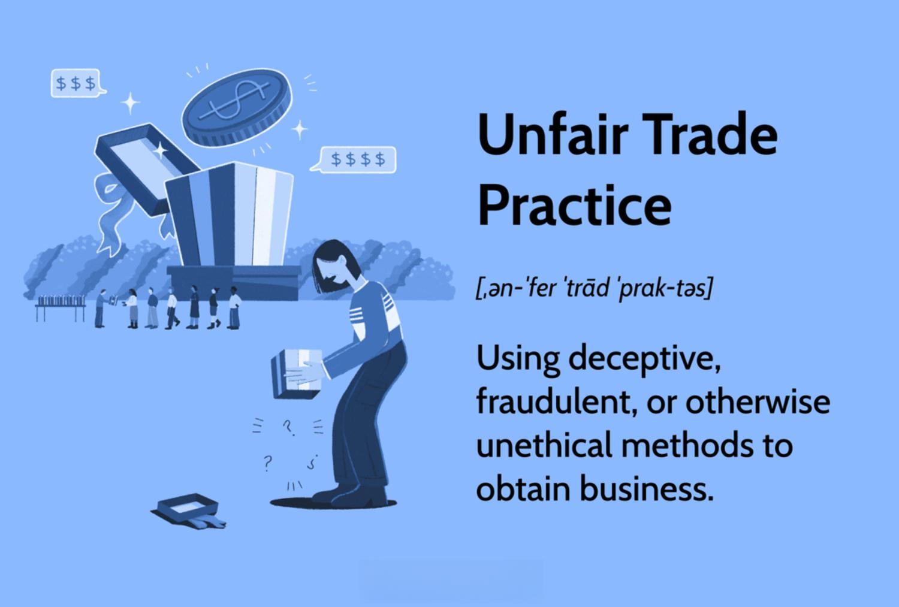

In the modern financial landscape, algorithmic trading has revolutionized how trading occurs, offering both significant opportunities and controversies. Algorithms, capable of processing vast amounts of data at unparalleled speeds, have transformed trading operations by improving efficiency and minimizing human errors. However, this technological advancement is not without its drawbacks. Algorithmic trading can be associated with unfair trade practices, which pose challenges to traditional business ethics.

Unfair trade practices refer to deceptive, unethical, or fraudulent business methods employed to gain an advantage over competitors. In the context of algorithmic trading, these practices can manifest through the exploitation of speed and informational asymmetries, potentially disadvantaging less technologically-equipped participants.

This article explores the intersection of unfair trade practices, deceptive methods, business ethics, and algorithmic trading. It covers definitions, examples, and the ethical considerations that companies and regulators face in today's trading environment. Navigating this complex landscape is crucial, as maintaining fair and transparent markets is essential for upholding consumer trust and safeguarding market integrity.

Through examining these dynamics, businesses and regulators can better understand the implications of algorithmic trading and work towards creating a trading environment that balances innovation with ethical standards and consumer protection.

## Table of Contents

## What Are Unfair Trade Practices?

Unfair trade practices are actions engaged in by businesses that are deceptive, fraudulent, or unethical, often intended to gain an undue competitive advantage. These practices violate the principles of fair competition and consumer protection, posing significant threats to the integrity of the marketplace.

Common unfair trade practices include:

- **False Advertising**: This involves making misleading claims about a product or service to entice consumers. For example, advertisements that overstate the benefits or functionalities of a product fall under this category.

- **Misrepresentation**: Businesses may provide false or misleading information about the nature or quality of a product. This can misguide consumers and influence their purchasing decisions based on inaccurate information.

- **Tied Selling**: This practice involves compelling a consumer to purchase an unwanted product or service as a condition for buying a desired product. It restricts consumer choice and can lead to anti-competitive behavior.

- **Deceptive Pricing**: This includes presenting prices in a way that misleads customers, such as through bait-and-switch tactics where a seller advertises a low price on a product that is not actually available, intending to sell a more expensive item instead.

Consumer Protection Laws are enacted to safeguard the interests of consumers against such unfair practices. These laws provide mechanisms for affected individuals to seek redress, ensuring that companies are accountable and honest in their dealings. For instance, legal frameworks stipulate that businesses must avoid any statement or estimate that can mislead or deceive customers.

The presence of unfair trade practices undermines consumer trust and the overall integrity of the market. When consumers feel that they are being misled or exploited, their confidence in the marketplace erodes, which can lead to decreased market participation and reduced economic efficiency. Furthermore, such practices distort competition and can harm businesses that adhere to fair trading standards by placing them at a disadvantage.

Legal frameworks addressing unfair trade practices vary across jurisdictions but generally aim to ensure that markets remain transparent and competitive. These laws are critical for protecting consumers and ensuring that businesses can compete on a level playing field, fostering an environment where ethical practices are the norm.

## Examples of Deceptive Methods in Business

Deceptive methods in business can significantly undermine market integrity and erode consumer trust. These practices involve intentional acts that mislead consumers or distort their decision-making processes. Among the most prevalent deceptive strategies is deceptive advertising. This involves making misleading claims about a product or service, designed to entice consumers by portraying benefits or features that do not exist. An example might be a health supplement advertised with exaggerated claims about its efficacy without scientific backing.

Bait and switch is another underhanded sales tactic wherein a company advertises a product that is not actually available, with the primary objective being to upsell or push consumers towards a more expensive alternative. This practice often leaves consumers frustrated and skeptical about the business's intentions and integrity.

Phantom discounts are also a widespread deceptive method. This occurs when businesses offer discounts on products where the original price was inflated beforehand. Consumers are misled into believing they are receiving a bargain when, in fact, the "discounted" price may reflect the item's true market value.

Hidden fees represent another insidious method, where additional charges are concealed within the fine print, only disclosed at the final stages of a purchase or after a service is rendered. This can catch consumers off guard, making the final cost much higher than anticipated.

False endorsements involve the use of fabricated or misleading testimonials to enhance a company's credibility. These endorsements may be presented as coming from satisfied customers or experts when, in reality, they are fictitious or manipulated. This has the potential to unduly influence consumer decisions based on trust that is falsely generated.

These deceptive business practices pose significant challenges to fair trade, necessitating robust regulatory frameworks and ethical business standards to ensure consumer protection and maintain trust in the marketplace.

## The Role of Business Ethics

Business ethics represent the application of ethical principles within the sphere of business operations. These principles serve as the foundation for trust-building and the maintenance of long-term relationships with consumers. When businesses consistently engage in ethical practices, they not only enhance their reputations but also provide a baseline of integrity that promotes consumer confidence. 

Ensuring adherence to ethical standards is both a moral and legal obligation for companies. Failing to meet these standards can lead to significant reputational damage, potentially resulting in financial losses and reduced market share. For example, a company that is caught engaging in deceptive practices or avoiding its ethical responsibilities might face consumer backlash, loss of customer loyalty, and diminished brand value.

Transparency, honesty, and fairness are the key components of ethical business practices. Transparency involves openly sharing relevant information with stakeholders, ensuring that there are no hidden agendas. This approach allows customers to make informed decisions and creates an atmosphere of mutual respect and understanding. Honesty involves truthful representation of products and services, wherein consumers are not misled or deceived. Fairness denotes equitable treatment of all parties involved in business transactions, ensuring that no party is unduly taken advantage of.

Navigating the fine line between aggressive marketing and ethical conduct requires a mindful approach to business strategies. Aggressive marketing, while potentially effective in boosting sales, can sometimes lead to exaggerated claims or manipulative tactics that push ethical boundaries. Companies must strive to balance their sales objectives with their ethical responsibilities, ensuring their marketing practices align with both legal standards and societal expectations.

In conclusion, the role of business ethics is crucial for fostering a market environment conducive to trust and sustainability. By committing to ethical practices, companies not only protect their reputations but also contribute to the broader economic landscape by setting standards for fair play and integrity.

## Algorithmic Trading and Its Ethical Challenges

Algorithmic trading, a technological advancement in financial markets, automates trade execution through sophisticated algorithms. These algorithms analyze market data and execute trades at speeds and frequencies beyond human capability, unlocking efficiencies and minimizing human error. However, this progress introduces ethical challenges that necessitate careful consideration.

One primary ethical issue is the fairness of [algorithmic trading](/wiki/algorithmic-trading). High-frequency trading ([HFT](/wiki/high-frequency-trading-strategies)) firms, equipped with superior technology, can execute trades in microseconds, exploiting latency to gain profits at the expense of slower traders. Such advantages challenge the principle of a level playing field, raising questions about the ethics of using speed as a competitive edge. While speed itself is not inherently unethical, the potential for abuse and market manipulation demands scrutiny.

The New York Stock Exchange (NYSE) and the Nasdaq have both encountered instances where algorithmic trading led to market disruptions. For instance, the Flash Crash of May 6, 2010, exemplified how algorithms can exacerbate [volatility](/wiki/volatility-trading-strategies), triggering massive sell-offs that briefly wiped out nearly $1 trillion in market value. This incident revealed vulnerabilities in the system, emphasizing the need for ethical considerations and robust fail-safes in trading algorithms.

Regulation becomes complex as traders and firms navigate rapidly evolving digital landscapes. Regulators, like the Securities and Exchange Commission (SEC), grapple with establishing guidelines that prevent manipulative practices without stifling innovation. One approach considered involves implementing circuit breakers to halt trading amid extreme volatility, providing human oversight in otherwise automated environments.

Implementing trading halts at predefined thresholds can mitigate flash crashes while preserving market integrity. These halts allow for reassessment of market conditions and interventions if necessary, thus providing a buffer against algorithm-induced turbulence.

Additionally, promoting transparency in algorithmic trading practices is crucial. Requiring firms to disclose algorithmic strategies or imposing audits could help in curbing excessive risk-taking behaviors that often stem from opaque trading operations. However, regulators must balance transparency with protecting proprietary trading strategies, ensuring that firms remain competitive without compromising ethical standards.

Assessing the ethical challenges in algorithmic trading underscores the need for regulatory frameworks that adapt to technological advancements, fostering an environment where innovation coexists with integrity. Effective regulations, balancing consumer protection with technological growth, will ultimately uphold the fairness and stability of financial markets.

## Regulatory Responses to Unfair Trade Practices

The Federal Trade Commission (FTC) is pivotal in enforcing consumer protection laws in the United States, specifically targeting unfair and deceptive practices through robust regulatory measures. A core component of its mandate is encapsulated in Section 5(a) of the FTC Act, which prohibits "unfair or deceptive acts or practices in or affecting commerce." This foundational statute grants the FTC authority to address a broad spectrum of unfair trade practices, ensuring that businesses do not engage in deceptive behavior that may harm consumers. By providing legal recourse, this regulation upholds consumer trust and market fairness.

Internationally, approaches to regulating unfair trade practices vary significantly. For instance, the European Union employs the Unfair Commercial Practices Directive to harmonize consumer protection laws across member states, aiming to create a consistent standard that prevents misleading and aggressive commercial conduct. Similarly, countries like Australia use the Australian Consumer Law, which details specific prohibitions against misleading representations and unfair practices, thus enabling a proactive stance in consumer protection.

As digital markets continue to evolve, traditional regulatory frameworks face significant challenges. The rapid development of technology in trading, especially with the advent of algorithmic trading, requires regulatory bodies to adapt swiftly to ensure that innovations do not circumvent consumer protection laws. This adaptation might involve the incorporation of advanced technology such as [machine learning](/wiki/machine-learning) algorithms to monitor and analyze market activities for potential misconduct.

Effective regulation thus relies on a fine balance between encouraging innovation and ensuring comprehensive consumer protection. As trading technologies advance, regulators must also enhance their strategies, possibly incorporating predictive analytics to foresee potential market abuses. Such adaptations are crucial in creating environments where consumers are protected without stifling technological advancements.

In conclusion, safeguarding against unfair trade practices in a rapidly changing digital landscape necessitates constant vigilance and adaptation. Collaborative efforts between international regulatory bodies, technological innovation, and rigorous enforcement of existing laws are essential to maintaining the integrity of markets and protecting consumer interests.

## Conclusion

Unfair trade practices and deceptive methods pose substantial risks to market integrity, affecting both consumer trust and the stability of financial systems. Ethical business practices, alongside stringent regulatory oversight, play a vital role in protecting consumers and maintaining a trustworthy market environment. The evolution of algorithmic trading highlights the necessity for proactive measures to address its ethical implications. As trading technologies become increasingly sophisticated, ensuring fairness requires a collaborative effort involving regulators, businesses, and consumers.

Regulatory bodies must continuously adapt their frameworks to effectively monitor and mitigate unethical trading practices. This includes updating regulations to accommodate emerging technologies and ensuring they remain responsive to new challenges. Businesses have a responsibility to uphold ethical standards, emphasizing transparency and integrity to foster long-term relationships with consumers. Consumers, in turn, should remain informed and vigilant, actively participating in safeguarding ethical trading environments.

By fostering open communication and cooperation among all stakeholders, the financial landscape can evolve in a way that balances innovation with ethical considerations. Ongoing vigilance and flexibility in adapting to market dynamics are essential for sustaining ethical trading environments, ultimately ensuring that markets remain fair and transparent for all participants.

## References & Further Reading

[1]: O'Hara, M. (2015). ["High-Frequency Trading and Its Impact on Markets."](https://statmath.wu.ac.at/~hauser/LVs/FinEtricsQF/References/oHara2015JFinEco_HighFrequ_Market_MiicroStruct.pdf) Annual Review of Financial Economics, 7(1), 133-152.

[2]: Gomber, P., Arndt, B., Lutat, M., & Uhle, T. (2011). ["High-Frequency Trading."](https://papers.ssrn.com/sol3/papers.cfm?abstract_id=1858626) CESifo Working Paper Series No. 3825.

[3]: DeFilippis, D. (2019). ["Algorithmic Trading: Impacts, Regulation, and Implications."](https://econcs.seas.harvard.edu/publications/how-do-fairness-definitions-fare-examining-public-attitudes-towards-algorithmic) Berkeley Business Law Journal, 16(1).

[4]: Aldridge, I. (2013). ["High-Frequency Trading: A Practical Guide to Algorithmic Strategies and Trading Systems"](https://www.ahmetbeyefendi.com/wp-content/uploads/2020/07/High-Frequency-Trading-Irene-Aldridge.pdf) (2nd ed.). Wiley.

[5]: MacKenzie, D. (2019). ["Material Signals: A Historical Sociology of High-Frequency Trading."](https://www.semanticscholar.org/paper/Material-Signals%3A-A-Historical-Sociology-of-MacKenzie/a3347764ea03c35bddbc703940a907c6e52f6f6b) Theory, Culture & Society.