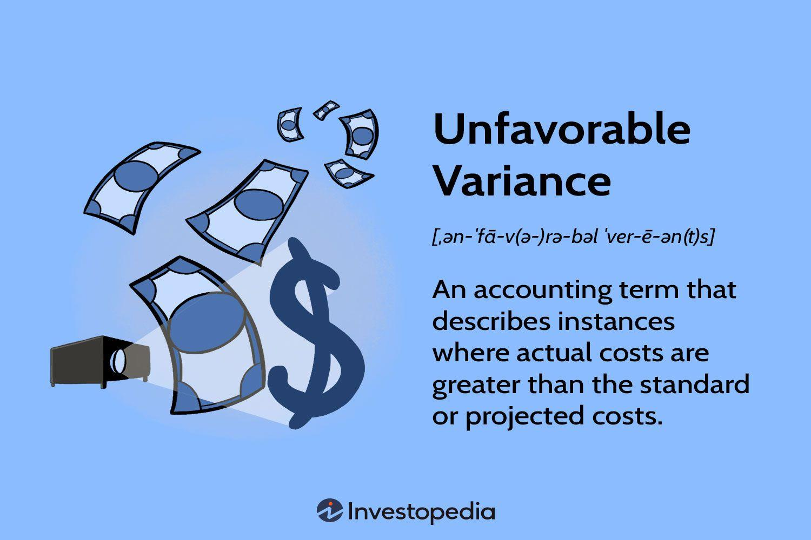

## Table of Contents

## What is an unfavorable variance?

An unfavorable variance is when the actual results of a business are worse than what was planned or expected. For example, if a company expected to spend $100 on materials but ended up spending $120, that's an unfavorable variance of $20. This happens often in businesses because things don't always go as planned.

When a business sees an unfavorable variance, it's a sign that they need to look closer at what went wrong. They might need to change their plans or find ways to save money. It's important for businesses to understand these variances so they can make better decisions in the future.

## How does an unfavorable variance differ from a favorable variance?

An unfavorable variance happens when things don't go as well as planned. For example, if a business expected to make $1000 but only made $900, that's an unfavorable variance. It means the business did worse than expected. This can happen with costs too, like if a company planned to spend $500 on supplies but ended up spending $600. Unfavorable variances show where a business needs to improve or fix problems.

A favorable variance is the opposite. It's when things go better than planned. If a business expected to spend $500 on supplies but only spent $400, that's a favorable variance. It means the business did better than expected, either by saving money or making more money than planned. Favorable variances are good because they show that the business is doing well in certain areas.

Both types of variances are important for businesses to understand. They help businesses see where they need to make changes or where they are doing well. By looking at these variances, a business can make better plans and decisions for the future.

## What are the common types of unfavorable variances?

Unfavorable variances can happen in different parts of a business. One common type is a cost variance, which happens when a business spends more money than it planned. For example, if a company expected to pay $100 for materials but ended up paying $120, that's an unfavorable cost variance. Another type is a revenue variance, which happens when a business makes less money than it expected. If a company thought it would earn $1000 from sales but only earned $900, that's an unfavorable revenue variance.

Another type of unfavorable variance is a labor variance, which happens when the cost of labor is higher than planned. This could be because workers are paid more than expected or because more hours are needed to complete a job. For example, if a business budgeted $500 for labor but ended up spending $600, that's an unfavorable labor variance. Lastly, there's an efficiency variance, which happens when it takes more time or resources than planned to do something. If a task was supposed to take 10 hours but took 12 hours, that's an unfavorable efficiency variance.

These types of variances are important for businesses to watch. They help business owners and managers see where things are not going as planned and where they need to make changes. By understanding unfavorable variances, a business can work on improving its plans and making better decisions for the future.

## Can you explain material variance and its impact on business?

Material variance is when a business spends more or less money on materials than it planned. This can happen if the price of materials goes up or down, or if the business uses more or less material than expected. For example, if a company planned to spend $100 on wood but ended up spending $120 because the price of wood went up, that's an unfavorable material variance. On the other hand, if the company only spent $80 because they found a cheaper supplier, that's a favorable material variance.

Material variances can have a big impact on a business. If there's an unfavorable material variance, it means the business is spending more money than planned. This can hurt the business's profits and might mean they need to find ways to save money in other areas or raise prices. A favorable material variance, on the other hand, can help the business make more profit. It's good for the business because it means they are spending less money than they thought they would. Understanding material variances helps businesses make better plans and decisions for the future.

## What is labor variance and how does it affect operations?

Labor variance happens when a business spends more or less on labor than it planned. This can happen if workers are paid more than expected, or if more hours are needed to get the job done. For example, if a business thought it would spend $500 on labor but ended up spending $600 because workers got a raise, that's an unfavorable labor variance. If they only spent $400 because they found a way to do the work faster, that's a favorable labor variance.

Labor variances can affect how a business runs. If there's an unfavorable labor variance, it means the business is spending more on labor than it planned. This can make it harder for the business to make a profit, and they might need to find ways to cut costs or raise prices. A favorable labor variance can help the business save money and make more profit. Understanding labor variances helps a business see where it needs to make changes and how to plan better for the future.

## How does overhead variance occur and what are its implications?

Overhead variance happens when a business spends more or less on overhead costs than it planned. Overhead costs are things like rent, utilities, and office supplies that a business needs to run but aren't directly tied to making a product or service. If a business planned to spend $200 on utilities but ended up spending $250 because of a cold winter, that's an unfavorable overhead variance. On the other hand, if they only spent $150 because they found a way to use less energy, that's a favorable overhead variance.

Overhead variances can have a big impact on a business. If there's an unfavorable overhead variance, it means the business is spending more money than it expected. This can make it harder for the business to make a profit and might mean they need to find ways to save money or raise prices. A favorable overhead variance can help the business save money and increase profits. By understanding overhead variances, a business can make better plans and decisions to keep costs under control and improve their financial health.

## What are the primary causes of unfavorable variances?

Unfavorable variances happen when a business spends more money or makes less money than it planned. One common reason for this is changes in costs. For example, if the price of materials goes up, a business might have to pay more than it expected. Another reason is not selling as much as planned. If a business thought it would sell 100 items but only sold 80, that's an unfavorable revenue variance. Sometimes, it's because the business needs more time or labor to get things done. If a job takes longer than planned, it can lead to higher labor costs.

Another cause of unfavorable variances is poor planning or unexpected events. If a business doesn't plan well, it might not have a good idea of what things will cost or how much they will sell. Unexpected events like a machine breaking down or a natural disaster can also cause costs to go up. For example, if a machine breaks, the business might have to pay for repairs and lose time, leading to an unfavorable variance. Understanding these causes helps a business see where it needs to improve its plans and be ready for surprises.

## How can inaccurate budgeting lead to unfavorable variances?

Inaccurate budgeting can lead to unfavorable variances because it means a business might not have the right numbers to plan with. If a business guesses wrong about how much things will cost or how much they will sell, they can end up spending more or making less money than they thought. For example, if a business plans to spend $100 on materials but the real cost is $120, they will have an unfavorable cost variance. This happens because the budget didn't match what actually happened.

When a business doesn't budget accurately, it can also miss out on planning for unexpected costs. If something goes wrong, like a machine breaking down or prices going up, the business might not have money set aside to cover these extra costs. This can lead to unfavorable variances because the business ends up spending more than it planned. By making sure budgets are as accurate as possible, a business can better predict what will happen and avoid these surprises.

## What role does market fluctuation play in causing unfavorable variances?

Market fluctuation can cause unfavorable variances because it makes prices and costs change a lot. For example, if a business plans to buy materials at one price but the price goes up because of market changes, they will end up spending more than they expected. This leads to an unfavorable cost variance. The same thing can happen with selling prices. If a business expects to sell its products at a certain price but the market changes and they have to lower their prices, they will make less money than they planned, causing an unfavorable revenue variance.

To deal with market fluctuation, businesses need to keep a close eye on the market and be ready to change their plans. If they can predict market changes, they might be able to adjust their budgets and plans to avoid big unfavorable variances. But even with good planning, market changes can still surprise a business and lead to costs being higher or sales being lower than expected. Understanding how market fluctuation can affect their business helps companies prepare better and manage their budgets more effectively.

## How can operational inefficiencies result in unfavorable variances?

Operational inefficiencies happen when a business does not run as smoothly as it could. This can cause unfavorable variances because it means the business might spend more money or take more time to do things than planned. For example, if workers are not trained well, they might make more mistakes or take longer to finish tasks. This can lead to higher labor costs than expected, creating an unfavorable labor variance. If machines are not working properly, they might break down more often, causing the business to spend more on repairs and lose time, which can result in an unfavorable overhead variance.

Another way operational inefficiencies can cause unfavorable variances is by using more materials than planned. If a business is not careful about how it uses materials, it might end up wasting them. This can lead to an unfavorable material variance because the business will need to buy more materials than it budgeted for. By finding and fixing these inefficiencies, a business can save money and time, helping to reduce unfavorable variances and improve its overall performance.

## What are some real-world examples of unfavorable variances in different industries?

In the construction industry, unfavorable variances can happen if a project takes longer than planned. For example, a construction company might budget $100,000 for a project, but if it rains a lot and work has to stop, they might end up spending $120,000. This is an unfavorable cost variance because they spent more than they planned. Another example is if the price of steel goes up suddenly. If the company budgeted $50 per ton but now has to pay $60 per ton, that's an unfavorable material variance.

In the restaurant industry, an unfavorable variance can occur if food costs rise. For instance, a restaurant might plan to spend $500 on ingredients for the week, but if there's a shortage of a key ingredient like tomatoes and the price goes up, they might end up spending $600. This creates an unfavorable cost variance. Also, if fewer customers come to eat than expected, the restaurant might make less money than planned, leading to an unfavorable revenue variance.

## How can companies mitigate the risks associated with unfavorable variances?

Companies can mitigate the risks of unfavorable variances by keeping a close eye on their budgets and plans. They should always check their numbers and see if they are spending more or making less than they thought. If they see a problem, they can change their plans quickly. For example, if the price of materials goes up, they might look for a cheaper supplier or use less material. By watching their budgets and being ready to make changes, companies can avoid big surprises and keep their costs under control.

Another way companies can reduce the risks of unfavorable variances is by planning for unexpected events. They can set aside some money in their budgets for things that might go wrong, like machines breaking down or prices going up. This way, if something unexpected happens, they will have the money to deal with it without spending more than they planned. By being ready for surprises and having good plans, companies can handle unfavorable variances better and keep their business running smoothly.

## What is Variance Analysis in Financial Performance?

Variance analysis is a fundamental component of financial performance evaluation, allowing organizations to assess deviations between actual outcomes and expected targets. This process not only provides insights into operational efficiency but also aids in strategic decision-making and budgeting.

### Methods of Variance Analysis

Variance analysis can be conducted through several methods, with decomposition and attribution analysis being among the most prominent.

**Decomposition Analysis**

This approach breaks down the total variance into various components to pinpoint specific areas that contributed to the deviation. By categorizing variances into price, [volume](/wiki/volume-trading-strategy), and efficiency segments, companies can better understand how each [factor](/wiki/factor-investing) impacts overall performance. For instance, when analyzing sales variance, it can be decomposed into:

$$
\text{Sales Variance} = (\text{Actual Sales Quantity} - \text{Budgeted Sales Quantity}) \times \text{Budgeted Sales Price} + (\text{Actual Sales Price} - \text{Budgeted Sales Price}) \times \text{Actual Sales Quantity}
$$

This formula allows managers to separately evaluate the impact of quantity changes and price fluctuations on sales performance.

**Attribution Analysis**

This method assigns the variance to specific drivers, such as market trends, economic conditions, or internal processes, offering a granular view of performance discrepancies. Attribution analysis is particularly useful in investment management where it helps to determine how asset allocation, security selection, and market timing have affected portfolio performance. For example, in Python, a simple attribution model can be constructed as follows:

```python
def calculate_attribution(actual_return, benchmark_return):
    allocation_effect = actual_return - benchmark_return
    return allocation_effect

actual_return = 0.08
benchmark_return = 0.05
print("Attribution Effect:", calculate_attribution(actual_return, benchmark_return))
```

### Importance of Identifying Root Causes

Identifying the root causes of variance is crucial for developing effective strategies to mitigate future risks and capitalize on opportunities. Understanding whether a variance is driven by controllable internal factors, such as operational inefficiencies, or external elements, such as market [volatility](/wiki/volatility-trading-strategies), enables organizations to implement targeted corrective measures. This proactive approach is essential for maintaining competitiveness and achieving financial objectives.

### Role in Strategic Planning and Budgeting

Variance analysis plays a significant role in strategic planning and budgeting by providing a basis for performance tracking and forecasting. By continually comparing actual performance with planned targets, organizations can adjust their strategies and allocate resources more efficiently. This ongoing evaluation fosters a responsive and adaptive business environment, facilitating long-term sustainability and growth.

In summary, variance analysis is an invaluable tool for assessing financial performance, identifying areas for improvement, and informing strategic decisions. Its application across different methods and its integration into planning processes underscore its significance in contemporary business management.

## What are the challenges in variance analysis and algorithmic trading?

Successfully conducting variance analysis and implementing algorithmic trading is fraught with challenges that can impede the effective assessment and management of financial variance.

### Data Quality and Computational Power

A cardinal challenge in variance analysis lies in the quality and availability of data. Accurate variance analysis requires comprehensive and high-quality data. Incomplete or erroneous data can lead to skewed analyses, affecting financial decision-making. Organizations must ensure robust data validation and cleaning processes to maintain data integrity.

Furthermore, variance analysis, especially when tied to algorithmic trading, demands substantial computational power. As financial markets generate vast amounts of data every second, the ability to process this data timely and efficiently is crucial. The computational demands not only require advanced hardware but also sophisticated software capable of handling large datasets, running complex algorithms, and delivering real-time insights.

### Complexity and Interpretability of Models

Algorithmic trading models are inherently complex, often involving intricate mathematical formulas and algorithms. These models include elements such as stochastic calculus and differential equations, which can be challenging to interpret. For instance, a typical trading algorithm may utilize a form of the Black-Scholes model to price options and manage financial risks:

$$
C(S, t) = N(d_1) \cdot S - N(d_2) \cdot K \cdot e^{-r(T-t)}
$$

where:
- $C$ is the option price
- $S$ is the stock price
- $K$ is the strike price
- $T$ is time to maturity
- $r$ is the risk-free rate
- $N$ is the cumulative distribution function of the standard normal distribution
- $d_1, d_2$ are variables derived from the inputs

Such complexity can lead to difficulties in model validation and challenges for traders or analysts trying to understand and trust the algorithmic decisions.

### Risks and Limitations of Automated Trading Systems

Automated trading systems introduce several potential risks and limitations. A significant risk is the over-reliance on backtested results. While [backtesting](/wiki/backtesting) strategies provide insight into potential performance, they do not guarantee future success. Backtests could be plagued by the survivorship bias or overfitting, where models are overly tailored to past data without accounting for future market dynamics.

Moreover, automated systems can be susceptible to market anomalies. High-frequency trading, for instance, could exacerbate market volatility during unforeseen events, leading to flash crashes. Furthermore, trading algorithms can be targeted by adversarial entities, potentially leading to exploitative scenarios that financial institutions must safeguard against.

In conclusion, while variance analysis and algorithmic trading offer impressive capabilities, they also pose significant challenges related to data integrity, computational requirements, model complexity, interpretability, and inherent risks of automation. Overcoming these challenges is crucial for the successful integration and application of these techniques in financial markets.

## References & Further Reading

[1]: Bergstra, J., Bardenet, R., Bengio, Y., & Kégl, B. (2011). ["Algorithms for Hyper-Parameter Optimization."](https://dl.acm.org/doi/10.5555/2986459.2986743) Advances in Neural Information Processing Systems 24.

[2]: ["Advances in Financial Machine Learning"](https://www.amazon.com/Advances-Financial-Machine-Learning-Marcos/dp/1119482089) by Marcos Lopez de Prado

[3]: ["Evidence-Based Technical Analysis: Applying the Scientific Method and Statistical Inference to Trading Signals"](https://www.amazon.com/Evidence-Based-Technical-Analysis-Scientific-Statistical/dp/0470008741) by David Aronson

[4]: ["Machine Learning for Algorithmic Trading"](https://github.com/stefan-jansen/machine-learning-for-trading) by Stefan Jansen

[5]: ["Quantitative Trading: How to Build Your Own Algorithmic Trading Business"](https://www.amazon.com/Quantitative-Trading-Build-Algorithmic-Business/dp/1119800064) by Ernest P. Chan