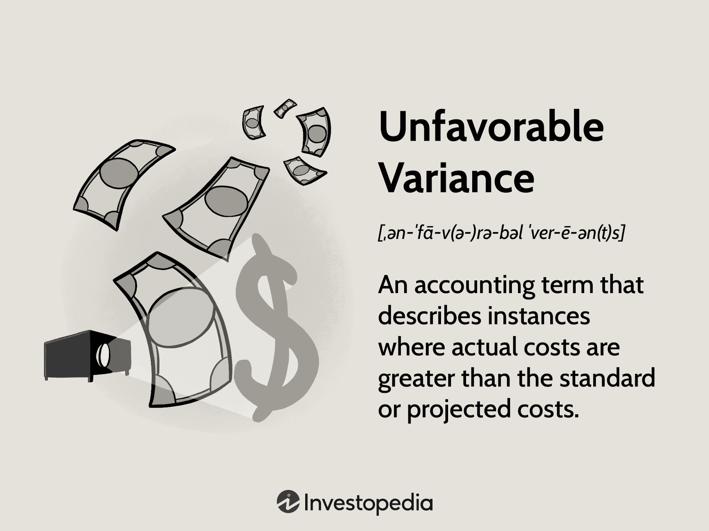

In today's financial landscape, accurately assessing and managing variance in financial performance is critical. Unfavorable variance, a situation where actual financial outcomes fall short of what was projected, presents unique challenges that can significantly impact a company's strategic objectives and bottom line. Understanding and managing these variances are crucial for maintaining economic viability and ensuring long-term business sustainability.

Algorithmic trading offers a powerful approach to addressing these challenges by employing sophisticated analysis and automation to optimize trading performance. Through the application of advanced mathematical models and data analytics, algorithmic trading can identify patterns and opportunities in market data that might be missed by human traders. This allows for proactive adjustments in trading strategies, thereby reducing the potential impact of unfavorable variance on financial outcomes.



This article explores the nuances of unfavorable variance, financial performance variance analysis, and the role of algorithmic trading in managing these discrepancies. As modern businesses operate in environments characterized by rapid changes and high volatility, there is a greater need for tools and techniques that can provide actionable insights from complex data sets. Algorithmic trading, with its ability to process vast amounts of information and execute trades at high speeds, represents a transformative method for managing financial performance variance.

Traders and companies can leverage these concepts to enhance financial decision-making and strategy implementation. By integrating variance analysis with algorithmic trading strategies, businesses can better anticipate market movements and adjust their operations accordingly. This not only helps in mitigating risks associated with unfavorable variance but also uncovers opportunities for gaining a competitive edge in the market. The interplay between traditional financial analysis methods and modern algorithmic systems remains an area of ongoing research and development, promising continuous advancements in financial strategy formulation and execution.

## Table of Contents

## Understanding Unfavorable Variance

Unfavorable variance occurs when the actual financial performance is poorer than projected, significantly affecting an organization's profitability and strategic objectives. Various factors contribute to unfavorable variance, including increased costs, reduced sales, and operational inefficiencies.

### Causes of Unfavorable Variance

1. **Increased Costs**: One of the primary causes of unfavorable variance is a rise in costs beyond what was initially budgeted. These can emerge from unexpected increases in material prices, labor costs, or overhead expenses. For instance, a sudden spike in raw material costs due to supply chain disruptions can lead to a cost variance that is unfavorable.

2. **Reduced Sales**: Sales variance arises when actual revenue falls short of expectations, which can be attributed to competitive pressure, changes in consumer preferences, or ineffective marketing strategies. A decline in consumer demand or a new competitor offering similar products at lower prices might result in reduced sales, contributing to unfavorable variance.

3. **Operational Inefficiencies**: Inefficiencies in production processes, such as lower than planned productivity or higher waste levels, lead to production variances. These inefficiencies can stem from equipment breakdowns, inefficient use of resources, or poor workforce management, resulting in lower output and higher production costs.

### Types of Unfavorable Variances

1. **Cost Variance**: This type of variance measures the difference between the actual incurred cost and the budgeted cost. It indicates whether a business pays more than expected for resources. Cost variance can be further divided into material cost variance, labor cost variance, and overhead variance.

2. **Sales Variance**: Sales variance is the deviation of actual sales from budgeted sales. Calculating sales variance helps in understanding how much of the variance is due to price fluctuations (sales price variance) and how much is due to changes in volume (sales volume variance).

3. **Production Variance**: This variance indicates discrepancies between estimated and actual production output. It can result from inefficiencies as well as errors in production planning, such as overestimating production capabilities or underestimating the time required to complete production tasks.

### Broader Implications

The broader implications of unfavorable variance in financial statements can significantly impact business sustainability. Unfavorable variances typically lead to a reduction in profitability, which can constrain a company’s financial resources and hamper its ability to reinvest in growth opportunities. Over time, persistently unfavorable variances may suggest structural issues within an organization, such as flawed budgeting processes, inadequate market analysis, or poor operational management. These issues, if unresolved, might affect the long-term sustainability of a business, making it less competitive in the marketplace. Therefore, businesses must regularly perform variance analysis not only to identify unfavorable variances but also to implement corrective measures that bring financial performance back in line with strategic goals.

## Variance Analysis in Financial Performance

Variance analysis is a fundamental component of financial performance evaluation, allowing organizations to assess deviations between actual outcomes and expected targets. This process not only provides insights into operational efficiency but also aids in strategic decision-making and budgeting.

### Methods of Variance Analysis

Variance analysis can be conducted through several methods, with decomposition and attribution analysis being among the most prominent.

**Decomposition Analysis**

This approach breaks down the total variance into various components to pinpoint specific areas that contributed to the deviation. By categorizing variances into price, [volume](/wiki/volume-trading-strategy), and efficiency segments, companies can better understand how each [factor](/wiki/factor-investing) impacts overall performance. For instance, when analyzing sales variance, it can be decomposed into:

$$
\text{Sales Variance} = (\text{Actual Sales Quantity} - \text{Budgeted Sales Quantity}) \times \text{Budgeted Sales Price} + (\text{Actual Sales Price} - \text{Budgeted Sales Price}) \times \text{Actual Sales Quantity}
$$

This formula allows managers to separately evaluate the impact of quantity changes and price fluctuations on sales performance.

**Attribution Analysis**

This method assigns the variance to specific drivers, such as market trends, economic conditions, or internal processes, offering a granular view of performance discrepancies. Attribution analysis is particularly useful in investment management where it helps to determine how asset allocation, security selection, and market timing have affected portfolio performance. For example, in Python, a simple attribution model can be constructed as follows:

```python
def calculate_attribution(actual_return, benchmark_return):
    allocation_effect = actual_return - benchmark_return
    return allocation_effect

actual_return = 0.08
benchmark_return = 0.05
print("Attribution Effect:", calculate_attribution(actual_return, benchmark_return))
```

### Importance of Identifying Root Causes

Identifying the root causes of variance is crucial for developing effective strategies to mitigate future risks and capitalize on opportunities. Understanding whether a variance is driven by controllable internal factors, such as operational inefficiencies, or external elements, such as market [volatility](/wiki/volatility-trading-strategies), enables organizations to implement targeted corrective measures. This proactive approach is essential for maintaining competitiveness and achieving financial objectives.

### Role in Strategic Planning and Budgeting

Variance analysis plays a significant role in strategic planning and budgeting by providing a basis for performance tracking and forecasting. By continually comparing actual performance with planned targets, organizations can adjust their strategies and allocate resources more efficiently. This ongoing evaluation fosters a responsive and adaptive business environment, facilitating long-term sustainability and growth.

In summary, variance analysis is an invaluable tool for assessing financial performance, identifying areas for improvement, and informing strategic decisions. Its application across different methods and its integration into planning processes underscore its significance in contemporary business management.

## Algorithmic Trading: A Solution for Managing Variance

Algorithmic trading uses computer algorithms to automate and optimize trading operations, providing a structured approach to handling variance in financial performance. By leveraging sophisticated mathematical models and real-time data analysis, [algorithmic trading](/wiki/algorithmic-trading) can dynamically adjust to market conditions, effectively minimizing the impact of unfavorable variance.

**Algorithms and Market Adaptation**

Algorithmic strategies are designed to recognize patterns and opportunities in the market, allowing traders to react swiftly and consistently. These algorithms employ statistical techniques to forecast future market movements and make informed decisions. A simple implementation of algorithmic trading might involve the use of moving averages to generate trade signals. For instance, a basic Python strategy could use the following code to trigger buy or sell actions:

```python
import pandas as pd

# Assume 'data' is a DataFrame with historical price data
short_window = 40
long_window = 100

# Create moving averages
data['Short_MA'] = data['Close'].rolling(window=short_window, min_periods=1).mean()
data['Long_MA'] = data['Close'].rolling(window=long_window, min_periods=1).mean()

# Generate signals
data['Signal'] = 0.0
data['Signal'][short_window:] = np.where(data['Short_MA'][short_window:] > data['Long_MA'][short_window:], 1.0, 0.0)
```

This strategy hinges on the concept that when a short-term moving average crosses above a long-term average, a bullish signal is typically generated, indicating a potential opportunity to buy.

**Machine Learning and Advanced Data Analytics**

Machine learning enhances the capability of algorithmic trading by enabling models to learn from vast datasets and improve their predictions over time. Advanced [machine learning](/wiki/machine-learning) models, such as neural networks, can detect complex non-linear relationships within financial data that traditional statistical methods might miss. Integrating these models supports traders in identifying causes of variance more effectively, facilitating proactive and adaptive management of trading strategies.

**Algorithmic Trading Platforms and Tools**

Several platforms and tools are designed to facilitate algorithmic trading and effective variance management. For instance, QuantConnect and Alpaca offer comprehensive environments for developing and testing algorithmic strategies. These platforms provide robust APIs and extensive historical data, empowering traders to fine-tune their strategies based on simulated outcomes before live deployment.

By employing algorithmic trading, traders can systematically address unfavorable variances, improving both operational efficiency and financial resilience. The utilization of machine learning and advanced analytics further bolsters their ability to navigate complex market dynamics, establishing a foundation for informed and strategic trading decisions.

## Case Studies and Real-World Applications

In exploring the tangible benefits of variance analysis and algorithmic trading, several case studies from real-world applications highlight how these practices have bolstered financial outcomes. Notable examples include quantitative hedge funds and high-frequency trading ([HFT](/wiki/high-frequency-trading-strategies)) firms, which illustrate how leveraging these strategies can lead to substantial improvements in performance.

Quantitative hedge funds like Renaissance Technologies and Two Sigma exemplify the successful integration of algorithmic trading with variance analysis. These firms utilize vast datasets and mathematical models to predict market trends and optimize trading strategies. Renaissance Technologies, known for its Medallion Fund, has consistently achieved returns exceeding the market average. The firm's success is attributed to its rigorous use of statistical models and algorithms to identify patterns and predict price movements, effectively managing variance to achieve sustained profitability. Their approach relies on data-driven insights, minimizing the impact of unfavorable variance by forecasting and adjusting to market dynamics efficiently.

High-frequency trading firms, such as Virtu Financial and Citadel Securities, also leverage algorithmic strategies to manage variance. HFT firms engage in rapid-fire buying and selling of securities, executing trades in fractions of a second. By employing sophisticated algorithms and advanced computational systems, these firms capitalize on minute discrepancies in market prices, achieving profit through the sheer volume of transactions with minimal individual trade variance. These practices illustrate how algorithmic trading can reduce the adverse effects of unfavorable variance by reacting swiftly to evolving market conditions.

Other sectors can learn valuable lessons from these applications, particularly in terms of data utilization and technology deployment. For instance, retail companies could consider variance analysis to optimize inventory levels and improve supply chain efficiency. By adopting algorithmic models akin to those used in trading, businesses can forecast demand fluctuations and adjust procurement strategies, thereby reducing waste and enhancing profitability.

In conclusion, the strategic application of variance analysis and algorithmic trading provides a robust framework for improving financial outcomes across various sectors. As evidenced by quantitative hedge funds and HFT firms, these techniques offer a competitive edge by ensuring responsiveness to market changes and optimizing operational efficiency. By integrating these advanced strategies, organizations can better navigate financial variances, ultimately enhancing decision-making and ensuring sustainability.

## Challenges in Variance Analysis and Algorithmic Trading

Successfully conducting variance analysis and implementing algorithmic trading is fraught with challenges that can impede the effective assessment and management of financial variance.

### Data Quality and Computational Power

A cardinal challenge in variance analysis lies in the quality and availability of data. Accurate variance analysis requires comprehensive and high-quality data. Incomplete or erroneous data can lead to skewed analyses, affecting financial decision-making. Organizations must ensure robust data validation and cleaning processes to maintain data integrity.

Furthermore, variance analysis, especially when tied to algorithmic trading, demands substantial computational power. As financial markets generate vast amounts of data every second, the ability to process this data timely and efficiently is crucial. The computational demands not only require advanced hardware but also sophisticated software capable of handling large datasets, running complex algorithms, and delivering real-time insights.

### Complexity and Interpretability of Models

Algorithmic trading models are inherently complex, often involving intricate mathematical formulas and algorithms. These models include elements such as stochastic calculus and differential equations, which can be challenging to interpret. For instance, a typical trading algorithm may utilize a form of the Black-Scholes model to price options and manage financial risks:

$$
C(S, t) = N(d_1) \cdot S - N(d_2) \cdot K \cdot e^{-r(T-t)}
$$

where:
- $C$ is the option price
- $S$ is the stock price
- $K$ is the strike price
- $T$ is time to maturity
- $r$ is the risk-free rate
- $N$ is the cumulative distribution function of the standard normal distribution
- $d_1, d_2$ are variables derived from the inputs

Such complexity can lead to difficulties in model validation and challenges for traders or analysts trying to understand and trust the algorithmic decisions.

### Risks and Limitations of Automated Trading Systems

Automated trading systems introduce several potential risks and limitations. A significant risk is the over-reliance on backtested results. While [backtesting](/wiki/backtesting) strategies provide insight into potential performance, they do not guarantee future success. Backtests could be plagued by the survivorship bias or overfitting, where models are overly tailored to past data without accounting for future market dynamics.

Moreover, automated systems can be susceptible to market anomalies. High-frequency trading, for instance, could exacerbate market volatility during unforeseen events, leading to flash crashes. Furthermore, trading algorithms can be targeted by adversarial entities, potentially leading to exploitative scenarios that financial institutions must safeguard against.

In conclusion, while variance analysis and algorithmic trading offer impressive capabilities, they also pose significant challenges related to data integrity, computational requirements, model complexity, interpretability, and inherent risks of automation. Overcoming these challenges is crucial for the successful integration and application of these techniques in financial markets.

## Conclusion

Managing unfavorable variance through robust financial analysis is crucial for maintaining a competitive edge in today's complex financial landscape. Unfavorable variance, where financial outcomes are worse than anticipated, can significantly affect profitability and strategic objectives. Addressing these discrepancies requires meticulous analysis and strategic planning to ensure long-term business sustainability.

Algorithmic trading presents a formidable solution to the challenges posed by unfavorable variance. By automating and optimizing trading decisions, algorithmic strategies can adapt swiftly to changing market conditions, mitigating the effects of variance. The integration of machine learning and advanced data analytics enhances the capacity to predict financial trends, enabling more informed decision-making processes. Algorithmic trading systems can analyze vast datasets at speeds unattainable by human traders, thereby identifying patterns and discrepancies that inform strategic investments.

Businesses and traders are encouraged to adopt advanced variance analysis tools to refine their strategic decisions. Techniques such as variance decomposition and attribution analysis help uncover the underlying causes of financial discrepancies, providing actionable insights for improving budget planning and strategic development. The implementation of these methodologies can lead to more accurate forecasting, efficient resource allocation, and ultimately, increased profitability.

The financial sector must continue investing in research and innovation to keep pace with the rapidly evolving technological landscape. Continued exploration of algorithmic trading advancements and enhanced variance analysis techniques can drive further improvements in managing financial performance. As computational capabilities expand and data analytics become more sophisticated, the potential to refine variance management strategies will only increase, offering businesses a greater ability to navigate financial uncertainties.

In conclusion, managing unfavorable variance is pivotal in realizing strategic financial objectives. By leveraging algorithmic trading and advanced financial analysis, businesses can effectively address these challenges and improve their decision-making processes. Ongoing research and innovation in this dynamic field will be essential for sustaining competitive advantage and achieving long-term financial success.

## References & Further Reading

[1]: Bergstra, J., Bardenet, R., Bengio, Y., & Kégl, B. (2011). ["Algorithms for Hyper-Parameter Optimization."](https://dl.acm.org/doi/10.5555/2986459.2986743) Advances in Neural Information Processing Systems 24.

[2]: ["Advances in Financial Machine Learning"](https://www.amazon.com/Advances-Financial-Machine-Learning-Marcos/dp/1119482089) by Marcos Lopez de Prado

[3]: ["Evidence-Based Technical Analysis: Applying the Scientific Method and Statistical Inference to Trading Signals"](https://www.amazon.com/Evidence-Based-Technical-Analysis-Scientific-Statistical/dp/0470008741) by David Aronson

[4]: ["Machine Learning for Algorithmic Trading"](https://github.com/stefan-jansen/machine-learning-for-trading) by Stefan Jansen

[5]: ["Quantitative Trading: How to Build Your Own Algorithmic Trading Business"](https://www.amazon.com/Quantitative-Trading-Build-Algorithmic-Business/dp/1119800064) by Ernest P. Chan