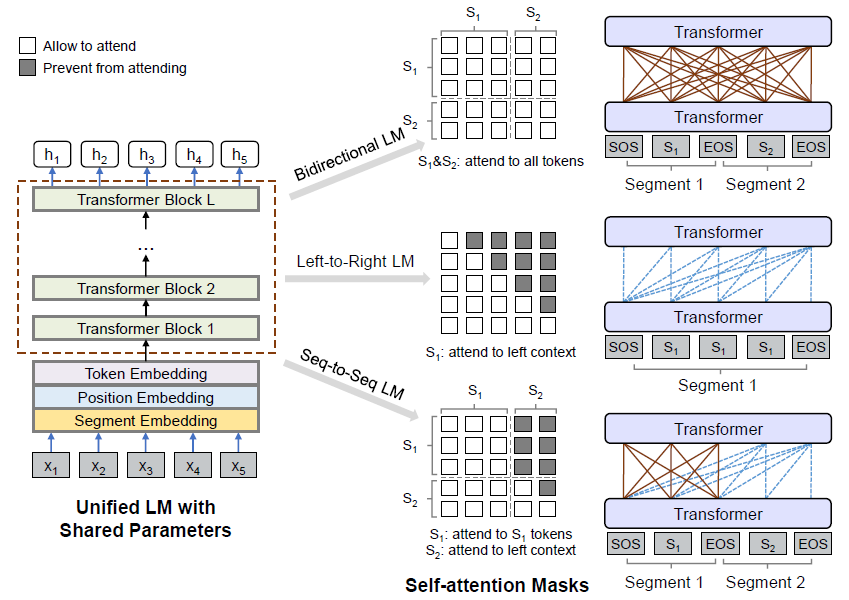

## Table of Contents

## What is a unidirectional language model in machine learning?

A unidirectional language model in machine learning is a type of model that processes text by looking at the words in one direction only, usually from left to right. This means that when the model tries to predict the next word in a sentence, it only uses the information from the words that come before it. For example, if you have the sentence "The cat is sleeping," a unidirectional model would use "The" and "cat" to predict "is," but it wouldn't use "sleeping" because it hasn't seen it yet.

These models are simpler to train because they don't need to consider future words, which makes them faster and less complex. However, they can miss out on important context that comes later in the sentence. For instance, in the sentence "Before the cat sat down, it was running around," a unidirectional model wouldn't know about "running around" when predicting "sat." Despite this limitation, unidirectional models have been very useful in many applications, such as autocomplete features in text editors and search engines.

## How does a unidirectional language model differ from a bidirectional language model?

A unidirectional language model looks at words in one direction, usually from left to right. This means it uses only the words that come before to guess the next word. For example, if you have the sentence "The cat is sleeping," a unidirectional model uses "The" and "cat" to predict "is." It doesn't look at "sleeping" because it hasn't seen it yet. These models are simpler and faster to train because they don't need to consider future words, but they can miss out on important context that comes later in the sentence.

On the other hand, a bidirectional language model looks at words in both directions, from left to right and right to left. This means it can use both the words that come before and after to understand and predict words. Using the same example, "The cat is sleeping," a bidirectional model can use "The" and "cat" to predict "is," but it can also use "sleeping" to help understand the context better. This makes bidirectional models more accurate because they can capture more context, but they are also more complex and can take longer to train.

In summary, unidirectional models are simpler and faster but may miss important context, while bidirectional models are more accurate and complex because they consider both past and future words in a sentence.

## What are the main components of a unidirectional language model?

The main components of a unidirectional language model include the input layer, the hidden layers, and the output layer. The input layer takes in the text data, usually one word at a time, and converts it into a format the model can understand, like a vector of numbers. This is often done using techniques like word embeddings, which turn words into numerical representations that capture their meanings and relationships. The hidden layers are where the model processes the input data. They can be made up of many units or neurons that apply mathematical operations to the data, learning patterns and relationships from the text.

The output layer is where the model makes its predictions. It takes the processed data from the hidden layers and uses it to predict the next word in the sequence. This is often done using a softmax function, which turns the model's raw predictions into probabilities for each possible next word. The model is trained by comparing its predictions to the actual next words in the training data, adjusting the weights in the hidden layers to minimize the difference between predictions and reality. This process is repeated many times until the model performs well on the task of predicting the next word based on the words that came before it.

## Can you explain the training process of a unidirectional language model?

The training process of a unidirectional language model involves feeding it lots of text data and letting it learn to predict the next word in a sequence. The model starts with the first word of a sentence and tries to guess what the next word will be. It does this by using the information from the words that came before it. If the model guesses wrong, it adjusts its internal settings, called weights, to try to do better next time. This process is repeated over and over with many sentences until the model gets good at predicting the next word.

To make these predictions, the model uses math to turn words into numbers, a process called word embedding. For example, the word "cat" might be turned into a set of numbers that represent its meaning. The model then processes these numbers through its hidden layers, applying more math to learn patterns in the data. At the end, the model uses a function called softmax to turn its predictions into probabilities for each possible next word. The formula for softmax is $$ \text{softmax}(x_i) = \frac{e^{x_i}}{\sum_j e^{x_j}} $$, where $$ x_i $$ is the model's raw prediction for the i-th word. The model's goal is to make these probabilities as accurate as possible, and it does this by tweaking its weights over many rounds of training.

## What are some common applications of unidirectional language models?

Unidirectional language models are used in many everyday tools. One common use is in autocomplete features on smartphones and computers. When you start typing a message or an email, the model looks at the words you've already written and tries to guess what you'll type next. This helps you type faster because the model suggests words or even whole phrases for you. Another use is in search engines, where the model helps predict what you might be searching for as you type into the search bar. This makes searching quicker and more convenient.

Another application is in language translation tools. When you type a sentence in one language, the model predicts the next word in the translated sentence based on the words it has already seen. This helps in creating smooth and accurate translations. Unidirectional models are also used in speech recognition systems, where they help predict the next word someone might say based on the words they've already spoken. This makes voice commands and dictation more accurate and efficient.

## How do unidirectional language models handle context in text?

Unidirectional language models handle context by looking at the words that come before the word they are trying to predict. They use this past information to guess what the next word might be. For example, if the sentence is "The cat is," the model uses "The" and "cat" to predict "is." It does this by turning words into numbers, a process called word embedding, and then using math to figure out the best guess. The model gets better at this over time by comparing its guesses to the real next words and adjusting its math to be more accurate.

These models are good at understanding context that has already been mentioned in the text. But they can miss out on important information that comes later in the sentence. For example, in the sentence "Before the cat sat down, it was running around," the model won't know about "running around" when predicting "sat." This means unidirectional models can sometimes make less accurate predictions because they don't see the whole picture. Despite this, they are still very useful in many applications like autocomplete and search engines, where they help make typing and searching faster and easier.

## What are the limitations of unidirectional language models?

Unidirectional language models have some limitations because they only look at words that come before the word they are trying to predict. This means they can miss important information that comes later in the sentence. For example, if the sentence is "Before the cat sat down, it was running around," the model won't know about "running around" when it's trying to predict "sat." This can make their guesses less accurate because they don't see the whole picture. They are good at understanding context that has already been mentioned, but they can't use information from the future parts of the sentence.

Another limitation is that unidirectional models can be less effective at understanding complex sentences or long texts. They might struggle with sentences that have many clauses or need to understand the overall structure of a paragraph. Because they only process text in one direction, they might miss out on important connections between different parts of the text. This makes them less good at tasks that require a deep understanding of the entire context, like summarizing a long document or answering questions about a complex topic. Despite these limitations, unidirectional models are still very useful for simpler tasks like autocomplete and search engine suggestions.

## How can the performance of a unidirectional language model be evaluated?

The performance of a unidirectional language model can be evaluated by looking at how well it predicts the next word in a sentence. One common way to do this is by using a measure called perplexity. Perplexity is a number that shows how surprised the model is by the actual next word. A lower perplexity means the model is better at predicting the next word. The formula for perplexity is $$ \text{Perplexity} = 2^{-\frac{1}{N} \sum_{i=1}^N \log_2 p(w_i)} $$, where $$ N $$ is the number of words, and $$ p(w_i) $$ is the probability the model gives to the actual next word $$ w_i $$. By calculating perplexity on a set of test sentences, we can see how good the model is at understanding and predicting language.

Another way to evaluate the model is by looking at how it performs in real-world applications. For example, if the model is used for autocomplete, we can measure how often it suggests the right word or phrase. We can also ask people to rate how helpful the suggestions are. In search engines, we can see if the model's predictions help users find what they are looking for faster. By testing the model in these practical situations, we get a better idea of how useful it is in everyday use. Both perplexity and real-world performance give us important information about how well a unidirectional language model works.

## What are some popular unidirectional language models used in the industry?

Some popular unidirectional language models used in the industry include the classic models like Recurrent Neural Networks (RNNs) and Long Short-Term Memory (LSTM) networks. RNNs are simple neural networks that process text one word at a time, using the information from previous words to predict the next one. LSTMs are a special type of RNN that are better at remembering information from earlier in the text, which helps them make better predictions over longer sentences.

Another popular model is the Transformer decoder used in autoregressive models like the original version of the Generative Pre-trained Transformer (GPT). Unlike RNNs and LSTMs, which process words sequentially, the Transformer decoder uses attention mechanisms to weigh the importance of different words in the input. This allows it to capture more complex patterns in the text. The formula for the attention mechanism is $$ \text{Attention}(Q, K, V) = \text{softmax}\left(\frac{QK^T}{\sqrt{d_k}}\right)V $$, where $$ Q $$, $$ K $$, and $$ V $$ are the query, key, and value matrices, and $$ d_k $$ is the dimension of the key vectors. These models have been widely used in applications like text generation, machine translation, and autocomplete features.

## How do unidirectional language models contribute to natural language processing tasks?

Unidirectional language models help a lot with tasks in natural language processing by predicting the next word in a sentence. They look at the words that come before to guess what word might come next. This is really useful for things like autocomplete on your phone or computer. When you start typing a message, the model uses the words you've already written to suggest what you might type next. This makes typing faster and easier. Unidirectional models are also used in search engines to predict what you're looking for as you type, making searching quicker.

These models are also important for other tasks like language translation and speech recognition. In translation, the model helps predict the next word in the translated sentence based on the words it has seen so far. This helps create smooth and accurate translations. In speech recognition, the model predicts the next word someone might say based on the words they've already spoken. This makes voice commands and dictation more accurate. Even though unidirectional models can miss out on context that comes later in the sentence, they are still very helpful in many everyday applications.

## What advancements have been made in unidirectional language models in recent years?

In recent years, unidirectional language models have seen several important improvements. One big advancement is the use of Transformer architectures, like the original version of the Generative Pre-trained Transformer (GPT). These models use attention mechanisms to better understand the importance of different words in a sentence. This helps them make more accurate predictions about what the next word might be. The attention mechanism works with the formula $$ \text{Attention}(Q, K, V) = \text{softmax}\left(\frac{QK^T}{\sqrt{d_k}}\right)V $$, where $$ Q $$, $$ K $$, and $$ V $$ are the query, key, and value matrices, and $$ d_k $$ is the dimension of the key vectors. This has made unidirectional models better at handling longer texts and more complex language patterns.

Another advancement is the increase in model size and training data. Bigger models with more parameters can learn more about language, and more training data helps them understand a wider variety of texts. This has led to better performance in tasks like text generation and machine translation. Researchers have also started using techniques like transfer learning, where a model is first trained on a large dataset and then fine-tuned for a specific task. This makes the models more versatile and effective in real-world applications.

## How can one fine-tune a unidirectional language model for a specific task?

To fine-tune a unidirectional language model for a specific task, you start with a model that has already been trained on a large amount of text. This model has learned a lot about language in general. Now, you want it to be good at a specific task, like answering questions or translating text. You do this by giving the model more training, but this time, you use text that is related to the task you want it to do. For example, if you want the model to help with customer service, you would train it on customer service chats and emails. During this fine-tuning, you adjust the model's weights to make it better at the new task. The formula for updating the weights during fine-tuning is $$ w_{\text{new}} = w_{\text{old}} - \eta \nabla L $$, where $$ w_{\text{old}} $$ are the old weights, $$ \eta $$ is the learning rate, and $$ \nabla L $$ is the gradient of the loss function.

Fine-tuning can be done in different ways. One way is to add a new layer on top of the pre-trained model that is specifically designed for the task you want to do. This new layer learns to use the information from the pre-trained model in a way that is best for your task. Another way is to keep the model as it is but train it more on your specific data. This is called "full fine-tuning." You might also choose to only update some of the weights, a method known as "partial fine-tuning." This can be faster and might work just as well. No matter which method you use, the goal is to make the model perform better on your specific task without losing the general language skills it learned before.

## References & Further Reading

[1]: Vaswani, A., Shazeer, N., Parmar, N., Uszkoreit, J., Jones, L., Gomez, A. N., Kaiser, Ł., & Polosukhin, I. (2017). ["Attention is All You Need."](https://arxiv.org/abs/1706.03762) Advances in Neural Information Processing Systems.

[2]: Devlin, J., Chang, M.-W., Lee, K., & Toutanova, K. (2019). ["BERT: Pre-training of Deep Bidirectional Transformers for Language Understanding."](https://aclanthology.org/N19-1423/) Proceedings of the 2019 Conference of the North American Chapter of the Association for Computational Linguistics: Human Language Technologies.

[3]: Radford, A., Narasimhan, K., Salimans, T., & Sutskever, I. (2018). ["Improving Language Understanding by Generative Pre-Training."](https://www.semanticscholar.org/paper/Improving-Language-Understanding-by-Generative-Radford-Narasimhan/cd18800a0fe0b668a1cc19f2ec95b5003d0a5035) OpenAI.

[4]: Goldberg, Y. (2017). ["Neural Network Methods for Natural Language Processing."](https://link.springer.com/book/10.1007/978-3-031-02165-7) Morgan & Claypool Publishers.

[5]: Goodfellow, I., Bengio, Y., & Courville, A. (2016). ["Deep Learning."](https://link.springer.com/article/10.1007/s10710-017-9314-z) MIT Press.

[6]: Hochreiter, S., & Schmidhuber, J. (1997). ["Long Short-Term Memory."](https://ieeexplore.ieee.org/abstract/document/6795963) Neural Computation.