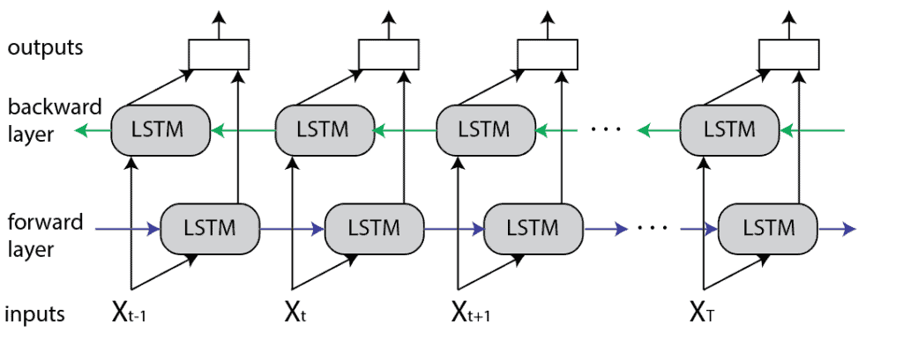

## Table of Contents

## What is unidirectional machine learning?

Unidirectional machine learning is a type of machine learning where the data flow is in one direction only. This means that once the model is trained, it can only make predictions based on new input data and cannot learn from the outcomes of those predictions. This approach is commonly used in situations where the model needs to be simple and fast, like in real-time applications.

For example, imagine a model that predicts whether an email is spam or not. In unidirectional machine learning, the model would be trained on a dataset of emails labeled as spam or not spam. After training, the model would then be used to classify new emails. If the model makes a mistake, it cannot automatically learn from that mistake to improve its future predictions. Instead, the model would need to be retrained with new data that includes the correct labels for the previously misclassified emails.

This type of machine learning is different from bidirectional or online learning, where the model can continuously learn and update itself based on new data and feedback. Unidirectional machine learning can be less flexible, but it is often easier to implement and can be more stable in environments where the underlying patterns in the data do not change frequently.

## How does unidirectional machine learning differ from bidirectional machine learning?

Unidirectional [machine learning](/wiki/machine-learning) is like a one-way street. Once the model is trained on a set of data, it can only use that knowledge to make predictions on new data. It cannot learn from the results of its predictions. For example, if a model predicts whether an email is spam and gets it wrong, it won't automatically get better at predicting the next time. The model stays the same until someone retrains it with new data.

Bidirectional machine learning, on the other hand, is more like a two-way street. The model can learn from both the initial training data and the outcomes of its predictions. If the model makes a mistake, it can use that information to improve its performance over time. This type of learning is often used in systems that need to adapt quickly to changing conditions, like recommendation engines or fraud detection systems. The model keeps getting better as it sees more data and feedback.

In summary, unidirectional machine learning is simpler and more stable but less flexible, while bidirectional machine learning is more complex and adaptable but can be less stable if not managed carefully. The choice between the two depends on the specific needs of the application and the environment in which it operates.

## What are the basic applications of unidirectional machine learning?

Unidirectional machine learning is often used in situations where you need a quick and simple model that doesn't change much over time. One common application is in real-time systems, like predicting whether a transaction is fraudulent or not. Once the model is trained on past data, it can quickly classify new transactions without needing to update itself. This makes it useful for applications where speed and stability are more important than constant learning.

Another application is in recommendation systems for things like movies or products. The model is trained on historical data about what users have liked or bought before. Then, it uses this information to suggest new items to users. If the model makes a wrong suggestion, it won't automatically learn from it. Instead, it keeps suggesting based on the original training data until someone retrains it with new information.

In summary, unidirectional machine learning is great for applications where you want a model that works well right away and doesn't need to adapt constantly. It's used in many areas where simplicity and speed are key, like fraud detection and recommendation systems.

## Can you explain the process of training a unidirectional model?

Training a unidirectional model is like teaching a student a lesson that they won't change later. You start by gathering a lot of data that the model will learn from. This data is usually split into two parts: one part for training and another part for testing. You feed the training data into the model, and it learns to find patterns and make predictions based on that data. For example, if you're training a model to recognize spam emails, you'd show it lots of emails labeled as spam or not spam. The model looks at things like words, sender information, and other features to figure out what makes an email spam.

Once the model has learned from the training data, you test it with the test data to see how well it performs. If it does well, you can start using it to make predictions on new data. But remember, once the training is done, the model doesn't learn anything new. If it makes a mistake, it won't get better on its own. To improve it, you'd need to train it again with new data. This process of training and testing is simple but effective for situations where you need a model that works well right away and doesn't need to change often.

## What types of data are best suited for unidirectional machine learning?

Unidirectional machine learning works best with data that doesn't change much over time. This means the patterns in the data stay pretty much the same. For example, if you're trying to predict whether an email is spam or not, the signs of spam emails don't change a lot from day to day. So, once you train a model on past emails, it can keep working well on new emails without needing to learn anything new.

Another good type of data for unidirectional machine learning is data where you need quick and simple predictions. If you're making a model to recommend movies or products, you can train it on what people have liked before. The model can then use this information to suggest new things without getting better or worse over time. This makes it perfect for situations where you want a model that works well right away and doesn't need to adapt constantly.

## What are the common algorithms used in unidirectional machine learning?

Unidirectional machine learning often uses simple and fast algorithms that work well without needing to change over time. One common algorithm is the logistic regression. It's like a math formula that helps predict if something is true or false, like if an email is spam or not. The formula looks at the data and calculates a number between 0 and 1, where numbers closer to 1 mean it's more likely to be true. For example, in spam detection, the model might look at words in the email and use logistic regression to figure out the chance it's spam.

Another popular algorithm is the decision tree. Imagine a tree where each branch is a question about the data, like "Does the email have the word 'free' in it?" The tree keeps splitting the data into smaller groups until it can make a prediction. Decision trees are easy to understand and quick to use, making them perfect for unidirectional models where you don't need to keep learning from new data. Both logistic regression and decision trees are great for situations where you want a model that works well right away and doesn't need to change often.

## How does unidirectional machine learning handle sequential data?

Unidirectional machine learning can handle sequential data, but it does so in a way that doesn't change over time. Imagine you're trying to predict the next word in a sentence. A unidirectional model would be trained on lots of sentences to learn patterns. Once trained, it can predict the next word in a new sentence, but if it gets it wrong, it won't learn from that mistake. It keeps using the same rules it learned during training.

For example, if you're using a simple model like a Markov chain to predict the weather, it might look at past sequences of sunny and rainy days. The model learns the probability of rain following a sunny day and uses that to make predictions. But if the weather pattern changes and it starts raining more often after sunny days, the model won't adjust. You'd have to retrain it with new data to make it work better. This makes unidirectional models good for situations where the patterns in the data stay pretty much the same.

## What are the limitations of unidirectional machine learning?

Unidirectional machine learning has a big limitation: it can't learn from its mistakes. Once the model is trained, it stays the same. If it makes a wrong prediction, it won't get better on its own. This means you have to retrain the model with new data if you want it to improve. For example, if a model is used to predict if an email is spam, and it keeps labeling normal emails as spam, you need to retrain it with the correct labels to fix the problem.

Another limitation is that unidirectional machine learning doesn't work well when the data changes over time. If the patterns in the data start to shift, the model won't adapt. For instance, if you use a model to predict stock prices and the market changes, the model will keep using old patterns and might make bad predictions. This makes unidirectional models less useful in situations where things are always changing, like in recommendation systems or fraud detection where new tricks and trends keep appearing.

## How can unidirectional models be optimized for better performance?

To optimize unidirectional models for better performance, you can start by using more and better training data. The more examples the model sees during training, the better it can learn the patterns in the data. You can also try different algorithms or tweak the settings of the current algorithm. For example, if you're using logistic regression, you might change the learning rate or the type of regularization to see if it helps the model perform better. It's like tuning a guitar to get the best sound.

Another way to improve unidirectional models is by using feature engineering. This means you create new variables or change the existing ones to make them more useful for the model. For instance, if you're predicting house prices, you might combine the number of bedrooms and bathrooms into a new feature called "total rooms." This can help the model see patterns more clearly. Also, you can use techniques like cross-validation to test the model on different parts of the data and make sure it works well overall. By trying these different methods, you can make your unidirectional model work as well as possible without changing it after training.

## What are some advanced techniques used in unidirectional machine learning?

One advanced technique used in unidirectional machine learning is ensemble methods. Imagine you have a bunch of different models, each trying to solve the same problem. You can combine their predictions to get a better overall prediction. For example, you might use several decision trees and combine their results using a method called "voting." If most trees predict something is spam, then the final prediction will be spam. This can make the model more accurate because it uses the strengths of different models.

Another advanced technique is feature selection and engineering. This is about choosing the best pieces of data to use in your model or creating new pieces of data that help the model see patterns more clearly. For example, if you're predicting house prices, you might create a new feature that combines the number of bedrooms and bathrooms into "total rooms." By doing this, you can help the model understand the data better and make more accurate predictions. These techniques can make unidirectional models perform better without needing to change after training.

## Can you discuss a case study where unidirectional machine learning was effectively applied?

In a case study about email spam detection, a company used unidirectional machine learning to build a model that could quickly and accurately classify emails as spam or not spam. They collected a large dataset of emails, with each email labeled as spam or not spam. The model was trained using logistic regression, which is a simple algorithm that works well for this kind of problem. After training, the model was tested on a separate set of emails to see how well it performed. The results showed that the model could correctly identify spam emails with high accuracy, and it was fast enough to work in real-time as emails came in. Because the patterns of spam emails don't change very often, the company didn't need to retrain the model frequently, making it a good fit for unidirectional machine learning.

Another example is a recommendation system for an online movie streaming service. The company wanted to suggest movies to users based on their past viewing history. They trained a unidirectional model using historical data about what movies users had watched and rated. The model used a decision tree algorithm to learn the patterns in the data and make movie recommendations. Once trained, the model could suggest movies to new users without needing to learn from their feedback. This approach worked well because the general tastes of movie viewers don't change quickly, so the model didn't need to adapt over time. The company found that the unidirectional model provided good recommendations and was easy to maintain, which made it a successful application of this type of machine learning.

## What future developments are expected in the field of unidirectional machine learning?

In the future, unidirectional machine learning is expected to become even more efficient and accurate. One way this could happen is by using better algorithms that can learn from more data faster. For example, new versions of algorithms like logistic regression or decision trees might be developed to handle bigger datasets and make better predictions. Also, techniques like ensemble methods, where you combine several models to get a better result, might become more common. This could help unidirectional models perform even better without needing to change after training.

Another expected development is in the area of feature engineering and selection. Scientists might come up with new ways to create and choose the best features for models, making them more accurate. For instance, they might find new ways to combine different pieces of data to help the model see patterns more clearly. This could make unidirectional models work well in more situations, even when the data is complex. Overall, these advancements could make unidirectional machine learning a more powerful tool for quick and stable predictions in many different fields.

## References & Further Reading

[1]: Bishop, C. M. (2006). ["Pattern Recognition and Machine Learning."](https://www.cs.uoi.gr/~arly/courses/ml/tmp/Bishop_book.pdf) Springer.

[2]: Goodfellow, I., Bengio, Y., & Courville, A. (2016). ["Deep Learning."](https://www.deeplearningbook.org/) MIT Press.

[3]: Murphy, K. P. (2012). ["Machine Learning: A Probabilistic Perspective."](https://www.cs.ubc.ca/~murphyk/MLbook/pml-toc-1may12.pdf) MIT Press.

[4]: Domingos, P. (2015). ["The Master Algorithm: How the Quest for the Ultimate Learning Machine Will Remake Our World."](https://archive.org/details/masteralgorithmh0000domi_a3k6) Basic Books.

[5]: Hastie, T., Tibshirani, R., & Friedman, J. (2009). ["The Elements of Statistical Learning: Data Mining, Inference, and Prediction."](https://link.springer.com/book/10.1007/978-0-387-84858-7) Springer Series in Statistics.