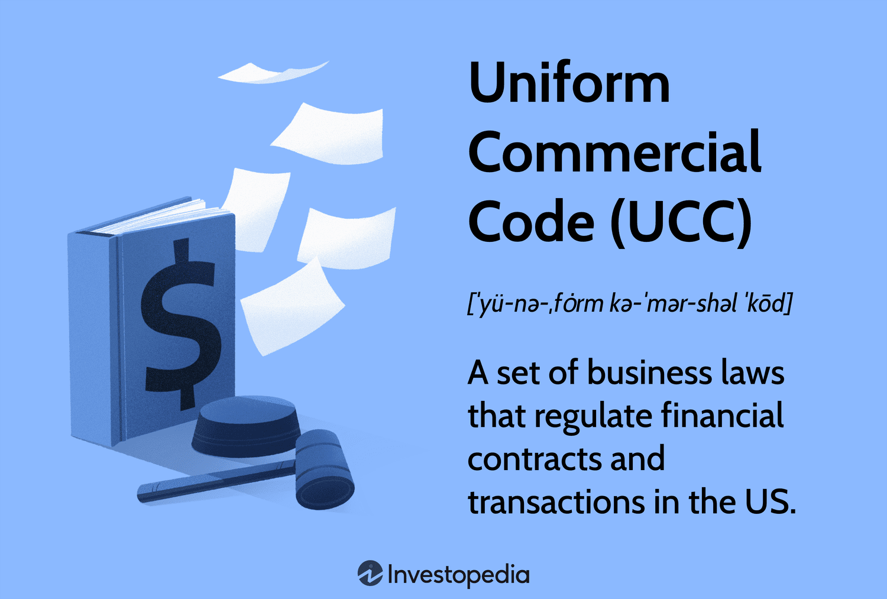

The field of commercial law is expansive and constantly adapting, driven largely by technological innovations. At the heart of this domain within the United States is the Uniform Commercial Code (UCC), an essential framework governing commercial transactions. Its structure ensures consistency and clarity across various transactions, facilitating ease of commerce. As we advance further into the 21st century, technology's role in commerce becomes increasingly pronounced. A key development in this area is algorithmic trading, where computer algorithms are employed to execute trading decisions at speeds and efficiencies unattainable by human traders alone.

This transformation poses both opportunities and challenges for legal frameworks such as the UCC. The relationship between traditional commercial laws and emerging technologies like algorithmic trading is complex and evolving. This article aims to investigate how the principles embodied in the UCC interact with the practices of algo trading. It discusses the significant legal considerations and implications that arise from this intersection, such as contract enforcement and liability issues, within an automated trading environment.

For legal professionals, businesses, and traders immersed in today's commercial activities, understanding the dynamics between the UCC and technology-based trading platforms is crucial. Mastery of these concepts is essential for navigating the increasingly digital and automated landscape of modern commerce effectively. The insights gained from exploring these connections will aid in adapting to ongoing changes and maintaining compliance with legal standards while fostering innovation.

## Table of Contents

## Understanding the Uniform Commercial Code (UCC)

The Uniform Commercial Code (UCC) is a vital compilation of laws designed to bring uniformity to the regulation of commercial transactions across the United States. Established to standardize and simplify the legal requirements involved in commerce, the UCC plays a central role for businesses engaged in activities such as buying, selling, leasing, and financing goods and services. The Code covers a broad range of transactions, providing a consistent legal framework that enhances business reliability and efficiency.

Key components of the UCC include crucial articles that address essential business activities. Articles related to the sale of goods and secured transactions hold particular significance for commercial entities. For example, Article 2 focuses on the sale of goods, establishing guidelines for contract formation, performance, and breach, while Article 9 deals with secured transactions, outlining the process for creating and enforcing security interests in personal property. These provisions are foundational for businesses to navigate the complexities of commerce, ensuring legal compliance and smooth transactions.

The UCC's framework offers a uniform legal structure across different states, fostering a predictable business environment. However, it also allows for state-specific adaptations, acknowledging that each state may have unique legal considerations and commercial practices. This balance between uniformity and flexibility helps accommodate varying regional requirements while maintaining a cohesive national standard.

For individuals involved in commerce, possessing thorough knowledge of the UCC is indispensable. Understanding the intricacies of the UCC not only aids in legal compliance but also provides strategic advantages in business negotiations and operations. As commercial transactions increasingly involve complex and high-speed technological elements, such as [algorithmic trading](/wiki/algorithmic-trading), the need for comprehensive knowledge of the UCC becomes increasingly apparent. Businesses and legal professionals must remain informed about the UCC to effectively handle the dynamic nature of modern commercial activities.

## What is Algorithmic Trading?

Algorithmic trading, commonly known as algo trading, utilizes computer algorithms to oversee trading operations with minimal human intervention. By processing complex data sets with remarkable speed, these algorithms can execute trades in mere fractions of a second based on pre-established criteria. This capability allows them to identify and capitalize on trading opportunities more swiftly than a human trader could.

Several strategies are employed in algorithmic trading, each tailored to achieve specific financial goals. Market making involves algorithms consistently offering to buy and sell securities, profiting from the bid-ask spread. Arbitrage strategies seek to exploit price discrepancies of identical or similar financial instruments across different markets. Trend following strategies, on the other hand, aim to capture gains through the analysis of an asset's [momentum](/wiki/momentum) in a particular direction.

The proliferation of algorithmic trading has significantly transformed financial markets, heralding an era of increased trading speed and efficiency. This evolution has allowed for larger volumes of trades to be processed with greater precision and lower transaction costs. However, the swift execution capabilities of algo trading pose unique challenges and risks. 

One notable challenge is market stability. Instances such as the "Flash Crash" of 2010 demonstrate how algorithmic trading can contribute to market [volatility](/wiki/volatility-trading-strategies), with algorithmic trades leading to rapid price swings. Further, the complex nature of these algorithms necessitates robust legal and regulatory frameworks to ensure compliance and mitigate potential negative impacts on market integrity.

To safeguard against these risks, regulatory oversight is vital. This involves setting clear guidelines for the deployment of trading algorithms, monitoring their impact on market behavior, and enforcing measures to preempt and address malfunctions or abuses. As algorithmic trading continues to advance, maintaining a balance between innovation and regulation remains a key focus for financial markets internationally.

## The UCC's Role in Governing Algorithmic Trading

The Uniform Commercial Code (UCC) serves primarily as a regulatory framework for traditional commerce; however, its principles find increasing relevance in algorithmic trading environments due to shared underlying commercial and contractual tenets. Algorithmic trading, characterized by autonomous execution of trades via complex computational algorithms, can engage UCC principles, particularly those pertaining to contracts and negotiable instruments.

Contracts serve as foundational elements in any trading activity, dictating terms and enforcing obligations. The UCC provides a structure for contract creation and enforcement, stipulating necessary elements such as offer, acceptance, and consideration. In algorithmic trading, the crucial question often concerns whether an executed trade, determined by an algorithm based on predefined criteria, involves a legally binding contract. The UCC's provisions on contract formation can govern these interactions, ensuring clarity and legality even as the 'offer' and 'acceptance' occur electronically and instantaneously.

Negotiable instruments, governed by Article 3 of the UCC, play a role when transactions involve transfers of securities or other financial instruments. Although predominantly tailored to traditional paper-based transactions, the principles can extend to electronic contexts where trading algorithms simulate similar functions. Here, issues of signature, transfer, and endorsement require reinterpretation in light of electronic execution.

One of the main legal issues faced in algorithmic trading is the enforcement of contracts where execution errors or market anomalies occur. Algorithmic trades can result in unintended or erroneous orders being executed, raising questions of liability. The uncertainty surrounding these fast-paced, automatic transactions calls for a nuanced understanding of the UCC's applicability in such contexts. Contract disputes, liability concerns, and the need for effective dispute resolution mechanisms thus demand new interpretations, often necessitated by technological advancements.

While the UCC provides a comprehensive framework, its principles sometimes require adaptations to fully accommodate the uniqueness of algorithmic trading. Legal practitioners and traders must navigate these modifications, aligning UCC provisions with the realities of automated trading. This requires regulatory adjustments and potentially novel legal interpretations to ensure the principles of fairness, transparency, and enforceability are upheld within algorithmic markets.

Understanding these dynamics is critical for those engaged in algorithmic trading, as the integration of traditional UCC principles within a technologically advanced trading environment supports both compliance and innovation. The move towards aligning the UCC with modern trading practices reflects broader trends within commercial law, demanding an ongoing dialogue among stakeholders to harmonize these two arenas.

## Legal Challenges and Considerations in Algo Trading

Algorithmic trading, or algo trading, presents several legal challenges that are essential for legal and financial professionals to consider. These challenges stem from the inherent speed and complexity of algorithmic transactions, which can complicate the determination of liability and enforcement issues. 

1. **Liability Considerations**: One of the primary legal concerns in algo trading is determining liability in the event of erroneous trades or system malfunctions. Unlike traditional trading, algorithmic trading can execute a large volume of trades in milliseconds, making real-time oversight by a human trader impractical. This rapid execution can lead to situations where errors escalate quickly, resulting in significant financial impacts. The question of who is liable—whether the developer of the trading algorithm, the trader, or the institution employing the algorithm—remains complex. Legal frameworks must address scenarios where algorithms act unpredictably or cause market disruptions.

2. **Intellectual Property Rights**: Another critical area is the protection and ownership of the intellectual property underlying trading algorithms. With the rise of sophisticated trading strategies powered by proprietary algorithms, the need to protect these algorithms from unauthorized use or theft is paramount. Intellectual property laws must evolve to cover the unique aspects of algorithmic designs and the proprietary data they utilize. Questions surrounding the ownership of the outputs generated by algorithms also need clarity, especially when multiple entities are involved in the development and deployment of these systems.

3. **Regulatory Compliance**: The regulatory landscape for algo trading is continuously adapting to keep up with technological advancements. Regulatory bodies, such as the Securities and Exchange Commission (SEC) in the United States, have introduced rules aimed at ensuring that algorithmic trading does not compromise market integrity or fairness. Firms using these technologies must comply with rules concerning transparency, market manipulation, and risk management. Staying informed about regulatory changes and implementing best practices is vital for mitigating legal risks and achieving compliance. 

4. **Attribution of Errors**: Attributing errors in algorithmic trading is complex, due to the autonomous nature of algorithms. These systems often operate based on predefined criteria, and when they fail, it can be challenging to pinpoint the exact cause. As technological systems evolve, so do the potential failure points, necessitating robust systems for error detection and attribution. Developing legal norms that address responsibility for errors and failures in automated systems is crucial for a fair and efficient market.

In conclusion, the legal challenges posed by algorithmic trading are multifaceted and require ongoing attention as technology evolves. Legal practitioners need to understand these challenges to navigate the regulatory environment effectively and protect their interests in an increasingly automated trading world. The need for clear legal standards and proactive engagement with regulatory updates will be essential to managing the legal risks associated with algorithmic trading.

## Future Implications and Developments

As technology advances, the integration of AI and [machine learning](/wiki/machine-learning) in trading algorithms is transforming the financial landscape. The Uniform Commercial Code (UCC), a foundational framework for commercial transactions in the United States, must evolve in response to these technological changes. The increasing complexity and speed of algorithmic trading, driven by AI advancements, present both opportunities and challenges, necessitating a reevaluation of existing legal structures to ensure they remain relevant and effective.

Future developments in the domain of algorithmic trading are likely to feature increased regulatory oversight. The fast-paced nature of this technology demands a robust legal framework that can address emerging issues such as algorithm accountability, trade secrecy, and the protection of market integrity. Legal standards that are specifically tailored for the nuances of algorithmic trading may become essential, encompassing areas like automated contract execution and the regulation of autonomous trading decisions.

Professionals in the financial and legal sectors must be proactive in understanding and influencing these changes. This requires not only staying informed about technological advancements but also actively participating in discussions surrounding the legal and ethical implications of algorithmic trading. The evolution of trading technologies presents both risks and opportunities, and professionals must be equipped to navigate this dynamic environment effectively.

The dynamic nature of trading technologies necessitates ongoing research and dialogue between legal scholars, practitioners, and regulatory bodies. Collaborative efforts are crucial in developing legal frameworks that can accommodate both current innovations and future technological shifts. Through continuous engagement and research, stakeholders can ensure that regulations are adaptable, promoting innovation while safeguarding against potential abuses in the rapidly evolving domain of algorithmic trading. 

By embracing these changes, the legal system can support an innovative financial market structure that is both efficient and fair. As AI continues to integrate into trading activities, its implications will extend beyond legal frameworks, impacting market structures and investor strategies. The proactive adaptation of legal standards will be essential in steering these developments towards positive outcomes.

## Conclusion

The intersection of the Uniform Commercial Code (UCC) and algorithmic trading presents a unique and significant domain in contemporary commercial law. Navigating this complex landscape necessitates a dual understanding of established legal frameworks and cutting-edge technological advancements. Legal professionals, businesses, and traders must work together to maintain legal compliance and optimize trading efficiency. As commercial transactions become increasingly digitized, it is imperative that legal structures evolve accordingly to address emerging challenges effectively. By embracing the intricacies inherent in combining traditional legal systems with modern trading technologies, stakeholders can facilitate continued innovation while ensuring adherence to essential legal standards. This collaborative approach will be instrumental in shaping a robust and adaptive legal environment suitable for the rapidly changing commercial world.

## References & Further Reading

[1]: ["Uniform Commercial Code: Official Text and Comments"](https://www.law.cornell.edu/ucc) by The Uniform Law Commission

[2]: Luo, X., & Li, X. (2014). ["High-Frequency Trading and Endogenous Instability in Financial Markets."](https://link.springer.com/article/10.1007/s11408-019-00331-6) International Review of Finance.

[3]: Domowitz, I., & Yegerman, H. (2012). ["The Cost of Algorithmic Trading: A First Look at Comparative Performance"](https://www.researchgate.net/publication/237547529_The_Cost_of_Algorithmic_Trading_A_First_Look_at_Comparative_Performance) with Traditional Trading Desk. ITG, Inc.

[4]: Johnson, B., & Zhao, X. (2020). ["The Algorithms Behind High-Frequency Trading"](https://scholar.google.com/citations?user=6kffx6wAAAAJ&hl=en) Communications of the ACM.

[5]: Anshuman, V. R., & Kalay, A. (2020). ["Algorithmic Trading and Price Efficiency"](https://www.sciencedirect.com/science/article/abs/pii/S1386418101000209). Academy of Management Journal.