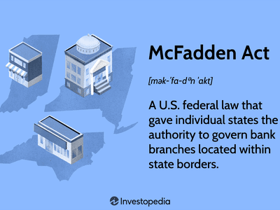

The Uniform Partnership Act (UPA) is a foundational legal framework that establishes guidelines governing business partnerships across many U.S. states. Its significance lies in providing consistent regulations that aid in the seamless operation and termination of partnerships, thus fostering an environment conducive to business collaboration. Initially enacted in 1914, the UPA has undergone various amendments to accommodate shifts in the business landscape, reflecting its adaptability to contemporary needs.

This article explores the UPA's critical elements and its applicability to modern business contexts. By understanding its provisions, stakeholders can navigate the complexities of partnership law effectively. One modern trend that intersects with partnership law is algorithmic trading, where automated systems execute trades at speeds and volumes that human traders cannot match. The UPA offers guidance related to fiduciary duties and liabilities within partnerships, making it relevant for those involved in such tech-driven financial activities.

Understanding the legal implications of partnerships under the UPA is crucial for businesses and individuals. As technology continues to influence financial practices, insights drawn from the UPA can help partnerships manage risks and leverage opportunities, ensuring they function within a robust legal structure.

## Table of Contents

## What is the Uniform Partnership Act (UPA)?

The Uniform Partnership Act (UPA) is an essential legislative instrument that establishes a structured approach to the formation, operation, and dissolution of business partnerships within the United States. Enacted originally in 1914, the UPA was devised to standardize partnership laws across various states, providing a cohesive legal framework that businesses can rely on. Over the years, this act has been revised multiple times to address the evolving demands of the business environment, preserving its relevance amidst significant economic and legal transformations.

One of the primary objectives of the UPA is to deliver consistency in how partnerships are governed across the states that have adopted it. This legislative uniformity is particularly valuable as it facilitates predictable legal outcomes for partnerships operating in multiple jurisdictions. As of now, approximately 44 states in the U.S. have adopted the UPA, reinforcing a standardized legal terrain for partnerships. This wide-scale adoption underscores the act's comprehensive nature and its ability to accommodate a diverse range of business partnership arrangements, thereby ensuring a cohesive application of partnership law across state boundaries.

The UPA provides clear definitions and guidelines regarding the formation and dissolution processes of partnerships. It outlines the responsibilities and rights of partners, ensuring that parties involved in a partnership have transparent expectations and obligations. These regulations include stipulations on the management structure of partnerships, the distribution of profits and losses, and the procedures for dissolving a partnership when necessary. Such provisions are crucial for minimizing disputes and ensuring smooth transitions in the lifecycle of a business partnership.

In summary, the Uniform Partnership Act provides a critical foundation for the operation and dissolution of partnerships, offering a unified legal framework adopted by most states. This ensures that businesses engaged in partnerships can rely on a consistent and comprehensive set of rules that align with contemporary business practices and legal standards.

## Key Concepts and Features of the UPA

The Uniform Partnership Act (UPA) establishes a statutory framework governing the formation, operation, and dissolution of business partnerships within the United States. It applies principally to general partnerships and limited liability partnerships (LLPs), while deliberately excluding limited partnerships (LPs), which are subject to different statutory requirements given their distinct structure and characteristics. 

One of the significant provisions of the UPA pertains to the continuation of a partnership in the event of a partner’s dissociation. Under the act, a majority of the remaining partners have the legal right to decide whether to continue the partnership. Importantly, this decision must be made within a 90-day period following a partner’s dissociation, ensuring timely resolution and maintaining the business's stability.

Fiduciary duties form a core aspect of the legal framework outlined by the UPA, imposing a set of obligations and ethical standards that partners must adhere to. These fiduciary duties primarily include the duty of loyalty and the duty of care. The duty of loyalty requires partners to act in the best interest of the partnership, avoiding conflicts of interest and refraining from competing against the partnership. The duty of care mandates that partners must act prudently and diligently when making decisions affecting the partnership.

Additionally, the UPA clearly defines partnership assets and liabilities, facilitating an understanding of the business's financial framework. Partnership assets are considered collectively owned by the partnership, rather than by individual partners, and are generally used to manage the operation and financial needs of the partnership. Similarly, liabilities incurred by the partnership are addressed collectively, though it's important to note that partners in a general partnership might still bear personal liability for partnership debts. In contrast, LLPs provide partners with protection against personal liability concerning the partnership’s obligations, adding a layer of security particularly valued in modern business structures.

The legal framework established by the UPA offers a consistent approach to managing the complexities of partnerships, enabling partners to navigate their obligations and rights with greater clarity and legal assurance.

## UPA 1997 Revision

The 1997 revision of the Uniform Partnership Act (UPA), often aligned closely with the Revised Uniform Partnership Act (RUPA), introduced significant advancements aimed at enhancing the framework for limited liability partnerships (LLPs). These amendments were primarily oriented towards bolstering partner protection by addressing liability concerns that had become increasingly prevalent in modern business environments.

A pivotal modification under the 1997 revision was the allowance of separate liabilities for partners. This development fundamentally changed how partnerships and their assets were shielded from individual creditors' claims. By ensuring that a partner's personal liabilities would not automatically implicate or risk the collective assets of the partnership, the revision provided a more secure and attractive legal structure for individuals entering into business alliances. This segregation of liabilities implies that the partnership as a whole retains its financial integrity even if one partner faces personal financial challenges, thereby increasing the partnership's resilience.

Moreover, the 1997 revision set forth comprehensive standards for mergers and conversions, responding effectively to the evolving needs of businesses that sought greater flexibility and scalability in their operations. The establishment of these standards allowed for smoother transitions and adaptations as partnerships sought to expand, restructure, or integrate. By offering clear legal pathways for mergers and conversions, the UPA 1997 revision facilitated partnerships in pursuing strategic growth opportunities without the attendant legal ambiguities that might otherwise hinder innovative business endeavors.

In summary, the UPA 1997 revision provided enhanced protection for partners through the articulation of separate liabilities and introduced strategic mechanisms for business mergers and conversions. These changes significantly modernized the partnership framework, aligning it more closely with the dynamic needs of contemporary business practices.

## Algorithmic Trading and Partnership Law

Algorithmic trading has emerged as a dominant force in the financial markets, leveraging computer algorithms to automate and optimize trading strategies. This approach allows for rapid execution of trades, minimizing human error and capitalizing on market opportunities that may only exist for fractions of a second. As a result, partnerships engaged in [algorithmic trading](/wiki/algorithmic-trading) must navigate a complex landscape of both technological and legal considerations.

The Uniform Partnership Act (UPA) provides a framework that is particularly relevant for such tech-driven financial partnerships. The UPA outlines the fiduciary duties required of partners, which are critical in maintaining trust and accountability within algorithmic trading partnerships. Fiduciary duties under the UPA mandate that partners act in good faith and avoid conflicts of interest, ensuring that the automated trading practices align with the partnership's goals and ethical standards.

Liability considerations under the UPA are of significant importance in the context of algorithmic trading. The act differentiates between general and limited liability partnerships (LLPs), providing varying degrees of liability protection. In a highly automated trading environment, this protection can shield partnership assets from legal claims arising from the actions of individual partners, such as trading errors or breaches of trading regulations. 

Understanding these legal nuances is crucial for partnerships to effectively manage risk. The complexity of algorithmic trading platforms and the speed at which trades occur mean that potential legal issues can arise quickly and with significant financial implications. Therefore, a solid grounding in partnership law, as outlined by the UPA, helps in preemptively addressing such issues, ensuring the partnership operates within a legally compliant framework. 

Overall, the interplay between the UPA's legal provisions and the operational demands of algorithmic trading necessitates careful consideration by partnerships. By adhering to the UPA's guidelines, tech-driven financial partnerships can better manage fiduciary duties and liabilities, fostering a sustainable and legally sound operational environment.

## UPA vs. RUPA

The Uniform Partnership Act (UPA) and the Revised Uniform Partnership Act (RUPA) represent two legislative frameworks governing partnerships, with nuanced distinctions that are significant for legal clarity. The UPA, originally enacted in 1914 and revised in 1997, remains the official version recognized across many states for managing partnership operations. Its updates have incorporated essential elements for aligning partnerships with contemporary business practices, such as the inclusion of limited liability partnerships (LLPs) and provisions affecting partner liabilities and fiduciary duties.

Conversely, RUPA, an unofficial revision, has sometimes led to confusion due to its similarities and overlapping objectives with the UPA. The RUPA sought to modernize partnership law by modifying concepts such as the aggregate theory of partnerships into a more entity-focused perspective, aiming to simplify the management and dissolution processes. Nevertheless, the adoption and recognition of RUPA have been inconsistent across states, limiting its efficacy as a uniform standard.

Stakeholders must diligently distinguish between these frameworks to ensure proper compliance. While the UPA 1997 serves as the prevailing standard, with states having the autonomy to apply further amendments, understanding the evolution and differences between UPA and RUPA is vital. These legal delineations impact decision-making processes, partnership agreements, and the management of fiduciary responsibilities, thereby necessitating a thorough comprehension for those involved in legal and business partnerships.

## Special Considerations in the UPA

The National Conference of Commissioners on Uniform State Laws (NCCUSL) plays a pivotal role in the development of uniform laws, including the Uniform Partnership Act (UPA). The NCCUSL's mission is to promote consistency in state laws across the United States by drafting model statutes like the UPA, which states can then choose to adopt. These uniform laws aim to harmonize legal principles across states, facilitating smoother interstate commerce and reducing legal complexities for businesses operating in multiple jurisdictions.

The enactment of uniform laws like the UPA is ultimately dependent on individual state legislatures, which may adopt the act in whole, modify it, or choose not to adopt it at all. This state-specific flexibility introduces significant variation in partnership law across the United States. Consequently, partnerships operating in different states must navigate these differences carefully. For instance, while many states adhere to the UPA or its subsequent revisions, others may have additional statutory requirements or interpretations that affect partnership operations and governance.

When forming partnerships across multiple jurisdictions, it is essential to account for variations in state law. The UPA provides a useful baseline, but businesses must ensure compliance with local statutes. Legal counsel experienced in multi-jurisdictional issues can provide invaluable guidance, helping partnerships to understand and address legal differences effectively. This approach minimizes the risks associated with non-compliance and ensures that partnerships are structured in a way that aligns with both uniform and state-specific legal requirements.

Understanding these nuances is critical for partnerships aiming for success and longevity, especially those involved in emergent and complex fields such as algorithmic trading. In this context, the UPA's principles of fiduciary duty and liability become important considerations, as they help define the legal obligations and protections tailored to the unique challenges presented by modern technological advancements.

## Conclusion

The Uniform Partnership Act (UPA) continues to serve as a cornerstone of partnership law in the United States. It provides essential legal guidelines for the formation, operation, and dissolution of business partnerships. As technology advances and businesses adopt modern practices, particularly in financial markets with algorithmic trading, understanding the intricacies of the UPA becomes increasingly important. Algorithmic trading involves complex algorithms to automate trading decisions and execute trades at speeds unattainable through human intervention. These tech-driven partnerships must navigate liabilities, fiduciary responsibilities, and asset protection in alignment with the UPA's provisions.

The UPA's adaptability through revisions ensures it remains relevant amidst evolving business landscapes. The incorporation of limited liability protections in the 1997 revision of the UPA exemplifies this flexibility, meeting contemporary business needs and mitigating risks associated with individual partner liabilities. These legal updates are imperative for partnerships to maintain clarity and compliance across varying jurisdictions, as state-specific implementation of the UPA can influence partnership operations.

Overall, the UPA provides a robust framework that supports stable and efficient business partnerships. Continuous adaptations to partnership law are necessary to align with market dynamics and technological advancements. This legal structure not only fosters confidence among business entities but also ensures they can operate within clear, standardized legal boundaries, which is pivotal for the growth and sustainability of partnerships in an increasingly complex business environment.

## References & Further Reading

[1]: Hynes, J.L. (1997). ["The Revised Uniform Partnership Act: A Different Approach."](https://cap-press.com/pdf/9781531008130.pdf) Oklahoma Law Review, 50(3).

[2]: ["Uniform Partnership Act (1997)"](https://www.uniformlaws.org/viewdocument/enactment-kit-73?CommunityKey=52456941-7883-47a5-91b6-d2f086d0bb44) - National Conference of Commissioners on Uniform State Laws.

[3]: Gary, S., & Robert, W. (1999). ["The Revised Uniform Partnership Act and Unincorporated Business Entities"](https://archive.sfopera.com/das-rheingold/1998-1999). The Business Lawyer, 54(1), 259-272.

[4]: Bromberg, A. L., & Ribstein, L. E. (2001). ["Bromberg and Ribstein on Partnership."](https://law-store.wolterskluwer.com/s/product/bromberg-ribstein-on-partnership3mo-subvitallaw-3r/01t0f00000NY7ZoAAL) Aspen Publishers.

[5]: Eggert, A. W. (2012). ["The Law of Modern Partnership and LLPs."](https://scholar.google.com/citations?user=JOpSYusAAAAJ) Sweet & Maxwell.