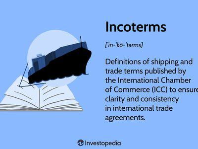

This article explores URDG demand guarantees and their implications for algorithmic trading, providing key insights into how these international rules shape financial transactions and establish a framework for secure payments. The Uniform Rules for Demand Guarantees (URDG), formulated by the International Chamber of Commerce (ICC), are designed to standardize and streamline global trading practices. By providing a robust framework for handling financial obligations, these guidelines significantly mitigate risks and ensure that contractual terms are fulfilled.

Central to the utility of URDG in financial transactions is their role as a protective mechanism that assures the performance of contractual duties. Demand guarantees act as a financial safety net, thereby increasing the confidence of parties engaged in international trade. The implication of these guarantees in algorithmic trading is profound, as they offer a predictable and structured environment which is essential for developing automated trading systems.



Understanding the intricacies of URDG can reveal strategies for optimizing trading algorithms. These rules, while primarily focused on financial transactions, have principles that can be adapted for algorithmic platforms, enhancing their security and efficiency. As such, traders who integrate URDG principles into their automated systems can cultivate improved trading strategies, optimizing returns while minimizing risks. The alignment of URDG with algorithmic models could thus be a pivotal factor in the evolution of trading technologies.

## Table of Contents

## What Are URDG Demand Guarantees?

URDG, which stands for Uniform Rules for Demand Guarantees, is a set of guidelines established by the International Chamber of Commerce (ICC) to enhance the clarity and reliability of international trade transactions. These rules were formally adopted in 1991, aiming to create uniformity across global trading practices by providing a standardized process for handling demand guarantees. A demand guarantee is a financial instrument, often used in international contracts, that serves as a safety net by ensuring that financial obligations between parties are fulfilled.

The primary function of demand guarantees under URDG is to protect the beneficiary from the risk of non-performance or non-payment by the principal in a contract. Unlike conditional guarantees, demand guarantees can be called up by the beneficiary without needing to prove the principal's default, making them a secure option in risk management. This unconditional nature greatly enhances their utility in global trade, where diverse legal systems and practices can present significant challenges.

The applicability of URDG underlines the commitment of the parties involved, providing assurance to traders, bankers, and legal entities alike by defining an internationally recognized framework for guarantees. The benefits of adopting these rules include reduced risk, increased transaction speed, and the elimination of misunderstandings, which can often arise due to differing contract interpretations across jurisdictions.

For example, in a scenario where a supplier is required to provide a demand guarantee to a buyer for the delivery of goods, the buyer can claim the guaranteed amount if the supplier fails to deliver the goods as agreed. This system ensures that the buyer is financially protected while encouraging compliance from the supplier. Ultimately, URDG enhances trust and reliability in international trade, ensuring that obligations are met in a prompt and standardized manner, which is essential for fostering global business relationships.

## The Importance of URDG in International Trade

Uniform Rules for Demand Guarantees (URDG) hold significant importance in the context of international trade, primarily because they provide a structured framework that helps balance the interests of all parties involved, while simultaneously minimizing associated risks. These guidelines, introduced by the International Chamber of Commerce (ICC), aim to ensure that financial obligations in contracts are reliably met, thus acting as a crucial backstop in global transactions. 

URDG guidelines are widely recognized and accepted on an international scale, being utilized by banks, traders, and industry associations to facilitate transactions. This widespread acceptance is crucial as it allows for a level playing field, wherein parties from different jurisdictions can engage with a mutual understanding and expectation of guarantee terms. By establishing a uniform code of practice, the URDG reduces the potential for misunderstandings and disputes, fostering a smoother transaction process.

Compliance with URDG helps in achieving dispute-free transactions by setting clear expectations for the execution of demand guarantees. This clarity is vital in complex international dealings where parties may operate under different legal systems and trading customs. Adherence to these guidelines ensures that conditions such as when and how payments are made under a guarantee are clearly outlined and agreed upon in advance, significantly reducing the possibilities of contention.

Moreover, URDG's influence extends beyond simplification and risk mitigation. By fostering transparency and predictability in international trade transactions, it helps in building trust between parties. This trust is a key enabler for long-term business relationships, as it reassures stakeholders that financial commitments will be honored unequivocally as per the agreed terms. For businesses and financial institutions, this trust translates to enhanced operational efficiency and stability, critical factors for growth in a global marketplace.

The ability of URDG to minimize risks and facilitate dispute-free transactions makes it an indispensable tool for promoting international commerce. Its structured approach and global acceptance contribute to a robust framework that supports the international business ecosystem, providing the assurance required to navigate the complexities of cross-border trade. This, in turn, enhances economic collaboration and development, underscoring the pivotal role of URDG in international trade dynamics.

## URDG 758: A Significant Update

In 2010, the Uniform Rules for Demand Guarantees (URDG) underwent a comprehensive revision, resulting in the introduction of URDG 758. This update was primarily driven by the need to adapt to evolving trading environments and technological advancements. Notably, URDG 758 incorporated provisions for the handling of electronic documents, reflecting the increasing reliance on digital communication in modern financial transactions. These new rules provided guidance on how electronic formats should be treated equivalently to physical documents, thus ensuring that demand guarantees remain efficient and legally robust in a digital age.

Furthermore, URDG 758 introduced specific guidelines for fund transfers, addressing ambiguities that previously existed in financial operations. These guidelines outlined clear protocols for the execution and scrutiny of payment obligations, thereby streamlining processes and minimizing the potential for disputes. By establishing a clearer framework for these transactions, URDG 758 significantly contributed to enhanced financial stability.

The aim of URDG 758 was to reduce conflicts by offering a standardized interpretation of common issues that arise in demand guarantee operations. This revision extended the applicability of the rules and offered enhanced clarity for all parties involved in international trade transactions. Consequently, URDG 758 fosters a more predictable and reliable environment for global trade, reinforcing the trust and dependability necessary for seamless international business relations. 

Through such improvements, URDG 758 has positioned itself as an essential tool in the facilitation of secure and efficient international transactions, ensuring that financial institutions can operate with an increased confidence in the predictability and fairness of the demand guarantee processes. With these updates, URDG continues to support and evolve with the demands of global commerce.

## URDG and Algorithmic Trading

Algo trading, also known as [algorithmic trading](/wiki/algorithmic-trading), necessitates a framework that is both precise and predictable. These requirements are inherently supported by the Uniform Rules for Demand Guarantees (URDG), which establish a standardized set of principles aimed at ensuring financial obligations are met consistently and transparently. This synergy between the rules laid out by URDG and the demands of an algorithmic trading platform can not only enhance trading efficiency but also fortify security measures.

Integrating URDG guidelines into algorithmic platforms involves embedding these rules within the trading algorithms themselves. By doing so, traders and financial institutions can automate several compliance checks that are traditionally manual, thereby reducing the occurrence of human error and enhancing the speed and accuracy of transactions. For instance, the URDG provides specific structures for handling documents and fund transfers, which can be translated into algorithmic codes, ensuring that every transaction adheres to these international standards without requiring direct oversight.

The alignment of URDG principles with algorithmic models also contributes significantly to the development of robust trading strategies. The uniformity and predictability of URDG create an environment where economic [agents](/wiki/agents) can design algorithms that anticipate and react to market movements with minimal risk of unexpected disputes or irregularities. For example, an algorithm can be programmed to automatically execute trades or monetary repayments when a demand guarantee is activated, streamlining processes and ensuring compliance at every step.

By embedding URDG principles into the core logic of these algorithms, there is potential for enhancing the strategic capabilities of algorithmic trading. This integration not only increases the robustness of trading models but also provides a reliable framework to mitigate risks associated with complex international transactions. As a result, financial market participants are more equipped to navigate the intricacies of global trade efficiently and securely, leveraging the strength and predictability offered by the URDG framework.

## Practical Applications of URDG in Algo Trading

Traders can enhance algorithmic trading systems by implementing logic based on the Uniform Rules for Demand Guarantees (URDG). These international guidelines provide a structured approach to managing demand guarantees, which can be translated into algorithmic functions to improve trading operations. By automating compliance checks and transaction validations, trading platforms can ensure adherence to the standards set by the URDG, minimizing the risk of errors and disputes.

Algorithms can be crafted to trigger actions contingent upon the conditions set forth in demand guarantees. For instance, automated systems can streamline processes such as fund releases or collateral adjustments by verifying that all necessary requirements are fulfilled, thus limiting human intervention. This reduces latency and enhances the speed and efficiency of executing financial transactions.

Coding these principles into trading software involves translating legal and procedural aspects of URDG into binary codes and conditional loops. An example in Python might resemble verifying a demand guarantee condition:

```python
def check_demand_guarantee(criteria_met):
    if criteria_met:
        trigger_transaction()
    else:
        log_error("Demand Guarantee criteria not met")

def trigger_transaction():
    # Code to process the transaction
    print("Transaction Executed")
```

Here, `check_demand_guarantee` checks whether certain prescribed conditions are met, and if so, triggers a transaction, demonstrating the basic automation of guarantee compliance checks.

Understanding the subtleties of URDG rules is crucial for developing effective algorithmic trading strategies. By integrating these rules accurately, traders can deploy algorithms that not only comply with international standards but also capitalize on the reliability and predictability these guidelines offer. Such implementation leads to robust, automated trading strategies, providing a competitive edge in the fast-paced world of algorithmic trading.

## Conclusion and Future Outlook

Uniform Rules for Demand Guarantees (URDG) establish a robust framework for secure international transactions, serving as a crucial backbone for the advancement of algorithmic trading. These guidelines ensure that financial transactions are conducted with a high degree of predictability and security, qualities that are essential for effective algo trading strategies. By providing clarity and reducing the risk of disputes, URDG facilitates the seamless execution of complex trading algorithms across borders.

As technology and international trade continuously evolve, staying updated with URDG amendments is vital for traders and financial institutions. This ongoing knowledge not only aids in maintaining compliance with current standards but also in anticipating future changes that may affect trading operations. The International Chamber of Commerce (ICC) periodically revises these rules to address emerging challenges and opportunities in global trade, underscoring the necessity for market participants to be proactive in their approach to regulatory developments.

Integrating URDG guidelines into automated trading systems offers significant strategic advantages. By embedding these regulations into algorithmic platforms, traders can optimize their operations through enhanced compliance checks and automated decision-making processes, reducing the need for manual interventions. This automation can include designing algorithms that automatically validate demand guarantees and trigger corresponding actions, increasing operational efficiency and risk management.

In conclusion, URDG not only equips traders with a versatile tool for navigating international markets but also underpins the future trajectory of algorithmic trading. As we advance in an increasingly interconnected global economy, leveraging these guidelines presents opportunities for innovation and competitive edge, ensuring that trading algorithms are both compliant and strategically optimized.

## References & Further Reading

[1]: Byrne, M. ([2010](https://psycnet.apa.org/record/2009-14446-000)). "The Importance of URDG 758 in Modern Banking." International Banker.

[2]: ICC Uniform Rules for Demand Guarantees (URDG 758). International Chamber of Commerce, 2010. 

[3]: Lopez de Prado, M. ([2018](https://papers.ssrn.com/sol3/papers.cfm?abstract_id=3104816)). "Advances in Financial Machine Learning." Wiley.

[4]: ICC Legal Handbook on Global Sourcing Contracts: A Guide to Structuring Legal Transactions for International Sourcing, Thirteenth Edition. 

[5]: Jansen, S. ([2020](https://www.researchgate.net/publication/346526064_Who_gets_in_and_why_Race_class_and_aspiration_among_South_Africa's_elite_schools)). "Machine Learning for Algorithmic Trading: Predictive Models to Extract Signals from Market and Alternative Data for Systematic Trading Strategies with Python." Packt Publishing.

[6]: ["Uniform Rules for Demand Guarantees - URDG 758"](http://www.cipcic-bragadin.com/wp-content/uploads/2015/09/ICC-URDG-758.pdf). International Chamber of Commerce.