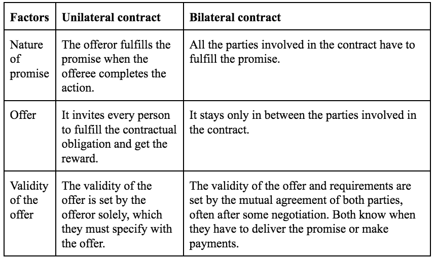

## Table of Contents

## What is a unilateral contract?

A unilateral contract is a type of agreement where one party promises to do something if the other party does a specific action. For example, if a company says they will pay you $100 if you find and return their lost dog, that's a unilateral contract. The company is making a promise, but you don't have to agree to anything. You can just find the dog and return it, and then the company has to pay you the $100.

In a unilateral contract, the promise is only binding once the action is completed. If you start looking for the lost dog but don't find it, the company doesn't have to pay you anything. This is different from a bilateral contract, where both parties make promises to each other. Unilateral contracts are common in situations like reward offers, contests, and some insurance policies.

## How does a unilateral contract differ from a bilateral contract?

A unilateral contract is when one person makes a promise to do something if another person does a specific action. For example, if a company says they will pay you $100 if you find their lost dog, that's a unilateral contract. The company promises to pay, but you don't have to promise anything back. You can just find the dog and return it, and then the company has to pay you. The promise only becomes binding once you complete the action.

A bilateral contract is different because it involves two promises. Both people agree to do something for each other. For example, if you agree to mow your neighbor's lawn every week and they agree to pay you $20 each time, that's a bilateral contract. Both of you are making promises to each other. In a bilateral contract, both sides have to keep their promises, or there could be legal consequences.

Unilateral contracts are often used for things like rewards, contests, and some insurance policies. Bilateral contracts are more common in everyday situations like buying things, renting apartments, or hiring someone to do a job. The main difference is that a unilateral contract depends on one person doing something, while a bilateral contract depends on both people keeping their promises.

## Can you provide an example of a unilateral contract?

Imagine you see a poster in your neighborhood that says, "Lost Dog! Reward of $50 for anyone who finds and returns our missing dog, Spot." This is an example of a unilateral contract. The owner of the dog is promising to pay $50, but you don't have to agree to anything. You can just go out and look for the dog. If you find Spot and return him, the owner has to give you the $50.

The contract becomes binding only when you complete the action of finding and returning the dog. If you search for Spot but don't find him, the owner doesn't owe you any money. This is different from a situation where you might agree to help look for the dog in exchange for payment, which would be a bilateral contract. In a unilateral contract, the focus is on one party doing a specific thing to activate the promise made by the other party.

## What are the essential elements of a unilateral contract?

A unilateral contract has a few important parts. First, there's a promise from one person to do something if another person does a specific action. For example, if a company says they will pay you $100 if you find their lost dog, the company is making the promise. You don't have to agree to anything; you can just go out and look for the dog. The key is that the promise only becomes binding once you complete the action. If you don't find the dog, the company doesn't have to pay you.

The second important part is that the action has to be clear and specific. In the lost dog example, the action is finding and returning the dog. It can't be something vague like "try to find the dog." The action needs to be something that can be clearly seen as done or not done. This makes it fair for both sides. The person making the promise knows exactly what they're promising to do, and the person doing the action knows exactly what they need to do to get the reward.

## How is an offer made in a unilateral contract?

In a unilateral contract, the offer is made when one person promises to do something if another person does a specific action. For example, if a company puts up a poster saying they will pay $100 to anyone who finds their lost dog, that's an offer. The company is making a promise, but you don't have to say yes or no to the offer. You can just go out and look for the dog. The offer is open to anyone who sees the poster and decides to take action.

The key thing about the offer in a unilateral contract is that it's only binding once the specific action is completed. If you find the lost dog and return it to the company, they have to pay you the $100. But if you don't find the dog, the company doesn't owe you anything. This makes the offer different from a regular contract where both sides agree to do something. In a unilateral contract, the offer is more like an invitation for anyone to do the action and get the reward.

## What constitutes acceptance in a unilateral contract?

In a unilateral contract, acceptance happens when someone does the specific action that was asked for. For example, if a company says they will pay $100 to anyone who finds their lost dog, you accept the offer by finding and returning the dog. You don't need to tell the company you're going to look for the dog. You just do it, and if you succeed, that's your acceptance.

The important thing is that the action has to be exactly what was asked for in the offer. If the company said they would pay for finding the dog, but you only looked for it and didn't find it, that's not acceptance. The contract only becomes binding when the action is fully completed. This makes unilateral contracts different from other types of contracts where both sides agree to do something before anyone starts.

## What are the legal requirements for a valid unilateral contract?

A valid unilateral contract needs a few important things. First, there must be a clear offer from one person to do something if another person does a specific action. For example, if a company says they will pay $100 to anyone who finds their lost dog, that's the offer. The offer has to be clear about what action is needed. It can't be something vague like "try to find the dog." It has to be something specific like "find and return the dog." The offer is open to anyone who sees it and decides to take action.

Second, the action that needs to be done must be completed for the contract to be valid. In our example, finding and returning the lost dog is the action. If you find the dog and bring it back, the company has to pay you the $100. The contract only becomes binding once you do what was asked. If you don't find the dog, the company doesn't have to pay anything. This makes unilateral contracts different from other types of contracts where both sides agree to do something before anyone starts.

## What happens if the offer in a unilateral contract is revoked before acceptance?

If the offer in a unilateral contract is revoked before someone does the specific action, the offer is no longer valid. For example, if a company says they will pay $100 to anyone who finds their lost dog, but then they take down the poster before anyone finds the dog, the offer is gone. If you start looking for the dog but haven't found it yet when the offer is revoked, the company doesn't have to pay you anything.

However, if you have already started the action and the company knows you're working on it, they might not be able to take back the offer. For example, if you tell the company you're looking for their dog and they know you're out searching, they might have to keep the offer open until you finish. This is to make sure the contract is fair and that people aren't tricked into doing something without getting the reward.

## How are unilateral contracts enforced in court?

If someone doesn't keep their promise in a unilateral contract, the person who did the action can go to court to make them keep their promise. For example, if a company said they would pay $100 for finding their lost dog and you found the dog but they didn't pay, you could take them to court. You would need to show the court the offer, like a poster or an ad, and prove that you did what the offer asked. The court would then decide if the contract was valid and if you should get the money.

Courts look at a few things when deciding if a unilateral contract should be enforced. They check if the offer was clear and if the action you did was exactly what the offer asked for. They also look at if the offer was taken back before you finished the action. If the company took down the poster before you found the dog, they might not have to pay. But if you started looking for the dog and they knew about it, the court might say they can't take back the offer and you should get the money.

## What are the common types of unilateral contracts?

Unilateral contracts are often used for rewards. For example, if someone loses their pet and offers money to anyone who finds it, that's a unilateral contract. The person who lost the pet promises to pay if someone else does the specific action of finding and returning the pet. Another common type is contests or sweepstakes, where a company promises a prize if someone does something like solving a puzzle or entering a drawing. The company makes the offer, and anyone can accept it by doing what's asked.

Insurance policies can also be unilateral contracts. For example, if you have life insurance, the insurance company promises to pay your family if you die. You don't have to promise anything back; you just have to pay the premiums. If you die, the company has to pay the money. This is different from other types of contracts where both sides agree to do something before anyone starts. In a unilateral contract, the focus is on one person doing a specific thing to activate the promise made by the other person.

## What are the potential risks and benefits of entering into a unilateral contract?

Entering into a unilateral contract can have some benefits. One big benefit is that you don't have to make any promises. For example, if you see a poster offering money for finding a lost dog, you can just go look for the dog without agreeing to anything. If you find the dog, you get the money. This can be good if you want to try something without any risk. Also, unilateral contracts can be a way to get rewards or prizes. If you're good at solving puzzles or entering contests, you might win something without having to do much.

There are also some risks to think about with unilateral contracts. One risk is that the person making the offer might take it back before you finish the action. For example, if the company takes down the poster about the lost dog before you find it, you won't get any money even if you were looking for the dog. Another risk is that you might spend time or money trying to do the action without getting anything in return. If you spend a lot of time looking for the lost dog but don't find it, you won't get paid. So, it's important to think about these risks before you start working on a unilateral contract.

## How do unilateral contracts apply in specific industries or situations?

In the insurance industry, unilateral contracts are very common. When you buy life insurance, the insurance company promises to pay your family a certain amount of money if you die. You don't have to promise anything back; you just need to pay the premiums. If you die, the company has to pay the money. This is different from other types of contracts where both sides agree to do something before anyone starts. In this case, the insurance company's promise is only binding if you die, making it a unilateral contract.

In the world of marketing and promotions, unilateral contracts are often used for contests and sweepstakes. A company might promise a prize to anyone who solves a puzzle or enters a drawing. The company makes the offer, and anyone can accept it by doing what's asked. For example, if a company says they will give a new car to anyone who can guess the right number, people can enter without making any promises. The company only has to give the car if someone guesses the right number. This type of contract is great for getting people interested and involved without them having to commit to anything upfront.

## What are the types of unilateral contracts?

Unilateral contracts can be generally divided into two main categories: open requests and insurance policies.

Open requests involve a scenario where an offeror puts forth a general offer that promises compensation upon the fulfillment of designated conditions. This type of unilateral contract is prevalent in contexts such as rewards, contests, and incentive programs. For example, a company might offer a monetary reward to anyone who successfully develops a software solution that addresses a particular business challenge. In such cases, the offeror is bound to pay once the task is completed satisfactorily by the offeree, while the offeree is under no initial obligation to undertake the task.

These contracts are characterized by a promise contingent on performance, encapsulated in the simple economic principle:

$$
\text{Reward} = \begin{cases} 
      P & \text{if task conditions are met} \\
      0 & \text{otherwise} 
   \end{cases}
$$

Where $P$ represents the promised payment by the offeror.

Insurance policies, another form of unilateral contract, function similarly. In this context, the insurer, acting as the offeror, commits to compensating the insured party upon the occurrence of a specified event, such as damage to property or a health issue. The insurer's obligation is activated only when the conditions set forth in the policy are met, at which point the insured party becomes entitled to receive the agreed-upon payout. Until such events occur, the insured party is not obliged to take any specific action, aside from paying the insurance premiums.

The nature of these contracts underscores a fundamental aspect of unilateral arrangements: a binding commitment from one party upon the completion of particular conditions, often leading to a win-win situation when effectively managed.

## References & Further Reading

[1]: ["Unilateral Contracts."](https://www.investopedia.com/terms/u/unilateral-contract.asp) Cornell Law School - Legal Information Institute.

[2]: Meng, Chao-Yang, and Lin, Xilin. (2020). ["The Role of Unilateral Contracts in Algorithmic Trading: Legal and Strategic Perspectives."](https://dl.acm.org/doi/10.1145/3636534.3690703) Law and Financial Markets Review.

[3]: Hull, John C. (2012). ["Options, Futures, and Other Derivatives"](https://www.semanticscholar.org/paper/Options%2C-Futures%2C-and-Other-Derivatives-Hull/89bdee500c8623864fc9eb7a471546aa713acc44). Pearson.

[4]: ["Algorithmic Trading: Winning Strategies and Their Rationale"](https://onlinelibrary.wiley.com/doi/pdf/10.1002/9781118676998.fmatter) by Ernest P. Chan.

[5]: Mishra, Arvind Virmani. (2014). ["Algorithmic and High-Frequency Trading."](https://assets.cambridge.org/97811070/91146/frontmatter/9781107091146_frontmatter.pdf) World Scientific Publishing Company.

[6]: Knutson, Korok Ray. (2012). ["Legal Aspects of Algorithmic Trading Contracts."](https://ijcrt.org/papers/IJCRT2312463.pdf) Stanford Journal of Law, Business & Finance.

[7]: Lo, Andrew W. (2011). ["Adaptive Markets: Financial Evolution at the Speed of Thought"](https://archive.org/details/adaptivemarketsf0000loan). Princeton University Press.

[8]: Park, S.H. (2018). ["Risk Management and Regulation of Algorithmic Trading."](https://assets.kpmg.com/content/dam/kpmg/uk/pdf/2018/06/algorithmic-trading-governance-and-controls.pdf) Law and Financial Markets Review.