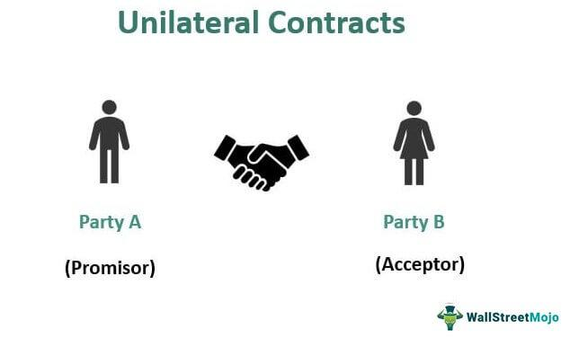

Understanding different types of contracts is essential for individuals and enterprises when navigating legal agreements. These contracts provide the foundation for ensuring the rights and obligations among parties are clearly defined. Unilateral contracts, a specific form of agreement, place an obligation on only one party, distinguishing them from bilateral contracts, which involve mutual obligations. This singularity makes them particularly relevant in certain business and individual scenarios.

In the domain of algorithmic trading, grasping these legal frameworks yields significant benefits. Algorithmic trading, characterized by the use of algorithms to make trading decisions, operates in a fast-paced environment where quick and decisive actions are crucial. The application of unilateral contracts in this context can optimize trading strategies by providing clear terms of engagement that one party accepts after completing a specific act or task. Thus, understanding these contracts and their workings can provide traders with a competitive edge, ensuring compliance and strategic advantage in financial markets.

This article systematically explains unilateral contracts, shedding light on their fundamental principles and how they manifest in algorithmic trading. Readers will gain insight into the contractual obligations involved, the scenarios for their application, and the unique advantages they bring. This foundational knowledge empowers traders and businesses to navigate legal agreements more strategically and effectively.

## Table of Contents

## What is a Unilateral Contract?

A unilateral contract is a distinctive form of agreement characterized by its one-sided nature. In this arrangement, the offeror extends a promise to pay or provide a benefit contingent upon the offeree's completion of a specified task. This type of contract is unique because it imposes an obligation solely on the offeror, as opposed to bilateral contracts, where mutual obligations bind both parties. The absence of an obligation for the offeree to perform the act differentiates unilateral contracts, making them suitable for offers where the offeree may choose whether or not to act.

Key components of a unilateral contract include the promise to perform a specific act in exchange for fulfillment of the task, and the establishment of binding obligations only upon completion of the specified act. These contracts are frequently employed in scenarios involving optional tasks or incentives, where the offeree takes on no initial obligation to perform but can accept the offer by completing the requested act. Such contracts often manifest in the form of rewards or incentives, where the promise of payment or benefit is contingent upon fulfilling the conditions set forth by the offeror.

The unique characteristics of unilateral contracts offer flexibility and specificity in scenarios where the offeror seeks to incentivize specific performance without imposing initial obligations on the offeree. Upon completion of the act, the offeror’s obligation becomes enforceable, solidifying the contract's legal standing and ensuring fulfillment of the offeror's promise.

## How Unilateral Contracts Work

Unilateral contracts operate uniquely in that they become activated by the offeree's fulfillment of an action requested by the offeror. Unlike bilateral contracts, where mutual obligations exist from the onset, unilateral contracts establish an obligation solely upon the completion of the specified task. Consequently, the offeree is not legally bound to perform the act, allowing them the option to engage without the risk of breaching a contract if they choose not to complete the task.

The fundamental trigger for the enforceability of a unilateral contract is the performance of the requested task. This is a pivotal characteristic because the contract remains unenforceable until the action is completed. For instance, a promise to pay a reward for the return of a lost pet turns into a binding contract only when someone successfully returns the pet. This aspect of activation upon performance underscores the distinction between an intention to contract and the actual creation of a contract in unilateral agreements.

From a legal standpoint, challenges in enforcing a unilateral contract usually revolve around disputes regarding the clarity of the offer or the fulfillment of the agreed terms. Legal action is uncommon, mainly because the offeree's voluntary engagement is not obligated until performance. However, if disputes concerning the offer's terms or whether the act was satisfactorily completed arise, legal intervention may become necessary.

In summary, unilateral contracts hinge on a clear, communicated offer with terms that await fulfillment by the offeree. The completion of the requested task not only activates the contract but also transforms the promise into a binding obligation for the offeror. While litigation is rare due to the voluntary nature of the offeree's engagement, clearly defined offers and terms are vital to preventing disputes and ensuring legal enforceability.

## Types of Unilateral Contracts

Unilateral contracts can be generally divided into two main categories: open requests and insurance policies.

Open requests involve a scenario where an offeror puts forth a general offer that promises compensation upon the fulfillment of designated conditions. This type of unilateral contract is prevalent in contexts such as rewards, contests, and incentive programs. For example, a company might offer a monetary reward to anyone who successfully develops a software solution that addresses a particular business challenge. In such cases, the offeror is bound to pay once the task is completed satisfactorily by the offeree, while the offeree is under no initial obligation to undertake the task.

These contracts are characterized by a promise contingent on performance, encapsulated in the simple economic principle:

$$
\text{Reward} = \begin{cases} 
      P & \text{if task conditions are met} \\
      0 & \text{otherwise} 
   \end{cases}
$$

Where $P$ represents the promised payment by the offeror.

Insurance policies, another form of unilateral contract, function similarly. In this context, the insurer, acting as the offeror, commits to compensating the insured party upon the occurrence of a specified event, such as damage to property or a health issue. The insurer's obligation is activated only when the conditions set forth in the policy are met, at which point the insured party becomes entitled to receive the agreed-upon payout. Until such events occur, the insured party is not obliged to take any specific action, aside from paying the insurance premiums.

The nature of these contracts underscores a fundamental aspect of unilateral arrangements: a binding commitment from one party upon the completion of particular conditions, often leading to a win-win situation when effectively managed.

## Unilateral Contracts in Algo Trading

In the world of [algorithmic trading](/wiki/algorithmic-trading), unilateral contracts play a crucial role by leveraging their unique structure to manage risk and incentivize desired behaviors. One common example within this domain is the option contract. Here, the unilateral nature is evident, as the seller is obligated to fulfill the contract only if the buyer exercises their option. This structure allows for strategic flexibility in trading, as the buyer is not required to take any action unless it is beneficial based on market conditions. 

Option contracts contribute significantly to risk management in trading strategies. Traders can use them to hedge against potential price movements, securing rights to buy or sell assets at predetermined prices. This setup minimizes potential losses while maximizing profit opportunities, without obligating the buyer to follow through if circumstances change unfavorably.

Moreover, unilateral contracts are valuable tools in crafting promotions and incentives in financial markets. Trading firms and brokers often deploy these contracts to encourage specific trading activities by offering bonuses or rewards contingent on the completion of certain tasks. For instance, incentives might be tied to achieving specific trading volumes or executing trades within a given timeframe. The unilateral nature of these contracts ensures that the offeror—the trading firm, in this case—is only obligated to fulfill its promise if the trader meets the preset conditions.

In summary, the unilateral attributes of options and incentive contracts in algorithmic trading facilitate flexible risk management and strategic advantage. They empower traders and financial institutions to undertake calculated actions, optimizing outcomes while maintaining a low-risk profile.

## Legal Implications

The legal enforceability of unilateral contracts is fundamentally dependent on the performance of the specified action by the offeree. Such contracts are structured uniquely, requiring an offeror to extend an offer that becomes enforceable once the offeree completes the requested action. This structure is inherently distinct from bilateral contracts, which involve mutual promises and obligations.

A critical [factor](/wiki/factor-investing) in the enforceability of unilateral contracts is the clarity of the offer. It is essential that the offer is explicitly defined, leaving no ambiguity about the terms and conditions. This clarity ensures that the offeree understands precisely what action is required to fulfill the contract and what the promised compensation will be. Without this specificity, the enforceability of the contract may be compromised, leading to potential disputes.

Additionally, strict adherence to the terms of performance specified in the contract is crucial. If the offeree completes an act that diverges from the specified requirements, the offeror may not be legally obligated to fulfill their promise. This adherence underscores the importance of both parties understanding the terms clearly and the offeree's responsibility to execute the exact specified act.

The offeror's right to revoke the offer adds another layer of complexity to unilateral contracts. Generally, the offeror can revoke the offer at any time before the offeree begins the performance of the requested act. However, once the performance begins, the offeror's ability to revoke is substantially diminished, particularly if the act involves a significant commitment from the offeree. This aspect highlights the temporal sensitivity of unilateral contracts compared to their bilateral counterparts.

Furthermore, in cases of breach, legal remedies are available primarily to the offeree if the offeror fails to honor the contract after the completion of the specified act. The usual remedies include compensatory damages designed to cover the value promised by the offeror. However, the specific remedies depend on the jurisdiction's contract law principles and the precise contractual terms agreed upon.

Overall, the enforceability of unilateral contracts is intimately tied to the performance of the specified act, with clarity, adherence to terms, and revocation rights playing pivotal roles in determining their legal standing. These principles underscore the importance of well-drafted contract terms and a clear understanding by both the offeror and the offeree.

## Practical Examples and Applications

In advertising, unilateral contracts are commonly utilized in promotional offers where the retailer's obligation to provide a discount or gift is activated only when a customer makes a qualifying purchase. For instance, "Buy One Get One Free" offers or cashback rewards are typical scenarios where unilateral contracts come into play. The retailer promises a benefit, which becomes binding only upon the customer's execution of the required purchase.

In the sphere of competitions and challenges, unilateral contracts are frequently employed to outline rewards for specific achievements. For example, a tech company might announce a challenge to develop a piece of software or solve a complex problem, promising a reward to anyone who meets the challenge criteria first. Here, the company is not obligated to pay unless the challenge is successfully completed, thus demonstrating the unilateral nature of this agreement.

In employment, unilateral contracts can manifest through offers like signing bonuses that are contingent upon the completion of a defined probationary period. An employer might extend an offer of a bonus to a new employee, stipulating that the bonus will be granted only if the employee remains with the company for a set duration, such as six months or a year. This creates a binding obligation on the employer only after the employee fulfills the condition, illustrating another practical application of a unilateral contract.

These examples highlight the flexibility and strategic utility of unilateral contracts across different domains, from driving consumer engagement in marketing to fostering innovation through competitions and ensuring commitment in employment settings.

## Conclusion

Unilateral contracts serve as adaptable instruments within legal frameworks and the dynamic world of algorithmic trading. These agreements, defined by an obligation placed on only one party, offer distinct advantages by simplifying the commitment process. This simplicity, however, requires a comprehensive understanding of their structure and enforceability to be effectively utilized. For businesses and traders, mastering the intricacies of unilateral contracts is not only beneficial but necessary. In algorithmic trading, where quick decisions and precision are paramount, the clear terms of unilateral contracts can offer significant strategic leverage.

As the financial markets expand and grow more complex, so too does the application of unilateral contracts. New technologies and trading methodologies continuously reshape how these contracts can be deployed, requiring constant adaptation from those who use them. By staying informed about the evolution of unilateral contracts, businesses and traders can harness these agreements to optimize their strategies and maintain a competitive edge. The burgeoning complexity of financial scenarios thus underscores the importance of continuous learning and innovation in contractual applications.

## References & Further Reading

[1]: ["Unilateral Contracts."](https://www.investopedia.com/terms/u/unilateral-contract.asp) Cornell Law School - Legal Information Institute.

[2]: Meng, Chao-Yang, and Lin, Xilin. (2020). ["The Role of Unilateral Contracts in Algorithmic Trading: Legal and Strategic Perspectives."](https://dl.acm.org/doi/10.1145/3636534.3690703) Law and Financial Markets Review.

[3]: Hull, John C. (2012). ["Options, Futures, and Other Derivatives"](https://www.semanticscholar.org/paper/Options%2C-Futures%2C-and-Other-Derivatives-Hull/89bdee500c8623864fc9eb7a471546aa713acc44). Pearson.

[4]: ["Algorithmic Trading: Winning Strategies and Their Rationale"](https://onlinelibrary.wiley.com/doi/pdf/10.1002/9781118676998.fmatter) by Ernest P. Chan.

[5]: Mishra, Arvind Virmani. (2014). ["Algorithmic and High-Frequency Trading."](https://assets.cambridge.org/97811070/91146/frontmatter/9781107091146_frontmatter.pdf) World Scientific Publishing Company.

[6]: Knutson, Korok Ray. (2012). ["Legal Aspects of Algorithmic Trading Contracts."](https://ijcrt.org/papers/IJCRT2312463.pdf) Stanford Journal of Law, Business & Finance.

[7]: Lo, Andrew W. (2011). ["Adaptive Markets: Financial Evolution at the Speed of Thought"](https://archive.org/details/adaptivemarketsf0000loan). Princeton University Press.

[8]: Park, S.H. (2018). ["Risk Management and Regulation of Algorithmic Trading."](https://assets.kpmg.com/content/dam/kpmg/uk/pdf/2018/06/algorithmic-trading-governance-and-controls.pdf) Law and Financial Markets Review.