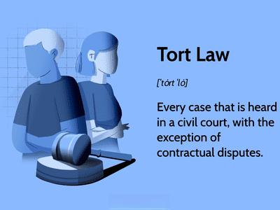

In the evolving world of finance, particularly in algorithmic trading, understanding the legal landscape of tort law is crucial for investors and financial professionals. Tort law, specifically unintentional torts, gains significance in algorithmic trading due to the potential for software-driven decisions to cause unforeseen damage or loss. Unintentional torts occur when harm is caused accidentally, often stemming from negligence. In algorithmic trading, this involves scenarios where trading algorithms malfunction, resulting in significant financial losses.

This article will examine the nuances of unintentional torts, their relevance to algorithmic trading, and the requirements for legal proof in such cases. Understanding these concepts is essential, as algorithmic trading systems must uphold a standard of care akin to that expected from a 'reasonable person' to avoid endangering others in financial markets. Instances of negligence might arise from programming errors, insufficient testing, or failure to consider extreme market conditions.



Key elements required to prove an unintentional tort include establishing that the defendant owed a duty of care to the plaintiff, demonstrating a breach of this duty, and showing that this breach led to financial loss or damage. In the context of algorithmic trading, courts assess whether the algorithm's design and execution complied with industry standards and regulatory frameworks.

As algorithmic trading becomes increasingly prevalent, having a thorough understanding of these legal frameworks helps protect parties from negligence-related consequences, ensuring that traders and financial professionals proactively manage risks.

## Table of Contents

## Understanding Unintentional Torts in Algorithmic Trading

Unintentional torts in the field of algorithmic trading primarily arise from situations where harm is caused accidentally, often due to negligence. This negligence may manifest in various ways within the technical and operational aspects of trading algorithms.

Algorithmic trading systems often execute trades at high speeds and volumes, relying on pre-programmed instructions. When an algorithm malfunctions, it can lead to severe financial losses. Such malfunctions might be due to errors in code, inadequate testing procedures, or failure to consider unpredictable market conditions. For example, a seemingly minor programming oversight might lead to incorrect buy/sell signals, exacerbating market [volatility](/wiki/volatility-trading-strategies) and causing unintended financial harm.

The degree of care required from [algorithmic trading](/wiki/algorithmic-trading) systems parallels the legal concept of the 'reasonable person' standard—implying that algorithms should be designed, tested, and operated with the care and skill that a reasonable person would use in similar circumstances. For instance, during the development and testing phases, ensuring the reliability and robustness of algorithms is crucial in minimizing the risk of negligence. This can involve implementing rigorous quality assurance processes, such as:

```python
def test_algorithm(algo, test_cases):
    for case in test_cases:
        try:
            assert algo.run(case) == case.expected_output
        except AssertionError:
            print(f"Algorithm failed on test case: {case}")
```

Furthermore, extreme market conditions pose a unique challenge to algorithmic trading. These markets can lead to rapid price swings, testing algorithms beyond their normal operating conditions. Failing to adequately prepare for such scenarios may result in significant financial disruption, thus constituting negligence. Proper contingency planning and stress testing are critical components in addressing these challenges.

In conclusion, safeguarding against negligence in algorithmic trading requires adherence to industry standards in software development, conducting thorough testing, and anticipating extreme market conditions. These practices help ensure that trading algorithms perform with the care and precision expected in a highly dynamic financial environment.

## Proving Legal Negligence in Algorithmic Trading

In the context of algorithmic trading, proving unintentional negligence requires showing that the defendant owed a duty of care to the plaintiff. This duty implies a responsibility to act with the level of care expected of a reasonable party under similar circumstances, especially when developing and deploying trading algorithms.

Negligence arises when the defendant fails to meet this standard of care, resulting in a breach that causes financial damage. For instance, if an algorithm has coding errors due to inadequate testing or oversight, and these errors cause significant losses during trading, the developer or financial institution may be considered negligent.

To establish causation, it's crucial to demonstrate that, "but for" the negligent act, the injury or loss would not have occurred. In the context of algorithmic trading, this means illustrating a direct link between the algorithm's malfunction and the financial harm experienced by the plaintiff. This often involves complex analysis of trading data and expert testimony to highlight how the negligence led to specific market behaviors or financial outcomes.

Courts also examine whether the algorithm's design and operational procedures adhered to industry standards and regulatory requirements. Compliance with these standards is critical as it can influence the assessment of whether the defendant's actions were reasonable. For example, if the algorithm failed to incorporate basic risk management protocols expected in the industry, it would support a claim of negligence.

In summary, proving negligence in algorithmic trading involves a rigorous analysis of the duty of care, breach, causation, and adherence to standards, forming the basis of a robust legal evaluation in such cases.

## Case Studies and Examples

### Case Studies and Examples

Historical instances of algorithmic trading have demonstrated significant challenges related to unintentional torts, particularly regarding market disruptions like flash crashes. A prominent example is the May 6, 2010, Flash Crash, where the U.S. stock market witnessed an unprecedented plunge in prices within minutes, followed by a rapid recovery. This event highlighted the potential for algorithmic trading systems to malfunction under extreme conditions, causing substantial financial losses.

Investigations into the Flash Crash revealed that a large sell order initiated by a mutual fund led to a cascade of algorithmic trades, exacerbating the market downturn. The event underscored the importance of thorough oversight and testing of trading algorithms to prevent similar occurrences. The legal challenges arose in evaluating whether these algorithmic systems failed in adhering to industry standards and whether negligence occurred due to inadequate safeguards.

In another case, the Knight Capital incident on August 1, 2012, illustrated the severe impact of coding errors. Knight Capital's trading algorithm erroneously executed millions of trades in a mere 45 minutes, resulting in a $440 million loss and eventually leading to the company's downfall. This case emphasized the necessity of rigorous testing and review processes for algorithmic systems. Legal scrutiny focused on whether the firm neglected its duty of care by failing to implement adequate testing protocols and oversight mechanisms.

These real-world examples highlight the critical role of implementing comprehensive testing, validation, and governance structures for algorithmic trading systems. Employing simulation tools, conducting stress tests under various market conditions, and ensuring compliance with regulatory standards can mitigate the risk of unintentional torts. As financial markets increasingly rely on algorithmic trading, understanding these historical lessons is vital to prevent negligence-related liabilities.

## Implications for Traders and Financial Institutions

Understanding tort law is fundamental for traders and financial institutions to mitigate negligence risks associated with algorithmic trading. By comprehensively integrating these principles into their operational frameworks, financial entities can enhance their resilience against unforeseen legal liabilities that may arise from unintentional tort claims.

A critical step for financial institutions is the establishment of robust compliance measures. This involves the implementation of comprehensive procedures and guidelines that align with current regulatory standards. Such protocols ensure that algorithmic trading systems operate within legal boundaries, reducing the likelihood of algorithm-induced mishaps that could culminate in negligence claims. Regular audits are an indispensable part of this process; they serve as a mechanism for continuous monitoring and improvement of trading systems. Audits help identify potential vulnerabilities and ensure that the trading algorithms function as intended, under both normal and extreme market conditions.

Compliance frameworks should also be adaptive, enabling financial entities to respond swiftly to updates in legal precedents and regulatory requirements. This adaptability is particularly crucial given the dynamic nature of financial regulation, where changes can occur rapidly in response to technological advancements or shifting market landscapes. Staying informed allows firms to proactively adjust their trading systems and risk management strategies, thereby reducing exposure to potential legal challenges.

In fostering a culture of compliance and risk management, financial institutions can employ technology to automate some aspects of monitoring and compliance checks. For instance, [machine learning](/wiki/machine-learning) algorithms can be harnessed to detect anomalies or deviations from expected trading patterns, acting as an early warning system for potential system failures or breaches in protocol. Here's a simple Python script example that demonstrates how a machine learning model might be trained to predict anomalies:

```python
from sklearn.ensemble import IsolationForest
import numpy as np

# Example data - typically this would be your real trading data
trading_data = np.array([[0.1, 0.2], [0.15, 0.27], [0.13, 0.25], [0.8, 0.9]])

# Initialize the Isolation Forest model
model = IsolationForest(contamination=0.1)  # assuming 10% contamination for anomalies

# Fit the model on the trading data
model.fit(trading_data)

# Predict anomalies
anomalies = model.predict(trading_data)

# Output results
for index, anomaly in enumerate(anomalies):
    if anomaly == -1:
        print(f"Anomaly detected in transaction {index}: {trading_data[index]}")
```

This script identifies potential anomalies in trading data, enabling traders to investigate and rectify issues before they escalate into genuine incidents that could lead to unintentional tort claims. By embedding such predictive analytics into their operations, financial institutions are better equipped to safeguard against negligent practices and maintain market integrity.

In conclusion, the integration of tort law principles within financial practices not only protects institutions from negligence-related liabilities but also fosters a proactive approach to risk management. Staying abreast of legal and regulatory developments acts as a safeguard against the dynamic challenges posed by algorithmic trading, ensuring that financial entities can navigate this complex landscape with confidence.

## Conclusion

In the fast-paced world of algorithmic trading, comprehending unintentional torts becomes crucial for risk management. The rapid evolution of financial technologies and increased reliance on complex algorithms necessitate a thorough understanding of legal responsibilities to prevent negligence-related liabilities. As legal landscapes continue to change, traders and financial firms must proactively adapt their strategies to protect themselves from potential negligence claims.

The intertwining of technology and finance introduces intricate challenges that demand strategic legal guidance. This guidance ensures that algorithmic trading systems operate within the confines of legal and regulatory frameworks, effectively mitigating the risk of unintentional torts. Maintaining awareness of such legal intricacies is critical; it enables traders and institutions to develop comprehensive compliance measures and integrate robust risk management protocols. These actions not only safeguard against financial and reputational damage but also foster a culture of accountability and precision in trading practices.

Moreover, ongoing education regarding legal precedents and statutory changes affecting algorithmic trading is essential. By staying informed and seeking expert legal advice, financial entities can align their operational strategies with evolving legal standards. Ultimately, a sound understanding of unintentional torts forms the foundation of a resilient risk management strategy, crucial for navigating the complexities of the modern financial landscape.

## References & Further Reading

[1]: Bunge, M., & Corredor, S. (2015). ["Technology and the Law: Facing Unintentional Torts."](https://www.researchgate.net/publication/361909959_Metascience_Foundations_of_Information_Technology_Based_on_Bunge's_Systemist_Philosophy_of_Reality) International Journal of Law and Information Technology.

[2]: Lopez de Prado, M. (2018). ["Advances in Financial Machine Learning."](https://www.amazon.com/Advances-Financial-Machine-Learning-Marcos/dp/1119482089) Wiley.

[3]: Pardo, R. (2008). ["The Evaluation and Optimization of Trading Strategies."](https://onlinelibrary.wiley.com/doi/book/10.1002/9781119196969) Wiley.

[4]: Casey, K., & Lutton, J. D. (2008). ["Algorithmic Trading: The Basics and the Best Practices of a Mathematical Trading Model."](https://pmc.ncbi.nlm.nih.gov/articles/PMC2500212/) Journal of Computational Finance.

[5]: Friedlander, K. (2015). ["Managing Financial Risks through Algorithmic Trading: Legal Considerations and Best Practices."](https://www.techfunnel.com/fintech/risk-management-in-finance/) Financial Analysts Journal.