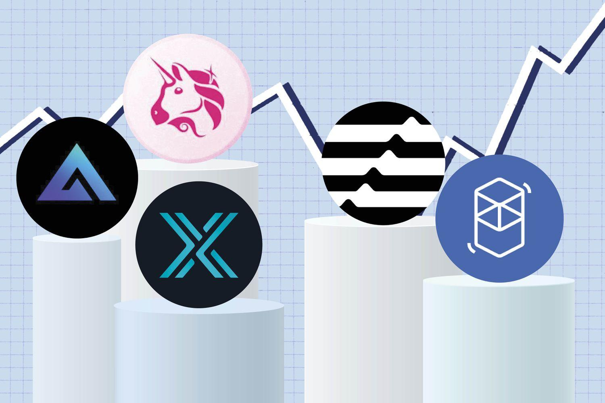

In recent years, decentralized finance (DeFi) has significantly transformed our understanding of financial transactions and investment modalities. Central to this transformation is Uniswap, a leading decentralized cryptocurrency exchange that has set new standards for decentralized finance applications. Unlike traditional centralized exchanges, Uniswap enables peer-to-peer swapping of cryptocurrencies without the need for intermediaries, offering a more secure and efficient trading environment.

This article will provide an in-depth examination of Uniswap's operational mechanisms within the DeFi ecosystem. By employing an automated market maker (AMM) system, Uniswap facilitates seamless trading and liquidity provision, thereby enabling users to engage in trading activities with reduced friction and enhanced transparency. Moreover, the advent of algorithmic trading has introduced new dimensions to the platform's functionalities. Algorithmic trading on Uniswap allows traders to harness market conditions using predefined strategies, optimizing trade executions for improved returns.



An understanding of these core concepts—Uniswap's decentralized framework and the role of algorithmic trading—is essential for both investors looking to capitalize on DeFi opportunities and developers aiming to innovate within this space. By exploring these elements, stakeholders can better navigate the complex and rapidly advancing landscape of digital finance. Through this journey, the article seeks to illuminate the innovative attributes of Uniswap, the broader implications of DeFi, and the potential benefits of algorithmic trading.

## Table of Contents

## Understanding Uniswap: Basics and Evolution

Uniswap is a pioneering decentralized exchange (DEX) built on the Ethereum blockchain. It facilitates cryptocurrency trading without the need for traditional intermediaries like centralized exchanges. Instead of relying on order books to match buyers and sellers, Uniswap employs an innovative approach known as an automated market maker (AMM) system. This system leverages liquidity pools to execute trades, ensuring users can smoothly swap various cryptocurrencies.

The AMM model relies on smart contracts to manage the liquidity pools, enabling constant transactions between token pairs. Liquidity providers (LPs) fund these pools by depositing equivalent values of the two tokens in question, and in return, they earn transaction fees from trades executed within these pools.

Uniswap was launched in 2018 by Hayden Adams. Since its inception, it has witnessed substantial evolution, notably with the release of Uniswap V3. This version introduced numerous improvements aimed at enhancing both scalability and capital efficiency. V3 allows liquidity providers to concentrate their capital within customized price ranges, thereby maximizing their [earning](/wiki/earning-announcement) potential while also reducing the capital required to offer the same liquidity. It introduced the concept of concentrated liquidity, which gives LPs more control over how their assets are distributed within the liquidity pool.

Uniswap's open-source nature has been a critical [factor](/wiki/factor-investing) in its widespread adoption and innovative growth. Developers across the globe can access Uniswap's codebase, enabling them to build and integrate their own decentralized finance (DeFi) applications. This open-access environment encourages creativity and has led to the proliferation of unique DeFi solutions based on Uniswap's core technology.

As Uniswap continues to evolve, understanding its mechanics and historical developments is essential for comprehending its significance in the rapidly changing [cryptocurrency](/wiki/cryptocurrency) market. As DeFi ecosystems expand, the foundational technologies driving platforms like Uniswap set the stage for future financial innovations.

## The Role of Decentralized Finance (DeFi)

Decentralized finance, commonly known as DeFi, represents a transformative shift in the financial sector, utilizing blockchain technology to create a network of permissionless financial applications. These applications aim to replace traditional financial intermediaries by enabling trustless transactions, thereby offering financial services that are accessible to anyone with an internet connection without the need for central authority.

DeFi applications cover a wide range of services including lending, borrowing, trading, and insurance, all executed on decentralized platforms. One of the most notable features of these applications is their reliance on smart contracts—self-executing contracts with the terms of the agreement directly written into code. These smart contracts automate and streamline processes, substantially reducing overhead costs and enhancing transparency in financial operations.

Uniswap stands out as a prominent player in the DeFi sector, facilitating decentralized trading through its innovative automated market maker (AMM) model. Uniswap eliminates the need for order [books](/wiki/algo-trading-books) by directly connecting users who wish to swap different cryptocurrencies, thereby bypassing traditional exchange mechanisms. This approach not only democratizes access to trading but also ensures continuous market [liquidity](/wiki/liquidity-risk-premium) by allowing users to contribute liquidity to various token pairs.

The rapid expansion of the DeFi ecosystem has captured worldwide attention due to its potential to offer more inclusive and equitable financial systems. By removing barriers to entry prevalent in traditional finance, DeFi holds the promise of empowering individuals in underserved regions, fostering financial innovation, and providing new opportunities for wealth generation. As DeFi continues to grow, it challenges existing financial structures and encourages the development of more resilient and adaptable financial systems globally.

## Algorithmic Trading on Uniswap

Algorithmic trading, commonly referred to as algo trading, employs sophisticated computer programs to execute trades on financial platforms based on predetermined strategies. On Uniswap, a prominent decentralized exchange operating on Ethereum, this trading approach allows participants to harness prevailing market conditions efficiently, optimizing transactions for improved returns.

Uniswap stands out in the decentralized finance (DeFi) landscape due to its distinctive automated market maker (AMM) model, which facilitates trading via liquidity pools rather than traditional order books. Liquidity pools are central to Uniswap's functionality, as they enable the seamless exchange of cryptocurrencies. In this environment, algorithmic strategies are particularly effective, as they can evaluate pool depths and monitor price movements in real-time, ensuring swift responses to market changes.

With the continuous advancement of blockchain technology, the development of application programming interfaces (APIs) and smart contracts has been transformative. These tools have empowered traders by allowing them to automate intricate trading strategies without manual intervention. Smart contracts on platforms like Uniswap reduce the complexity and time required for trades, managing everything from execution to settlement seamlessly. For instance, a Python script could be drafted to interact with Uniswap's smart contracts, executing trades when certain market conditions are met:

```python
from web3 import Web3

# Connect to Ethereum node
w3 = Web3(Web3.HTTPProvider('https://mainnet.infura.io/v3/YOUR_INFURA_PROJECT_ID'))

# Interact with Uniswap smart contract
uniswap_contract_address = "0xAddressOfUniswapContract"
uniswap_contract = w3.eth.contract(address=uniswap_contract_address, abi=uniswap_abi)

# Sample function to execute a trade
def execute_trade(token_in, token_out, amount):
    txn = uniswap_contract.functions.swapExactTokensForTokens(
        amount,
        0,  # amount_out_min
        [token_in, token_out],
        your_wallet_address,
        int(time.time()) + 1000
    ).buildTransaction({
        'from': your_wallet_address,
        'gas': 200000,
        'gasPrice': w3.toWei('20', 'gwei'),
        'nonce': w3.eth.getTransactionCount(your_wallet_address),
    })
    signed_txn = w3.eth.account.signTransaction(txn, private_key=your_private_key)
    w3.eth.sendRawTransaction(signed_txn.rawTransaction)

# Execute a trade based on predefined conditions
if market_condition_met:
    execute_trade(token_in, token_out, amount_to_trade)
```

By crafting algorithms that utilize Uniswap's liquidity dynamics, traders can engage in practices such as [arbitrage](/wiki/arbitrage), [market making](/wiki/market-making), and yield farming. Each strategy requires a deep understanding of the network's intricacies and the ability to anticipate price shifts as they occur. 

The adaptability of algo trading strategies to the dynamic nature of cryptocurrency markets makes them invaluable. However, it is important to note that the success of these strategies hinges on precise execution and real-time data analysis. The algorithms must be meticulously optimized to manage risks such as slippage, liquidity [volatility](/wiki/volatility-trading-strategies), and potential smart contract vulnerabilities.

In conclusion, the integration of [algorithmic trading](/wiki/algorithmic-trading) with Uniswap’s decentralized framework signifies a pivotal progression in cryptocurrency trading, promoting a more autonomous and efficient trading experience. As technology evolves, the synergy between algorithmic trading and decentralized platforms like Uniswap is likely to expand, offering new opportunities and challenges for market participants.

## Benefits and Challenges of Using Uniswap for Algo Trading

Uniswap offers several benefits for algorithmic trading, primarily centered around its decentralized structure. The platform allows users to trade a diverse array of tokens without incurring the high fees often associated with centralized exchanges. This cost-efficiency can significantly enhance the profitability of trades executed by algorithms, particularly for traders who engage in high-frequency trading or manage sizeable trading volumes. Furthermore, the decentralized nature of Uniswap enhances security; the absence of a centralized authority reduces the risk of hacks and fraud, which can lead to substantial financial losses on traditional exchanges.

The automated market maker (AMM) model used by Uniswap enables more predictable pricing and availability of assets, which is beneficial for algorithmic trading strategies. Algorithms can be designed to interact directly with liquidity pools, optimizing trades based on the depth and pricing within these pools. This can lead to improved execution times and reduced slippage, contributing to better overall trading efficiency.

However, there are inherent challenges when utilizing Uniswap for algorithmic trading. Slippage—where the executed price differs from the expected price due to market movements—remains a concern, especially in less liquid markets. Additionally, impermanent loss, which occurs when providing liquidity to a pool and experiencing divergence between token prices, can erode the gains of liquidity providers and requires careful strategy adaptation and risk management.

The volatility of cryptocurrency markets also presents a challenge. Rapid price movements can result in substantial gains or losses, necessitating robust algorithms that can adapt to changing market conditions. Successful algorithmic trading on Uniswap requires an in-depth understanding of market trends and constant optimization of trading algorithms to ensure they remain effective in volatile conditions.

Despite these challenges, Uniswap continues to be a favored platform for traders seeking the advantages of a decentralized trading environment. The platform's open-source nature allows for constant innovation and adaptation, providing opportunities for traders to develop and refine their strategies in a secure and cost-effective manner. As the DeFi ecosystem evolves, the continuous improvements to Uniswap's framework are likely to offer new possibilities for algorithmic trading.

## Future Prospects of Uniswap, DeFi, and Algo Trading

Uniswap's future is intrinsically linked to the continuous advancements in blockchain technology and the growing interest of users in decentralized financial systems. Uniswap, a pioneer in the decentralized finance (DeFi) space, relies heavily on technological innovation to maintain its competitive edge and attract a broader user base. As blockchain technology evolves, enhancements in scalability, security, and transaction speed will significantly contribute to the platform's development. Increased user adoption is expected as these improvements make decentralized trading more accessible and efficient.

Interoperability between DeFi platforms and traditional financial systems presents a significant opportunity. As DeFi matures, creating seamless communication bridges between these sectors could facilitate a more integrated financial ecosystem. Such interoperability could allow institutional investors to interact with DeFi platforms directly, leveraging opportunities that traditional systems do not provide. This evolution could also lead to hybrid models where financial products and services cross the boundaries of conventional and decentralized platforms, fostering innovation and expanding user bases.

Algorithmic trading on Uniswap is anticipated to reach new levels of sophistication with the incorporation of advanced technologies such as [artificial intelligence](/wiki/ai-artificial-intelligence) (AI) and [machine learning](/wiki/machine-learning). These technologies can enhance trading strategies by providing real-time market analysis, predictive analytics, and automated decision-making processes. Sophisticated algorithms may offer unparalleled precision and efficiency in executing trades, optimizing returns, and managing risks.

Regulatory developments stand to significantly influence the trajectory of Uniswap, DeFi, and algorithmic trading. As these technologies burgeon, striking a balance between fostering innovation and ensuring investor protection becomes crucial. Emerging regulations may focus on transparency, security, and consumer protection while also considering implications for market stability and anti-money laundering measures. Compliance with evolving regulatory frameworks will be essential for Uniswap and similar platforms to gain mainstream acceptance and trust.

In summary, Uniswap, along with DeFi and algorithmic trading, is anticipated to play a central role in shaping the future of the digital financial ecosystem. Continued technological advancements, enhanced interoperability, sophisticated trading strategies, and constructive regulatory frameworks will collectively contribute to the vibrant evolution of decentralized finance. This evolution promises to redefine financial transactions, offering unprecedented opportunities for both traditional and digital finance participants.

## Conclusion

Uniswap represents a paradigm shift in how currency trading and financial services are approached within the digital world. By leveraging the principles of decentralized finance (DeFi) and the possibilities introduced by algorithmic trading, users of this platform can achieve a degree of autonomy and efficiency previously unattainable in traditional financial systems. This shift underscores the importance of permissionless and trustless transactions, which reduce dependency on intermediaries and enhance transaction transparency.

For both new and seasoned investors, Uniswap offers a wealth of opportunities coupled with certain challenges. These include the potential for high returns through algorithmically optimized trades and the security gains from decentralized trading structures. However, users must also navigate risks such as market volatility and technical complexities related to algorithmic strategies. The evolving dynamics of the crypto market demand a continuous learning approach to capitalize on these opportunities.

As the cryptocurrency space grows, staying informed and adaptable remains essential for users who wish to maximize the potential of decentralized exchanges like Uniswap. This involves understanding the intricacies of smart contract functionalities, liquidity pool management, and algorithmic trade execution. The synergy between decentralized platforms, such as Uniswap, and algorithmic trading technologies is catalyzing an exciting era for global finance. This fusion heralds a future where financial transactions and services operate more inclusively and efficiently, benefiting a broader swath of the global population.

## References & Further Reading

[1]: Adams, H. (2018). ["Uniswap Whitepaper."](https://app.uniswap.org/whitepaper-v3.pdf) 

[2]: Buterin, V. (2013). ["Ethereum Whitepaper."](https://ethereum.org/en/whitepaper/)

[3]: Lopez de Prado, M. (2018). ["Advances in Financial Machine Learning."](https://www.amazon.com/Advances-Financial-Machine-Learning-Marcos/dp/1119482089) Wiley.

[4]: Jansen, S. (2020). ["Machine Learning for Algorithmic Trading."](https://github.com/stefan-jansen/machine-learning-for-trading) Packt Publishing.

[5]: Kothari, R., & Botsari, A. (2020). ["Defi and the Future of Finance."](https://books.google.com/books/about/DeFi_and_the_Future_of_Finance.html?id=CGM4EAAAQBAJ) Springer.