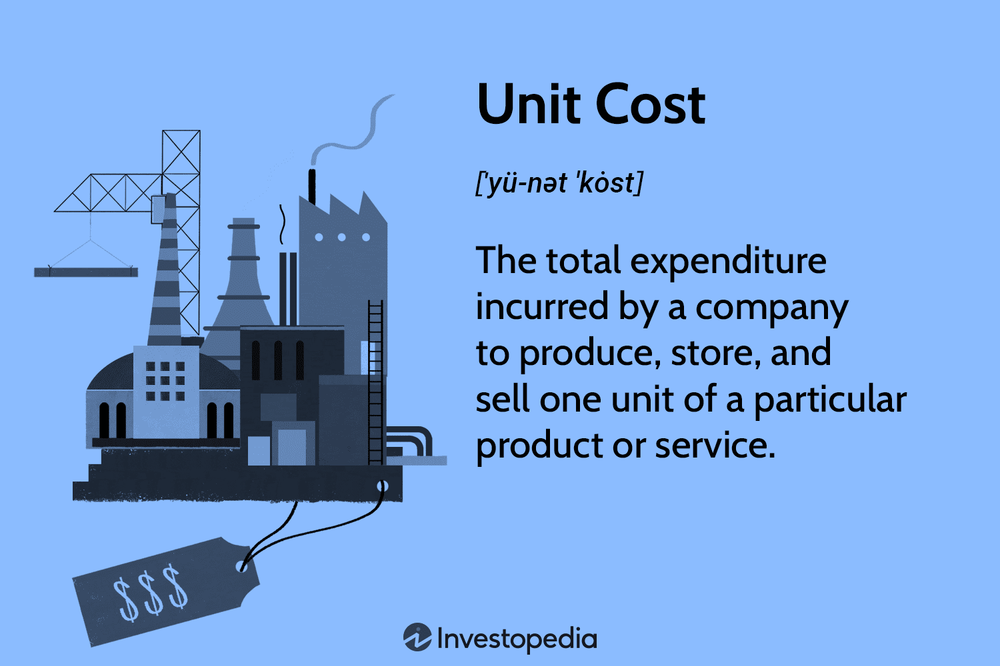

## Table of Contents

## What is unit cost and why is it important?

Unit cost is the total amount of money it takes to make or buy one single item or unit of something. For example, if you make cookies and it costs you $10 to make 5 cookies, the unit cost of one cookie is $2. Knowing the unit cost is important because it helps businesses figure out how much to charge for their products. If they don't know how much it costs to make each item, they might sell it for less than it costs to make it, which means they would lose money.

Understanding unit cost is also crucial for making good decisions about how to save money and make the business more efficient. If a business knows that the unit cost of their product is high, they can look for ways to lower it, like finding cheaper materials or making the production process faster. This can help the business make more profit and stay competitive in the market. In the end, keeping track of unit costs helps businesses stay healthy and grow.

## How do you calculate the unit cost of a product?

To calculate the unit cost of a product, you need to add up all the costs that go into making or buying one item. This includes things like the cost of materials, labor, and any other expenses like rent for the factory or electricity used in production. Once you have the total cost, you divide that number by the number of units you made or bought. For example, if it costs $100 to make 10 cookies, the unit cost of one cookie is $100 divided by 10, which equals $10 per cookie.

It's important to be as accurate as possible when figuring out the unit cost. Sometimes, costs like rent or electricity are shared among many products, so you need to figure out how much of these costs should be added to each unit. This can be tricky, but it's important to get it right. If you don't include all the costs, you might think your unit cost is lower than it really is, which can lead to setting prices too low and losing money.

## What are the different types of unit costs?

There are different types of unit costs that businesses use to understand their expenses better. One type is the direct unit cost, which includes only the costs that can be directly linked to making one item. This usually means the cost of materials and the labor used to make the product. For example, if you are making a toy car, the plastic and paint used, plus the time workers spend making it, are part of the direct unit cost.

Another type is the indirect unit cost, which includes costs that are not directly linked to making one item but are still important for the business. These costs are shared among all the products the business makes. Things like rent for the factory, electricity, and the salaries of managers are examples of indirect costs. To figure out the indirect unit cost, you need to divide these shared costs by the total number of units made.

Finally, there is the total unit cost, which is the sum of the direct and indirect unit costs. This gives you a complete picture of how much it costs to make one item. Knowing the total unit cost helps businesses set the right price for their products so they can make a profit and stay competitive in the market.

## Can you explain the difference between fixed and variable unit costs?

Fixed unit costs are the costs that stay the same no matter how many items you make. These are things like rent for your factory or the salary of a manager. Even if you make one item or a thousand, these costs don't change. To figure out the fixed unit cost, you take the total fixed costs and divide them by the number of items you make. If you have $1,000 in fixed costs and you make 100 items, the fixed unit cost for each item is $10.

Variable unit costs, on the other hand, change depending on how many items you make. These are costs like the materials you use or the wages of workers who are paid by the hour. If you make more items, these costs go up. If you make fewer items, these costs go down. For example, if you need $2 of materials to make one item, the variable unit cost for each item is $2. If you make 100 items, your total variable cost is $200.

Understanding the difference between fixed and variable unit costs is important for businesses. It helps them see how costs change with production levels and make better decisions about pricing and production. For example, if a business knows its variable costs are high, it might try to find cheaper materials or ways to make things faster to lower those costs. On the other hand, if fixed costs are high, the business might need to produce more items to spread those costs over more units and lower the fixed unit cost per item.

## How does unit cost affect pricing strategies?

Unit cost is a key part of deciding how much to charge for a product. If a business knows how much it costs to make one item, it can set a price that covers those costs and also makes a profit. For example, if it costs $5 to make a toy, the business might decide to sell it for $10 to cover the cost and make some money. But if the unit cost is too high, the business might have to charge a lot more, which could make customers not want to buy it.

Knowing the unit cost also helps businesses choose the right pricing strategy. If the unit cost is low, a business might decide to use a low-price strategy to attract more customers and sell more items. This can work well if the business can sell a lot of items and make up for the low profit per item with high sales [volume](/wiki/volume-trading-strategy). On the other hand, if the unit cost is high, a business might use a premium pricing strategy, charging more for the product to reflect its higher cost and value. This way, the business can still make a good profit even if it sells fewer items.

## What role does unit cost play in break-even analysis?

Unit cost is really important when doing a break-even analysis. This analysis helps businesses figure out how many items they need to sell to start making a profit. To do this, you need to know the unit cost because it tells you how much it costs to make each item. You then compare this cost to the price you sell the item for. The break-even point is when the money you make from selling the items equals the total cost of making them. If you don't know the unit cost, you can't do this calculation correctly.

For example, if it costs $5 to make a toy and you sell it for $10, you need to sell enough toys so that the total money you make is at least as much as the total cost. If you sell 100 toys, you make $1,000, but if it cost you $500 to make them, you've reached your break-even point. Knowing the unit cost helps you see how many items you need to sell to cover your costs and start making a profit. It's a simple but powerful way to plan and manage your business.

## How can businesses reduce their unit costs?

Businesses can reduce their unit costs by finding cheaper ways to make their products. This can mean using less expensive materials or finding suppliers who charge less for the same things. They can also look at their production process to see if they can make it faster or more efficient. For example, by training workers to do their jobs better or by using machines that work faster, a business can make more items in less time, which spreads out the fixed costs over more units and lowers the unit cost.

Another way to lower unit costs is by making more items. When a business makes a lot of something, the fixed costs like rent and salaries get spread out over more units, making the unit cost go down. This is called economies of scale. Businesses can also look at their indirect costs, like electricity or office supplies, and find ways to use less of these things or find cheaper alternatives. By keeping an eye on all these costs and making smart changes, businesses can make their unit costs smaller and be more profitable.

## What are some common challenges in accurately determining unit costs?

One big challenge in figuring out unit costs is making sure you include all the costs. Sometimes, it's easy to forget about indirect costs like rent or electricity because they don't directly go into making each item. If you don't include these costs, you might think your unit cost is lower than it really is, which can lead to setting prices too low and losing money. Another challenge is figuring out how to divide the indirect costs fairly among all the products you make. If you don't do this right, some products might seem more expensive or cheaper than they really are, which can mess up your pricing and profit calculations.

Another issue is that costs can change over time. The price of materials or labor might go up or down, and if you don't keep track of these changes, your unit cost calculations won't be accurate. This can make it hard to set the right price for your products and know when you're making a profit. Also, if you make different products in the same factory, it can be tricky to figure out how much of the shared costs should go to each product. Getting this wrong can lead to wrong decisions about which products are profitable and which ones are not.

## How do unit costs vary across different industries?

Unit costs can be very different in different industries. In manufacturing, like making cars or electronics, unit costs are usually high because it takes a lot of expensive materials and machines to make these things. The cost of steel for a car or the chips for a computer can be a big part of the unit cost. Also, the labor to put these things together can be expensive, especially if workers need special skills. In these industries, businesses often try to make a lot of items to spread out the high fixed costs and lower the unit cost.

In industries like retail or food service, unit costs can be lower. For example, if you're selling clothes or making sandwiches, the cost of materials like fabric or bread might not be as high as in manufacturing. But, these industries still have to deal with other costs like rent for stores or restaurants, and the wages of workers. Even though the unit costs might be lower, these businesses still need to keep an eye on them to make sure they're setting the right prices and making a profit. In both cases, understanding and managing unit costs is key to staying competitive and successful.

## What advanced methods can be used to allocate overhead costs to unit costs?

One advanced way to figure out how to add overhead costs to unit costs is called activity-based costing (ABC). This method looks at all the different activities that go into making a product and figures out how much each activity costs. For example, if you're making cookies, activities might include mixing the dough, baking, and packaging. ABC helps you see how much of the overhead costs, like rent or electricity, should be added to each of these activities. Then, you can add up these costs to get a more accurate unit cost for each cookie. This method is really helpful when you make a lot of different products because it makes sure each product gets its fair share of the overhead costs.

Another method is called the step-down allocation method. This is used when some overhead costs are shared between different parts of the business. For example, the cost of the maintenance department might be shared between the production and sales departments. With the step-down method, you start by figuring out the costs for the department that provides the most services to other departments, like maintenance. You then spread these costs to the other departments based on how much they use the services. After that, you can figure out how much of these shared costs should be added to each unit of your product. This method helps make sure that all the overhead costs are included in the unit cost, even if they are shared among different parts of the business.

## How do changes in production volume impact unit costs?

When a business makes more of something, the unit cost usually goes down. This happens because some costs, like rent for the factory or salaries for managers, stay the same no matter how many items you make. These are called fixed costs. When you make more items, you spread these fixed costs over more units, which makes the unit cost for each item smaller. For example, if it costs $1,000 to rent a factory and you make 100 items, the fixed cost per item is $10. But if you make 1,000 items, the fixed cost per item drops to $1.

On the other hand, some costs, like the materials you use or the wages of workers who are paid by the hour, go up when you make more items. These are called variable costs. If you make more items, these costs go up, but they might not go up as fast as the number of items you make. For example, if you need $2 of materials to make one item, the variable cost per item stays $2 no matter how many items you make. But if you can buy materials in bulk at a lower price when you make more items, the variable cost per item might go down. So, making more items can lower the unit cost by spreading out fixed costs and sometimes lowering variable costs.

## Can you provide real-world examples of how companies have successfully managed their unit costs?

One example of a company managing its unit costs well is IKEA. IKEA makes furniture that customers put together themselves. This helps them keep their unit costs low because they don't have to pay workers to assemble the furniture. Also, IKEA designs their products to use flat-packaging, which makes it cheaper to ship them. By doing these things, IKEA can keep their prices low and still make a good profit.

Another example is Toyota, a car company that uses a system called "lean manufacturing" to manage their unit costs. Lean manufacturing is all about cutting out waste and making things as efficiently as possible. Toyota does this by making sure they only make what customers want, when they want it, and by constantly looking for ways to make their production process faster and cheaper. This helps Toyota keep their unit costs low and stay competitive in the car market.

## What is the understanding of unit cost in algorithmic trading?

In algorithmic trading, understanding the concept of unit cost is critical for optimizing strategy performance and profitability. Unit cost in trading refers to the total cost associated with executing a single trade of a security, including all relevant fees and expenses. It is a comprehensive measure that accounts for the price paid to acquire or sell a stock, as well as ancillary costs, such as transaction fees, market impact, and opportunity costs.

Unit cost has a direct impact on the profitability of [algorithmic trading](/wiki/algorithmic-trading) strategies. Lower unit costs can enhance the returns of a trading strategy, whereas high unit costs can erode the profitability, particularly for high-frequency trading strategies where margins are generally slimmer. Optimizing unit costs allows traders to maximize their net gains from trading activity by considering both execution efficiency and the scalability of their algorithms.

Calculating the unit cost of a trade involves aggregating all expenses incurred during the transaction. Consider a scenario where a trading algorithm purchases 100 shares of a stock at a market price of $50 per share. The formula to calculate the basic unit cost can be expressed as follows:

$$
\text{Unit Cost} = \frac{\text{Total Cost}}{\text{Number of Shares}}
$$

Assuming a flat transaction fee of $10 and a market impact cost of $0.02 per share, the total cost is calculated as:

$$
\text{Total Cost} = (100 \times 50) + 10 + (100 \times 0.02) = 5010 + 2 = 5012
$$

Applying these figures gives:

$$
\text{Unit Cost} = \frac{5012}{100} = 50.12
$$

In this example, the unit cost of each share is $50.12, illustrating how non-price components of trading affect overall costs.

Reducing unit costs is a vital goal for algorithmic traders. They often implement strategies such as improving algorithmic efficiency, optimizing order timing, and leveraging economies of scale to lower these costs. As unit costs are minimized, net profitability tends to improve, making the trading strategy more competitive and potentially more successful in various market conditions.

## What are the different types of costs in algorithmic trading?

Algorithmic trading encompasses various types of costs, each influencing the overall performance of trading strategies. Understanding these costs is pivotal for optimizing profitability. Below are the key costs associated with algorithmic trading:

### Transaction Costs
Transaction costs are expenses incurred when buying or selling securities. These include broker commissions, fees, and taxes. Transaction costs directly affect the net gain from trades, making it imperative for traders to minimize them without compromising execution quality. Effective algorithms are designed to optimize order size and timing to reduce these costs while still capitalizing on market opportunities.

Mathematically, transaction cost (TC) for a single trade can be represented as:

$$
TC = P \times Q \times C_{rate}
$$

Where:
- $P$ is the price per unit of the security
- $Q$ is the quantity traded
- $C_{rate}$ is the commission rate

### Market Impact Costs
Market impact costs refer to the price movement caused by the execution of large orders. Large trades can move the market unfavorably, thus increasing costs. This cost is critical as it affects the execution price and can erode the expected profit margin. To mitigate market impact, algorithms often split large orders into smaller, strategically timed trades.

For instance, if executing a large order inflates the market price by 0.5%, the algorithmic strategy should assess whether trading smaller blocks over time could minimize this impact while still fitting within the strategy's temporal constraints.

### Opportunity Costs
Opportunity costs in algorithmic trading occur when the potential profit from a missed or delayed trade exceeds the gains realized from other executed trades. These costs often arise from execution delays or suboptimal algorithm performance. Opportunity costs can affect long-term profitability and need to be carefully managed by ensuring algorithms are responsive and execute trades swiftly in advantageous market conditions.

Opportunity costs are not always directly quantifiable but can be illustrated by comparing the actual returns of a trading strategy against a benchmark representing optimal execution.

### Operational Costs
Operational costs encompass expenses related to technology infrastructure, data acquisition, and human resources. These include costs for hardware, software, data feeds, and algorithm development and maintenance. In the high-speed trading world, up-to-date technology and reliable data sources are critical, making operational costs a significant consideration.

For instance, a Python-based algorithmic trading system might incur costs associated with cloud computing resources, premium data service subscriptions, and skilled personnel for system management and development:

```python
# Example cost estimation for a trading system

hardware_cost = 10000  # Annual cost in USD
data_feed_cost = 5000  # Annual subscription in USD
human_resource_cost = 80000  # Annual salary expenses in USD

total_operational_cost = hardware_cost + data_feed_cost + human_resource_cost
```

Understanding and managing these costs ensures that algorithmic trading strategies maintain their competitive edge and maximize potential returns. Each cost type contributes uniquely to the financial equation of trading, reinforcing the necessity for comprehensive cost analysis and strategy optimization.

## References & Further Reading

[1]: Bergstra, J., Bardenet, R., Bengio, Y., & Kégl, B. (2011). ["Algorithms for Hyper-Parameter Optimization."](https://papers.nips.cc/paper/4443-algorithms-for-hyper-parameter-optimization) Advances in Neural Information Processing Systems 24.

[2]: ["Advances in Financial Machine Learning"](https://books.google.com/books/about/Advances_in_Financial_Machine_Learning.html?id=oU9KDwAAQBAJ) by Marcos Lopez de Prado

[3]: ["Evidence-Based Technical Analysis: Applying the Scientific Method and Statistical Inference to Trading Signals"](https://www.amazon.com/Evidence-Based-Technical-Analysis-Scientific-Statistical/dp/0470008741) by David Aronson

[4]: ["Machine Learning for Algorithmic Trading"](https://github.com/stefan-jansen/machine-learning-for-trading) by Stefan Jansen

[5]: ["Quantitative Trading: How to Build Your Own Algorithmic Trading Business"](https://books.google.com/books/about/Quantitative_Trading.html?id=j70yEAAAQBAJ) by Ernest P. Chan