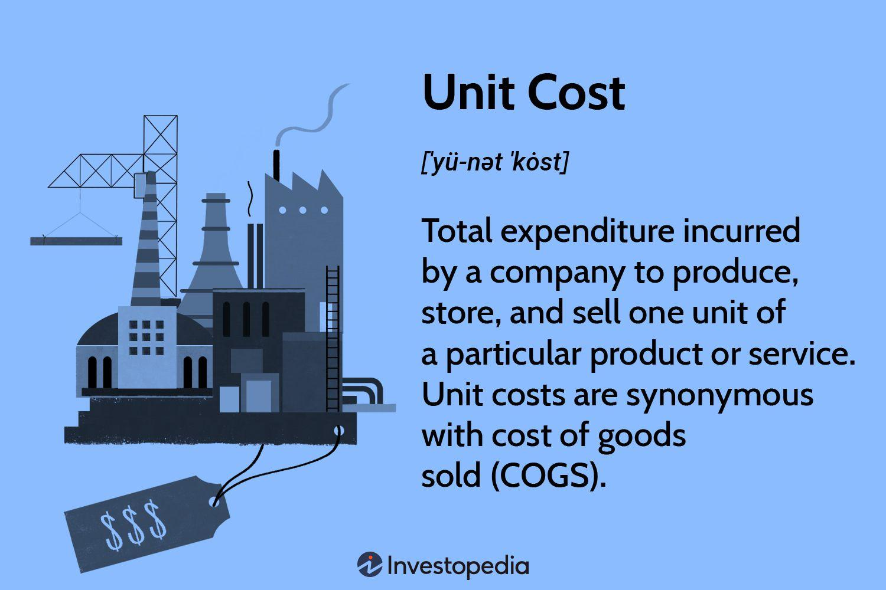

Algorithmic trading refers to the use of computer algorithms to automate trading decisions and execute trades in financial markets. This approach leverages mathematical models and statistical analyses to identify profitable trading opportunities, execute trades at high speed, and reduce human intervention. The primary objectives of algorithmic trading are to increase efficiency, enhance the speed of trade execution, minimize the impact of human error, and exploit market conditions that may not be as visible or accessible to human traders.

The significance of algorithmic trading in financial markets is profound. It has transformed the way traditional trading is executed by enabling traders to handle vast volumes of transactions with precision and at unparalleled speeds. The widespread usage of algorithmic trading is evident in equities, foreign exchange, and futures markets, driving the growth of high-frequency trading (HFT) where trades are executed within fractions of a second. The evolution of technology and the advent of big data have further fueled the adoption of algorithmic trading, allowing firms to analyze large datasets and refine trading strategies continuously.



Understanding costs is crucial in algorithmic trading as these can significantly impact the profitability of trading strategies. While algorithmic trading offers the benefit of executing large orders swiftly and in a consistent manner, it also entails various costs. Factors like transaction fees, slippage, market impact, and opportunity costs all contribute to the overall expense of a trading strategy. Moreover, operational costs related to technology, data acquisition, and human resources must also be considered. These factors combined can erode trading profits if not adequately managed.

In algorithmic trading, costs can be classified into several categories. Transaction costs are fees paid to exchanges or intermediaries for executing trades. Market impact costs refer to the adverse effect a trade can have on market prices when attempting to execute large orders. Opportunity costs arise from the potential profits lost when trades are not executed at the most opportune time due to algorithmic inefficiencies or market conditions. Lastly, operational costs include expenditures on technology infrastructure, data feeds, and skilled personnel essential for developing and maintaining trading algorithms.

In summary, algorithmic trading plays a pivotal role in contemporary financial markets by enhancing trade execution speed and accuracy. However, to ensure the profitability of algorithmic strategies, understanding and managing associated costs is essential. By carefully considering transaction, market impact, opportunity, and operational costs, traders can optimize their strategies to maintain a competitive edge in the market.

## Table of Contents

## Understanding Unit Cost in Algorithmic Trading

In algorithmic trading, understanding the concept of unit cost is critical for optimizing strategy performance and profitability. Unit cost in trading refers to the total cost associated with executing a single trade of a security, including all relevant fees and expenses. It is a comprehensive measure that accounts for the price paid to acquire or sell a stock, as well as ancillary costs, such as transaction fees, market impact, and opportunity costs.

Unit cost has a direct impact on the profitability of [algorithmic trading](/wiki/algorithmic-trading) strategies. Lower unit costs can enhance the returns of a trading strategy, whereas high unit costs can erode the profitability, particularly for high-frequency trading strategies where margins are generally slimmer. Optimizing unit costs allows traders to maximize their net gains from trading activity by considering both execution efficiency and the scalability of their algorithms.

Calculating the unit cost of a trade involves aggregating all expenses incurred during the transaction. Consider a scenario where a trading algorithm purchases 100 shares of a stock at a market price of $50 per share. The formula to calculate the basic unit cost can be expressed as follows:

$$
\text{Unit Cost} = \frac{\text{Total Cost}}{\text{Number of Shares}}
$$

Assuming a flat transaction fee of $10 and a market impact cost of $0.02 per share, the total cost is calculated as:

$$
\text{Total Cost} = (100 \times 50) + 10 + (100 \times 0.02) = 5010 + 2 = 5012
$$

Applying these figures gives:

$$
\text{Unit Cost} = \frac{5012}{100} = 50.12
$$

In this example, the unit cost of each share is $50.12, illustrating how non-price components of trading affect overall costs.

Reducing unit costs is a vital goal for algorithmic traders. They often implement strategies such as improving algorithmic efficiency, optimizing order timing, and leveraging economies of scale to lower these costs. As unit costs are minimized, net profitability tends to improve, making the trading strategy more competitive and potentially more successful in various market conditions.

## Cost Examples in Algorithmic Trading

Algorithmic trading, a method of executing orders using automated pre-programmed trading instructions, involves various costs that can significantly impact the profitability of the trades. These costs vary depending on the trading strategies used and can be a crucial determinant of trading performance.

### Detailed Examples of Costs in Algorithmic Trading

#### Example 1: Transaction Costs
Transaction costs are direct costs incurred during the buying or selling of securities. These include brokerage fees, exchange fees, and taxes. For instance, consider an algorithmic trade executed with a brokerage fee of $0.005 per share. Trading 10,000 shares would incur a direct transaction cost of:
$$
\text{Transaction Cost} = 10,000 \times 0.005 = \$50
$$

#### Example 2: Market Impact Costs
Market impact costs arise when large trades affect the security's price, resulting in less favorable prices for the execution. Suppose an algorithm executes a large buy order for 10,000 shares of a less liquid stock, causing the price to increase by 0.5%. If the initial price per share was $100, the additional cost incurred due to market impact would be:
$$
\text{Market Impact Cost} = 10,000 \times (100 \times 0.005) = \$5,000
$$

#### Example 3: Opportunity Costs
Opportunity costs occur when a trading strategy fails to execute due to market conditions, leading to missed profits. For example, an algorithm designed to buy shares at $50 may fail to execute if prices suddenly jump to $52. If the market then rises to $60, the opportunity cost is the lost profit from not acquiring the shares at $50:
$$
\text{Opportunity Cost} = (60 - 50) \times \text{Number of Shares Not Bought}
$$

#### Example 4: Operational Costs
Operational costs include expenses associated with technological infrastructure and human resources necessary to maintain the algorithmic trading system. An average high-frequency trading firm may spend millions annually on technology and salaries, representing substantial operational costs that need to be factored into the profitability calculations.

### Comparisons of Costs Between Different Trading Strategies

Different trading strategies incur varied costs. For instance, high-frequency trading ([HFT](/wiki/high-frequency-trading-strategies)) strategies, characterized by a high [volume](/wiki/volume-trading-strategy) of trades and short holding periods, typically face higher transaction and operational costs compared to traditional buy-and-hold strategies. HFT strategies may benefit from minimal market impact costs due to efficient order execution algorithms.

Conversely, strategies like statistical [arbitrage](/wiki/arbitrage), which rely on price discrepancies and execute trades over shorter intervals, might incur higher market impact costs but relatively lower opportunity costs due to rapid market entry and [exit](/wiki/exit-strategy). These discrepancies highlight the significance of choosing a trading strategy that aligns with the cost budget and market conditions.

### Impact Assessment of Costs on Trading Performance

Costs profoundly impact the overall performance of algorithmic trading strategies. Excessive transaction and market impact costs can erode profit margins, particularly in strategies with small expected returns per trade. Efficiently managing these costs is crucial for maintaining profitability.

To assess this impact, consider a scenario where an algorithm yields a gross return of $3,000 from trading activities. If transaction and market impact costs total $1,500 and operational costs are $1,200, the net profit becomes:
$$
\text{Net Profit} = 3,000 - 1,500 - 1,200 = \$300
$$

This example underscores the importance of rigorous cost analysis and management to ensure trading strategies remain profitable. Utilizing advanced computational technologies and continuously optimizing algorithms can help minimize these costs and improve overall trading performance.

## Different Types of Costs in Algorithmic Trading

Algorithmic trading encompasses various types of costs, each influencing the overall performance of trading strategies. Understanding these costs is pivotal for optimizing profitability. Below are the key costs associated with algorithmic trading:

### Transaction Costs
Transaction costs are expenses incurred when buying or selling securities. These include broker commissions, fees, and taxes. Transaction costs directly affect the net gain from trades, making it imperative for traders to minimize them without compromising execution quality. Effective algorithms are designed to optimize order size and timing to reduce these costs while still capitalizing on market opportunities.

Mathematically, transaction cost (TC) for a single trade can be represented as:

$$
TC = P \times Q \times C_{rate}
$$

Where:
- $P$ is the price per unit of the security
- $Q$ is the quantity traded
- $C_{rate}$ is the commission rate

### Market Impact Costs
Market impact costs refer to the price movement caused by the execution of large orders. Large trades can move the market unfavorably, thus increasing costs. This cost is critical as it affects the execution price and can erode the expected profit margin. To mitigate market impact, algorithms often split large orders into smaller, strategically timed trades.

For instance, if executing a large order inflates the market price by 0.5%, the algorithmic strategy should assess whether trading smaller blocks over time could minimize this impact while still fitting within the strategy's temporal constraints.

### Opportunity Costs
Opportunity costs in algorithmic trading occur when the potential profit from a missed or delayed trade exceeds the gains realized from other executed trades. These costs often arise from execution delays or suboptimal algorithm performance. Opportunity costs can affect long-term profitability and need to be carefully managed by ensuring algorithms are responsive and execute trades swiftly in advantageous market conditions.

Opportunity costs are not always directly quantifiable but can be illustrated by comparing the actual returns of a trading strategy against a benchmark representing optimal execution.

### Operational Costs
Operational costs encompass expenses related to technology infrastructure, data acquisition, and human resources. These include costs for hardware, software, data feeds, and algorithm development and maintenance. In the high-speed trading world, up-to-date technology and reliable data sources are critical, making operational costs a significant consideration.

For instance, a Python-based algorithmic trading system might incur costs associated with cloud computing resources, premium data service subscriptions, and skilled personnel for system management and development:

```python
# Example cost estimation for a trading system

hardware_cost = 10000  # Annual cost in USD
data_feed_cost = 5000  # Annual subscription in USD
human_resource_cost = 80000  # Annual salary expenses in USD

total_operational_cost = hardware_cost + data_feed_cost + human_resource_cost
```

Understanding and managing these costs ensures that algorithmic trading strategies maintain their competitive edge and maximize potential returns. Each cost type contributes uniquely to the financial equation of trading, reinforcing the necessity for comprehensive cost analysis and strategy optimization.

## Optimizing Costs in Algorithmic Trading

Optimizing costs in algorithmic trading is crucial for enhancing profitability and maintaining competitiveness in financial markets. Several strategies can be employed to reduce the various costs associated with algorithmic trading.

**Strategies to Minimize Various Costs**

1. **Efficient Execution Algorithms**: Utilizing advanced execution algorithms can markedly decrease transaction costs and market impact costs. Execution algorithms such as VWAP (Volume Weighted Average Price) or TWAP (Time Weighted Average Price) are designed to split large orders into smaller trades, reducing market impact by executing at favorable prices over time.

2. **Order Aggregation and Smart Routing**: Aggregating orders and employing smart order routing strategies can lower transaction costs by taking advantage of the best available prices across multiple trading venues. This involves utilizing tools that efficiently cluster orders and route them to exchanges with the most advantageous conditions.

3. **Use of Limit Orders**: Opting for limit orders instead of market orders can help reduce transaction costs by providing more control over the execution price. Although limit orders may not always be immediately filled, they allow traders to execute trades at more favorable prices, thereby minimizing slippage costs.

**Role of Technology and Data Analytics**

Advanced technology and data analytics play a pivotal role in reducing trading expenses. High-frequency data feeds and real-time analytics enable traders to make informed decisions quickly, fostering more efficient trade execution. Furthermore, [machine learning](/wiki/machine-learning) models can predict market conditions and optimize order execution strategies, reducing market impact and slippage.

Here is a simple example of how data analytics could be implemented to minimize impact costs using Python:

```python
import pandas as pd
import numpy as np

# Load historical trade data
data = pd.read_csv('trade_data.csv')
price_impact_model = some_ml_model.fit(data[['volume', 'volatility']], data['market_impact'])

# Real-time data
current_data = fetch_real_time_data()

# Predict potential market impact
predicted_impact = price_impact_model.predict(current_data[['current_volume', 'current_volatility']])

# Adjust order size to minimize impact
if predicted_impact > threshold:
    order_size = adjust_order_size(predicted_impact)
else:
    order_size = default_order_size
```

**Importance of Continuous Monitoring and Adjustment**

The dynamic nature of financial markets necessitates continuous monitoring and adjustments of algorithms. Regular [backtesting](/wiki/backtesting) and stress testing of algorithms ensure robustness to changing market conditions. Traders can leverage feedback loops where algorithms learn from prior trading decisions, adapting strategies to improve efficiency.

Moreover, periodic cost analysis assists in identifying areas of inefficiency, enabling targeted improvements. By continuously refining execution parameters and incorporating new data insights, traders can optimize performance and maintain a competitive edge.

## Conclusion

Understanding and managing costs in algorithmic trading is fundamental to optimizing profitability and ensuring efficient market participation. Costs, both explicit and implicit, significantly influence the outcome of algorithm-driven strategies. Explicit costs, such as transaction fees, are straightforward but crucial components that directly reduce the profit margin. Implicit costs, including market impact and opportunity costs, can subtly erode returns and should be carefully assessed.

A meticulous approach to cost management in algorithmic trading involves continuous monitoring and refinement. Traders must employ advanced data analytics and technology to identify inefficiencies and mitigate unnecessary expenses. This strategic oversight enables the fine-tuning of algorithms to adapt to dynamic market conditions, ultimately enhancing performance.

Effective cost management serves as a mechanism to balance the dual objectives of minimizing expenses and maximizing trading effectiveness. Successful traders implement strategies that reduce costs without compromising the speed and accuracy that define algorithmic trading. This balance is vital in maintaining a competitive edge and achieving sustained profitability. In conclusion, the emphasis on cost control is an indispensable component of a robust trading strategy, facilitating both economic efficiency and the attainment of trading objectives.

## References & Further Reading

[1]: Bergstra, J., Bardenet, R., Bengio, Y., & Kégl, B. (2011). ["Algorithms for Hyper-Parameter Optimization."](https://papers.nips.cc/paper/4443-algorithms-for-hyper-parameter-optimization) Advances in Neural Information Processing Systems 24.

[2]: ["Advances in Financial Machine Learning"](https://books.google.com/books/about/Advances_in_Financial_Machine_Learning.html?id=oU9KDwAAQBAJ) by Marcos Lopez de Prado

[3]: ["Evidence-Based Technical Analysis: Applying the Scientific Method and Statistical Inference to Trading Signals"](https://www.amazon.com/Evidence-Based-Technical-Analysis-Scientific-Statistical/dp/0470008741) by David Aronson

[4]: ["Machine Learning for Algorithmic Trading"](https://github.com/stefan-jansen/machine-learning-for-trading) by Stefan Jansen

[5]: ["Quantitative Trading: How to Build Your Own Algorithmic Trading Business"](https://books.google.com/books/about/Quantitative_Trading.html?id=j70yEAAAQBAJ) by Ernest P. Chan