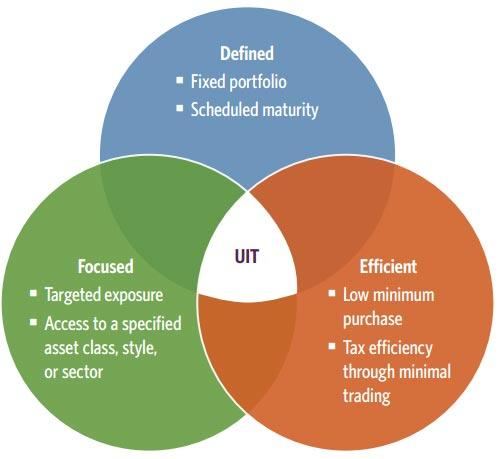

## Table of Contents

## What is a Unit Investment Trust (UIT)?

A Unit Investment Trust (UIT) is a type of investment company that offers a fixed portfolio of securities in a one-time public offering. Unlike mutual funds, UITs have a set number of units and a specific termination date, after which the trust is dissolved and the proceeds are returned to the investors. This structure makes UITs a good choice for people who want a simple, low-cost way to invest in a diversified set of assets without the ongoing management fees associated with mutual funds.

UITs can hold a variety of assets, such as stocks, bonds, or a mix of both. Once the trust is created, the portfolio remains mostly unchanged, except in cases where securities mature, are called, or default. This fixed nature of the portfolio can be appealing to investors who want predictability and transparency in their investments. However, because UITs are not actively managed, they may not adapt as quickly to changing market conditions as other investment vehicles.

## How does a UIT differ from mutual funds and ETFs?

A Unit Investment Trust (UIT) is different from mutual funds and ETFs in a few key ways. First, a UIT has a fixed portfolio that doesn't change much over time. Once it's set up, the mix of stocks or bonds stays the same until the UIT ends. Mutual funds and ETFs, on the other hand, are actively managed, which means their managers can buy and sell assets to try to do better than the market. This makes UITs simpler and more predictable, but they might not adapt as well to changes in the market.

Second, UITs have a set end date. They are created for a specific period, and when that time is up, the UIT is closed, and the money is given back to the investors. Mutual funds and ETFs don't have an end date; they keep going as long as people want to invest in them. This fixed term of UITs can be good for people who want to invest for a certain amount of time, but it's different from the ongoing nature of mutual funds and ETFs.

## What are the typical investment objectives of a UIT?

The main goal of a Unit Investment Trust (UIT) is to give investors a simple way to own a mix of stocks, bonds, or other assets without having to pick them themselves. UITs are set up to follow a certain plan, like focusing on income from bonds or growth from stocks. This makes them a good choice for people who want to invest in a way that matches their goals, like saving for retirement or getting regular income.

UITs also aim to be clear and easy to understand. Since the investments in a UIT don't change much after it's created, investors know exactly what they're getting into. This can be really helpful for people who want to invest without worrying about their money being moved around a lot. Plus, because UITs have a set end date, they can be a good fit for people who want to invest for a specific amount of time.

## How are UITs structured and what are their key features?

A Unit Investment Trust (UIT) is set up with a fixed set of investments, like stocks or bonds, that don't change much after it starts. When someone wants to invest in a UIT, they buy units of the trust, which are like shares. The trust is created for a certain amount of time, and when that time is up, the UIT ends, and the money is given back to the investors. This makes UITs different from mutual funds and ETFs, which keep going as long as people want to invest in them.

UITs are designed to be simple and clear. They have a set plan, like focusing on income from bonds or growth from stocks, which helps investors know what to expect. Because the investments in a UIT don't change much, it's easier for people to understand what they're investing in. This can be really helpful for people who want to invest without worrying about their money being moved around a lot. Plus, the fixed end date of a UIT can be good for people who want to invest for a specific amount of time.

## What are the benefits of investing in UITs for beginners?

Investing in Unit Investment Trusts (UITs) can be a great choice for beginners because they are simple and easy to understand. UITs have a fixed set of investments, like stocks or bonds, that don't change much after the trust starts. This means that when you invest in a UIT, you know exactly what you're getting into. It's like buying a basket of investments that stays the same until the UIT ends. This can be really helpful for beginners who might feel overwhelmed by the idea of [picking](/wiki/asset-class-picking) individual stocks or bonds.

Another benefit of UITs for beginners is that they have a set end date. This means you can invest in a UIT knowing that it will end at a certain time, and you'll get your money back then. This can be good for people who want to invest for a specific goal, like saving for a big purchase or planning for retirement. Plus, UITs often focus on a clear goal, like [earning](/wiki/earning-announcement) income from bonds or growing money from stocks, which makes it easier for beginners to choose an investment that matches what they want to achieve.

## How can UITs be used as part of a diversified investment strategy?

UITs can be a helpful part of a diversified investment strategy because they let you spread your money across different types of investments. For example, you might choose a UIT that focuses on bonds to get regular income, and another UIT that focuses on stocks to grow your money over time. By mixing different UITs, you can balance the risk and reward in your investment plan. This way, if one type of investment doesn't do well, the others might help make up for it.

Another way UITs can help with diversification is by offering a fixed set of investments that don't change much. This can be good if you want to invest in a certain area, like technology or healthcare, without having to pick individual stocks. By including UITs in your portfolio, you can get exposure to different sectors or types of assets, which can help reduce the overall risk of your investments. Plus, because UITs have a set end date, you can plan your investments to match your financial goals, like saving for a big purchase or retirement.

## What are the risks associated with UITs and how can they be mitigated?

Investing in UITs comes with some risks that you should know about. One big risk is that the value of the investments in the UIT can go up or down. Since UITs have a fixed set of investments that don't change much, if the market goes down, the value of your UIT might go down too. Another risk is that UITs have a set end date, so if you need your money before the UIT ends, you might have to sell your units at a lower price. Also, UITs might not be as flexible as other investments because they can't change their investments to adapt to new market conditions.

To lower these risks, you can take a few steps. First, make sure you understand the investments in the UIT and how they fit with your overall investment plan. If you're worried about the market going down, you might want to spread your money across different types of UITs, like some that focus on stocks and others that focus on bonds. This can help balance out the risk. If you're concerned about needing your money before the UIT ends, you could choose UITs with shorter terms or keep some of your money in more liquid investments, like a savings account. By thinking carefully about these risks and planning ahead, you can make UITs a safer part of your investment strategy.

## How do UITs fit into different investment strategies, such as income or growth?

UITs can be a good fit for people who want to focus on getting regular income from their investments. If you choose a UIT that invests in bonds, you can get regular interest payments, which can be a steady source of income. This can be helpful if you're retired or just want to have some money coming in regularly. Since UITs have a fixed set of investments, you know exactly what you're getting into, which can make it easier to plan for your income needs.

UITs can also work well for people who want to grow their money over time. If you pick a UIT that invests in stocks, you might see your investment grow as the stock prices go up. This can be a good choice if you're saving for a long-term goal, like buying a house or planning for retirement. Because UITs have a set end date, you can choose one that matches your timeline, which can help you stay on track with your growth goals.

## What should investors consider when selecting a UIT?

When picking a UIT, investors should first think about their investment goals. Are you looking for regular income, or do you want your money to grow over time? UITs can be set up to focus on either of these goals. If you want income, you might choose a UIT that invests in bonds, which can give you regular interest payments. If you're looking for growth, a UIT that invests in stocks might be a better fit. It's important to pick a UIT that matches what you want to achieve with your money.

Another thing to consider is how long you want to invest. UITs have a set end date, so you need to think about when you'll need your money back. If you need it soon, you might want a UIT with a shorter term. If you're saving for something far in the future, a longer-term UIT could work better. Also, think about the risks. Since UITs have a fixed set of investments, if the market goes down, the value of your UIT might go down too. Make sure you understand these risks and how they fit with your overall investment plan.

## How do the fees and expenses of UITs compare to other investment vehicles?

UITs usually have lower fees than mutual funds because they don't need to be managed as much. Once a UIT is set up, the investments don't change much, so there's less work for the people running it. This means you might pay less in management fees with a UIT. But, you'll still have to pay some fees, like the cost of setting up the UIT and any fees for buying or selling units. These fees can add up, so it's good to look at them carefully before you invest.

Compared to ETFs, UITs might have similar or slightly higher fees. ETFs can be cheaper because they often track an index and don't need a lot of active management. But, UITs can be a bit more expensive because they might need more work to set up and keep running. Still, the fees for UITs are usually clear and easy to understand, which can be helpful when you're trying to figure out how much your investment will cost you.

## What advanced strategies can experienced investors employ with UITs?

Experienced investors can use UITs in smart ways to make their investment plans better. One way is to use UITs to balance out the risk in their portfolio. They might pick UITs that focus on different things, like some that invest in stocks for growth and others that invest in bonds for income. By mixing these UITs, they can spread their money around and lower the chance that a big drop in one type of investment will hurt their whole plan. Another way is to use UITs with different end dates to match their financial goals. For example, they might choose a UIT that ends in a few years if they're saving for a big purchase, and another that ends in a longer time if they're planning for retirement.

Another strategy is to use UITs to get into specific parts of the market without having to pick individual stocks or bonds. Experienced investors might choose UITs that focus on certain sectors, like technology or healthcare, to add variety to their investments. This can help them take advantage of growth in these areas without having to do a lot of research on individual companies. Plus, because UITs are clear and easy to understand, experienced investors can use them to keep their investment plans simple and focused on their goals.

## How can UITs be used in tax planning and estate planning?

UITs can be a helpful tool for tax planning because they can offer some tax benefits. When you invest in a UIT, you might get regular income from the investments, like interest from bonds or dividends from stocks. This income can be taxed differently depending on where it comes from. For example, interest from municipal bonds in a UIT might be tax-free at the federal level, which can save you money on taxes. Also, because UITs have a set end date, you can plan when you'll get your money back and think about how that might affect your taxes. By choosing the right UITs, you can make your investment plan more tax-efficient.

UITs can also be useful in estate planning. If you want to leave money to your family or other people after you're gone, UITs can be a good way to do that. You can set up a UIT to end at a certain time, which can help you plan when your heirs will get the money. This can be helpful if you want to make sure they get the money at a time that works well for them, like when they're ready to buy a house or retire. Plus, because UITs are clear and easy to understand, they can make it simpler for your heirs to know what they're getting and how to handle it. By using UITs in your estate plan, you can make sure your money goes where you want it to, in a way that's easy for everyone involved.

## References & Further Reading

[1]: ["Advances in Financial Machine Learning"](https://www.amazon.com/Advances-Financial-Machine-Learning-Marcos/dp/1119482089) by Marcos Lopez de Prado

[2]: ["Evidence-Based Technical Analysis: Applying the Scientific Method and Statistical Inference to Trading Signals"](https://www.semanticscholar.org/paper/Evidence-Based-Technical-Analysis%3A-Applying-the-and-Aronson/3b33df8737f1772e9e14d66a08c9696f140a2ee1) by David Aronson

[3]: ["Machine Learning for Algorithmic Trading"](https://github.com/PacktPublishing/Machine-Learning-for-Algorithmic-Trading-Second-Edition) by Stefan Jansen

[4]: ["Quantitative Trading: How to Build Your Own Algorithmic Trading Business"](https://books.google.com/books/about/Quantitative_Trading.html?id=j70yEAAAQBAJ) by Ernest P. Chan

[5]: Bergstra, J., Bardenet, R., Bengio, Y., & Kégl, B. (2011). ["Algorithms for Hyper-Parameter Optimization."](https://dl.acm.org/doi/10.5555/2986459.2986743) Advances in Neural Information Processing Systems 24.

[6]: Aldridge, Irene. ["High-Frequency Trading: A Practical Guide to Algorithmic Strategies and Trading Systems."](https://www.amazon.com/High-Frequency-Trading-Practical-Algorithmic-Strategies/dp/1118343506)  

[7]: Silver, N. (2012). ["The Signal and the Noise: Why So Many Predictions Fail – but Some Don't."](https://www.amazon.com/Signal-Noise-Many-Predictions-Fail-but/dp/0143125087)

[8]: Harris, L. (2002). ["Trading and Exchanges: Market Microstructure for Practitioners."](https://books.google.com/books/about/Trading_and_Exchanges.html?id=Rd9hDRR1Yx4C)

[9]: ["Interactive Brokers API"](https://www.interactivebrokers.com/campus/ibkr-api-page/ibkr-api-home/) - Official documentation for Interactive Brokers API, providing tools for automated trading.