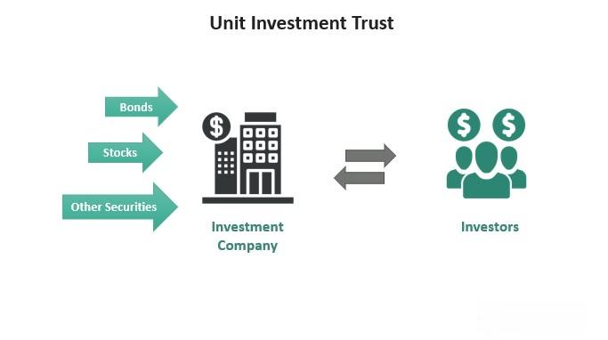

Unit Investment Trusts (UITs) are professionally managed, fixed portfolios of stocks, bonds, or other securities that maintain a static composition for a specified term. Unlike mutual funds or exchange-traded funds (ETFs), UITs are not actively managed; their portfolios remain unchanged throughout their predetermined life span. This unique characteristic provides investors with predictability and transparency, making UITs a distinct choice for diversification and professional management within investment portfolios.

Recently, algorithmic trading has garnered significant interest due to its ability to optimize trading strategies using computer algorithms. Its application to various investment vehicles, including UITs, has been a subject of growing curiosity among investors and financial analysts alike. Algorithmic trading offers benefits such as increased trading speed, precision, and the capacity to analyze and act upon vast datasets, thus enhancing traditional investment strategies.



This article aims to explore the integration of UITs with algorithmic trading strategies, focusing on the potential benefits of such a combination. We seek to uncover strategies that leverage algorithmic trading's capabilities while maintaining the structured investment approach of UITs. Such strategies may offer enhanced returns, improved risk-adjusted performance, and efficient portfolio management. As the financial markets increasingly demand automated solutions, understanding the synergy between UITs and algorithmic trading can present innovative investment opportunities.

The structure of this article is as follows: We will begin by understanding UITs, discussing their nature, advantages, and associated risks. Then, we will examine the rise of algorithmic trading, its benefits, and related strategies. Following that, we will explore specific strategies for integrating UITs with algorithmic trading, assess the technological tools required for implementation, and discuss the risks and considerations of this innovative approach. Finally, we will conclude with insights into future trends and guidance for investors considering this investment strategy.

## Table of Contents

## Understanding Unit Investment Trusts (UITs)

Unit Investment Trusts (UITs) constitute a unique category of investment vehicles characterized by their fixed portfolio and predetermined lifespan. Unlike mutual funds, which are actively managed and engage in continuous buying and selling of securities, UITs maintain a static portfolio composition throughout their term. This structure means that once the securities within UITs are selected, they remain unchanged until the trust reaches its maturity date. Exchange-Traded Funds (ETFs), on the other hand, although passively managed like UITs, are traded actively on stock exchanges and offer more liquidity and versatility in their buying and selling mechanisms.

Investments in UITs come with several advantages. Primarily, they offer diversification, as a single UIT can hold a collection of different asset classes such as stocks, bonds, or real estate. This variety helps spread risk across the assets, potentially reducing the overall volatility of an investor’s portfolio. Unlike self-managed portfolios, UITs benefit from professional management during their setup phase, where experienced managers select the securities based on defined investment criteria. This aspect provides investors with a degree of professional oversight without the need for ongoing management fees, as seen with mutual funds.

The operational framework of a UIT is straightforward: investors purchase units of the trust, which gives them proportional ownership of the underlying assets. The fixed nature of the portfolio means that investors have a clear understanding of what they are investing in at the start, and can align their expectations with the predefined term of the UIT, which typically ranges from 13 months to several years. Upon reaching maturity, the UIT is dissolved, and the proceeds from the sale of the assets are distributed to the investors.

UITs commonly include a diverse array of assets. Stocks are a prominent feature, selected to align with specific market sectors or indices. Bonds form another critical component, often providing a steady income through interest payments. Some UITs may also invest in real estate assets, offering potential for capital appreciation and income. Each UIT is designed with a particular investment goal, such as income generation or capital growth, which dictates its asset composition.

Despite these advantages, there are inherent risks associated with investing in UITs. The fixed nature of the portfolio could either be a benefit or a detriment, depending on market conditions. Since the portfolio is not actively managed, it remains exposed to market [volatility](/wiki/volatility-trading-strategies) without the flexibility to adjust to changing economic circumstances. Additionally, the trust must be purchased and sold with markup and markdown fees, respectively, which can impact returns. Investors should thoroughly understand these risks and consider them against their financial goals before investing in UITs.

## The Rise of Algorithmic Trading

Algorithmic trading, often referred to as algo trading, involves the use of computer algorithms to automate trading decisions. These algorithms are mathematical models based on predefined sets of rules to execute trades systematically. The practice has become an integral part of the modern financial ecosystem, significantly transforming the way trading is conducted across various asset classes.

### Benefits of Algorithmic Trading

The primary benefits of [algorithmic trading](/wiki/algorithmic-trading) are speed, precision, and the capability to process and analyze large volumes of data. Algorithms can execute orders at speeds much faster than any human trader, often within milliseconds. This speed can be crucial in capturing profits from small price differences that exist for only fractions of a second. 

Moreover, algorithmic trading eliminates the emotional and psychological biases that often affect human traders. It allows for precision in buying and selling, adhering strictly to the algorithm's rules without deviation. Finally, the ability to process vast amounts of data in real-time gives these algorithms an edge in identifying patterns or opportunities that are imperceptible to human traders. This capability is crucial for strategies such as high-frequency trading and statistical [arbitrage](/wiki/arbitrage).

### Types of Algorithmic Trading Strategies

There are several strategies employed in algorithmic trading, each serving different market needs:

1. **Statistical Arbitrage**: This involves the use of complex statistical models to trade assets that are mispriced relative to each other. Traders exploit the mean-reverting behavior of asset prices to achieve a profit.

2. **Trend Following**: As the name suggests, this strategy focuses on taking positions in assets that are trending in a particular direction, either upward or downward. The algorithm identifies trends based on historical price data and other indicators.

3. **Market Making**: This strategy provides liquidity to the market by placing simultaneous buy and sell orders. The trader profits from the bid-ask spread, ensuring that there is a steady flow of trades in the market.

### Evolution of Algo Trading

Algorithmic trading has evolved significantly, driven by advancements in technology and increased accessibility for retail investors. The advent of powerful computing technology and sophisticated algorithms has facilitated the rise of high-frequency trading, where trades are executed in microseconds. Furthermore, the proliferation of [machine learning](/wiki/machine-learning) and [artificial intelligence](/wiki/ai-artificial-intelligence) has opened new frontiers in predictive analytics, allowing for more nuanced trading strategies that adapt in real-time to market changes.

The rise of online trading platforms and APIs has democratized access to algorithmic trading, enabling retail investors to develop and deploy their own trading algorithms. This has leveled the playing field to some extent, allowing individual traders to compete with larger institutional players.

### Ethical and Regulatory Considerations

Despite its advantages, algorithmic trading raises ethical and regulatory concerns. High-frequency trading, in particular, can lead to market instability, as evidenced by events like the Flash Crash of 2010. Regulatory bodies, such as the Securities and Exchange Commission (SEC) in the United States, have established rules to mitigate risks associated with algo trading, including circuit breakers and stringent disclosure requirements.

Additionally, the use of algorithms poses ethical challenges, particularly concerning market fairness and transparency. There is a persistent debate about whether high-frequency traders have an unfair advantage and whether their activities align with the principles of a fair and orderly market.

In conclusion, algorithmic trading plays a significant role in modern finance, offering unparalleled advantages in speed, accuracy, and data processing. While it presents numerous opportunities, it also necessitates careful consideration of ethical and regulatory implications to ensure sustainable and fair market environments.

## Integrating UITs and Algorithmic Trading: Strategies and Benefits

Unit Investment Trusts (UITs) and algorithmic trading, when combined, offer a powerful synergy for investors seeking both stability and the benefits of automation in trading. This integration focuses on leveraging the fixed, diversified nature of UITs along with the precision and efficiency of algorithms.

**Strategies for Applying Algorithmic Trading to UIT Investments**

1. **Market Timing**: Algorithms can be employed to identify optimal entry and exit points for UITs within the market. By analyzing historical and real-time data, these algorithms aim to maximize profits through precise timing strategies. For example, momentum-based algorithms may suggest trading UITs when specific trends are detected, potentially leading to enhanced returns. A simple momentum strategy can be implemented in Python as follows:

   ```python
   def moving_average(data, window_size):
       return data.rolling(window=window_size).mean()

   def momentum_strategy(data, short_window, long_window):
       short_ma = moving_average(data['price'], short_window)
       long_ma = moving_average(data['price'], long_window)
       signals = (short_ma > long_ma).astype(int)
       return signals
   ```

2. **Asset Allocation Adjustments**: Algorithmic models can assist in dynamically adjusting the asset composition within UITs to better align with changing market conditions. This involves rebalancing the portfolio more frequently than typical UITs might allow, thereby maintaining an optimal risk-return profile.

3. **Risk Management**: Algorithms can be programmed to impose strict risk controls, such as stop-loss orders or hedging strategies, to protect against substantial losses. This automated risk management ensures that portfolios are consistently aligned with the investor's risk tolerance, which is crucial given the fixed nature of UITs.

**Potential Benefits**

- **Enhanced Returns**: By efficiently capitalizing on market opportunities through timely trades, investors can potentially achieve superior returns compared to traditional static UIT investments.
- **Improved Risk-Adjusted Performance**: The integration allows for real-time adjustments that optimize the risk-return ratio, enhancing the overall performance of the investment portfolio.
- **Efficient Portfolio Rebalancing**: Automation facilitates rapid and efficient rebalancing processes that would otherwise be time-consuming and prone to human error.

**Case Studies and Examples**

Integrating UITs with algorithmic trading has seen success in various scenario applications. One notable instance is in fixed-income UITs, where algorithms helped optimize bond selection based on [interest rate](/wiki/interest-rate-trading-strategies) movements, ultimately leading to increased yields without significantly elevating risks.

**Challenges and Limitations**

However, implementing these strategies does come with certain challenges:

- **Complexity and Costs**: Developing and maintaining algorithmic trading systems requires technical expertise and can be costly, potentially reducing net returns.
- **Overfitting and Model Bias**: Algorithms risk being overly reliant on past data, leading to patterns that may not hold in future markets. Investors need to be wary of overfitting their models to historical data.
- **Regulatory Compliance**: Algorithms, especially those influencing UITs, must adhere to strict regulatory guidelines, which can vary significantly across jurisdictions. Ensuring compliance while maintaining strategy effectiveness is a delicate balance.

In conclusion, while the fusion of UITs with algorithmic trading offers promising advantages, investors should carefully consider these challenges. Proper implementation and continuous evaluation are key to successfully unlocking the potential of this investment approach.

## Technological Tools and Platforms

Technological tools are paramount for algorithmic trading when applied to Unit Investment Trusts (UITs). These tools facilitate the execution and management of trading strategies, offering a range of functionalities that cater to both retail and institutional investors. Platforms such as MetaTrader, QuantConnect, and [Interactive Brokers](/wiki/interactive-brokers-api) are widely used, providing essential features like automated trading, data analysis, and strategy development environments.

MetaTrader, particularly MetaTrader 4 and MetaTrader 5, is popular among retail traders for its user-friendly interface and robust scripting language (MQL) that enables custom algorithm development. QuantConnect, a cloud-based algorithmic trading platform, supports multiple languages, including Python, and offers extensive libraries for data manipulation and strategy testing. Interactive Brokers caters to both retail and institutional investors, offering a comprehensive API that allows for advanced trading strategies and integration with custom software.

Data analytics and artificial intelligence (AI) are integral to enhancing algorithmic trading with UITs. By leveraging large data sets and machine learning algorithms, traders can better identify patterns and predict market movements. For instance, sentiment analysis can be performed using natural language processing (NLP) techniques on news articles and social media feeds to gauge market sentiment. Machine learning models, such as neural networks, can be trained to optimize trading strategies over time, potentially improving accuracy and profitability.

Backtesting and simulation tools are critical in developing robust trading strategies. These tools allow traders to test their algorithms on historical data, ensuring that strategies are viable under various market conditions before live deployment. Platforms like QuantConnect provide extensive [backtesting](/wiki/backtesting) capabilities with access to historical data across different asset classes. This historical perspective helps identify potential weaknesses in strategies and provides insights into possible improvements.

Choosing the right technology stack is crucial and should align with an investor's goals and expertise. For beginners, platforms with user-friendly interfaces and strong community support, such as MetaTrader and QuantConnect, are advisable. More experienced traders, especially those familiar with programming, might prefer customizable environments like Interactive Brokers' API, which allows for more sophisticated strategy development and integration with existing systems.

In conclusion, the choice of technological tools and platforms significantly impacts the effectiveness of algorithmic trading strategies applied to UITs. By selecting the appropriate technology stack, traders can enhance their ability to analyze data, test strategies, and execute trades efficiently, thereby maximizing their potential for success in the financial markets.

## Risks and Considerations

Algorithmic trading introduces various risks that can significantly impact Unit Investment Trust (UIT) investments. One primary concern is overfitting, a common pitfall where trading models are excessively tailored to historical data. This customization results in a model that performs well on past data but poorly on future, unseen data due to low generalizability. This can be mitigated by using techniques such as cross-validation, where a dataset is split into training and validation sets to test the model's prediction accuracy.

Model bias is another challenge, where algorithms can be unintentionally influenced by the biases inherent in the data, leading to skewed decision-making processes. To reduce model bias, ensuring that input data is comprehensive and representative of different market conditions is essential. Employing techniques like regularization, which penalizes complex models, can also help in minimizing bias.

The regulatory landscape for algorithmic trading is complex and constantly evolving. Compliance with regulations is crucial, especially when integrating algorithms within UIT frameworks. Key considerations include ensuring the transparency of algorithms and having robust audit trails to track decisions made by automated systems. Regulatory bodies, such as the Securities and Exchange Commission (SEC) in the United States, often require detailed reporting on trading activities and may impose restrictions on the types of algorithms that can be used.

Risk management and mitigation strategies are vital for safely incorporating algorithmic trading into UITs. Diversification is a foundational approach, spreading investments across various assets to minimize exposure to any single source of risk. This ensures that poor performance in one area can be offset by gains in another. Stop-loss mechanisms are also employed to protect against significant losses. This involves setting a predetermined price at which assets are automatically sold to prevent further decline.

Continuous monitoring and strategy evaluation are essential to maintain the efficacy of algorithmic trading strategies within UITs. Market conditions change rapidly, and algorithms must be consistently updated and tested against these new environments. Backtesting, simulating trading strategies on historical data, can be beneficial for understanding potential outcomes and refining models. Performance metrics, such as Sharpe ratio and drawdown, should be regularly assessed to ensure alignment with investment goals.

```python
# Example of a simple moving average crossover strategy in Python for backtesting purposes
import pandas as pd
import numpy as np

# Load historical data
data = pd.read_csv('historical_data.csv')

# Calculate moving averages
data['SMA_50'] = data['Close'].rolling(window=50).mean()
data['SMA_200'] = data['Close'].rolling(window=200).mean()

# Create a trading signal
data['Signal'] = 0
data.loc[data['SMA_50'] > data['SMA_200'], 'Signal'] = 1
data.loc[data['SMA_50'] < data['SMA_200'], 'Signal'] = -1

# Calculate returns
data['Returns'] = np.log(data['Close'] / data['Close'].shift(1))
data['Strategy_Returns'] = data['Signal'].shift(1) * data['Returns']

# Calculate cumulative returns
cumulative_strategy_returns = data['Strategy_Returns'].cumsum().apply(np.exp)
cumulative_market_returns = data['Returns'].cumsum().apply(np.exp)

# Plot Returns
import matplotlib.pyplot as plt

plt.figure(figsize=(14, 7))
plt.plot(data.index, cumulative_strategy_returns, label='Strategy Returns')
plt.plot(data.index, cumulative_market_returns, label='Market Returns')
plt.legend(loc='best')
plt.show()
```

This code provides a basic framework for implementing and backtesting a simple trading strategy using moving averages. Continuous evaluation of strategies like this ensures that they remain effective in varying market conditions. Selecting the appropriate strategies and continuously refining them can maximize the potential benefits of algorithmic trading when integrated with UITs.

## Conclusion

The integration of Unit Investment Trusts (UITs) with algorithmic trading strategies presents a promising frontier in the investment landscape. By converging traditional investment vehicles with cutting-edge technology, investors can potentially achieve enhanced returns, improved risk management, and efficient portfolio management. Algorithmic trading offers advantages such as speed, precision, and the ability to process vast amounts of data, enabling smarter and more dynamic approaches to managing UIT portfolios.

Investors considering this strategy should emphasize thorough research and seek guidance from financial advisors to navigate the complexities involved. This dual approach ensures informed decisions and alignment with individual investment goals and risk tolerance. As the financial markets evolve, the synergy between UITs and algorithmic trading is likely to grow, driven by technological advancements and increased accessibility for investors.

Looking forward, the future of this innovative investment strategy appears robust, with trends indicating a shift towards more automation and data-driven decision-making in the financial sector. As such, those interested in exploring these opportunities are encouraged to engage with the tools and platforms available, ensuring they are well-prepared to capitalize on the potential benefits.

In conclusion, as technology continues to transform the financial landscape, the integration of UITs with algorithmic trading is positioned as a strategic innovation. Investors are invited to consider this approach, exploring its potential to deliver on the promise of superior investment outcomes.

## References & Further Reading

[1]: ["Advances in Financial Machine Learning"](https://www.amazon.com/Advances-Financial-Machine-Learning-Marcos/dp/1119482089) by Marcos Lopez de Prado

[2]: ["Evidence-Based Technical Analysis: Applying the Scientific Method and Statistical Inference to Trading Signals"](https://www.semanticscholar.org/paper/Evidence-Based-Technical-Analysis%3A-Applying-the-and-Aronson/3b33df8737f1772e9e14d66a08c9696f140a2ee1) by David Aronson

[3]: ["Machine Learning for Algorithmic Trading"](https://github.com/PacktPublishing/Machine-Learning-for-Algorithmic-Trading-Second-Edition) by Stefan Jansen

[4]: ["Quantitative Trading: How to Build Your Own Algorithmic Trading Business"](https://books.google.com/books/about/Quantitative_Trading.html?id=j70yEAAAQBAJ) by Ernest P. Chan

[5]: Bergstra, J., Bardenet, R., Bengio, Y., & Kégl, B. (2011). ["Algorithms for Hyper-Parameter Optimization."](https://dl.acm.org/doi/10.5555/2986459.2986743) Advances in Neural Information Processing Systems 24.

[6]: Aldridge, Irene. ["High-Frequency Trading: A Practical Guide to Algorithmic Strategies and Trading Systems."](https://www.amazon.com/High-Frequency-Trading-Practical-Algorithmic-Strategies/dp/1118343506)  

[7]: Silver, N. (2012). ["The Signal and the Noise: Why So Many Predictions Fail – but Some Don't."](https://www.amazon.com/Signal-Noise-Many-Predictions-Fail-but/dp/0143125087)

[8]: Harris, L. (2002). ["Trading and Exchanges: Market Microstructure for Practitioners."](https://books.google.com/books/about/Trading_and_Exchanges.html?id=Rd9hDRR1Yx4C)

[9]: ["Interactive Brokers API"](https://www.interactivebrokers.com/campus/ibkr-api-page/ibkr-api-home/) - Official documentation for Interactive Brokers API, providing tools for automated trading.