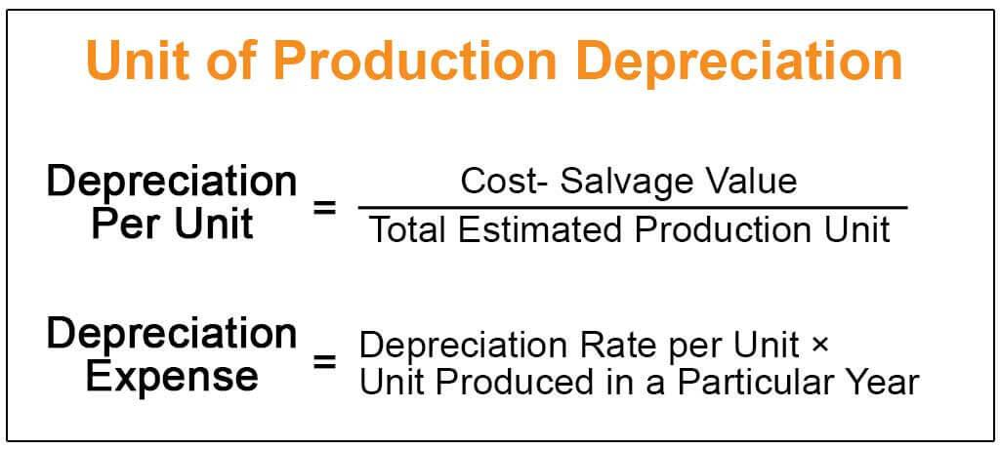

## Table of Contents

## What is the Unit of Production Method?

The Unit of Production Method is a way to figure out how much an asset, like a machine, has used up over time. Instead of guessing how long the machine will last, this method looks at how much the machine actually does. For example, if a machine can make 100,000 items before it wears out, and it made 10,000 items this year, then it used up 10% of its life this year.

This method is really useful for businesses that want to match the cost of their machines to how much they are actually using them. It's different from other methods that might just spread the cost evenly over time, no matter how much the machine is used. By using the Unit of Production Method, a business can get a better idea of the true cost of making their products, which can help them make smarter decisions about buying new machines or keeping old ones.

## How does the Unit of Production Method differ from other depreciation methods?

The Unit of Production Method is different from other depreciation methods because it focuses on how much an asset is actually used, rather than just how old it is. For example, with the Straight-Line Method, you spread the cost of an asset evenly over its expected life. So, if a machine costs $10,000 and is expected to last 10 years, you'd say it loses $1,000 of value each year, no matter how much you use it. But with the Unit of Production Method, if that same machine makes more products one year, it would be considered to have used up more of its value that year.

Another common method is the Declining Balance Method, which speeds up depreciation at the beginning of an asset's life. It assumes the asset loses more value early on, so you might write off a bigger chunk of its cost in the first few years. This is different from the Unit of Production Method, which doesn't care about time as much as it cares about usage. If a machine is used a lot in its early years, the Unit of Production Method would show more depreciation then, but if it's used less later on, the depreciation would be lower, matching the actual wear and tear on the machine.

In summary, the Unit of Production Method stands out because it ties depreciation directly to how much an asset is used, rather than just its age or a fixed schedule. This makes it a good choice for businesses where the use of an asset can vary a lot from year to year, allowing them to more accurately match the cost of the asset to the revenue it helps generate.

## What types of assets are best suited for the Unit of Production Method?

The Unit of Production Method works best for assets that wear out based on how much they are used, not just how old they are. This method is great for machines or equipment that make products. For example, if you have a printing press that prints [books](/wiki/algo-trading-books), the more books it prints, the more it wears out. Using the Unit of Production Method, you can match the cost of the printing press to how many books it actually prints, which makes sense for figuring out the true cost of making those books.

This method is also good for things like mining equipment or vehicles that deliver goods. If you have a truck that drives a lot of miles to deliver stuff, it's going to wear out faster than if it just sits in the garage. With the Unit of Production Method, you can figure out how much the truck has been used by counting the miles it drives, and then spread out its cost based on those miles. This helps businesses see the real cost of using their trucks and can help them decide when it's time to get a new one.

## What is the formula for calculating depreciation using the Unit of Production Method?

The formula for calculating depreciation using the Unit of Production Method is pretty straightforward. You start by figuring out how much the asset cost and how many units it can produce over its whole life. Then, you look at how many units it actually produced in a certain period, like a year. The depreciation for that period is calculated by dividing the total cost of the asset by the total units it can produce, and then multiplying that by the number of units produced in the period.

For example, if a machine cost $50,000 and can produce 250,000 units over its life, the cost per unit would be $50,000 divided by 250,000, which is $0.20 per unit. If in one year, the machine produced 50,000 units, the depreciation for that year would be 50,000 units times $0.20 per unit, which equals $10,000. This way, the depreciation matches how much the machine was actually used, not just how old it is.

## How do you determine the total units of production for an asset?

To figure out the total units of production for an asset, you need to look at how it's used and what it's meant to do. If you have a machine that makes parts, you might talk to the people who made the machine or look at the manual to see how many parts it can make before it wears out. Sometimes, you might also use past experience or industry standards to guess how long the machine will last and how many units it can produce.

Once you have a good idea of how many units the asset can produce over its life, you can use that number in the Unit of Production Method. It's important to be as accurate as possible because this number helps you figure out how much the asset is worth as it gets used up. If you're not sure, it's better to be a bit careful and maybe use a lower number, so you don't end up thinking the machine is worth more than it really is as it gets older.

## Can you explain the steps to apply the Unit of Production Method in depreciation?

To apply the Unit of Production Method for depreciation, you first need to figure out the total cost of the asset. This includes the price you paid for it and any other costs to get it ready to use, like delivery or setup fees. Next, you need to estimate how many units the asset can produce over its whole life. You can do this by looking at the manufacturer's information, past experience, or industry standards. Once you know the total cost and the total units of production, you can find the cost per unit by dividing the total cost by the total units.

After you have the cost per unit, you track how many units the asset actually produces in a given period, like a year. To find out the depreciation for that period, you multiply the number of units produced by the cost per unit. This gives you the amount of depreciation for that period. As the asset keeps working and producing more units, you keep doing this calculation to see how much value it's losing based on how much it's being used. This way, the depreciation matches the actual wear and tear on the asset, which can be more accurate than just guessing based on time.

## What are the advantages of using the Unit of Production Method for depreciation?

The Unit of Production Method has some big advantages for businesses. One main advantage is that it matches the cost of using an asset to how much it's actually being used. This means if a machine is working hard and making a lot of products one year, the cost of using it will be higher that year. This can help businesses see the real cost of making their products, which can lead to better decisions about when to buy new machines or keep old ones.

Another advantage is that this method can be more accurate than other ways of figuring out depreciation. Instead of just guessing how long an asset will last and spreading its cost evenly over time, the Unit of Production Method looks at how much the asset is actually doing. This can be really helpful for things like machines or vehicles that wear out based on how much they're used, not just how old they are. By using this method, businesses can get a clearer picture of what their assets are really worth as they get used up.

## What are the potential disadvantages or limitations of the Unit of Production Method?

One big downside of the Unit of Production Method is that it can be hard to figure out how many units an asset can make over its whole life. This number is really important because it helps you figure out how much the asset is worth as it gets used up. If you guess wrong, you might end up thinking the asset is worth more or less than it really is. This can make it tough to know the true cost of making things and can lead to bad decisions about when to buy new machines or keep old ones.

Another problem is that this method needs a lot of tracking and record-keeping. You have to keep track of how many units the asset makes every period, which can take a lot of time and effort. If you don't keep good records, you might mess up the depreciation calculation. This can be a big hassle for small businesses or for assets that are used in a way that's hard to measure, like a truck that's used for different kinds of jobs.

## How does the Unit of Production Method affect financial statements?

The Unit of Production Method changes how a business shows the value of its assets and the costs of making things on its financial statements. When you use this method, the cost of an asset like a machine is spread out over the units it makes, not just the years it's used. This means that if a machine makes a lot of products one year, the cost shown on the income statement for that year will be higher. This can make the profits look lower for that year because more of the machine's cost is taken away from the money the business made.

On the balance sheet, the value of the asset goes down faster when it's used a lot. This can make the total value of the business's assets look lower if the machines are working hard. But it also gives a more accurate picture of what the machines are really worth because it matches the cost to how much they're actually being used. This can help people who look at the financial statements understand the true cost of making things and how the business is doing.

## How can changes in production levels impact depreciation expense under this method?

Changes in production levels can really change how much depreciation expense a business shows when using the Unit of Production Method. If a machine makes more stuff in a year, the depreciation expense for that year goes up. This is because the cost of the machine is spread out over the units it makes, so making more units means more of the cost is used up that year. On the other hand, if the machine makes less stuff, the depreciation expense goes down because less of the cost is being used up.

This can be really helpful for businesses that have times when they make more or less stuff. For example, if a company makes more products during the busy holiday season, the depreciation expense will be higher during that time. This matches the cost of using the machine to the money the business makes from selling those extra products. But it also means that the business needs to keep good records of how much the machine is used, so they can figure out the right amount of depreciation expense every time.

## What adjustments might be necessary if the estimated total units of production change?

If the estimated total units of production for an asset changes, you'll need to make some adjustments to how you figure out depreciation. Let's say you thought a machine could make 100,000 units over its life, but now you think it can only make 80,000. You would need to change the cost per unit. Instead of dividing the total cost by 100,000, you'd divide it by 80,000. This means the cost per unit goes up, so the depreciation expense for each unit the machine makes will be higher from now on.

These changes can affect the financial statements of the business. If the cost per unit goes up, the depreciation expense on the income statement will be higher for the units made after the change. This can make the profits look lower for those periods. On the balance sheet, the value of the machine will go down faster because each unit it makes now costs more in terms of depreciation. It's important to keep an eye on these estimates and make adjustments when needed to keep the financial statements accurate.

## How does the Unit of Production Method comply with different accounting standards like GAAP and IFRS?

The Unit of Production Method is okay to use under both GAAP (Generally Accepted Accounting Principles) and IFRS (International Financial Reporting Standards). Both sets of rules say that you can use this method to figure out depreciation as long as it matches the way the asset loses value. The key is to make sure you're being fair and clear about how you're figuring out the total units of production and the cost per unit. If you can do that, then using this method will be in line with what GAAP and IFRS expect.

One thing to keep in mind is that both GAAP and IFRS want you to review your estimates from time to time. If you find out that the machine can make more or fewer units than you thought, you need to change your calculations. This keeps your financial statements honest and accurate. So, as long as you're keeping good records and making adjustments when needed, the Unit of Production Method will fit well with these accounting standards.

## What are the different methods for understanding depreciation?

Depreciation is the process of allocating the cost of a tangible asset over its useful life, representing its gradual decline in value due to factors such as wear and tear, technological obsolescence, or market conditions. This allocation is an essential aspect of both accounting and financial analysis, as it reflects the decreasing utility and economic value of assets over time on financial statements.

Several common methods are used to calculate depreciation, each offering distinct benefits depending on the nature of the asset and the financial reporting goals:

1. **Straight-Line Method**: This is the most straightforward method, where the asset’s cost is spread evenly over its useful life. The formula can be expressed as:
$$
   \text{Depreciation Expense} = \frac{\text{Cost} - \text{Salvage Value}}{\text{Useful Life}}

$$
   This method is advantageous for its simplicity and is typically applied to assets whose benefits are consumed at a steady rate over time.

2. **Declining Balance Method**: This accelerated method results in higher depreciation expenses in the earlier years of an asset’s life. It reflects the higher potential for obsolescence at the beginning stages. The calculation involves applying a fixed depreciation rate to the asset's remaining book value each year. It is often used for assets that rapidly lose value early on, such as technology or vehicles.

3. **Units of Production Method**: This method links depreciation expenses directly to the production output or usage of an asset, making it particularly suitable for machinery and equipment. Under this method, depreciation is calculated based on actual usage, which may vary from year to year. The formula for this method is:
$$
   \text{Depreciation Expense} = \left( \frac{\text{Original Value} - \text{Salvage Value}}{\text{Estimated Production Capability}} \right) \times \text{Units Produced}

$$
   This approach ensures that depreciation reflects the wear and tear associated with direct asset utilization, providing a more accurate portrayal of an asset’s operational reality.

Selecting the appropriate depreciation method is critical, as it directly affects an organization's financial reporting and asset management strategies. The choice of method not only influences income tax calculations and compliance but also impacts decisions regarding capital budgeting, asset replacement, and investment analysis. By aligning depreciation strategy with the operational and financial characteristics of the business, organizations can achieve more precise and meaningful financial insights.

## What is the Unit of Production Depreciation Formula?

The Unit of Production Depreciation is a method that ties the depreciation expense of an asset to its actual usage, making it particularly useful for machinery and equipment whose value diminishes based on operational output rather than time alone. The formula for calculating depreciation expense under this method is expressed as:

$$
\text{Depreciation Expense} = \left(\frac{\text{Original Value} - \text{Salvage Value}}{\text{Estimated Production Capability}}\right) \times \text{Units Produced}
$$

Where:
- **Original Value** is the initial cost of the asset.
- **Salvage Value** represents the estimated residual value of the asset at the end of its useful life.
- **Estimated Production Capability** is the total expected productive output of the asset over its useful life.
- **Units Produced** is the actual number of units produced during the period.

This depreciation method aligns the expense more closely with the asset's actual use, providing a more accurate reflection of its consumption during periods of high production. Consequently, companies can depreciate more in periods of higher production, closely matching expenses with revenue, which can better inform management decisions and financial analysis.

The Unit of Production method is especially ideal for industries where usage—and thus wear and tear—fluctuates from year to year. This approach not only promotes financial accuracy but also aligns resources and operational strategies according to asset utilization patterns.

## How can depreciation be applied in trading models according to the case study?

In a hypothetical scenario, consider a [hedge fund](/wiki/hedge-fund-trading-strategies) that leverages the unit of production depreciation method within its trading models to refine its asset valuation strategy. The fund's primary objective is to dynamically adjust asset valuations to reflect real-time production levels and associated depreciation. This approach is especially relevant for assets whose utility and wear correlate directly with operational activity, such as machinery in manufacturing sectors or digital equipment in data-intensive industries.

### Dynamic Adjustment of Asset Valuations

The hedge fund employs a dynamic valuation model whereby the asset's book value is periodically updated based on production metrics. Consider the formula for unit of production depreciation:

$$

\text{Depreciation Expense} = \left(\frac{\text{Original Value} - \text{Salvage Value}}{\text{Estimated Production Capability}}\right) \times \text{Units Produced}
$$

In this model, assets that have a high output in a given period face higher depreciation expenses, thus reducing their book value more sharply. This dynamic update inevitably affects the fund's balance sheets and informs investment decisions.

### Trading Precision and Risk Mitigation

By integrating such depreciation metrics into its algorithmic strategies, the fund can achieve a few distinct outcomes:

1. **Improved Trading Precision**: With asset values reflecting real-world usage, trading algorithms can better estimate the fair market value, ensuring buy and sell signals are grounded in realistic valuations, thus reducing potential discrepancies caused by static assessments.

2. **Enhanced Data Integration**: Incorporating real-time production data into trading models allows for a nuanced understanding of asset wear, leading to more precise forecasts on asset lifecycles and their impact on financial statements.

3. **Risk Management**: Dynamic adjustments in depreciation can mitigate risks associated with overvaluation or underestimation of asset conditions, shielding the hedge fund from unexpected liabilities stemming from asset impairments.

### Python Integration Example

A simplified Python script might illustrate how such a dynamic system could be implemented:

```python
class Asset:
    def __init__(self, original_value, salvage_value, estimated_production_capability):
        self.original_value = original_value
        self.salvage_value = salvage_value
        self.estimated_production_capability = estimated_production_capability
        self.book_value = original_value

    def update_depreciation(self, units_produced):
        depreciation_expense = ((self.original_value - self.salvage_value) /
                                self.estimated_production_capability) * units_produced
        self.book_value -= depreciation_expense
        return depreciation_expense

# Example usage
asset = Asset(original_value=50000, salvage_value=5000, estimated_production_capability=10000)
current_units = 1500  # units produced in the current period
depreciation = asset.update_depreciation(current_units)
print(f"Updated Depreciation: {depreciation}, New Book Value: {asset.book_value}")
```

### Conclusion

By employing units of production depreciation, the hypothetical hedge fund benefits from trading models that align closer with the real-time conditions of their assets. This integration not only fine-tunes asset valuations but also enhances overall trading strategy resilience by accounting for the true economic wear of assets over time.

## References & Further Reading

[1]: Damodaran, A. (2012). ["Investment Valuation: Tools and Techniques for Determining the Value of Any Asset."](https://books.google.com/books/about/Investment_Valuation.html?id=5SRHAAAAQBAJ) John Wiley & Sons.

[2]: Fabozzi, F. J., Focardi, S. M., & Fabozzi, T. (2010). ["Quantitative Equity Investing: Techniques and Strategies."](https://www.semanticscholar.org/paper/Quantitative-Equity-Investing%3A-Techniques-and-Fabozzi-Focardi/1c49a2a53919f7e65cb96f16691b8ff726fd3cd7) John Wiley & Sons.

[3]: Pinedo, M. L. (2009). ["Scheduling: Theory, Algorithms, and Systems."](https://link.springer.com/book/10.1007/978-3-031-05921-6) Springer.

[4]: Hull, J. C. (2017). ["Options, Futures, and Other Derivatives."](https://www.semanticscholar.org/paper/Options%2C-Futures%2C-and-Other-Derivatives-Hull/89bdee500c8623864fc9eb7a471546aa713acc44) Pearson.

[5]: Harris, L. (2003). ["Trading and Exchanges: Market Microstructure for Practitioners."](https://academic.oup.com/book/52292) Oxford University Press.