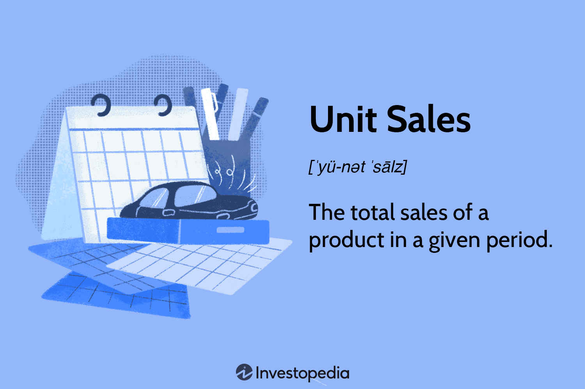

In the dynamic world of finance and commerce, the interconnection between unit sales, sales calculations, and algorithmic trading is increasingly pivotal for shaping strategic financial decisions. Unit sales, representing the total number of products sold within a specified timeframe, are a fundamental metric in assessing market demand and operational efficiency. Accurate tracking and analysis of unit sales are essential for determining net sales and understanding sales volume, which are critical in evaluating a company’s performance over time.

The integration of sales data with financial forecasting tools aids businesses in predicting future sales scenarios and adjusting their strategies accordingly. By analyzing historical sales trends, companies can make informed decisions about production levels, pricing strategies, and market expansion. This approach is crucial for adapting to market changes and meeting consumer demand efficiently.



Algorithmic trading, employing complex computer algorithms, has become a cornerstone of modern financial markets. These algorithms enhance trading precision and speed by executing trades based on data-driven strategies. The incorporation of sales data into these algorithms can provide a competitive edge, offering insights into price fluctuations and market trends.

This article explores the significance of unit sales in shaping financial strategies and the transformative role of algorithmic trading in modern markets. By examining concepts such as net sales and sales volume, and discussing advanced trading strategies, the focus will be on how businesses can leverage sales data for improved financial forecasting and decision-making. The interplay between unit sales information and algorithmic trading holds the potential to revolutionize predictive analytics and strategic planning within finance and commerce.

## Table of Contents

## Understanding Unit Sales

Unit sales represent the total number of units sold within a specified period, serving as a fundamental metric often included in a company's financial statements, such as the balance sheet. This measure provides a straightforward view of a product's sales performance and is integral to financial analysis and business strategy.

Determining the appropriate price point is a critical aspect of maximizing unit sales. The price point must balance covering production costs and attracting consumers. To understand the relationship between price, sales volume, and revenue, many businesses employ elasticity of demand models, often formulated as:

$$
E_d = \frac{\Delta Q / Q}{\Delta P / P}
$$

where $E_d$ is the elasticity of demand, $\Delta Q$ is the change in quantity sold, $Q$ is the initial quantity sold, $\Delta P$ is the change in price, and $P$ is the initial price. This formula helps determine how sensitive the quantity sold is to price changes, aiding in setting the optimal price point.

Revenue streams are another vital component of understanding unit sales. Revenue, at its core, is derived from the equation:

$$
\text{Revenue} = \text{Unit Sales} \times \text{Unit Price}
$$

This straightforward calculation underpins the entire sales process, from production planning to financial forecasting. Analyzing unit sales data helps companies gauge market demand accurately. By observing sales trends over time, businesses can adjust their production and pricing strategies to meet consumer needs efficiently, minimizing overproduction or stockouts and enhancing profitability.

Moreover, unit sales data allow companies to measure production efficiency. By correlating sales volumes with production costs, businesses can identify opportunities to streamline operations and achieve cost savings. Efficient production not only helps in maintaining competitive pricing but also in ensuring that the company can meet demand without unnecessary expenditure.

Overall, unit sales provide insight into market demand and inform production and pricing strategies, emphasizing their importance in financial planning and analysis.

## Unit Sales and Production

Understanding the relationship between unit sales and production costs is essential for maintaining financial health. This connection dictates how efficiently a business can operate and scale, influencing its overall profitability. Two key financial concepts, the break-even point and economies of scale, are instrumental in understanding this relationship.

The break-even point is where total revenues from unit sales equal total production costs, resulting in neither profit nor loss. It is calculated using the formula:

$$
\text{Break-even Point (units)} = \frac{\text{Fixed Costs}}{\text{Selling Price per Unit} - \text{Variable Cost per Unit}}
$$

Reaching the break-even point is crucial for businesses, as it marks the minimum amount of product that must be sold to cover costs. Beyond this point, each additional unit sold contributes directly to profit, assuming marginal costs remain constant.

Economies of scale refer to the cost advantages that enterprises experience as production increases. These advantages result from the ability to spread fixed costs over a larger [volume](/wiki/volume-trading-strategy) of produced goods, thus reducing the cost per unit. As production scales, businesses can negotiate better terms with suppliers, automate processes, and optimize resource utilization, thereby lowering per-unit costs.

Production efficiency significantly impacts the relationship between unit sales and production costs. Efficient production processes minimize waste, reduce variable costs, and enhance quality, contributing to higher profitability. In practice, production efficiency may involve adopting technologies that streamline operations, investing in employee training to boost productivity, or improving supply chain logistics. Companies that achieve superior production efficiency realize profits beyond the break-even point more rapidly, allowing them to reinvest in their operations and explore market expansion.

In summary, understanding and optimizing the dynamics of unit sales and production costs is vital for businesses aiming to enhance financial performance. Achieving efficiencies that reduce costs and improve production capabilities not only boosts profitability but also positions companies competitively in their respective markets.

## Unit Sales Forecasting

Forecasting unit sales is a crucial aspect of strategic decision-making and assessing future financial performance. Accurate forecasts allow companies to allocate resources efficiently, manage inventory levels, and optimize production schedules, ultimately leading to enhanced profitability and market competitiveness.

To predict future unit sales scenarios, companies often rely on historical data encompassing profit margins, sales volumes, and prevailing market trends. For instance, analyzing year-over-year sales data can reveal seasonal patterns, while monitoring economic indicators can help anticipate shifts in consumer demand. The use of statistical techniques such as time series analysis and regression models is common in this process, where patterns from the past inform future projections. Specifically, autoregressive integrated moving average (ARIMA) models can be valuable for understanding complex time series data, capturing trends, and mitigating noise.

Different sectors rely on unit sales forecasting to tailor their strategies. In the automotive industry, predicting sales is fundamental due to its significant lead times in manufacturing and inventory management. Automakers like Ford and Toyota use advanced statistical models to predict consumer behavior and adjust production rates, ensuring efficient use of capital while avoiding overproduction.

Similarly, the technology sector, noted for its rapid innovation cycles, greatly benefits from unit sales forecasting. Companies like Apple and Samsung utilize sales forecasts to manage supply chains effectively, anticipating the consumer demand for upcoming models based on historical sales patterns and current market trends. This foresight enables them to manage stock levels judiciously and plan for product launches strategically.

In both cases, embedding external factors such as economic conditions, competitive actions, and technological advancements into the forecasting models is essential for achieving accurate predictions. Machine learning techniques, like neural networks, are increasingly incorporated for their ability to handle vast datasets and identify non-linear patterns, thereby refining the accuracy of forecasts.

These forecasting practices highlight the need for integrating sophisticated analytical tools and business acumen, allowing companies to make informed decisions that align with market opportunities and consumer demands. By leveraging past data effectively, businesses can enhance their strategic planning, secure a competitive edge, and drive sustained financial growth.

## Introducing Sales Calculation

Sales calculations are a fundamental aspect of financial analysis, involving the determination of revenue by multiplying unit sales by the unit price. This process not only provides essential insights into a company's financial health but also aids strategic decision-making. The formula for calculating revenue is straightforward: 

$$
\text{Revenue} = \text{Unit Sales} \times \text{Unit Price}
$$

One of the critical metrics in sales calculations is the Average Selling Price (ASP). The ASP provides a measure of the average price at which a product is sold over a particular period. It is calculated as:

$$
\text{ASP} = \frac{\text{Total Revenue}}{\text{Total Units Sold}}
$$

Understanding ASP is vital for comparative financial analysis, enabling businesses to assess pricing strategies, market positioning, and profitability. It helps companies track pricing trends and make informed decisions on pricing adjustments to maximize revenue.

### Example Calculation

Consider a company that sold 1,000 units of a product, with a total sales revenue of $50,000. To calculate the ASP:

$$
\text{ASP} = \frac{50,000}{1,000} = 50
$$

This result indicates that, on average, each unit was sold for $50. If this company's unit price changes, recalculating the ASP can help understand the impact on revenue and adjust strategies accordingly.

For further illustration, consider the following Python code snippet that calculates revenue and ASP:

```python
def calculate_revenue(unit_sales, unit_price):
    return unit_sales * unit_price

def calculate_asp(total_revenue, total_units_sold):
    if total_units_sold == 0:
        return 0
    return total_revenue / total_units_sold

# Example data
unit_sales = 1000
unit_price = 50
total_revenue = calculate_revenue(unit_sales, unit_price)
total_units_sold = unit_sales

# Calculating ASP
asp = calculate_asp(total_revenue, total_units_sold)
print(f"Total Revenue: ${total_revenue}")
print(f"Average Selling Price (ASP): ${asp}")
```

This example reinforces the significance of sales calculations and ASP in assessing business performance. By regularly monitoring these metrics, companies can optimize their pricing strategies, enhance profitability, and make data-driven decisions in their financial planning.

## Algorithmic Trading Overview

Algorithmic trading, often referred to as algo trading or automated trading, relies on sophisticated computer algorithms to execute trades based on predefined strategies. This technology-driven approach has revolutionized the landscape of financial markets, offering significant advantages in terms of speed, precision, and cost efficiency.

**Benefits and Impact on Trading Efficiency**

One of the primary benefits of [algorithmic trading](/wiki/algorithmic-trading) is its unmatched speed. Algorithms can analyze vast amounts of market data and execute trades within fractions of a second, far surpassing human capabilities. This speed ensures that traders can capitalize on fleeting market opportunities and react effectively to market movements.

Precision is another key advantage of algorithmic trading. By following predetermined instructions, algorithms reduce the risk of human error in trade execution. This precision is essential for implementing complex strategies that rely on timing and quick decision-making processes.

Moreover, algorithmic trading reduces transaction costs. By optimizing trade execution and minimizing the bid-ask spread, algorithms help in achieving better price points. They can also break down large orders into smaller parts and execute them over a designated period to avoid significant market impact.

**Historical Evolution**

The origins of algorithmic trading can be traced back to the 1970s with the introduction of electronic trading systems and computerized stock exchanges. The New York Stock Exchange (NYSE) introduced the Designated Order Turnaround (DOT) system during this period, allowing for the electronic routing of orders. The advent of electronic communication networks (ECNs) in the 1990s further accelerated the adoption of automated trading by allowing participants to trade outside regular exchange hours.

In the early 2000s, advances in technology and increased computing power enabled the development of more sophisticated algorithms capable of executing highly intricate strategies. High-frequency trading ([HFT](/wiki/high-frequency-trading-strategies)), a subset of algorithmic trading, emerged as a significant market force by exploiting small price discrepancies across different markets at ultra-high speeds.

**Role of Algorithms in Trading Markets**

Algorithms play a crucial role in various trading strategies, including [market making](/wiki/market-making), statistical [arbitrage](/wiki/arbitrage), and [trend following](/wiki/trend-following). For instance, in market making, algorithms continuously provide buy and sell quotes for a security, profiting from the bid-ask spread. In [statistical arbitrage](/wiki/statistical-arbitrage), they identify and exploit pricing inefficiencies across correlated securities.

The ability of algorithmic trading to process large datasets and incorporate complex mathematical models enables traders to devise strategies that are both systematic and data-driven. Algorithms can incorporate factors such as market [volatility](/wiki/volatility-trading-strategies), historical pricing patterns, and economic indicators to inform trading decisions.

Algorithmic trading has also contributed to the [liquidity](/wiki/liquidity-risk-premium) and efficiency of financial markets. By executing trades rapidly and consistently, algorithms enhance market depth and can contribute to narrowing spreads, ultimately benefiting all market participants.

In conclusion, algorithmic trading has become an indispensable component of modern financial markets, transforming how trades are executed and strategies are formed. Its evolution and impact continue to shape the landscape of trading, making it a critical area of study for finance professionals and technologists alike.

## Interplay Between Unit Sales and Algo Trading

The integration of unit sales data into algorithmic trading represents a significant advancement in enhancing trading strategies. By leveraging the rich insights provided by sales trends, traders and financial analysts can more accurately predict price movements and refine their algorithmic trading operations.

Sales trends provide critical indicators of market behavior. For instance, a consistent upward trend in unit sales for a particular product may signal increased consumer demand, potentially leading to a rise in the company’s stock price. Algorithmic trading systems, equipped with this unit sales data, can execute trades with improved foresight, buying shares in anticipation of price increases or selling before a predicted decline.

One prominent aspect of this integration is the use of real-time sales data. In industries where sales data are available at [high frequency](/wiki/high-frequency-trading), algorithms can continuously adjust trading strategies in response to new information. For example, during product launches or seasonal sales events, rapid sales data influxes can be analyzed to forecast short-term stock price movements, allowing algorithms to capitalize on these fluctuations more effectively.

Real-life applications highlight the efficacy of this integration. Retail giants like Amazon and Walmart have harnessed sales data to inform their trading strategies. By analyzing unit sales patterns, these companies can adjust inventory levels and pricing strategies, which in turn affects their market performance and trading decisions. In the case of Amazon, [machine learning](/wiki/machine-learning) algorithms analyze vast amounts of sales data to optimize not only supply chain operations but also trading strategies in the stock market.

Additionally, technology firms have utilized unit sales data combined with advanced analytics to enhance their trading algorithms. For example, Apple, known for its significant unit sales during new product releases, uses sales forecasts to influence their investment strategies, aligning production changes with anticipated demand to maximize shareholder value.

From a technical perspective, integrating unit sales data into algorithmic models can involve the use of predictive analytics and machine learning techniques. A simplified example in Python could involve using historical sales data to train a model for predicting future sales volumes, which can then inform trading decisions:

```python
import numpy as np
from sklearn.model_selection import train_test_split
from sklearn.linear_model import LinearRegression

# Example sales data (units sold) and corresponding stock price changes
sales_data = np.array([100, 150, 200, 250, 300])
price_changes = np.array([2.5, 3.0, 3.5, 4.3, 5.0])

# Reshape data for model
sales_data = sales_data.reshape(-1, 1)

# Split dataset into training and testing
X_train, X_test, y_train, y_test = train_test_split(sales_data, price_changes, test_size=0.2, random_state=42)

# Create and train the model
model = LinearRegression()
model.fit(X_train, y_train)

# Predict future price change based on new sales volume
new_sales_volume = np.array([[320]])
predicted_price_change = model.predict(new_sales_volume)
```

This simple linear regression model can be expanded with more complex machine learning algorithms and larger datasets to yield more precise trading insights. The primary advantage of integrating unit sales data with algorithmic trading is the enhancement of predictive accuracy, allowing firms to remain agile and competitive in fast-paced markets.

## Case Studies and Applications

Case studies that highlight the integration of unit sales data into algorithmic trading showcase significant improvements in trading outcomes. These examples provide practical insights and financial advantages for companies adopting such strategies.

One prominent case is the use of unit sales data by retailers to inform dynamic pricing algorithms. Retail giants like Amazon and Walmart have harnessed real-time sales data to adjust prices algorithmically. By integrating sales trends, these companies ensure competitive pricing and optimize inventory turnover. The strategy involves assessing unit sales fluctuations and automating price changes to reflect demand, thereby leveraging unit sales data to increase profit margins and minimize overstock risks.

The automotive industry also provides compelling examples. Car manufacturers use historical unit sales data to forecast demand and inform trading strategies concerning raw material purchases. For instance, during periods of high sales volatility, manufacturers can utilize predictive algorithms based on unit sales trends to hedge against price changes in raw materials, such as steel or aluminum. This approach reduces cost volatility and ensures more stable production lines.

In the technology sector, companies like Apple and Samsung collect extensive unit sales data from global markets to refine their supply chain strategies. By analyzing sales patterns, these companies optimize their production schedules and stock levels, ensuring that manufacturing aligns with market demand. These insights contribute to algorithmic trading decisions, such as entering futures contracts for components or foreign exchange hedging, thus securing a cost advantage in volatile markets.

Lessons learned from these applications emphasize the importance of data accuracy and integration. High-quality sales data ensures that algorithms accurately reflect market trends and consumer behavior, leading to more effective trading decisions. It's essential for companies to establish robust data collection and cleaning processes to maintain the integrity of sales data used in trading algorithms.

Successful case studies underline best practices like flexible algorithm designs that can adapt to diverse market conditions and continuous data monitoring systems. These strategies are vital for refining trading models and enhancing predictability in fast-changing market environments. Additionally, interdisciplinary collaboration between sales teams and data scientists can accelerate the development and application of unit sales data in algorithmic trading, offering a comprehensive approach to decision-making.

The continual innovation in data analytics and computational technologies presents opportunities for expanding these methods. Future advancements are likely to enhance the precision and efficiency of integrating unit sales data into algorithmic trading, promising competitive advantages for early adopters.

## Challenges and Considerations

Integrating unit sales data with algorithmic trading presents several challenges and considerations that must be addressed to enhance the reliability and effectiveness of trading strategies. Three primary concerns are data accuracy, real-time processing, and market volatility.

**Data Accuracy**

Accurate data is crucial for making informed trading decisions. Errors in sales data, whether due to incorrect entries, outdated information, or inconsistencies, can lead to flawed analysis and consequently poor trading decisions. Verification processes need to be in place to ensure data accuracy. Implementing a robust system for data validation and cleansing can help mitigate risks associated with faulty data feeds. Using machine learning algorithms to automatically detect anomalies in sales data could enhance the reliability of input data. 

**Real-time Processing**

Algorithmic trading thrives on the speed of data interpretation and decision-making. The real-time processing of unit sales data is vital to capitalize on immediate market opportunities. However, ensuring that sales data is instantly available and properly integrated with trading systems can be technically demanding. A streamlined data pipeline with low latency is essential. Utilizing technologies such as in-memory data grids can assist in achieving near-instantaneous data processing, thereby ensuring trading decisions are based on the most current information.

**Market Volatility**

Market volatility can disrupt the predictive power of trading algorithms, particularly when they rely heavily on past sales data. Sudden market changes can render historical data less impactful, necessitating the incorporation of volatility metrics in algorithmic models to adjust trading strategies dynamically. One approach to incorporating market volatility is through the use of volatility-adjusted moving averages or adaptive algorithms that recalibrate based on real-time market conditions.

**Addressing Risks and Strategies**

To effectively integrate sales data with trading algorithms, certain risks must be addressed:

1. **Data Latency Risk**: High-frequency trading algorithms are sensitive to data latency. Implement strategies such as proximity hosting and co-location services to reduce transmission delays between data sources and trading platforms.

2. **System Compatibility Risk**: Ensure that all data sources—sales and market data—speak the same "language" by using standardized data formats and APIs, allowing for smooth integration and reducing the risk of misinterpretation.

3. **Unexpected Market Movements**: Use hedging techniques and diversify trading strategies to mitigate the risks associated with unexpected market swings, ensuring that reliance on a single data type does not jeopardize trading outcomes.

Overall, the integration of unit sales data with algorithmic trading systems requires careful consideration of data integrity, processing capability, and market variables. By employing robust validation measures, enhancing real-time processing capabilities, and accounting for market volatility, companies can develop sophisticated trading strategies that leverage sales data effectively.

## Conclusion

Unit sales play a pivotal role in strategic financial planning and trading by serving as a foundation for understanding market demand and guiding production efficiency. By accurately forecasting unit sales, companies can make informed decisions regarding pricing strategies, inventory management, and resource allocation, ultimately enhancing their financial stability and growth potential.

Integrating sales data with algorithmic trading presents numerous advantages. By harnessing the insights gained from unit sales trends, trading algorithms can optimize their performance through improved predictions of market movements. For example, a consistent increase in sales volume can be used to anticipate a rise in demand, thus influencing stock prices. This data-driven approach enhances the precision of trading strategies and reduces the inherent risks and costs associated with manual trading.

One of the key takeaways from the integration of sales data and algorithmic trading is its ability to enhance decision-making speed and accuracy. Algorithms can process vast amounts of sales data in real time, allowing traders to respond to market changes more swiftly than traditional methods. This capability not only improves trading efficiency but also aligns financial strategies with real-time market conditions, providing a competitive advantage in volatile markets.

Looking ahead, the future development of sales data analytics and algo trading lies in the continuous refinement of data processing techniques and machine learning algorithms. As data analytics technology evolves, the potential for more granular and predictive sales forecasting increases, leading to more sophisticated trading strategies. Additionally, advancements in [artificial intelligence](/wiki/ai-artificial-intelligence) and big data analytics are expected to enhance the adaptability and intelligence of trading algorithms, further improving their ability to leverage sales data for optimal financial outcomes.

In conclusion, the synergy between unit sales and algorithmic trading offers significant strategic benefits, providing companies with a robust framework for financial planning and market engagement. Embracing these advancements will be essential for businesses aspiring to thrive in an increasingly data-driven financial landscape.

## References & Further Reading

1. **Books:**
   - Hull, J. C. (2020). *Options, Futures, and Other Derivatives.* This book provides foundational knowledge in financial derivatives, essential for understanding advanced trading strategies.
   - Chan, E. (2009). *Quantitative Trading: How to Build Your Own Algorithmic Trading Business.* This guide offers practical insights into creating and managing an algorithmic trading business, with a focus on quantitative strategies.

2. **Articles and Journals:**
   - Zhang, W., & Zhang, Z. (2012). "High-Frequency Trading, Stock Volatility, and Price Discovery." This study explores the impacts of algorithmic trading on market dynamics.
   - Cartea, Á., & Penalva, J. (2012). "Where is the Value in High Frequency Trading?" This article investigates the value proposition of high-frequency trading.

3. **Online Courses:**
   - *Coursera – Financial Markets* by Yale University: Offers an introduction to risk management and behavioral finance principles to understand the real-world functioning of securities, insurance, and banking industries.
   - *edX – Algorithmic Trading and Finance Models* by WorldQuant University: Provides insights into the mathematical models and computational techniques behind algorithmic trading strategies.

4. **Research Papers:**
   - Aldridge, I. (2013). "High-Frequency Trading: A Practical Guide to Algorithmic Strategies and Trading Systems." This paper discusses the technical and practical aspects of high-frequency trading.

5. **Websites:**
   - *Investopedia*: A comprehensive resource for learning about finance and trading concepts, including detailed articles on unit sales and algorithmic trading [Investopedia](https://www.investopedia.com).
   - *QuantStart*: An educational website focusing on practical algorithmic trading guides and quantitative finance articles [QuantStart](https://www.quantstart.com).

6. **Professional Organizations:**
   - *Algorithmic Traders Association*: Provides networking opportunities, access to workshops, and resources for professional development in algorithmic trading.
   - *CFA Institute*: Offers various resources and certifications for financial analysts, including materials on financial forecasting and trading strategies.

Encouraging further education and ongoing learning through these resources can significantly enhance one's understanding and capabilities in financial analysis and algorithmic trading.

