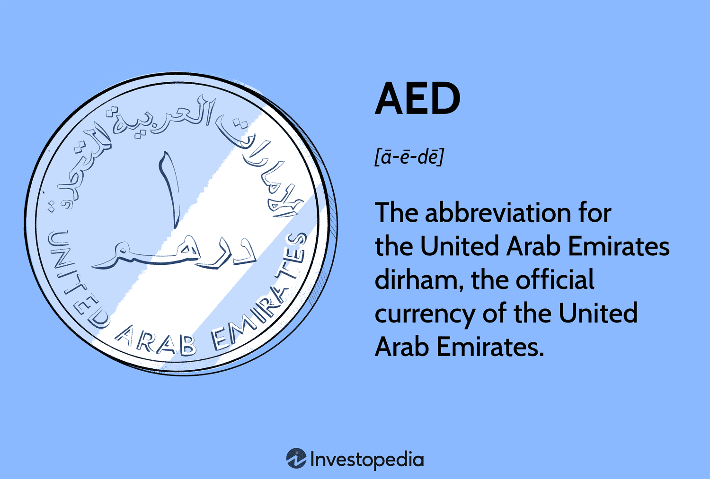

## Table of Contents

## What is the United Arab Emirates Dirham (AED)?

The United Arab Emirates Dirham, often shortened to AED, is the official currency used in the United Arab Emirates (UAE). It was introduced in 1973, replacing the Qatar and Dubai Riyal. The Dirham is divided into 100 smaller units called fils. The currency is managed by the Central Bank of the UAE, which works to keep the Dirham stable and strong.

The Dirham is used every day by people in the UAE to buy things like food, clothes, and other goods. It is also used in business and trade within the country and with other countries. The Dirham's symbol is د.إ, and its ISO code is AED. Many people from around the world visit the UAE, so the Dirham is often exchanged for other currencies like the US Dollar or the Euro.

## How is the AED symbolized and abbreviated?

The AED is symbolized using the Arabic letter 'dal' (د) followed by a dot and the Arabic letter 'ra' (إ). In English, it looks like د.إ. This symbol is used in everyday transactions in the UAE.

The abbreviation for the United Arab Emirates Dirham is AED. This is used in banking, finance, and when writing about the currency. It stands for "Arab Emirates Dirham."

## Which countries use the AED as their official currency?

The United Arab Emirates Dirham, or AED, is the official money used in the United Arab Emirates. The UAE is made up of seven different areas called emirates, including places like Dubai and Abu Dhabi. People in all these emirates use the Dirham every day to buy things they need.

No other countries use the AED as their official currency. So, if you travel outside the UAE, you will need to use a different kind of money. But many places around the world will exchange your money into Dirhams if you are planning to visit the UAE.

## What is the history of the AED?

The United Arab Emirates Dirham, or AED, started being used in 1973. Before that, people in the UAE used the Qatar and Dubai Riyal. The UAE wanted its own money, so they made the Dirham. The Central Bank of the UAE was set up to take care of the Dirham and make sure it stayed strong. The Dirham was divided into 100 smaller parts called fils, which helped people use it easily for buying things.

When the Dirham first came out, it was worth about 8.88777 to one British pound. Over time, the Dirham has stayed pretty stable, which means its value doesn't change a lot. This is good for people and businesses in the UAE because they know how much their money is worth. The Dirham is used every day in the UAE for buying things like food, clothes, and other stuff people need. It's also used in big business deals and trade with other countries.

## How is the AED managed and who issues it?

The United Arab Emirates Dirham, or AED, is managed by the Central Bank of the UAE. The Central Bank makes sure the Dirham stays strong and doesn't change value too much. They do this by watching how much money is being used and making rules about it. The Central Bank also decides how many Dirhams should be made and when new ones need to be printed or made into coins.

The Central Bank of the UAE is the only place that can issue the Dirham. This means they are the ones who make the money and give it to banks and people to use. They work hard to make sure there is enough money for everyone in the UAE to use, but not too much, which could make the Dirham less valuable. By controlling how much money is out there, the Central Bank helps keep the economy of the UAE stable and growing.

## What are the different denominations of AED banknotes and coins?

The United Arab Emirates Dirham comes in different banknotes and coins. The banknotes are in values of 5, 10, 20, 50, 100, 200, 500, and 1000 Dirhams. These banknotes have pictures of important places and people from the UAE on them. They are made of paper and are used for bigger purchases or when you need to carry a lot of money.

The coins are smaller and come in values of 1 Dirham and 50, 25, 10, 5, and 1 fils. The 1 Dirham coin is the biggest coin and is worth the same as 100 fils. The smaller coins, like the 50 fils and 25 fils, are used for smaller purchases or to give change. All these coins have different designs on them, often showing important symbols or landmarks from the UAE.

## How does the AED exchange rate work with major world currencies?

The exchange rate of the United Arab Emirates Dirham (AED) with major world currencies like the US Dollar, Euro, and British Pound shows how much one Dirham is worth in those currencies. The AED is often linked to the US Dollar, which means its value stays pretty close to the Dollar's value. For example, 1 US Dollar is usually worth around 3.67 AED. This link helps keep the Dirham stable and makes it easier for people and businesses in the UAE to plan their money matters.

When you want to change your Dirhams into another currency, like Euros or Pounds, the exchange rate will tell you how many Euros or Pounds you get for your Dirhams. These rates can change every day because of things like how well the economy is doing or what's happening in the world. If you're traveling or doing business with other countries, you'll need to check the current exchange rate to know how much your money is worth in that other currency.

## What factors influence the value of the AED?

The value of the United Arab Emirates Dirham (AED) is mainly influenced by its link to the US Dollar. The UAE decided to keep the Dirham's value close to the Dollar, so 1 US Dollar is usually worth around 3.67 AED. This link helps keep the Dirham stable and makes it easier for people and businesses in the UAE to plan their money matters. If the US Dollar goes up or down in value, the Dirham will usually follow because they are connected.

Other things can also affect the Dirham's value, like how well the UAE's economy is doing. If the UAE is making a lot of money from oil and other businesses, the Dirham might stay strong. But if the economy is not doing well, the Dirham could be affected. Also, what's happening in the world can change the Dirham's value. For example, if there's a big problem in the world that makes people worried about money, the Dirham might change in value because of that.

## How stable is the AED compared to other currencies?

The United Arab Emirates Dirham, or AED, is very stable compared to many other currencies. This is because it is linked to the US Dollar. The UAE decided to keep the Dirham's value close to the Dollar, so 1 US Dollar is usually worth around 3.67 AED. This link helps keep the Dirham's value from changing a lot. When the US Dollar goes up or down, the Dirham usually follows because they are connected. This makes it easier for people and businesses in the UAE to plan their money matters without worrying about big changes in the Dirham's value.

Even though the Dirham is linked to the US Dollar, other things can still affect its stability. The UAE's economy, especially how much money it makes from oil and other businesses, can influence the Dirham. If the economy is doing well, the Dirham stays strong. But if there are problems, the Dirham might be affected. Also, big events in the world can change the Dirham's value. For example, if there's a global crisis that makes people worried about money, the Dirham might change in value because of that. But overall, the Dirham is still more stable than many other currencies because of its link to the US Dollar.

## What are the regulations and restrictions on using AED in international transactions?

When you use the United Arab Emirates Dirham, or AED, for international transactions, there are some rules you need to follow. The Central Bank of the UAE sets these rules to make sure the Dirham stays strong and the country's money system works well. For example, if you want to send a lot of Dirhams out of the UAE, you might need to tell the bank or get special permission. This helps the Central Bank keep track of how much money is leaving the country and make sure it doesn't affect the Dirham's value too much.

Also, when you're traveling and want to use Dirhams in other countries, you might find that not many places accept them directly. You'll often need to change your Dirhams into another currency like the US Dollar or Euro. The exchange rate, which is how much your Dirhams are worth in another currency, can change every day. So, it's a good idea to check the current rate before you make a big transaction. This way, you can make sure you're getting a fair deal and that you understand how much your money is worth in another country.

## How does the AED fit into the global financial system?

The United Arab Emirates Dirham, or AED, is part of the global financial system because it is used in the UAE, which is a big place for business and trade. The Dirham is linked to the US Dollar, which means its value stays close to the Dollar's value. This link helps the Dirham stay stable, which is good for people and businesses in the UAE. They can plan their money matters without worrying about big changes in the Dirham's value. The UAE's economy, especially its oil and other businesses, also helps the Dirham fit into the global financial system. When the UAE does well, the Dirham stays strong, which makes it more trusted around the world.

Even though the Dirham is mainly used in the UAE, it still plays a role in international trade and finance. People and businesses from other countries often need to change their money into Dirhams to do business in the UAE. The exchange rate, which is how much the Dirham is worth in other currencies, can change every day. This means that when people or businesses want to use Dirhams for international transactions, they need to check the current exchange rate to make sure they're getting a fair deal. The Central Bank of the UAE also sets rules to make sure the Dirham stays strong and the country's money system works well, which helps the Dirham fit into the global financial system.

## What future trends might affect the AED's role and value?

In the future, the value and role of the United Arab Emirates Dirham, or AED, could be affected by many things. One big thing is how the UAE's economy does. If the UAE keeps making a lot of money from oil and other businesses, the Dirham might stay strong. But if the world starts using less oil or if there are big changes in the global economy, the Dirham could be affected. Also, if the UAE keeps growing as a place for business and trade, more people and companies might want to use Dirhams, which could help keep its value stable.

Another thing that could change the Dirham's future is what happens with the US Dollar. Since the Dirham is linked to the US Dollar, if the Dollar goes up or down a lot, the Dirham will usually follow. If the US has big economic changes or if there are new rules about money around the world, this could affect the Dirham too. Also, new technology and ways of using money, like digital currencies, might change how people use the Dirham. If more people start using digital money, the Dirham might need to change to stay important in the global financial system.

## References & Further Reading

[1]: ["The UAE's Currency Peg to the US Dollar: An Anchor of Stability"](https://www.khaleejtimes.com/global-business/how-does-the-weakening-dollar-impact-the-uae-economy-given-the-existing-peg-dollar-price-arrangemen) - International Monetary Fund Report 

[2]: Siffert, R. (2020). ["Currency Risk Management: UAE Dirham against the US Dollar"](https://pmc.ncbi.nlm.nih.gov/articles/PMC9598252/) - Journal of Financial Management 

[3]: ["Fintech in the Middle East: UAE as a Financial Technology Hub"](https://www.forbes.com/sites/lawrencewintermeyer/2023/06/16/dubai-on-the-road-to-becoming-a-top-global-financial-services-hub/) - Deloitte Insights 

[4]: ["Advances in Financial Machine Learning"](https://www.wiley.com/en-us/Advances+in+Financial+Machine+Learning-p-9781119482086) by Marcos Lopez de Prado 

[5]: ["Quantitative Trading: How to Build Your Own Algorithmic Trading Business"](https://books.google.com/books/about/Quantitative_Trading.html?id=j70yEAAAQBAJ) by Ernest P. Chan 

[6]: ["UAE Vision 2021: Towards an Innovative and Knowledge-based Economy"](https://u.ae/en/about-the-uae/strategies-initiatives-and-awards/strategies-plans-and-visions/strategies-plans-and-visions-untill-2021/vision-2021) 

[7]: ["Algorithmic Trading and Its Implications for the Financial Market"](https://www.researchgate.net/publication/378548435_Algorithmic_Trading_and_AI_A_Review_of_Strategies_and_Market_Impact) - MIT Press 

[8]: ["The Future of Finance in the Middle East: The Emerging Role of Fintech"](https://www.mei.edu/sites/default/files/2021-10/11.%20The%20Future%20of%20FinTech%20in%20the%20Middle%20East-%20Trends%20That%20Are%20Here%20to%20Stay%20.pdf) - Oxford Business Group 

[9]: ["The Impact of Artificial Intelligence on Fintech"](https://www.forbes.com/councils/forbesfinancecouncil/2021/06/23/three-areas-of-impact-for-ai-in-fintech/) - Deloitte Insights
