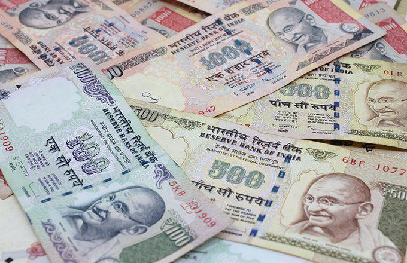

The United Arab Emirates (UAE) dirham, abbreviated as AED, is the official currency used throughout the UAE, encompassing significant cities such as Dubai and Abu Dhabi. Introduced in 1973, the AED quickly established itself as a symbol of economic stability within the region. This stability is largely attributed to its stable exchange rate, as the AED is pegged to the U.S. dollar at a rate of 3.6725 AED per USD. This fixed exchange rate enhances its reliability and significance in global markets, providing predictability and security for international investors and businesses dealing in the UAE.

The AED's stable exchange rate is crucial for facilitating the UAE's diverse economic activities, particularly in the oil and gas sector, which requires consistent currency valuation due to its global pricing in U.S. dollars. Beyond its economic stability, the AED represents a lucrative opportunity in the rising trend of algorithmic trading. This trading approach, leveraging the AED's stability, is increasingly adopted by market participants seeking efficient, data-driven methods in the financial markets.



To explore the AED's importance, it is essential to understand the broader economic framework of the UAE, a country renowned for its strategic initiatives and visionary leadership aimed at fostering economic growth and innovation. Algorithmic trading, gaining momentum within the UAE's financial landscape, finds an environment ripe with potential, driven by the supportive policies and robust fintech infrastructure of the UAE.

## Table of Contents

## Understanding the AED Currency

The AED, short for the Arabic Dirham, represents the unified monetary unit of the United Arab Emirates. Symbolized by Dhs or DH, the currency comprises 100 smaller units referred to as 'fils.' The AED offers various denominations, both in banknotes and coins. Banknotes are issued in values of 5, 10, 20, 50, 100, 200, 500, and 1,000 dirhams. Meanwhile, the coins circulate in denominations of 1, 25, and 50 fils. 

The design of the dirham incorporates advanced security measures to defend against counterfeiting. Among these features is the inclusion of the UAE's national emblem, the golden falcon, which serves as a visual mark of authenticity and national pride. The incorporation of these security features ensures that the currency maintains its integrity and trustworthiness among users, both within the UAE and in international transactions.

## The UAE Economy and the Role of the AED

The United Arab Emirates (UAE) is an economic powerhouse in the Middle East, consistently ranking 25th globally due to its substantial oil and natural gas exports. While these resources form the backbone of its economy, there are significant ongoing efforts towards diversification to reduce dependency on hydrocarbons. This strategic shift is evidenced by investments in sectors such as tourism, aviation, and financial services.

Central to the UAE’s economic framework is the stability of its currency, the UAE dirham (AED). The AED maintains one of the most consistent exchange rates globally, fixed at 3.6725 AED per U.S. dollar since 1997. This peg ensures predictability in exchange rates, which is crucial for trade. Given that oil is predominantly priced in U.S. dollars, the fixed exchange rate minimizes the risk of currency fluctuations affecting trade revenues, thereby reinforcing economic stability.

The stability of the AED is further supported by the UAE's robust economic policies, which have consistently resulted in a surplus in the current account. A current account surplus indicates that the country exports more goods, services, and capital than it imports, which strengthens the currency and contributes to its stability. This surplus also enhances investor confidence and helps maintain substantial foreign reserves, acting as a cushion during economic downturns.

In summary, the stability of the AED is a cornerstone of the UAE's economic strategy, enabling it to navigate the complexities of global trade effectively. By tying its currency value to the U.S. dollar, the UAE safeguards itself against oil market [volatility](/wiki/volatility-trading-strategies), promoting sustained growth and economic resiliency.

## Why is the AED Pegged to the US Dollar?

The UAE's decision to peg its currency, the dirham (AED), to the U.S. dollar arises from a strategic approach to manage economic stability, particularly given the volatility of oil prices. Oil exports constitute a substantial portion of the UAE's revenue, and since oil prices are typically quoted in U.S. dollars, pegging the AED to the dollar helps mitigate risks associated with fluctuating oil prices. This alignment ensures that any volatility in oil pricing does not drastically affect the UAE's revenue in local currency terms.

Maintaining this peg ensures a stable economic environment, which significantly bolsters investor confidence. Investors are more likely to invest in a region where currency risk is minimized, which in turn fosters the inflow of foreign capital. A stable currency is also essential for long-term economic planning, enabling businesses to forecast costs, revenues, and investment returns with greater accuracy.

Despite the evident benefits, maintaining the peg is not without challenges. Global financial shifts can sometimes pressure the fixed rate, potentially affecting the UAE's monetary policy flexibility. However, the UAE's robust economic strategies and substantial foreign reserves offer a buffer to support the dirham's stability against such pressures. The country's strategic reserves act as a financial safeguard, allowing it to maintain the peg even during adverse economic scenarios.

In summary, the peg to the U.S. dollar serves as a foundation for economic stability in the UAE, facilitating investor trust, stable revenue streams, and effective economic planning. While challenges exist, the nation's economic resilience and strategic reserves ensure the peg's sustainability.

## Algorithmic Trading with AED

Algorithmic trading, a significant development in financial markets, is increasingly prominent in the UAE's trading landscape, significantly impacting the trading of the UAE dirham (AED). This approach leverages computer algorithms to automatically execute trades based on predefined criteria. The stability of the AED, which is pegged to the U.S. dollar, enhances the appeal of [algorithmic trading](/wiki/algorithmic-trading) by providing a predictable and stable trading environment.

The core advantage of algorithmic trading lies in its ability to process vast amounts of data rapidly and execute trades with minimal human intervention. Traders in the UAE are increasingly utilizing advanced technologies to derive insights from historical data and real-time market conditions. For instance, using [machine learning](/wiki/machine-learning) algorithms allows for the analysis of historical trends which can predict future price movements with a certain degree of accuracy. Popular algorithms may include statistical models like moving average crossovers, mean reversion strategies, and machine learning techniques such as neural networks or support vector machines.

Python, as a preferred programming language for implementing trading algorithms due to its robust libraries such as Pandas, NumPy, and Scikit-learn, plays a crucial role in these developments. A simple moving average crossover strategy in Python could be implemented as follows:

```python
import pandas as pd

# Load market data
data = pd.read_csv('market_data.csv')
data['SMA_20'] = data['Close'].rolling(window=20).mean()
data['SMA_50'] = data['Close'].rolling(window=50).mean()

# Generate trading signals
data['Signal'] = 0
data['Signal'][20:] = np.where(data['SMA_20'][20:] > data['SMA_50'][20:], 1, 0)

# Execute trades based on signals
data['Position'] = data['Signal'].diff()
print(data[['Close', 'SMA_20', 'SMA_50', 'Signal', 'Position']])
```

This simplified example illustrates a strategy where a buy signal is generated when the 20-day moving average crosses above the 50-day moving average. The automation of such strategies allows traders to capitalize on fleeting opportunities that manual trading would likely miss due to human latency.

Furthermore, the UAE's progressive regulatory environment and commitment to fintech innovation offer a supportive ecosystem for algorithmic trading. The establishment of free zones, such as the Abu Dhabi Global Market (ADGM) and the Dubai International Financial Centre (DIFC), provides a conducive framework for fintech companies to innovate and thrive. These free zones are characterized by their favorable policies, including tax incentives and flexible regulations, encouraging the growth and integration of technology in financial markets.

As algorithmic trading continues to evolve, it is expected to further integrate with emerging technologies like [artificial intelligence](/wiki/ai-artificial-intelligence) and blockchain, driving efficiency and transparency. The UAE's strategic focus on technological advancement suggests a promising future for algorithmic trading involving the AED, aligning with the nation's broader economic goals and providing traders with robust tools to navigate complex market environments.

## Conclusion

The UAE dirham (AED) stands out as a robust currency, primarily anchored by the United Arab Emirates' stable economic landscape and its strategic peg to the U.S dollar. This pegging mechanism not only fortifies the currency against volatility in global markets but also engenders a climate of confidence among investors. Such stability makes the AED particularly attractive for modern trading strategies, including algorithmic trading, which benefit from a predictable exchange rate environment.

As the UAE continues its journey toward economic diversification, reducing its historical reliance on oil and gas, the AED is poised to maintain its significant presence in both local and international trading markets. The nation's diversification efforts aim to bolster sectors such as tourism, aviation, and fintech, which collectively contribute to a resilient national economy and reinforce the dirham's standing.

Looking ahead, the potential for AED trading appears promising. Technological advancements within the UAE, particularly in financial technology, create a conducive atmosphere for innovative trading instruments and platforms. Strategic economic policies, focusing on sustainable growth and resilience, further buttress the AED's role as a stable currency. Consequently, the AED is expected to retain its critical position in the global financial market, supported by the UAE's proactive economic strategies and technological integration.

## References & Further Reading

[1]: ["The UAE's Currency Peg to the US Dollar: An Anchor of Stability"](https://www.khaleejtimes.com/global-business/how-does-the-weakening-dollar-impact-the-uae-economy-given-the-existing-peg-dollar-price-arrangemen) - International Monetary Fund Report 

[2]: Siffert, R. (2020). ["Currency Risk Management: UAE Dirham against the US Dollar"](https://pmc.ncbi.nlm.nih.gov/articles/PMC9598252/) - Journal of Financial Management 

[3]: ["Fintech in the Middle East: UAE as a Financial Technology Hub"](https://www.forbes.com/sites/lawrencewintermeyer/2023/06/16/dubai-on-the-road-to-becoming-a-top-global-financial-services-hub/) - Deloitte Insights 

[4]: ["Advances in Financial Machine Learning"](https://www.wiley.com/en-us/Advances+in+Financial+Machine+Learning-p-9781119482086) by Marcos Lopez de Prado 

[5]: ["Quantitative Trading: How to Build Your Own Algorithmic Trading Business"](https://books.google.com/books/about/Quantitative_Trading.html?id=j70yEAAAQBAJ) by Ernest P. Chan 

[6]: ["UAE Vision 2021: Towards an Innovative and Knowledge-based Economy"](https://u.ae/en/about-the-uae/strategies-initiatives-and-awards/strategies-plans-and-visions/strategies-plans-and-visions-untill-2021/vision-2021) 

[7]: ["Algorithmic Trading and Its Implications for the Financial Market"](https://www.researchgate.net/publication/378548435_Algorithmic_Trading_and_AI_A_Review_of_Strategies_and_Market_Impact) - MIT Press 

[8]: ["The Future of Finance in the Middle East: The Emerging Role of Fintech"](https://www.mei.edu/sites/default/files/2021-10/11.%20The%20Future%20of%20FinTech%20in%20the%20Middle%20East-%20Trends%20That%20Are%20Here%20to%20Stay%20.pdf) - Oxford Business Group 

[9]: ["The Impact of Artificial Intelligence on Fintech"](https://www.forbes.com/councils/forbesfinancecouncil/2021/06/23/three-areas-of-impact-for-ai-in-fintech/) - Deloitte Insights