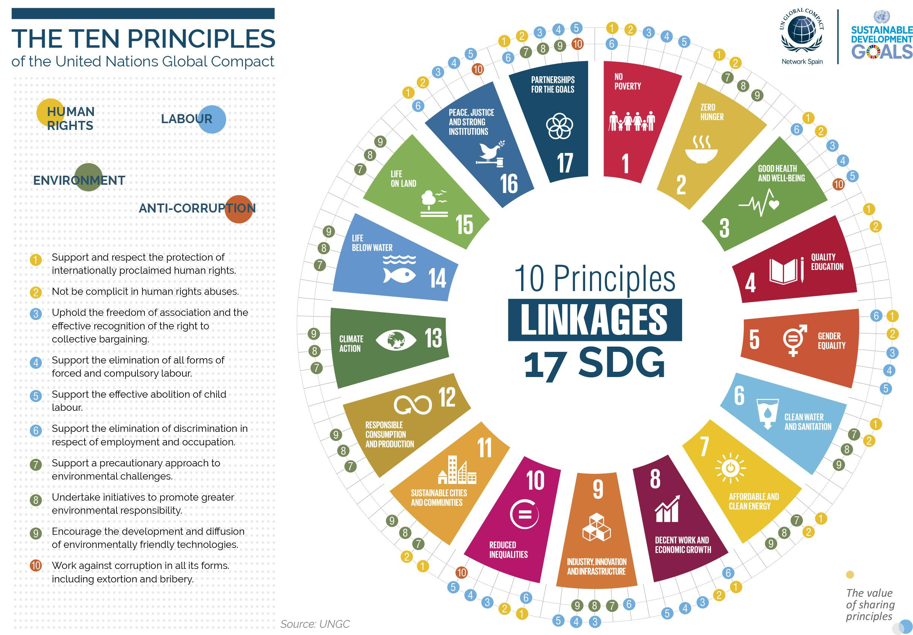

The intersection of global governance and financial innovation marks a new frontier in sustainable finance. As the world increasingly recognizes the importance of aligning economic activities with sustainable development goals, the United Nations Global Compact (UNGC) emerges as a pivotal initiative in promoting responsible business practices worldwide. Founded on ten principles covering human rights, labor, the environment, and anti-corruption, the UNGC serves as a framework for businesses to integrate social and environmental concerns into their operations andstrategies.

In parallel, the financial sector is undergoing a significant transformation driven by algorithmic trading. This innovation leverages advanced computational techniques to execute trades at high speeds and volumes, fundamentally reshaping financial markets. Algorithmic trading's ability to optimize strategies, predict market movements, and manage extensive datasets highlights its potential in modern finance. However, this technological advancement underscores the critical need for responsible practices, particularly in terms of how these systems interface with global sustainability standards.



This article explores how the principles of the United Nations Global Compact align with the evolving landscape of algorithmic trading. Our focus is on integrating sustainable practices within automated trading systems, ensuring that these systems not only drive financial performance but do so ethically and sustainably. By merging the global commitment to sustainability with cutting-edge financial technology, stakeholders can foster more transparent, inclusive, and fair markets aligned with the broader objectives of global governance.

## Table of Contents

## Understanding the UN Global Compact

The United Nations Global Compact (UNGC) is a strategic policy initiative that provides a framework for organizations committed to sustainable and socially responsible business practices. Launched in July 2000, the UNGC aims to align business operations with ten universally accepted principles in the areas of human rights, labor, environment, and anti-corruption. These principles serve as a guide for companies to cultivate ethical business cultures that are not only beneficial to their stakeholders but also contribute to broader societal goals, including the United Nations Sustainable Development Goals (SDGs).

The ten principles are derived from various international declarations and conventions. The two principles focused on human rights are based on the Universal Declaration of Human Rights, urging businesses to support and respect the protection of internationally proclaimed human rights and to ensure they are not complicit in human rights abuses. Labor standards, encapsulated in four principles, are drawn from the International Labour Organization’s Declaration on Fundamental Principles and Rights at Work. These principles encourage businesses to uphold the freedom of association and elimination of forced, compulsory labor, child labor, and discrimination in employment and occupation.

Environmental sustainability is another cornerstone of the UNGC, with three principles derived from the Rio Declaration on Environment and Development. These call for businesses to support a precautionary approach to environmental challenges, undertake initiatives to promote greater environmental responsibility, and encourage the development and diffusion of environmentally friendly technologies. Lastly, the anti-corruption principle draws from the United Nations Convention against Corruption, urging businesses to work against corruption in all its forms, including extortion and bribery.

By integrating these principles into corporate strategies, firms enhance their reputation and build consumer trust, which are invaluable assets in today’s globalized market. The integration of these ethical norms into everyday business practice not only promotes regulatory compliance but also reduces risks associated with unethical behavior, potentially leading to innovative business solutions. Furthermore, adopting these principles fosters a culture of transparency and accountability, which can lead to improved investor confidence and stable financial performance.

In essence, the UN Global Compact serves as a catalyst for sustainable transformation in the business sector. By adhering to its principles, organizations can effectively navigate the complexities of global governance while simultaneously driving positive change in society. The initiative encourages continuous reflection and innovation, allowing businesses to contribute meaningfully to sustainable development and the broader agenda of corporate social responsibility.

## Principles of the UN Global Compact and Their Relevance to Finance

The United Nations Global Compact (UNGC) principles provide a foundational framework that supports businesses in adopting sustainable and ethical practices. Rooted in values that encompass human rights, labor standards, environmental protection, and the eradication of corruption, these principles are not merely idealized concepts but actionable strategies that can have profound implications for the financial sector.

In the context of finance, these principles advocate for the establishment of transparent, inclusive, and fair systems. A commitment to transparency involves clear reporting and accountability measures, ensuring that financial transactions and decisions are conducted openly. This transparency is crucial in building trust with investors, as it reduces the opacity that often leads to unethical behavior or financial malfeasance.

Inclusion within financial systems ensures access and equitable participation in financial opportunities. By fostering an inclusive environment, financial institutions can address disparities that have historically marginalized certain groups. This approach aligns with the UCNG’s goal of promoting social equity and broadening economic opportunities for all individuals, regardless of socioeconomic status.

Fairness in financial systems is achieved through adherence to high ethical standards and the establishment of mechanisms that prevent exploitation. The UNGC principles provide a guideline for protecting stakeholder interests and ensuring that financial practices do not contribute to systemic inequities or abuses. In essence, fairness in finance helps mitigate risks linked to unethical conduct, such as fraud or manipulation, which can have severe repercussions on investments and market stability.

The incorporation of these principles into financial practices also leads to the mitigation of risks associated with unethical practices. Companies that adopt the UNGC principles are better equipped to manage reputational risks, as adherence to ethical standards enhances their image among potential investors. Moreover, by aligning business strategies with social and environmental priorities, companies can attract socially conscious investors who prioritize sustainability alongside profitability.

In conclusion, integrating the UNGC principles into finance systems fosters an ethical, transparent, and inclusive financial environment. This integration not only builds investor trust but also ensures long-term sustainability and resilience within financial markets. As investors and stakeholders increasingly demand responsible business practices, adherence to these principles becomes a critical component of modern financial strategies.

## Algorithmic Trading: Transforming Modern Markets

Algorithmic trading, a major innovation in the financial sector, leverages computer algorithms to execute trades at remarkable speeds and volumes. This approach to trading utilizes advanced mathematical models and computational techniques to make decisions about buying and selling securities on financial markets. By automating these processes, [algorithmic trading](/wiki/algorithmic-trading) eliminates the need for manual trade orders, significantly increasing the efficiency and speed of executions.

A primary advantage of algorithmic trading lies in its ability to process and analyze massive datasets far beyond the capability of human traders. Algorithms can identify patterns, trends, and potential investment opportunities by swiftly analyzing real-time data from various market sources. This ability to predict market movements allows traders to optimize their trading strategies and make informed decisions.

Consider this simplified Python example of a basic algorithm used to execute trades based on moving averages:

```python
# Import necessary libraries
import pandas as pd

# Load historical stock data
data = pd.read_csv('historical_stock_data.csv')

# Calculate short-term and long-term moving averages
data['Short_MA'] = data['Close'].rolling(window=5).mean()
data['Long_MA'] = data['Close'].rolling(window=30).mean()

# Generate trading signals
data['Signal'] = 0
data['Signal'][5:] = np.where(data['Short_MA'][5:] > data['Long_MA'][5:], 1, 0)

# Execute trades based on signals
data['Position'] = data['Signal'].diff()
```

In this code, the algorithm calculates short-term and long-term moving averages of a stock’s closing price and generates trading signals based on the crossover of these averages. Such decisions allow traders to capitalize on short-term price trends while managing long-term risks.

However, while algorithmic trading offers significant operational efficiencies, it concurrently raises the imperative for ethical considerations, particularly aligning with the principles of the United Nations Global Compact (UNGC). High-frequency trading can sometimes contribute to market [volatility](/wiki/volatility-trading-strategies) and the creation of unfair advantages, necessitating adherence to sustainable and responsible trading practices. Incorporating UNGC principles, such as transparency and fair market participation, is crucial in ensuring that the advancement of algorithmic trading does not compromise the ethical standards expected in global markets.

As algorithms are deeply integrated into financial systems, sophisticated and responsible use becomes imperative to prevent unethical practices. Transparency in data usage and strategy implementation, along with a focus on environmental and social governance ([ESG](/wiki/esg-investing)) criteria, can help promote a more equitable trading environment.

## Aligning UNGC Principles with Algorithmic Trading

Integrating the principles of the United Nations Global Compact (UNGC) into algorithmic trading systems requires a commitment to transparency and the responsible use of data. The design and implementation of trading algorithms must evolve beyond mere financial optimization to incorporate Environmental, Social, and Governance (ESG) criteria. By embedding these principles, trading firms can mitigate the risk of exploitative practices and foster a fair trading environment.

Transparency is a cornerstone of aligning algorithmic trading with the UNGC principles. This involves clear and open communication regarding trading strategies, decision-making processes, and data utilization. Transparency not only enhances trust among investors and stakeholders but also ensures accountability in the execution of trades. In algorithmic trading, this means maintaining a robust audit trail that records every decision made by the algorithm, to demonstrate adherence to ethical standards.

Incorporating ESG criteria into algorithmic trading is increasingly feasible through advancements in data analytics and [machine learning](/wiki/machine-learning). Algorithms can be trained to identify and weigh ESG factors alongside traditional financial metrics. For instance, a multi-objective optimization problem can be formulated where the algorithm seeks to maximize profits while minimizing the weighted sum of negative ESG impacts. This approach not only aligns with UNGC principles but also leverages the growing investor interest in sustainable finance.

To ensure these principles have real impact, trading firms must adopt advanced data analysis techniques, such as the application of natural language processing (NLP) to fintech news feeds and corporate reports. Using NLP, algorithms can extract sentiment and ESG-related information, which can be quantified and factored into trading decisions. This can be implemented in Python as follows:

```python
from sklearn.feature_extraction.text import TfidfVectorizer
from sklearn.decomposition import PCA
import pandas as pd

# Sample dataset of ESG-related news articles
esg_articles = ["Company A is committed to reducing carbon emissions.",
                "Company B faces allegations of labor rights violations.",
                "Company C launches a new social responsibility initiative."]

# Vectorizing the corpus
vectorizer = TfidfVectorizer(stop_words='english')
X = vectorizer.fit_transform(esg_articles)

# Reduce dimensionality for easier analysis and visualization
pca = PCA(n_components=2)
principalComponents = pca.fit_transform(X.toarray())

# Create a DataFrame for the PCA components
df = pd.DataFrame(data=principalComponents, columns=['Principal Component 1', 'Principal Component 2'])

print(df)
```

This code outlines an approach to process and analyze ESG-related content, revealing insights that can guide algorithmic trading strategies. By building ESG criteria into algorithms, firms not only comply with the ethical frameworks proposed by the UNGC but also differentiate themselves in a competitive market increasingly oriented toward sustainability.

The adoption of these practices in algorithmic trading ensures fair and equitable market participation. It aligns the financial industry's objectives with global sustainability goals, thereby reducing the prevalence of exploitative economic activities and promoting an inclusive economic model. These efforts contribute to a healthier financial ecosystem, reflective of the UNGC's vision for responsible and sustainable business practices globally.

## Challenges and Opportunities

The United Nations Global Compact (UNGC), as a voluntary initiative, presents challenges in ensuring that companies transcend mere branding to achieve substantive, ethical changes. The voluntary nature often results in uneven quality and rigor in reporting progress among its signatories. The absence of compulsory compliance measures can lead to a focus on symbolic rather than substantive adherence to its ten principles, particularly concerning human rights, labor, the environment, and anti-corruption goals.

In the financial sector, the adoption of algorithmic trading presents a significant opportunity to integrate sustainable practices into core financial strategies. This integration requires the careful design and deployment of algorithms that align with the environmental, social, and governance (ESG) criteria outlined by the UNGC. By embedding sustainable techniques through algorithmic processes, the finance sector can make substantial progress towards achieving these goals.

Algorithmic trading, powered by advanced computational methodologies and data analytics, offers unique avenues for responsible investing. Utilizing responsible [artificial intelligence](/wiki/ai-artificial-intelligence) (AI) can ensure transparency, fairness, and accountability in automated trading systems. AI-driven insights not only enhance decision-making capabilities but also create avenues for innovative solutions that align trading strategies with the UN's sustainability objectives.

For instance, machine learning algorithms can be employed to identify trading opportunities linked to companies with strong ESG performance. A possible approach is using Python for developing predictive models that assess companies' adherence to sustainability criteria. This could include techniques such as natural language processing (NLP) for analyzing corporate disclosures and press releases, evaluating the sentiment and substance of sustainability reports, and flagging discrepancies between reported and actual performances.

```python
import nltk
from nltk.sentiment import SentimentIntensityAnalyzer

nltk.download('vader_lexicon')
sia = SentimentIntensityAnalyzer()

def analyze_sentiment(document):
    score = sia.polarity_scores(document)
    return score

corporate_report = "Company reports emissions reduction but lacks execution details."
sentiment_score = analyze_sentiment(corporate_report)

print(sentiment_score)
```

This kind of approach can help in verifying the credibility of corporate claims, ensuring that investments are channeled into genuinely sustainable enterprises.

Ultimately, by leveraging algorithmic trading and responsible AI, the financial industry can create innovative strategies that effectively integrate sustainability into their operations. This synthesis of technology and ethics not only propels financial growth but also contributes meaningfully to the UN's global goals for a sustainable future. Therefore, financial institutions are encouraged to advance their technical capacities, align them with sustainability targets, and address both present and future challenges in a collaborative, transparent manner.

## The Future of Sustainable Algorithmic Trading

The future of sustainable algorithmic trading is poised to be a significant driver in aligning financial markets with the global sustainability agenda. As the United Nations Global Compact (UNGC) evolves, it dovetails with technological advancements, reinforcing a commitment to sustainable practices within financial systems. The amalgamation of sustainability and algorithmic trading hinges on several key developments.

One of the primary focuses is leveraging regional and local networks to foster sustainability in technologically driven markets. These networks play a vital role in implementing and propagating sustainable practices that resonate with the UNGC principles. This localized approach facilitates tailored strategies that account for regional economic, environmental, and social contexts, which are crucial for embedding sustainability within algorithmic trading systems. By capitalizing on regional strengths and addressing local challenges, financial institutions can effectively integrate sustainable practices into their operations.

Innovative strategies are essential for the finance sector to achieve both profitability and social responsibility. The use of sophisticated algorithms capable of assessing Environmental, Social, and Governance (ESG) criteria alongside traditional financial metrics is instrumental. Algorithmic trading systems can be designed to prioritize sustainable investments by incorporating these criteria into their decision-making processes. For instance, machine learning models could be trained to predict the long-term impacts of investment decisions on the environment and society. This alignment ensures that financial returns and sustainability are not mutually exclusive but rather complementary goals.

For example, consider the implementation of a constraint within an algorithmic trading model that favors companies with strong ESG performance. This can be represented by adjusting the weights $w$ in a portfolio optimization model:

$$
\max_w (R(w) - \lambda \cdot \text{ESG}(w)),
$$

where $R(w)$ is the expected return, $\text{ESG}(w)$ measures the ESG performance of the portfolio, and $\lambda$ is a parameter reflecting the investor's preference for ESG factors. By optimizing this equation, trading strategies can align with sustainable practices without sacrificing financial objectives.

Additionally, technology-driven innovations such as artificial intelligence and big data analytics provide valuable insights that help in developing more sustainable trading strategies. These technologies enable the processing and analysis of vast datasets to identify trends indicative of sustainable investment opportunities. By harnessing the power of these innovations, financial institutions can create more responsive and responsible trading systems.

In summary, the future of sustainable algorithmic trading is intimately linked with advancements in technology and the evolving framework of the UNGC. By focusing on regional and local networks and adopting innovative strategies, the finance sector can successfully balance profitability with social responsibility, leading to a more sustainable financial ecosystem.

## Conclusion

Successfully aligning the principles of the United Nations Global Compact (UNGC) with algorithmic trading symbolizes a critical juncture for the future of responsible investing. The ongoing evolution of financial technology provides a significant opportunity to embed sustainable practices within global markets. By leveraging advancements such as artificial intelligence and machine learning, financial institutions can optimize trading systems to incorporate Environmental, Social, and Governance (ESG) criteria effectively.

Algorithmic trading, characterized by high-frequency and high-[volume](/wiki/volume-trading-strategy) transactions, necessitates a robust ethical framework to guide its operations. Integrating UNGC principles ensures that automated trading systems are not solely focused on profit maximization but also consider the broader impact on society and the environment. This alignment enhances transparency, encourages fair market participation, and mitigates risks associated with unethical financial practices.

Realizing this vision requires a concerted effort from various sectors. Corporations must commit to transparent and responsible practices, recognizing that long-term profitability is intrinsically linked to social responsibility. Stakeholders, including investors and regulatory bodies, play a crucial role in driving compliance and fostering an environment that promotes sustainable investment strategies. Global governance entities can provide the necessary frameworks and incentives to motivate businesses to align with these principles, ensuring consistency and accountability across markets.

The journey toward integrating sustainability into algorithmic trading is both challenging and promising. It demands innovation, collaboration, and a shared commitment to ethical standards. As the financial landscape continues to evolve, embracing these principles will not only enhance investor trust but also contribute to the achievement of global sustainability goals, ultimately benefiting both the financial sector and society at large.

## References & Further Reading

[1]: United Nations Global Compact. (n.d.). ["The Ten Principles of the UN Global Compact."](https://unglobalcompact.org/what-is-gc/mission/principles)

[2]: Barratt, A. (2021). ["Sustainable Investing and the United Nations Global Compact: Aligning Profit and Principles."](https://digitallibrary.un.org/record/3932350)

[3]: Varian, H. R. (2014). ["Big Data: New Tricks for Econometrics."](https://www.aeaweb.org/articles?id=10.1257/jep.28.2.3) Journal of Economic Perspectives, 28(2), 3-28.

[4]: De Prado, M. L. (2018). ["Advances in Financial Machine Learning."](https://www.amazon.com/Advances-Financial-Machine-Learning-Marcos/dp/1119482089) Wiley.

[5]: Chan, E. P. (2009). ["Quantitative Trading: How to Build Your Own Algorithmic Trading Business."](https://github.com/ftvision/quant_trading_echan_book) Wiley.

[6]: Aronson, D. (2006). ["Evidence-Based Technical Analysis: Applying the Scientific Method and Statistical Inference to Trading Signals."](https://www.amazon.com/Evidence-Based-Technical-Analysis-Scientific-Statistical/dp/0470008741) Wiley.

[7]: Jansen, S. (2020). ["Machine Learning for Algorithmic Trading."](https://github.com/stefan-jansen/machine-learning-for-trading) Packt Publishing.