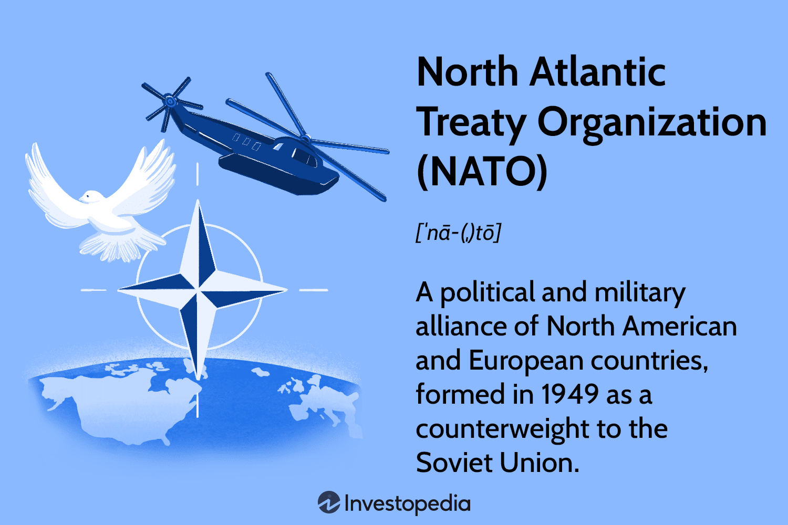

## Table of Contents

## What is the United Nations?

The United Nations, often called the UN, is an international group made up of many countries. It was created after World War II to help keep peace and solve problems around the world. Countries that join the UN work together to talk about and fix issues like wars, poverty, and human rights.

The UN has different parts, like the General Assembly where all countries can speak, and the Security Council which focuses on keeping peace. The UN also helps with things like giving food to hungry people, helping refugees, and fighting diseases. It's like a big team where countries help each other to make the world a better place.

## What is the primary purpose of the United Nations?

The main goal of the United Nations is to keep peace and help countries work together. After World War II, many countries wanted to make sure big fights like that didn't happen again. So, they created the UN to help solve problems before they turn into wars. The UN tries to do this by getting countries to talk and work out their differences peacefully.

The UN also helps with other big problems around the world. It works to make sure people have enough food, good health care, and their rights are protected. The UN helps countries that are poor or have been hit by disasters. By working together, the UN tries to make the world a better place for everyone.

## How is the United Nations structured?

The United Nations is made up of different parts that work together to help the world. The main part is the General Assembly, where all the countries that are members of the UN can come and talk. Each country gets one vote, and they can discuss anything from peace to human rights. Another important part is the Security Council, which focuses on keeping peace and can make decisions that all countries have to follow. The Security Council has 15 members, but only 5 of them, called permanent members, have a special power to stop decisions they don't like.

There are also other parts of the UN that help with specific problems. The Secretariat is like the UN's office, run by the Secretary-General, who helps manage everything. The International Court of Justice is like a world court that solves disagreements between countries. The Economic and Social Council works on issues like poverty and health, and it helps different groups and countries work together. The UN also has special groups like UNICEF, which helps children, and the World Food Programme, which fights hunger.

All these parts of the UN work together to make the world a better place. They help countries talk to each other, solve problems, and work on big issues like peace, health, and human rights. By working together, the UN tries to make sure everyone can live safely and happily.

## What are the main organs of the United Nations and their functions?

The United Nations has six main organs that help it do its job. The General Assembly is like a big meeting where all the countries that are part of the UN can talk and vote. Each country gets one vote, and they can discuss anything from peace to human rights. The Security Council focuses on keeping peace around the world. It has 15 members, but 5 of them, called permanent members, have a special power to stop decisions they don't like. The Secretariat is like the UN's office, run by the Secretary-General, who helps manage everything and make sure the UN's work gets done.

The International Court of Justice is like a world court that solves disagreements between countries. It helps make sure countries follow international laws. The Economic and Social Council works on issues like poverty, health, and education. It helps different groups and countries work together to solve these problems. The Trusteeship Council used to help countries that were not yet independent, but it doesn't do much anymore because most of those countries are now independent.

All these organs work together to help the UN achieve its goals. They help countries talk to each other, solve problems, and work on big issues like peace, health, and human rights. By working together, the UN tries to make sure everyone can live safely and happily.

## How does one become a member of the United Nations?

To become a member of the United Nations, a country needs to follow a few steps. First, the country has to show that it is peaceful and wants to work with other countries. It sends a letter to the Secretary-General of the UN saying it wants to join. Then, the Security Council, which is a group of 15 countries, looks at the request. If most of the Security Council members agree and none of the five permanent members say no, the request goes to the General Assembly.

The General Assembly is a big meeting where all the countries that are already members of the UN get to vote. If two-thirds of the countries in the General Assembly vote yes, the new country can join the UN. After that, the country can take part in all the meetings and help make decisions about important issues like peace, health, and human rights. This way, the UN makes sure that new members will help make the world a better place.

## What are the criteria for membership in the United Nations?

To become a member of the United Nations, a country needs to be peaceful and willing to work with other countries. It starts by sending a letter to the UN's Secretary-General saying it wants to join. Then, the Security Council, which is made up of 15 countries, looks at the request. If most of the Security Council members agree and none of the five permanent members say no, the request moves forward.

Next, the request goes to the General Assembly, where all the countries that are already members of the UN get to vote. If two-thirds of the countries in the General Assembly vote yes, the new country can join the UN. This process makes sure that new members will help make the world a better place by working together on important issues like peace, health, and human rights.

## How does the United Nations maintain international peace and security?

The United Nations works hard to keep peace and security around the world. It does this mainly through its Security Council, which is a group of 15 countries that focus on stopping wars and solving conflicts. When there's a problem, the Security Council can decide to send peacekeepers to help. Peacekeepers are soldiers from different countries who go to places where there's fighting to help keep people safe and make sure everyone follows the rules. The Security Council can also tell countries to stop fighting or even put special rules on them if they don't listen.

The UN also helps countries talk to each other to solve their problems without fighting. It does this through meetings and talks where countries can share their ideas and work out their differences peacefully. The UN also has special groups that help with things like making sure people have enough food and good health care, which can help stop fights from starting in the first place. By working together and helping each other, the UN tries to make sure everyone can live safely and happily.

## What role does the United Nations play in promoting sustainable development?

The United Nations helps countries work together to make the world a better place for everyone, now and in the future. It does this by promoting sustainable development, which means making sure people can have what they need without hurting the planet. The UN set up the Sustainable Development Goals (SDGs), which are 17 big goals that countries should try to reach by the year 2030. These goals include things like ending poverty, making sure everyone has enough food, and keeping the earth clean and healthy.

To help reach these goals, the UN works with countries to make plans and share ideas. It helps countries learn from each other and find new ways to grow their economies without hurting the environment. The UN also gives money and support to projects that help with things like building schools, improving health care, and protecting nature. By working together, the UN hopes to make sure that people everywhere can live good lives without using up all the earth's resources.

## How does the United Nations address human rights issues?

The United Nations works hard to make sure everyone's human rights are protected. It does this by having a special part called the United Nations Human Rights Council. This group looks at human rights problems around the world and tries to fix them. They can tell countries to stop doing things that hurt people's rights, and they can also help countries make new laws to protect people better. The UN also has special people called "Special Rapporteurs" who focus on different human rights issues, like the rights of children or the right to clean water. These people visit countries, talk to people, and write reports to help make things better.

The UN also helps by making big agreements that countries can sign. One of the most important ones is called the Universal Declaration of Human Rights. This agreement says that everyone should have basic rights like the right to life, freedom, and fairness. When countries sign these agreements, they promise to follow the rules and protect people's rights. If a country isn't following the rules, the UN can talk to them and try to help them do better. By working together, the UN tries to make sure everyone, everywhere can live with dignity and respect.

## What is the veto power in the UN Security Council and how does it work?

The veto power is a special rule in the UN Security Council that lets five countries stop decisions they don't like. These five countries are the United States, Russia, China, France, and the United Kingdom. They are called permanent members because they always have a seat on the Security Council. If any one of these countries says no to a decision, it can't happen, even if all the other countries agree. This power is meant to make sure these big countries feel safe and can work together to keep peace.

When the Security Council wants to make a big decision, like sending peacekeepers or telling a country to stop fighting, they need at least nine votes out of the fifteen members. But if any of the five permanent members use their veto, the decision won't go through. This can be a problem because it means one country can stop something important from happening, even if most other countries think it's a good idea. But it also helps make sure the Security Council can only make decisions that everyone agrees are really important.

## How does the United Nations coordinate humanitarian aid and assistance?

The United Nations helps people who need it by giving them food, water, and other things they need to live. It does this through different groups like the World Food Programme, which gives food to hungry people, and UNICEF, which helps children. When there's a big problem like a war or a natural disaster, the UN works with countries and other groups to figure out what people need and how to get it to them quickly. They make plans and send help to places where it's needed the most.

The UN also tries to make sure that help gets to everyone who needs it, no matter where they are or who they are. They work hard to make sure that aid is given out fairly and that it reaches people in time. The UN talks to countries and other groups to make sure everyone is working together and that the help is used in the best way possible. By doing this, the UN tries to make sure that people who are in trouble get the help they need to stay safe and healthy.

## What reforms have been proposed or implemented to improve the effectiveness of the United Nations?

Many people have ideas about how to make the United Nations work better. One big idea is to change how the Security Council works. Some people think there should be more countries on the Security Council, especially from places like Africa and Latin America. They also think that the veto power, which lets five countries stop decisions they don't like, should be changed or taken away. This could help the UN make decisions more fairly and quickly.

Another idea is to make the UN's work more clear and easy to understand. Some people want the UN to share more information about what it's doing and how it's spending money. This could help people trust the UN more and see that it's doing a good job. The UN has already started to do some of these things, like making reports easier to read and using technology to share information faster. By making these changes, the UN hopes to work better and help more people around the world.

## References & Further Reading

[1]: Lopez de Prado, M. (2018). ["Advances in Financial Machine Learning."](https://www.amazon.com/Advances-Financial-Machine-Learning-Marcos/dp/1119482089) Wiley.

[2]: Aronson, D. (2007). ["Evidence-Based Technical Analysis: Applying the Scientific Method and Statistical Inference to Trading Signals."](https://www.amazon.com/Evidence-Based-Technical-Analysis-Scientific-Statistical/dp/0470008741) Wiley.

[3]: Jansen, S. (2020). ["Machine Learning for Algorithmic Trading."](https://github.com/stefan-jansen/machine-learning-for-trading) Packt Publishing.

[4]: Chan, E. P. (2009). ["Quantitative Trading: How to Build Your Own Algorithmic Trading Business."](https://github.com/ftvision/quant_trading_echan_book) Wiley.

[5]: Fabozzi, F. J., Focardi, S. M., & Kolm, P. N. (2010). ["Quantitative Equity Investing: Techniques and Strategies."](https://www.semanticscholar.org/paper/Quantitative-Equity-Investing%3A-Techniques-and-Fabozzi-Focardi/1c49a2a53919f7e65cb96f16691b8ff726fd3cd7) Wiley.

[6]: Aldridge, I. (2013). ["High-Frequency Trading: A Practical Guide to Algorithmic Strategies and Trading Systems."](https://www.ahmetbeyefendi.com/wp-content/uploads/2020/07/High-Frequency-Trading-Irene-Aldridge.pdf) Wiley.

[7]: United Nations Conference on Trade and Development (UNCTAD) [Official Website](https://unctad.org/)

[8]: High-Frequency Trading: Background, Risks, and Issues (2014). [Congressional Research Service Report](https://crsreports.congress.gov/product/pdf/R/R43608).