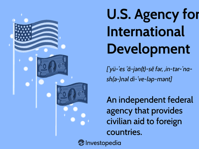

In today's interconnected world, international development and economic advancement are deeply intertwined. The United States plays a crucial role in fostering these developments through its foreign aid initiatives, primarily driven by the United States Agency for International Development (USAID). This agency's efforts have become integral to promoting peace, security, and economic prosperity globally. By aiding countries in building robust health, education, and economic systems, foreign aid serves as a catalyst for global stability and growth.

Simultaneously, the rise of algorithmic trading (algo trading) in economic markets signifies a transformative shift in how trading is perceived and conducted. Algo trading employs computer algorithms to drive trading decisions, leading to increased market efficiency, liquidity, and reduced transaction costs. This innovative approach influences international markets by shaping investor behaviors and trends through data-driven decisions.

This article explores the importance of U.S. foreign aid and the pivotal role of USAID in international development. Additionally, it examines the intersection of these efforts with algo trading in shaping global economies. U.S. foreign aid is a vital tool for promoting global stability and economic growth, addressing challenges like poverty, disease, and education deficits. It also fosters diplomatic relationships and enhances global economic stability. 

Algo trading, as a modern mechanism, revolutionizes international markets by contributing to market efficiency and liquidity. Moreover, USAID's strategic initiatives align with global economic growth and sustainability by supporting environments conducive to technological advancements. The intersection of these elements establishes a framework for understanding how the United States influences global economies through development aid and evolving financial practices.

## Table of Contents

## The Role of U.S. Foreign Aid in International Development

Foreign aid is a cornerstone of United States foreign policy, integral to promoting peace, security, and prosperity globally. The U.S. Agency for International Development (USAID) plays a critical role in this regard, directing American resources towards developmental aid that encompasses health, education, economic growth, and humanitarian assistance. This section examines the impact and strategic importance of U.S. foreign aid in addressing global challenges and fostering diplomatic ties that contribute to international stability.

The United States employs foreign aid to combat poverty, address health crises, and bridge education gaps in developing regions. Through initiatives spearheaded by USAID, significant strides have been made in combating diseases such as HIV/AIDS, malaria, and tuberculosis. For instance, USAID's contributions to the President's Emergency Plan for AIDS Relief (PEPFAR) have been instrumental in saving millions of lives, showcasing the direct impact of U.S. aid on global health.

Furthermore, U.S. foreign aid is pivotal in addressing education deficits, with USAID investing in educational programs that aim to enhance literacy rates and improve educational access in developing nations. These programs are designed to empower communities by providing crucial skills and building human capital, which in turn supports economic development.

Statistical data underscores the scale of U.S. foreign aid initiatives. In fiscal year 2020, the United States allocated approximately $51 billion for foreign aid. This included $19.5 billion in economic assistance and $14.4 billion in humanitarian aid. These figures highlight the U.S.'s substantial investment in global development and its role as a leading donor of foreign aid.

Beyond addressing immediate development needs, U.S. foreign aid serves a strategic purpose in fostering diplomatic relationships and promoting global stability. Aid serves as a tool for soft power, helping to strengthen alliances, support democratic governance, and promote economic development in strategic regions. By fostering stable and prosperous societies, U.S. foreign aid indirectly contributes to global security, reducing the threats of conflict and terrorism that can arise from marginalized populations.

The strategic importance of this aid can also be seen in its contribution to economic stability. By investing in infrastructure, fostering entrepreneurship, and enabling access to global markets, U.S. foreign aid helps to create conditions favorable for sustainable economic growth.

In summary, U.S. foreign aid, primarily facilitated through USAID, is a vital mechanism for promoting global development and stability. By addressing pressing global challenges and fostering diplomatic relations, it plays an instrumental role in shaping a more peaceful and prosperous world.

## USAID: Driving Economic and Humanitarian Progress

USAID, founded in 1961 under the aegis of President John F. Kennedy, operates as the United States' foremost agency in administering civilian foreign aid. The agency's establishment marked a consolidation of various U.S. foreign aid programs into a singular, cohesive entity intended to bolster U.S. foreign policy and international development objectives. Over the decades, USAID has evolved in response to global challenges, embracing new mandates that prioritize sustainable development and humanitarian assistance.

USAID's historical evolution is punctuated by strategic realignments to address emerging global issues. Initially centered around providing technical and economic assistance during the Cold War, its focus has transitioned to encompass a broad range of concerns, from global health to economic development, reflecting a more interconnected global landscape. The agency's mandates now align closely with international development priorities and the United Nations Sustainable Development Goals (SDGs). These goals include eradicating poverty, promoting peace and justice, and ensuring access to quality education and healthcare globally.

USAID's impact can be observed in multiple regions, with substantial programs operating across Sub-Saharan Africa, Asia, and the Middle East. In Sub-Saharan Africa, USAID initiatives have concentrated on enhancing agricultural productivity, improving health systems, and combating infectious diseases such as HIV/AIDS and malaria. For instance, the President's Malaria Initiative, in which USAID is a participating agency, aims to reduce malaria-related mortality through widespread distribution of insecticide-treated mosquito nets and improved malaria diagnosis and treatment.

In Asia, USAID has focused on economic growth through the promotion of trade and investment, the establishment of educational programs, and disaster risk reduction efforts. The agency's efforts in the Middle East often involve programs aimed at governance reform, economic stabilization, and humanitarian assistance in conflict zones. These efforts are vital, especially given the volatile conditions resulting from ongoing conflicts and political instability in many parts of the region.

USAID's strategic objectives are inherently aligned with the SDGs. By addressing issues like poverty eradication, health improvements, and education access, the agency contributes directly to the achievement of these global targets. USAID's work in disaster relief exemplifies its commitment to humanitarian progress, operating in conjunction with international partners to deliver timely aid during crises. Similarly, USAID plays an instrumental role in conflict prevention and recovery, implementing programs that foster resilience and rehabilitate communities disrupted by conflict.

The agency's contributions to sustainable development are evident through initiatives that promote renewable energy usage, encourage responsible resource management, and support climate adaptation measures. These efforts are harmonious with the SDGs aimed at combating climate change and ensuring sustainable management of natural resources.

Through its adaptive strategies and comprehensive programs, USAID continues to champion international development and humanitarian progress, reaffirming its crucial role in fostering global stability and prosperity.

## The Impact of Algorithmic Trading on Global Economics

Algorithmic trading, often referred to as algo trading, utilizes computer algorithms to automate trading activities based on predefined criteria. Since its inception in the late 20th century, [algorithmic trading](/wiki/algorithmic-trading) has revolutionized the financial markets by executing orders with speed and accuracy unattainable through manual trading. This approach not only enhances market efficiency but also increases [liquidity](/wiki/liquidity-risk-premium) and reduces transaction costs.

### Contributions to Market Efficiency and Liquidity

Algorithmic trading significantly contributes to market efficiency by enabling rapid price discovery and aligning prices more closely with intrinsic values. It achieves this through the high-speed processing of large volumes of data, allowing for immediate reactions to market changes. The constant interplay of buy and sell orders helps maintain a stable market environment by minimizing large price discrepancies.

Moreover, algo trading enhances market liquidity by providing continuous market presence. Algorithms can easily handle large order volumes, ensuring that trades occur with minimal price impact. This improved liquidity leads to narrower bid-ask spreads, benefiting investors through reduced transaction costs.

### Shaping Market Trends and Investor Behaviors

The strategies employed in algorithmic trading play a pivotal role in shaping market trends and investor behaviors. For example, trend-following algorithms can amplify market movements by executing trades that build on existing price trends, potentially leading to accelerated market dynamics. Conversely, mean-reversion strategies can help stabilize markets by capitalizing on price deviations from perceived fair values.

Algorithmic trading also influences investor behaviors by altering the landscape of market entry and [exit](/wiki/exit-strategy) points. The ability to execute trades based on complex strategies within milliseconds encourages investors to adopt more sophisticated trading approaches, leveraging statistical [arbitrage](/wiki/arbitrage) and [machine learning](/wiki/machine-learning) models for prediction and execution.

### Regulatory Landscape and Implications

The rise of algorithmic trading has prompted regulatory bodies worldwide to scrutinize its effects on financial markets. Regulations focus on ensuring transparency, fairness, and stability within markets dominated by high-frequency traders. Key regulatory measures include the implementation of circuit breakers, intended to halt trading during extreme [volatility](/wiki/volatility-trading-strategies), and the enforcement of minimum resting times for orders to prevent market manipulation.

These regulations aim to mitigate systemic risks posed by algorithmic trading, such as the potential exacerbation of market crashes and flash crashes due to erroneous algorithms. They also address concerns over "dark pools," private exchanges where algorithmic trading can occur without immediate public disclosure.

### Risks and Challenges of High-Frequency Trading

While algorithmic trading offers notable advantages, it also presents significant risks and challenges. High-frequency trading ([HFT](/wiki/high-frequency-trading-strategies)), a subset of algo trading, can introduce substantial market volatility due to its rapid trade execution and order cancellations. HFT can lead to decreased market transparency and perceived fairness, as these traders can exploit minute price differences inaccessible to traditional investors.

Another potential challenge is the reliance on complex algorithms, which can fail or behave unpredictably due to programming errors or unforeseen market conditions. This underscores the need for robust risk management practices and thorough testing of algorithms before deployment.

In conclusion, algorithmic trading continues to transform global economics by improving market dynamics and influencing investor strategies. However, its implementation necessitates careful regulatory oversight and risk management to maintain market integrity and prevent systemic disruptions.

## Synergies Between USAID's Efforts and Economic Growth Through Algo Trading

USAID's initiatives play a crucial role in creating robust and sustainable economic environments, laying a solid foundation for the adoption and growth of algorithmic trading (algo trading). By focusing on strengthening financial infrastructures, USAID fosters conditions conducive to advanced trading technologies, enabling efficient capital flow and increased investment in developing countries.

The development of financial markets is greatly enhanced by algorithmic strategies, which contribute to market efficiency, liquidity, and reduced transaction costs. Algo trading employs complex mathematical models and algorithms to execute trades at high speeds, often across multiple markets, to capitalize on investment opportunities. This technology not only supports market efficiency but also attracts capital inflow, providing investors with the confidence to invest in economies previously considered high-risk.

USAID's role in facilitating trade capacity is intertwined with technological and financial advancements. By implementing programs that enhance financial literacy, infrastructure, and regulatory frameworks, USAID ensures that emerging markets are equipped to integrate innovative trading practices. For instance, the introduction of digital platforms and financial services in underserved regions increases transparency and access, essential elements for algorithmic trading to thrive.

Case studies provide insight into USAID's impact on fostering economic environments where algo trading proves beneficial. In several African countries, USAID has partnered with local governments and institutions to modernize financial systems, paving the way for advanced trading technologies. These efforts have led to the creation of financial ecosystems where algorithmic strategies can function effectively, thereby attracting international investors and spurring economic growth.

Collaborations between USAID and private sector firms are instrumental in leveraging algorithmic trading for positive economic change. By partnering with fintech companies, USAID supports the development of infrastructure and platforms that facilitate algo trading. Such partnerships enhance the capacity for risk management and transaction efficiency, ultimately contributing to more resilient and dynamic financial markets.

In conclusion, USAID's strategic efforts in building strong economic foundations are pivotal in enabling algorithmic trading's potential to stimulate economic growth in developing regions. By aligning developmental goals with technological advancements, USAID ensures that financial markets are not only inclusive and robust but also capable of adapting to modern trading technologies.

## Conclusion

The multifaceted impact of U.S. foreign aid and USAID's pivotal role in international development cannot be overstated. U.S. foreign aid, channeled through USAID, has contributed significantly to global stability by addressing urgent humanitarian needs, enhancing educational opportunities, and supporting economic growth in developing nations. Through strategic investments and partnerships, USAID has helped build infrastructures, fostered health advancements, and promoted sustainable development, aligning with the United Nations' Sustainable Development Goals (SDGs).

Algorithmic trading represents a transformative force in global markets, optimizing trading processes through speed, accuracy, and data-driven strategies. By improving market efficiency, liquidity, and reducing transaction costs, algorithmic trading facilitates an environment that can potentially drive economic growth and stability in both developed and developing countries.

Continued synergy between governmental aid efforts and modern trading practices is essential for balanced and sustainable global development. By intertwining the objectives of international aid with the advancements in financial technology, nations can harness the dual benefits of improved market functionality and socio-economic progress. It is critical for policymakers to create environments where international development goals and financial technologies coalesce, ensuring that both sectors progress effectively and ethically.

To enhance collaboration between USAID initiatives and innovative financial market strategies, a robust framework is necessary. This framework could involve public-private partnerships, fostering innovation through regulatory environments that encourage experimentation while safeguarding against volatility and systemic risks. Additionally, shared knowledge platforms between USAID, financial institutions, and tech firms could lead to mutually beneficial outcomes, ensuring that economic growth fosters inclusive and sustainable development across the globe.

## References & Further Reading

[1]: Tarnoff, C. (2015). ["U.S. Agency for International Development (USAID): Background, Operations, and Issues."](https://sgp.fas.org/crs/row/R44117.pdf) Congressional Research Service.

[2]: Lopez de Prado, M. (2018). ["Advances in Financial Machine Learning."](https://www.amazon.com/Advances-Financial-Machine-Learning-Marcos/dp/1119482089) Wiley.

[3]: Aronson, D. R. (2006). ["Evidence-Based Technical Analysis: Applying the Scientific Method and Statistical Inference to Trading Signals."](https://www.amazon.com/Evidence-Based-Technical-Analysis-Scientific-Statistical/dp/0470008741) Wiley.

[4]: Jansen, S. (2020). ["Machine Learning for Algorithmic Trading."](https://github.com/stefan-jansen/machine-learning-for-trading) Packt Publishing.

[5]: Chan, E. P. (2008). ["Quantitative Trading: How to Build Your Own Algorithmic Trading Business."](https://github.com/ftvision/quant_trading_echan_book) Wiley.

[6]: President's Emergency Plan for AIDS Relief (PEPFAR). ["2020 Annual Report."](https://www.state.gov/pepfar-reports-to-congress-archive/) U.S. Department of State.