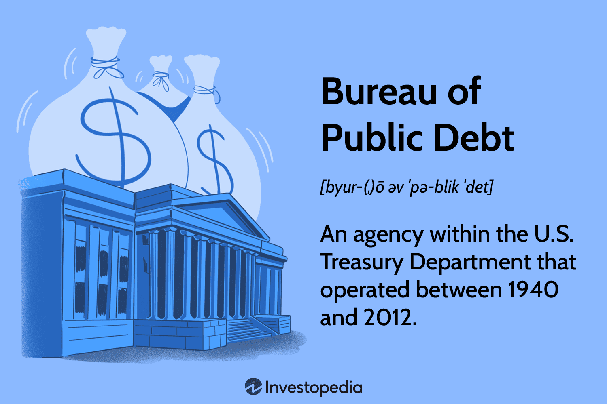

## Table of Contents

## What is the United States Bureau of the Public Debt?

The United States Bureau of the Public Debt was a part of the U.S. Department of the Treasury. It was responsible for managing the national debt of the United States. This included keeping track of how much money the country owed and making sure that the government paid back its loans on time.

The Bureau was created in 1940 and worked closely with the U.S. Treasury to sell government securities like bonds and savings bonds. These securities helped the government borrow money from people and institutions. In 2012, the Bureau merged with the Financial Management Service to form the Bureau of the Fiscal Service, which now handles these responsibilities.

## When was the United States Bureau of the Public Debt established?

The United States Bureau of the Public Debt was set up in 1940. It was part of the U.S. Department of the Treasury. Its main job was to take care of the country's national debt. This meant keeping track of how much money the government owed and making sure it paid back its loans on time.

The Bureau worked closely with the U.S. Treasury to sell government securities like bonds and savings bonds. These securities helped the government borrow money from people and institutions. In 2012, the Bureau joined with the Financial Management Service to create the Bureau of the Fiscal Service, which now does the same work.

## What are the main functions of the United States Bureau of the Public Debt?

The United States Bureau of the Public Debt was responsible for managing the national debt of the United States. This meant they kept track of how much money the government owed. They also made sure the government paid back its loans on time. The Bureau was part of the U.S. Department of the Treasury and started its work in 1940.

The Bureau worked closely with the U.S. Treasury to sell government securities like bonds and savings bonds. These securities helped the government borrow money from people and institutions. By doing this, the Bureau helped the government get the money it needed to run the country. In 2012, the Bureau merged with the Financial Management Service to form the Bureau of the Fiscal Service, which now handles these responsibilities.

## How does the Bureau of the Public Debt manage the national debt?

The United States Bureau of the Public Debt was a part of the U.S. Department of the Treasury. Its main job was to keep track of how much money the government owed. This meant they managed the national debt, which is the total amount of money the government borrowed. They made sure the government paid back its loans on time. This was important because if the government didn't pay back its loans, it could cause problems for the country's economy.

The Bureau worked closely with the U.S. Treasury to sell government securities like bonds and savings bonds. These securities are like IOUs that the government gives to people and institutions who lend them money. By selling these securities, the Bureau helped the government borrow the money it needed to run the country. In 2012, the Bureau joined with the Financial Management Service to create the Bureau of the Fiscal Service, which now does the same work.

## What types of securities does the Bureau issue to finance the national debt?

The United States Bureau of the Public Debt issued different types of securities to help finance the national debt. One common type of security was bonds. Bonds are like loans that people and institutions give to the government. The government promises to pay back the money with interest over a certain period of time. Another type of security was savings bonds. Savings bonds are similar to bonds but are usually smaller in amount and are often bought by individuals as a safe way to save money.

These securities helped the government borrow the money it needed to run the country. By selling bonds and savings bonds, the Bureau made sure the government could pay for important things like building roads, schools, and other public services. The money from these securities also helped the government manage the national debt, which is the total amount of money the government owes. In 2012, the Bureau merged with the Financial Management Service to form the Bureau of the Fiscal Service, which now handles these responsibilities.

## How does the Bureau of the Public Debt interact with the public and investors?

The United States Bureau of the Public Debt interacted with the public and investors by selling government securities like bonds and savings bonds. These securities allowed people and institutions to lend money to the government. When people bought these securities, they were helping the government finance its operations and manage the national debt. The Bureau made sure that information about these securities was clear and accessible, so people could understand how to invest and what returns they might expect.

The Bureau also worked to ensure that the government paid back its loans on time. This was important because it built trust with the public and investors. If people knew the government would pay them back, they were more likely to buy securities. The Bureau used various methods to communicate with the public, such as websites, brochures, and customer service lines, to answer questions and provide updates on the national debt and the securities they issued. In 2012, the Bureau merged with the Financial Management Service to form the Bureau of the Fiscal Service, which now handles these responsibilities.

## What is the role of the Bureau in relation to the U.S. Department of the Treasury?

The United States Bureau of the Public Debt was a part of the U.S. Department of the Treasury. Its main job was to manage the national debt, which is the total amount of money the government owes. The Bureau worked closely with the Treasury to keep track of how much money the government borrowed and to make sure it paid back its loans on time. This was important because it helped keep the country's economy stable.

The Bureau also helped the government borrow money by selling securities like bonds and savings bonds. These securities were like IOUs that the government gave to people and institutions who lent them money. By selling these securities, the Bureau helped the government get the money it needed to run the country and pay for things like roads and schools. In 2012, the Bureau merged with the Financial Management Service to form the Bureau of the Fiscal Service, which now does the same work.

## How has the role of the Bureau of the Public Debt evolved over time?

The United States Bureau of the Public Debt was created in 1940 as part of the U.S. Department of the Treasury. Its main job was to manage the national debt, which means keeping track of how much money the government owed and making sure it paid back its loans on time. The Bureau worked closely with the Treasury to sell government securities like bonds and savings bonds. These securities helped the government borrow money from people and institutions to run the country and pay for things like roads and schools.

Over time, the Bureau's role stayed focused on managing the national debt, but it also adapted to new technologies and methods. For example, it used websites, brochures, and customer service lines to communicate with the public and investors about the securities it issued. This helped build trust and made it easier for people to invest in government securities. In 2012, the Bureau merged with the Financial Management Service to form the Bureau of the Fiscal Service. This new bureau took over the responsibilities of managing the national debt and continued the work of the Bureau of the Public Debt.

## What are some significant historical events or crises that the Bureau has managed?

The United States Bureau of the Public Debt played a key role during World War II. During the war, the government needed a lot of money to pay for the military and other expenses. The Bureau helped by selling war bonds to the public. These bonds were a way for people to lend money to the government to help with the war effort. The Bureau made sure that the money from these bonds was used correctly and that the government paid back the loans when the war was over.

Another significant event was the financial crisis of 2008. During this time, the economy was in trouble, and the government needed to borrow more money to help stabilize it. The Bureau of the Public Debt managed the increased borrowing by issuing more securities like Treasury bonds. They worked to make sure that investors still trusted the government to pay back its debts, even during such a difficult time. This helped the government get the money it needed to support the economy and recover from the crisis.

## How does the Bureau ensure the security and integrity of the financial transactions it oversees?

The United States Bureau of the Public Debt made sure that the financial transactions it handled were safe and trustworthy. They did this by using strong security measures to protect the information and money involved in these transactions. For example, they used encryption to keep data secure and had strict rules about who could access important financial systems. This helped prevent fraud and kept the money safe.

The Bureau also worked hard to make sure everything was done correctly. They had systems in place to check and double-check all the transactions they managed. This meant that if there was a mistake or something suspicious, they could catch it quickly. By doing this, the Bureau helped make sure that the government's financial dealings were honest and reliable, which was important for keeping the trust of the public and investors.

## What technological systems and innovations has the Bureau implemented to improve its operations?

The United States Bureau of the Public Debt used technology to make its work easier and more secure. They created computer systems to keep track of the national debt and all the money the government owed. These systems helped them manage the huge amount of data they had to deal with every day. They also used technology to make sure that all the financial transactions they handled were safe. For example, they used encryption to protect data and set up strict rules about who could access their systems. This helped prevent fraud and kept the money safe.

The Bureau also used technology to communicate with the public and investors. They set up websites where people could find information about government securities like bonds and savings bonds. They also used online tools to make it easier for people to buy these securities. This helped the government borrow the money it needed to run the country. By using technology, the Bureau made its operations more efficient and helped build trust with the public by making information easy to find and understand.

## How does the Bureau of the Public Debt coordinate with other federal agencies and international bodies in managing the national debt?

The United States Bureau of the Public Debt worked closely with other parts of the U.S. government to manage the national debt. It was part of the U.S. Department of the Treasury, so it worked directly with the Treasury to keep track of how much money the government owed and to sell securities like bonds and savings bonds. These securities helped the government borrow money from people and institutions. The Bureau also coordinated with other federal agencies, like the Federal Reserve, to make sure the government's financial dealings were smooth and well-managed. This teamwork was important because it helped the government get the money it needed to run the country and pay for things like roads and schools.

The Bureau also worked with international bodies to manage the national debt. For example, it communicated with organizations like the International Monetary Fund (IMF) and the World Bank to share information about the U.S. economy and its debt. This was important because it helped keep the global financial system stable. By working with these international groups, the Bureau helped make sure that the U.S. government could borrow money from other countries if needed. This cooperation helped the U.S. manage its national debt in a way that was trusted and respected around the world.

## What is the understanding of public debt and government finance?

The U.S. government employs various strategies to manage its finances, among which borrowing through the issuance of Treasury securities is the most prominent. Treasury securities, which include Treasury bills, notes, and bonds, are essential tools for raising funds required to support government operations and public projects. The funds obtained from these securities are utilized in numerous sectors, including infrastructure development, education, healthcare, and defense. This financial approach enables the government to meet its financial commitments while stimulating economic growth.

Public debt serves as a crucial economic lever, allowing the government to fund immediate needs without resorting to abrupt tax increases or spending cuts. Public debt can be expressed using the equation:

$$
\text{Public Debt} = \text{Treasury Securities} + \text{Other Liabilities}
$$

This highlights the role of Treasury securities as a cornerstone of public financing. The effective management of public debt is vital for maintaining fiscal stability and ensuring that the borrowing costs remain sustainable over time. Notably, a high level of public debt relative to Gross Domestic Product (GDP) can lead to increased interest rates and crowding out of private investment, posing challenges to long-term economic health.

The Bureau of the Fiscal Service, an agency under the U.S. Department of the Treasury, plays a pivotal role in overseeing the issuance and management of government debt. Its responsibilities include the auctioning of Treasury securities, recording and tracking the debt, and ensuring compliance with statutory debt limits. The Bureau works to ensure that government borrowing is conducted efficiently and cost-effectively, minimizing the burden on taxpayers.

The Bureau also provides timely data and analysis on the status of federal debt, which is crucial for ensuring transparency and informing the government's fiscal policy decisions. This comprehensive management of government debt is essential not only for maintaining the confidence of investors but also for preserving the overall health of the U.S. economy. 

Through these efforts, the government can secure funding for essential public services and infrastructure projects, thus fostering economic development and stability. Addressing the challenges posed by large-scale borrowing requires a balanced approach that considers both present and future fiscal needs. Understanding these financial dynamics is essential for policymakers and investors as they navigate the complexities of fiscal strategy and public debt management.

## References & Further Reading

[1]: ["Algorithmic Trading and DMA: An Introduction to Direct Access Trading Strategies"](https://www.amazon.com/Algorithmic-Trading-DMA-introduction-strategies/dp/0956399207) by Barry Johnson

[2]: ["Advances in Financial Machine Learning"](https://www.amazon.com/Advances-Financial-Machine-Learning-Marcos/dp/1119482089) by Marcos Lopez de Prado

[3]: ["Evidence-Based Technical Analysis: Applying the Scientific Method and Statistical Inference to Trading Signals"](https://www.amazon.com/Evidence-Based-Technical-Analysis-Scientific-Statistical/dp/0470008741) by David Aronson

[4]: ["Machine Learning for Algorithmic Trading"](https://github.com/stefan-jansen/machine-learning-for-trading) by Stefan Jansen

[5]: ["Quantitative Trading: How to Build Your Own Algorithmic Trading Business"](https://www.amazon.com/Quantitative-Trading-Build-Algorithmic-Business/dp/1119800064) by Ernest P. Chan

[6]: ["The U.S. Treasury Market: An Overview"](https://www.sifma.org/explore-issues/treasury-market-structure/) by The Federal Reserve

[7]: ["U.S. Treasury Securities"](https://en.wikipedia.org/wiki/United_States_Treasury_security) by U.S. Department of the Treasury