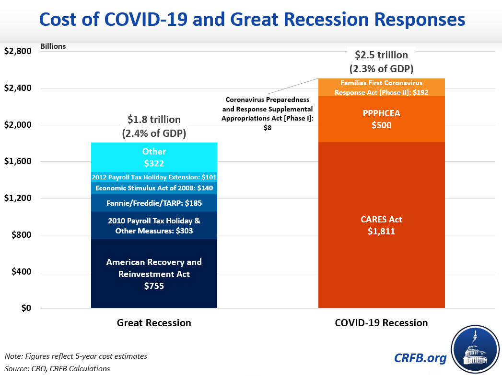

## Table of Contents

## What is the purpose of the United States COVID-19 economic stimulus and relief?

The United States COVID-19 economic stimulus and relief was created to help people and businesses during the hard times caused by the coronavirus. When the virus started spreading, many people lost their jobs and businesses had to close. This made it tough for people to pay for things they needed, like food and rent. The government wanted to help by giving money to people and businesses to keep them going until things got better.

The relief packages included direct payments to many Americans, extra money for unemployment benefits, and loans or grants for small businesses. This was meant to help people keep buying things and to stop businesses from closing forever. By doing this, the government hoped to keep the economy from getting too bad and to help it recover faster once the virus was under control.

## How was the need for economic stimulus identified during the COVID-19 crisis?

The need for economic stimulus during the COVID-19 crisis was identified as the virus spread and caused big problems. When people got sick, they had to stay home, and many businesses had to close to stop the virus from spreading more. This meant a lot of people lost their jobs and didn't have money coming in. Without money, people couldn't buy things they needed, and this hurt the whole economy. The government saw that if they didn't do something, the economy could get much worse.

To figure out how bad things were, the government looked at numbers like how many people were out of work, how much money people were spending, and how many businesses were closing. They saw that these numbers were getting worse very fast. This showed that people and businesses needed help right away. So, the government decided to create economic stimulus and relief plans to give people money and support businesses, hoping to keep the economy from falling apart.

## What are the main components of the economic stimulus packages?

The main parts of the economic stimulus packages were direct payments to people and help for businesses. The government sent money straight to many Americans to help them pay for things they needed, like food and bills. This was called a stimulus check, and it was meant to give people some quick cash to keep spending and help the economy. The amount of money people got depended on things like how much they earned and if they had kids.

Another big part was helping businesses, especially small ones. The government made loans and grants available so businesses could keep paying their workers and stay open. This was important because if too many businesses closed, it would be hard for the economy to get better. Some businesses got money they didn't have to pay back, and others got loans that could be forgiven if they used the money in certain ways, like keeping people employed.

There were also other parts of the stimulus packages, like extra money for unemployment benefits. People who lost their jobs got more money each week to help them get by. This was important because it meant people could still buy things even if they weren't working. The government also helped states and local governments, which were struggling because they had less money coming in and more costs from dealing with the virus. All these parts worked together to try to keep the economy from getting too bad during the crisis.

## How have different demographic groups been affected by the economic relief measures?

Different groups of people were affected in different ways by the economic relief measures. For people who lost their jobs, the extra money for unemployment benefits was a big help. It gave them more money each week so they could still pay for things like food and rent. Families with kids also got more help because they got bigger stimulus checks. But not everyone got the same amount of help. Some people, like those who were already retired or didn't have a job before the virus, didn't get as much help from these measures.

Small business owners were another group that got a lot of help. The government gave them loans and grants to keep their businesses open and to keep paying their workers. This was really important for people who owned small shops or restaurants because they were hit hard by the virus. But bigger companies also got help, and some people thought they got too much. Also, some groups like people who didn't speak English well or didn't have bank accounts had a harder time getting the help they needed because they didn't know about it or couldn't get the money easily.

## What are the key differences between the CARES Act and subsequent relief packages?

The CARES Act was the first big relief package that the government passed when the virus started to spread. It gave money directly to many Americans, with people getting up to $1,200 per adult and $500 per child. It also made unemployment benefits bigger by adding an extra $600 a week for people who lost their jobs. The CARES Act helped businesses too, especially small ones, by giving them loans and grants to stay open and keep paying workers. It was a quick response to help people and businesses when things were getting bad fast.

Later relief packages, like the American Rescue Plan, were different in some ways. The American Rescue Plan, which came out in 2021, gave people more money, with up to $1,400 per person. It also focused more on helping people and places that were hit the hardest by the virus. This package had more money for things like schools, public health, and helping states and cities that were struggling. Unlike the CARES Act, these later packages tried to fix more problems that came up after the first wave of the virus, and they aimed to help the economy recover over a longer time.

## How has the distribution of stimulus funds been managed and what challenges were encountered?

The government managed the distribution of stimulus funds mostly through the Internal Revenue Service (IRS). They used the information they had from tax returns to send money straight to people's bank accounts or by mail if they didn't have a bank account. For businesses, the Small Business Administration (SBA) handled loans and grants, often working with banks to get the money to businesses quickly. States and local governments also got money to help with their costs and to help people in their areas.

There were a lot of challenges in getting the money out. One big problem was that some people didn't get their money right away, especially if they had changed their bank details or moved. Another issue was that some people, like those who didn't file taxes or didn't have a social security number, had a harder time getting help. For businesses, the process of getting loans and grants was sometimes slow and confusing, and some businesses felt they didn't get enough help. Overall, while the government tried to get money to people and businesses as fast as they could, there were still a lot of problems to work through.

## What economic indicators have been used to measure the impact of the stimulus and relief efforts?

To see how well the stimulus and relief efforts were working, people looked at different numbers that show how the economy is doing. One important number was the unemployment rate. When the virus started, a lot of people lost their jobs, and the unemployment rate went up a lot. After the stimulus money came out, this number started to get better. People also looked at how much money people were spending. When people got stimulus checks, they spent more money on things they needed, like food and clothes. This helped businesses sell more and made the economy stronger.

Another thing people looked at was how much money businesses were making. The stimulus helped some businesses stay open and keep paying their workers. This meant they could keep making money, which was good for the economy. People also watched the stock market to see if it was going up or down. When the stimulus came out, the stock market started to go up because people felt more sure about the future. All these numbers together helped show that the stimulus and relief efforts were helping the economy get better, even though there were still a lot of problems.

## How have state and local governments utilized their portions of the relief funds?

State and local governments used their part of the relief money to help with the problems caused by the virus. They spent a lot of money on things like testing and vaccines to keep people healthy. They also helped hospitals and other places that take care of sick people. This was important because these places were very busy and needed more money to do their jobs well. Some of the money also went to help schools so they could stay open safely or teach kids online.

Another way states and local governments used the money was to help people who were having a hard time. They gave money to food banks and other places that help people who don't have enough to eat. They also helped people who couldn't pay their rent or bills because they lost their jobs. Some places used the money to fix up old buildings or start new projects to create jobs. All these things helped make life a little easier for people during a tough time.

## What are the long-term economic implications of the stimulus and relief measures?

The stimulus and relief measures have had a big impact on the economy over the long term. By giving money to people and businesses, the government helped stop the economy from getting even worse during the virus. This meant that more people could keep their jobs and businesses could stay open. Over time, this helped the economy start to grow again. But, the government had to borrow a lot of money to pay for these measures, which means the country now has more debt. This could make it harder for the government to spend money on other things in the future, like schools or roads.

Another long-term effect is that the stimulus helped change how people and businesses work. Many people started working from home and businesses had to find new ways to sell things online. This has made the economy more flexible and able to change. But, it also means that some jobs and businesses that were around before the virus might not come back. The stimulus also helped some people save more money, which they can use to buy things later. This could help the economy keep growing, but it also means that prices for things might go up because there's more money around. Overall, the stimulus and relief measures have helped the economy recover, but they've also created new challenges that will need to be dealt with in the future.

## How have the stimulus measures affected the national debt and fiscal policy?

The stimulus measures have made the national debt bigger. To give money to people and businesses, the government had to borrow a lot. This means that the country now owes more money than before. A bigger national debt can be a problem because it means the government has to pay more money in interest. This could make it harder for the government to spend money on other important things like schools, roads, and helping people who need it. So, while the stimulus helped during the crisis, it also made the country's financial situation more difficult in the long run.

The stimulus measures have also changed fiscal policy. Fiscal policy is how the government decides to spend and tax money. With the stimulus, the government spent a lot more money to help the economy. This is called expansionary fiscal policy because it tries to make the economy grow. But now, the government might need to think about tightening fiscal policy to pay back the money it borrowed. This could mean spending less or raising taxes. It's a tricky balance because the government wants to keep helping the economy grow, but it also needs to make sure it can pay its bills.

## What role have international comparisons played in shaping U.S. economic relief strategies?

When the U.S. was figuring out how to help its people and businesses during the virus, it looked at what other countries were doing. Many countries around the world were also giving money to people and businesses to help them through the crisis. By seeing what worked well in places like Canada, Germany, and Japan, the U.S. got ideas on how to make its own plans better. For example, some countries gave more money to people who needed it most, like those with low incomes or families with kids. The U.S. used these ideas to decide how much money to give and who should get it.

Comparing with other countries also helped the U.S. see what problems might come up with its relief plans. Some countries had trouble getting money to people quickly or making sure everyone who needed help got it. The U.S. learned from these mistakes and tried to make its own system better. For instance, seeing how other countries struggled with giving money to people without bank accounts helped the U.S. think about ways to reach everyone. Overall, looking at what other countries did helped the U.S. make smarter choices about its economic relief strategies.

## What are the proposed reforms or future considerations for economic stimulus and relief in response to similar crises?

When thinking about how to handle future crises like the one caused by the virus, people have talked about making economic stimulus and relief plans better. One idea is to make sure the money gets to people faster. During the virus, it took a while for some people to get their stimulus checks. So, people want to find ways to get money to everyone quickly, maybe by using new technology or better systems. Another idea is to make sure the help goes to the people who need it the most. This means giving more money to people with low incomes or families with kids, so they can get through tough times easier.

Another thing people are thinking about is how to help businesses better. Some businesses got loans during the virus, but it was hard for them to understand how to get the money or use it right. So, future plans might make the process simpler and quicker. Also, people want to make sure that the government doesn't borrow too much money for stimulus, because this can make the country's debt bigger. They're thinking about other ways to pay for relief, like maybe using money that's already set aside for emergencies. Overall, the goal is to have a plan ready that can help people and businesses quickly and fairly when the next big problem comes along.

## What is the impact of stimulus efforts on algorithmic trading strategies?

Economic stimulus measures implemented during the COVID-19 pandemic significantly impacted [algorithmic trading](/wiki/algorithmic-trading) strategies. These measures altered two essential market dynamics: [liquidity](/wiki/liquidity-risk-premium) and [volatility](/wiki/volatility-trading-strategies), which are crucial components for formulating and executing algorithmic trading strategies.

The reduction of interest rates by the Federal Reserve and other global central banks was a pivotal stimulus action aimed at bolstering economic activity. Lower interest rates generally lead to decreased costs of borrowing, encouraging spending and investment. For markets, this influx of liquidity contributed to greater trading volumes and altered asset price movements. The increased liquidity in financial markets typically reduces bid-ask spreads, providing algorithmic traders with enhanced opportunities for executing high-frequency trading strategies. The relationship between interest rates and asset prices can often be modeled using the formula for discounted cash flow, which affects the valuation of equities and fixed-income securities:

$$
P = \sum \frac{C_t}{(1 + r)^t}
$$

where:
- $P$ is the price of the asset,
- $C_t$ represents the cash flow at time $t$,
- $r$ is the discount rate, influenced by interest rates.

Algorithmic trading systems had to incorporate these dynamic changes into their models to capitalize on evolving market conditions. These systems rely on accurate and up-to-date data to predict price movements and make Split-second trading decisions; thus, alterations in interest rates and the resulting liquidity changes presented both challenges and opportunities. 

Moreover, stimulus announcements and revised economic forecasts during the pandemic generated rapid shifts in market sentiment and volatility—factors that are integral to many algorithmic trading strategies. Volatility, as quantified by metrics such as the CBOE Volatility Index (VIX), represents the extent of variation in market prices over time and is closely monitored by algo traders. Increased volatility creates more market movement, offering opportunities for profit through [momentum](/wiki/momentum)-based strategies but also heightening the risk profile of trades.

Algorithmic trading strategies needed to adapt quickly to the proliferation of new information resulting from policy changes. Machine learning models, for instance, were deployed to analyze large datasets encompassing news releases and economic indicators to anticipate market reactions to stimulus efforts. Here’s a simple Python example illustrating how an algorithm might adjust trading signals based on volatility:

```python
import numpy as np

def calculate_volatility(prices, window=20):
    log_returns = np.log(prices[1:] / prices[:-1])
    volatility = np.std(log_returns[-window:]) * np.sqrt(252)
    return volatility

prices = np.array([100, 105, 102, 108, 110, 115])  # Example price data
current_volatility = calculate_volatility(prices)

if current_volatility > some_threshold:
    # Adjust strategy for high volatility
    trading_signal = 'reduce position size'
else:
    # Strategy for normal volatility
    trading_signal = 'maintain position size'
```

The necessity for continuous adaptation in trading algorithms was underscored during this period, as rapid policy shifts precipitated frequent recalibrations of trading models to account for new data inputs. Furthermore, algorithmic traders had to consider the heightened regulatory scrutiny that accompanied increased market volatility, ensuring compliance while maintaining profitability.

In summary, the COVID-19 economic stimulus efforts wielded a profound influence on algorithmic trading strategies, requiring traders to swiftly adapt to a constantly shifting financial landscape driven by unprecedented levels of liquidity and volatility.

## References & Further Reading

[1]: ["The CARES Act Works for All Americans"](https://home.treasury.gov/policy-issues/coronavirus/about-the-cares-act) - U.S. Department of the Treasury

[2]: Lopez de Prado, M. (2018). ["Advances in Financial Machine Learning"](https://www.amazon.com/Advances-Financial-Machine-Learning-Marcos/dp/1119482089) - Wiley

[3]: ["Quantitative Trading: How to Build Your Own Algorithmic Trading Business"](https://www.amazon.com/Quantitative-Trading-Build-Algorithmic-Business/dp/1119800064) by Ernest P. Chan

[4]: ["Machine Learning for Algorithmic Trading"](https://github.com/stefan-jansen/machine-learning-for-trading) by Stefan Jansen

[5]: ["Monetary Policy and the Fed's Balance Sheet, Part 1: How the Fed Changes the Size of Its Balance Sheet"](https://www.federalreserve.gov/monetarypolicy/bst_fedsbalancesheet.htm) - Federal Reserve

[6]: Aronson, D. (2006). ["Evidence-Based Technical Analysis: Applying the Scientific Method and Statistical Inference to Trading Signals"](https://www.amazon.com/Evidence-Based-Technical-Analysis-Scientific-Statistical/dp/0470008741) - Wiley