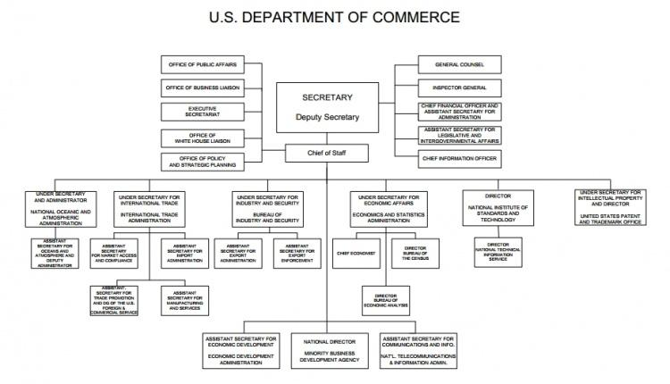

The Department of Commerce (DOC) is a crucial component of the United States government, tasked with the promotion of business, trade, and fostering economic growth throughout the nation. Established more than a century ago, the DOC has continuously adapted and refined its strategies to address the evolving demands of a global economy. This transformation is reflected in the various bureaus and offices that operate under its umbrella, each designed to support the DOC's overarching mission.

The history of the Department of Commerce is marked by significant change and adaptation, originating from its foundation as part of the Department of Commerce and Labor in 1903, later becoming an independent entity in 1913. This evolution was driven by the need to balance business interests with labor rights, reflecting the nation's growing industrial complexities. Over the decades, the DOC expanded its scope, strategically responding to historical challenges such as economic recessions and global conflicts by nurturing domestic industry and innovation.

A detailed examination of the DOC reveals a multifaceted structure comprising numerous agencies, each fulfilling a tailored role. Notable agencies include the U.S. Census Bureau, which provides critical demographic data; the U.S. Patent and Trademark Office, which protects intellectual property; and the Bureau of Economic Analysis, which offers essential economic metrics. These entities collectively empower policymakers and businesses with data-driven insights necessary for informed decision-making.

The impact of technological advancements on commerce has been profound, compelling the DOC to integrate innovative technologies into its operations. This integration enhances capabilities such as efficient communication, data analysis, and operational streamlining, positioning American industries to remain competitive globally. Fintech developments, including algorithmic trading, are indicative of the sector's shift towards automated, data-driven methodologies, prompting the DOC to cultivate supportive environments for such innovations.

Algorithmic trading, a significant technological advancement, utilizes computer algorithms to execute trades at speeds and volumes beyond human capability. This form of trading relies on precise mathematical models and programming to set strategies such as identifying trade opportunities and dynamic pricing. Amidst this technological evolution, the DOC's focus on fostering an environment conducive to growth is crucial, emphasizing both domestic advancements and international cooperation to sustain competitive U.S. markets.

In summary, the Department of Commerce plays an indispensable role in shaping the economic landscape of the United States. Its historical evolution, structural efficacy, and response to technological advancements underscore its commitment to fostering sustainable economic growth. Through strategic adaptation and global cooperation, the DOC continues to navigate the complexities of modern commerce, ensuring that the United States remains at the forefront of economic innovation.

## Table of Contents

## Historical Overview of the Department of Commerce

The Department of Commerce (DOC) was formed as the Department of Commerce and Labor in 1903, amid calls for better representation of business interests at the federal level. This establishment occurred during a time when economic expansion and industrial growth amplified the need for governmental oversight of commerce. However, the combination of commerce and labor functions under one department quickly revealed internal conflicts, particularly as labor leaders voiced concerns about neglecting labor issues. Consequently, in 1913, the department split into two distinct entities, resulting in the creation of the Department of Commerce and the Department of Labor. This split allowed each department to focus more closely on their respective areas of expertise and policy impact.

Throughout the 20th century, the Department of Commerce evolved substantially to align with the industrial and economic growth of the United States. This expansion included the establishment of various bureaus and offices, which were essential in addressing the increasing complexity of the economy. For example, as the country industrialized, the need for accurate economic data and analysis became more prominent, leading to the development of specialized bureaus within the DOC to manage these tasks.

Significant historical events played crucial roles in shaping the scope and direction of the Department of Commerce. The enactment of the federal income tax in 1913, following the 16th Amendment, provided the government with a more consistent revenue stream, enabling further investment in economic infrastructure and initiatives led by the DOC. Additionally, the department's activities were profoundly influenced by the two World Wars, during which the United States' economy transitioned into a global powerhouse. The DOC facilitated this transformation by promoting foreign trade, ensuring efficient resource allocation, and fostering industrial development to support the war efforts.

In recent decades, the DOC has further adapted its strategies to emphasize technology and international trade, reflecting the changing dynamics of a global economy. The rise of the information age prompted the Department to foster technological innovation and support industries critical to maintaining U.S. competitiveness. Also, as globalization deepened, the DOC increasingly focused on international trade policies to enhance the United States' economic standing on the world stage.

By continually adjusting to meet new economic challenges and opportunities, the Department of Commerce has remained a vital component of the federal government's mission to promote economic growth and stability. These strategic shifts underscore the Department’s commitment to fostering a robust economic environment that supports innovation and international collaboration.

## Understanding the Structure of the DOC

The Department of Commerce (DOC) operates as a Cabinet-level department, spearheaded by the Secretary of Commerce. The department is structured through an array of bureaus and offices, each tailored to address distinct economic functions that are vital to the nation's prosperity. Among its agencies, the U.S. Census Bureau, the U.S. Patent and Trademark Office, and the Bureau of Economic Analysis stand out due to their significant contributions to business decision-making and policy formulation.

The U.S. Census Bureau plays a pivotal role by conducting the decennial census, which generates comprehensive data essential for understanding population demographics and dynamics. This information is crucial not only for governmental planning and resource allocation but also for businesses that rely on demographic insights to target their markets effectively. Additionally, the bureau gathers a wide range of economic data that aids in forecasting trends and shaping strategies.

Similarly, the U.S. Patent and Trademark Office (USPTO) functions as the central authority for patent administration in the United States. It safeguards innovations by granting patents, which are critical for protecting intellectual property. The office supports inventors and businesses by ensuring their innovations are legally protected, thereby fostering an environment where technological advancement and inventive activities flourish. This protection is integral to maintaining a competitive edge in the global market.

The Bureau of Economic Analysis (BEA) is tasked with delivering key economic [statistics](/wiki/bayesian-statistics) such as the National Income and Product Accounts (NIPAs), which include indicators like Gross Domestic Product (GDP). These metrics are instrumental for policymakers, businesses, and researchers, providing insights into the economic health and trends of the country. Such data facilitates informed decision-making and strategic planning across various economic sectors.

The DOC's collaborative endeavors extend to partnerships with cities, academic institutions, and industry leaders, promoting comprehensive economic initiatives and development frameworks. By engaging with these entities, the department ensures that its economic strategies are innovative and aligned with contemporary challenges and opportunities. This synergy enhances the DOC’s capacity to drive sustainable economic growth while adapting to technological advancements and global economic shifts.

In summary, through a structured network of specialized bureaus and collaborative initiatives, the Department of Commerce efficiently directs resources and expertise to bolster the country's economic infrastructure and international competitiveness.

## Key Agencies and Their Roles in Commerce

The United States Department of Commerce (DOC) hosts several agencies, each serving distinct roles that contribute to the nation's economic framework. Among these, the U.S. Census Bureau, the U.S. Patent and Trademark Office (USPTO), and the Bureau of Economic Analysis (BEA) stand out for their significant impacts on business and policy.

The U.S. Census Bureau is paramount for its execution of the decennial census, a comprehensive data collection effort that not only determines congressional representation but also informs economic and policy decisions at multiple levels. The data garnered from these efforts helps businesses identify demographic trends, influencing market analyses and strategic planning. Beyond the national census, the Census Bureau conducts numerous surveys, such as the American Community Survey, providing continuous demographic data beneficial for public and private sector planning.

The U.S. Patent and Trademark Office (USPTO) is instrumental in fostering innovation and protecting inventors’ rights by granting patents and registering trademarks. The USPTO's role in intellectual property (IP) rights protection enables the United States to remain competitive on the global stage by ensuring inventors and businesses can capitalize on their innovations without unwarranted reproduction or infringement. This security encourages further investment in research and development across various industries.

Similarly, the Bureau of Economic Analysis (BEA) offers indispensable insights into the economic landscape through its compilation and release of critical reports like the National Income and Product Accounts (NIPAs). These accounts provide detailed breakdowns of economic activity, offering metrics such as Gross Domestic Product (GDP), personal income and outlays, and corporate profits. The data is crucial for policymakers, economists, and business leaders who rely on accurate economic analyses to shape fiscal policy, investment decisions, and strategic economic planning.

Each of these agencies under the Department of Commerce aligns with the overarching goal of promoting economic growth. Through specialized functions—data collection, IP protection, and economic analysis—these agencies enable informed decision-making and strategic planning that resonate with national economic interests. Their contributions to the nation's economic infrastructure are significant, reinforcing the DOC's mission to support and enhance the U.S. economy.

## The Impact of Technological Advancements on Commerce

Technological advancements have fundamentally reshaped the spectrum of commerce and trade, prompting the Department of Commerce (DOC) to continuously adapt its strategies to harness these opportunities effectively. The integration of technology into commercial practices enhances operational efficiency, streamlines communication, and enables real-time data analysis. Such benefits are vital as they allow businesses to respond swiftly to market changes and consumer demands.

Agencies within the DOC, such as the U.S. Patent and Trade Office, play an essential role in fostering an environment that promotes technological advancement. By ensuring robust intellectual property protections, the DOC supports innovation and maintains the competitiveness of American industries on a global stage. Protecting innovation ensures that businesses can invest in research and development with the confidence that their inventions will be shielded from unauthorized use.

Among the most transformative technological advancements is the rise of financial technologies (fintech), which have revolutionized traditional commerce practices. A prime example is [algorithmic trading](/wiki/algorithmic-trading), which leverages computer programs to execute trades based on predetermined parameters. This technology allows for trades to occur at speeds and volumes unachievable by human traders, optimizing financial strategies and increasing market [liquidity](/wiki/liquidity-risk-premium).

Algorithmic trading employs advanced algorithms to identify market trends and execute complex trading strategies. This method not only enhances efficiency but also minimizes human error and emotional decision-making in trading. The DOC facilitates these developments by promoting policies that encourage innovation and adapting regulatory frameworks to support emerging technologies while protecting market integrity.

The role of technology in commerce is not restricted to automation and fintech. It also includes the application of big data analytics, which enables businesses to extract valuable insights from vast datasets. Real-time data analysis aids in predicting market trends, optimizing supply chains, and personalizing customer experiences, thereby driving competitive advantage.

In conclusion, technological advancements are redefining the commercial landscape by introducing tools that enhance efficiency and adaptability. The DOC's commitment to fostering an environment conducive to technological growth is crucial in ensuring that American industries engage effectively with these innovations, thus maintaining a competitive edge in the ever-evolving global economy.

## Algorithmic Trading and Commerce

Algorithmic trading, often referred to as algo-trading, utilizes advanced computer algorithms to execute trades at speeds and frequencies surpassing human capability. This technological approach is characterized by executing trades based on predefined criteria, such as timing, price, or [volume](/wiki/volume-trading-strategy), to generate profits. These algorithms are designed to analyze market data, predict trading opportunities, and execute trades with precision, contributing to increased market efficiency.

Algo-trading strategies encompass several elements, including arbitrary item identification and dynamic pricing models. Arbitrary item identification involves recognizing and capitalizing on transient market imbalances, while dynamic pricing models adjust asset prices in real-time, responding to changes in market conditions and demand. These strategies require sophisticated algorithms capable of processing significant amounts of data and making split-second decisions.

The Department of Commerce (DOC) plays a crucial role in nurturing the environment necessary for such technological innovations. By supporting research and development in computer science and financial technology, the DOC ensures that the infrastructure required for algo-trading is robust and secure. Programs under the DOC focus on advancing technology, fostering innovation, and promoting fair competition, all essential for the evolution of automated trading systems.

Recognizing the global nature of algorithmic trading, the DOC is also committed to international cooperation and establishing standards that benefit U.S. markets. This international focus ensures that U.S. trading practices align with global developments, facilitating smoother operations across borders and enhancing market integration. Establishing global standards and collaboration frameworks also helps mitigate systemic risks and ensures the stability of financial markets.

In summary, algorithmic trading represents a significant shift in how financial markets operate, underscoring the importance of technological prowess and strategic international collaboration. Through its initiatives, the DOC continues to support and regulate innovations that keep U.S. commerce agile and competitive in an increasingly automated financial landscape.

## Conclusion

The Department of Commerce (DOC) remains a cornerstone of the United States' economic infrastructure, consistently aligning to promote and sustain economic growth amid an ever-evolving global landscape. Through its diverse array of bureaus and offices, the DOC plays a proactive role in both domestic and international commerce, addressing the challenges and seizing the opportunities facilitated by technological advancements.

As technology continues to push the boundaries with developments such as algorithmic trading, the DOC's function in harmonizing regulatory frameworks with innovative practices becomes increasingly critical. Algorithimic trading, which involves the use of computer programs to execute trades at speeds and scales unobtainable by humans, exemplifies the intersection of technology and commerce where the DOC must operate. It balances the need for regulation to ensure fair markets and the necessity for innovation to maintain competitive economic standing.

Looking ahead, the Department of Commerce promises a future defined by dynamic and sustainable economic development. This evolution remains anchored in the solid principles that have historically guided the DOC but is also fueled by modern-day ambitions that embrace the complexities of global trade and technology. With a forward-thinking approach, the DOC is well-positioned to foster economic environments that are resilient, innovative, and aligned with the national interest. This forward trajectory ensures that both the challenges of today and the prospects of tomorrow are navigated effectively, securing a robust economic future for the United States.

## References & Further Reading

[1]: Bergstra, J., Bardenet, R., Bengio, Y., & Kégl, B. (2011). ["Algorithms for Hyper-Parameter Optimization."](https://proceedings.neurips.cc/paper/2011/file/86e8f7ab32cfd12577bc2619bc635690-Paper.pdf) Advances in Neural Information Processing Systems 24.

[2]: ["Advances in Financial Machine Learning"](https://www.amazon.com/Advances-Financial-Machine-Learning-Marcos/dp/1119482089) by Marcos Lopez de Prado

[3]: ["Evidence-Based Technical Analysis: Applying the Scientific Method and Statistical Inference to Trading Signals"](https://www.amazon.com/Evidence-Based-Technical-Analysis-Scientific-Statistical/dp/0470008741) by David Aronson

[4]: ["Machine Learning for Algorithmic Trading"](https://github.com/stefan-jansen/machine-learning-for-trading) by Stefan Jansen

[5]: ["Quantitative Trading: How to Build Your Own Algorithmic Trading Business"](https://www.amazon.com/Quantitative-Trading-Build-Algorithmic-Business/dp/1119800064) by Ernest P. Chan

[6]: ["Patent and Trademark Office: Promoting Innovation or Limiting Competition?"](https://www.ftc.gov/reports/promote-innovation-proper-balance-competition-patent-law-policy) by Congressional Research Service

[7]: United States Census Bureau. ["About the Bureau"](https://www.census.gov/about.html)

[8]: Bureau of Economic Analysis (BEA). ["National Income and Product Accounts"](https://www.bea.gov/products/national-income-and-product-accounts)

[9]: U.S. Department of Commerce, ["Strategic Plan 2018-2022"](https://www.commerce.gov/sites/default/files/us_department_of_commerce_2018-2022_strategic_plan.pdf)