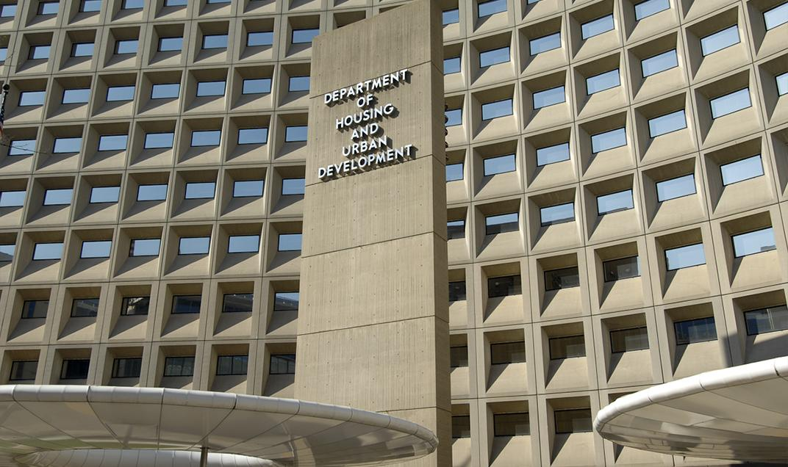

Urban development has increasingly become intertwined with the evolution of housing policies and the rapid advancement of new technologies. Central to this dynamic is the U.S. Department of Housing and Urban Development (HUD), which is instrumental in formulating and implementing policies that directly affect urban landscapes. Established to enhance the opportunities for affordable homeownership and community development, HUD's initiatives and regulations, such as those enforced under the Fair Housing Act, have a profound impact on mitigating housing discrimination and fostering inclusive urban environments.

Simultaneously, algorithmic trading and artificial intelligence are revolutionizing the financial and investment sectors. These technologies are being harnessed to influence housing markets, enabling high-speed transactions and offering sophisticated tools for predicting market trends and investment opportunities. Through the use of machine learning and big data analytics, AI is changing the way housing data is interpreted, ultimately affecting urban development strategies and outcomes.



The intersection of these fields presents an opportunity and a challenge. As urban development policies and housing markets increasingly incorporate technology, issues such as algorithmic bias and ethical implications of automated financial systems in housing require vigilant oversight. This article will examine the roles of HUD, urban development policies, and algorithmic trading in reshaping the future of urban housing, highlighting the necessity for equitable and accessible solutions as these domains converge and evolve.

## Table of Contents

## Understanding HUD and Urban Development

The Department of Housing and Urban Development (HUD) was established as a cabinet-level department in 1965. Its primary mission is to create and ensure affordable homeownership opportunities for American citizens. HUD plays a critical role in urban development by implementing housing policies that promote inclusivity and equality.

A cornerstone of HUD's mandate is the enforcement of the Fair Housing Act (FHA) of 1968. The FHA was enacted to eliminate housing discrimination and is vital in preventing discrimination based on race, color, national origin, religion, sex, familial status, or disability. Through rigorous enforcement of this act, HUD seeks to ensure equal access to housing and to dismantle systemic barriers that hinder fair housing practices.

Among the numerous programs spearheaded by HUD, the Community Development Block Grant (CDBG) is one of the most significant. This program provides annual grants to cities and states to develop viable urban communities by providing decent housing and suitable living environments, principally for low- and moderate-income persons. The CDBG plays a pivotal role in sustaining the economic viability of neighborhoods through a variety of projects such as infrastructure improvement, housing rehabilitation, and public service provision.

Another essential program under HUD's purview is the Housing Choice Voucher program, commonly known as Section 8. This program assists very low-income families, the elderly, and the disabled to afford decent, safe, and sanitary housing in the private market. Rather than confining recipients to specific housing units or areas, the Housing Choice Voucher program empowers them to choose any housing that meets the program requirements, allowing for greater flexibility and integration into diverse communities.

HUD's ongoing commitment to supporting community development extends to initiatives that address specific needs in urban areas, such as housing for the homeless, those affected by natural disasters, and special population groups like the elderly or disabled. Through these efforts, HUD strives not only to provide shelter but also to contribute to the creation of sustainable, livable communities where every citizen has the opportunity to thrive economically and socially.

## HUD's Housing Policies and Programs

The U.S. Department of Housing and Urban Development (HUD) plays a crucial role in delivering housing assistance programs designed to support low-income and disadvantaged populations. These initiatives are geared towards enhancing the accessibility and affordability of housing across the nation. Among the primary services offered by HUD are mortgage insurance programs, which facilitate increased homeownership by reducing the financial risk for lenders. This program is vital in offering support to first-time homebuyers and low-income families who may otherwise struggle to secure mortgages.

Rental assistance is another pivotal component of HUD's offerings, prominently embodied in programs such as the Housing Choice Voucher program, commonly known as Section 8. This initiative helps beneficiaries afford private market rentals by subsidizing a portion of their rent, allowing many to secure housing in better areas than they might otherwise afford. In addition, HUD provides specific housing programs catering to the needs of the elderly and disabled individuals. These programs include the Section 202 and Section 811 programs, which offer supportive housing options, ensuring that these populations have access to environments that accommodate their unique needs.

The implementation of these programs is not solely about providing financial support; it also seeks to ensure that housing is both safe and sustainable. This involves stringent regulations and oversight to maintain housing quality, as well as initiatives that promote energy efficiency and other eco-friendly practices.

Understanding the multifaceted nature of HUD's housing policies is essential in addressing urban development challenges. These programs do not just provide immediate housing solutions but also aim to foster long-term community development and economic stability. Moreover, these policies are continually evaluated and refined to meet the changing needs of urban populations, ensuring that they remain relevant and effective. This adaptability is critical as it allows HUD to respond to broader trends in urbanization and demographic shifts, ultimately contributing to a more equitable and inclusive housing landscape.

## Automation and Algorithmic Trading in Housing Markets

Algorithmic trading employs automated systems to execute financial transactions at rapid speeds, revolutionizing how investments are made across various markets, including housing. In housing markets, [algorithmic trading](/wiki/algorithmic-trading) systems leverage data analytics and [machine learning](/wiki/machine-learning) to forecast price trends, assess investment opportunities, and improve decision-making. This shift is driven by the extensive capabilities of [artificial intelligence](/wiki/ai-artificial-intelligence) (AI), which can handle vast datasets with efficiency and accuracy.

AI's integration into housing markets enables the analysis of real estate trends by evaluating factors that traditionally required manual scrutiny, such as market demand, supply fluctuations, interest rates, and economic indicators. This automated analysis facilitates the identification of lucrative investment prospects and the optimization of asset management strategies. Algorithms can model complex housing market behaviors, offering investors predictive insights regarding property values and rental yields.

In practice, algorithms process data inputs from diverse sources, including real estate listings, social media sentiment, and economic reports. This big data approach enables models to continuously learn and adapt, enhancing their predictive accuracy. For instance, machine learning models, such as regression analysis, can be used to predict housing prices based on historical trends, economic signals, and changes in consumer behavior. Python's scikit-learn library provides tools for implementing these algorithms:

```python
from sklearn.linear_model import LinearRegression
import numpy as np

# Sample data for housing prices and features
X = np.array([[3000, 3], [1500, 2], [4000, 4]])  # Features: [square feet, number of bedrooms]
y = np.array([500000, 300000, 750000])  # Housing prices

# Linear Regression model
model = LinearRegression()
model.fit(X, y)

# Example: Predict price for a house with 3500 sq ft and 3 bedrooms
predicted_price = model.predict(np.array([[3500, 3]]))
print(predicted_price)
```

Despite the benefits, the increasing reliance on algorithms necessitates a careful balance between efficiency and ethical considerations. Algorithms, if not properly managed, may inadvertently amplify biases present in their data inputs, potentially leading to discriminatory practices. Ethical algorithm design and ongoing oversight are crucial to ensuring that automated systems adhere to anti-discrimination laws, such as the Fair Housing Act. This involves implementing robust validation processes that scrutinize algorithmic decisions for fairness and transparency.

Lastly, as housing markets continue to intertwine with advanced technology, regulatory frameworks must evolve to oversee the ethical use of algorithmic trading systems. Ensuring ethical integrity in these systems is vital for fostering trust, promoting equitable access to housing, and maintaining efficient market operations.

## Addressing Algorithmic Discrimination in Housing

Concerns regarding algorithmic discrimination in housing have become increasingly prominent, prompting the U.S. Department of Housing and Urban Development (HUD) to issue new guidelines aimed at mitigating these issues. The integration of artificial intelligence (AI) and machine learning (ML) into housing market operations has revolutionized tenant screening and housing selection processes. However, these technologies can inadvertently perpetuate bias due to the data they are trained on or the design of the algorithms themselves.

Bias in AI and ML can occur when historical data, which may [carry](/wiki/carry-trading) societal or institutional biases, is used to train models. For instance, if past tenant data reflects discriminatory practices, an AI model could learn patterns that reinforce those biases. This problem necessitates the development of algorithms that are both transparent and accountable. An example of such bias can be shown mathematically: if an AI system uses a feature vector $x = (x_1, x_2, \ldots, x_n)$ representing applicant attributes and these attributes include biased variables, the learned model $f(x) = \sum w_i x_i + b$ may inadvertently reflect these biases if not properly adjusted or audited.

In response, HUD's latest guidelines emphasize compliance with the Fair Housing Act, which prohibits unfair discrimination in housing-related activities. These guidelines urge stakeholders to ensure that algorithmic tools do not result in discriminatory effects against protected categories such as race, sex, color, national origin, religion, disability, and familial status. The guidance encourages the incorporation of fairness assessments and bias mitigation techniques during the development and deployment of these technologies.

Ensuring non-discriminatory practices requires ongoing vigilance in the deployment of these automated systems. Strategies include the development of diverse training datasets, regular audits of algorithmic outputs, and the implementation of fairness-enhancing mechanisms such as preprocessing, in-processing, and post-processing adjustments. HUD's guidelines serve as a foundation, promoting transparency and requiring continual oversight to safeguard against unfair biases in housing-related services. Such measures are critical to uphold equity in the evolving landscape of housing technology.

## The Role of States in Mitigating Algorithmic Bias

Individual states are increasingly engaging in initiatives to address algorithmic bias in housing, responding to the constraints faced at the federal level. With algorithmic tools becoming prevalent in tenant screening and housing-related advertising, there is mounting concern that these technologies may inadvertently sustain or amplify existing biases. To counteract this, various states have begun drafting and implementing regulations aimed at ensuring fairness and transparency in these processes.

One approach states are employing is the enactment of legislation mandating transparency in how algorithms are designed and deployed in housing decisions. For example, some states are looking at requiring companies to disclose the criteria and data sets used by their algorithms, thus making it easier to audit and ensure these tools are not skewed against any particular group.

Furthermore, state-level interventions are valuable not only for their immediate effects but also as potential models for wider adoption. The initiatives at the state level offer an opportunity to test comprehensive approaches that could inform national policies. By assessing the outcomes and effectiveness of these state-implemented measures, it can become possible to ascertain best practices that could be scaled more broadly.

The success of these state measures often depends on strong collaboration with federal agencies. Effective communication and cooperation between state and federal entities can lead to more coherent policy frameworks that adequately address algorithmic discrimination. Such partnerships might involve data sharing, joint monitoring of technology impacts, and cooperative development of regulatory standards that ensure AI and machine learning applications in housing are equitable and just.

In conclusion, while the federal framework provides overarching principles of equitable housing, states play an instrumental role in pioneering specific, actionable strategies that address algorithmic bias. Through innovative regulations and cooperative strategies, states can significantly contribute to ensuring that the deployment of algorithms in housing markets aligns with the broader goals of fairness and nondiscrimination.

## Conclusion

The convergence of urban development policies, housing technology, and financial algorithms encapsulates a multifaceted landscape that necessitates nuanced and strategic approaches. The U.S. Department of Housing and Urban Development (HUD) remains an anchor in this evolving tableau, with its ongoing commitment to fair housing practices and community development. HUD's policies are critical in ushering a cohesive framework that integrates diverse elements of urban development with emergent technological innovations.

As technological advancements continue to reshape housing markets, particularly through automation and algorithmic trading, maintaining equity and accessibility is paramount. The deployment of artificial intelligence and algorithmic solutions offers substantial potential to enhance market efficiency and decision-making processes. However, this technological progression also brings with it challenges, notably the risk of algorithmic bias and discrimination, which can undermine equitable access to housing. Therefore, regulatory frameworks and oversight are indispensable to ensure these technologies contribute positively to the housing sector.

Moreover, ongoing research and policy discussions play a vital role in effectively addressing these complex, interdisciplinary issues. Collaborative initiatives amongst federal, state, and local entities are vital in establishing robust policy structures. These structures must adapt to technological innovations while safeguarding the principles of equity and accessibility. By fostering an environment of continuous learning and adaptation, stakeholders can better anticipate and mitigate challenges emerging from the intersection of urban policy and advancing technology.

In this shifting paradigm, policymakers, industry stakeholders, and communities must work in concert to cultivate strategies that balance innovation with ethical and equitable housing practices. As such, the dynamic interface between urban development policies and technological progress requires an ongoing commitment to research, discussion, and collaborative problem-solving. This approach will ensure that advancements serve public interests and contribute to sustainable and inclusive urban environments.

## References & Further Reading

[1]: U.S. Department of Housing and Urban Development. ["The Fair Housing Act."](https://www.hud.gov/program_offices/fair_housing_equal_opp/fair_housing_act_overview) 

[2]: Community Development Block Grant Program. ["CDBG Program."](https://www.hud.gov/program_offices/comm_planning/cdbg) U.S. Department of Housing and Urban Development.

[3]: National Academies of Sciences, Engineering, and Medicine. (2018). ["The Impact of Algorithmic Trading on Capital Markets."](https://www.nationalacademies.org/report-to-congress-2018) Washington, DC: The National Academies Press.

[4]: Obermeyer, Z., & Emanuel, E. J. (2016). ["Predicting the Future — Big Data, Machine Learning, and Clinical Medicine."](https://pubmed.ncbi.nlm.nih.gov/27682033/) The New England Journal of Medicine, 375(13), 1216-1219.

[5]: O’Neil, C. (2016). ["Weapons of Math Destruction: How Big Data Increases Inequality and Threatens Democracy."](https://dl.acm.org/doi/10.5555/3002861) Crown Publishing Group.

[6]: Baker, T., Kanbur, R., & Pincus, J. (2017). ["Development Policy in the Twenty-First Century: Beyond the Post-Washington Consensus."](https://www.taylorfrancis.com/books/edit/10.4324/9780203418796/development-policy-twenty-first-century-ben-fine-costas-lapavitsas-jonathan-pincus)

[7]: Pasquale, F. A. (2015). ["The Black Box Society: The Secret Algorithms That Control Money and Information."](https://www.jstor.org/stable/j.ctt13x0hch) Harvard University Press.