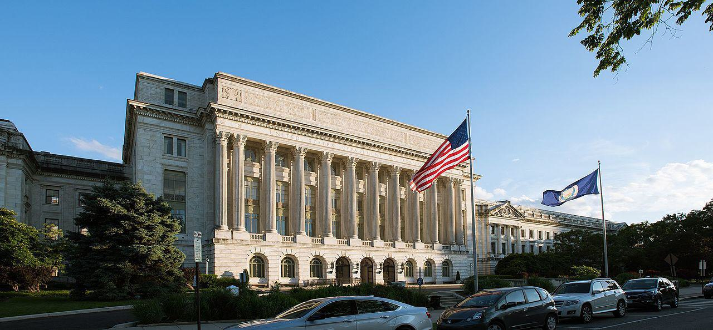

## Table of Contents

## What is the United States Department of Agriculture (USDA)?

The United States Department of Agriculture (USDA) is a government agency in the United States. It helps farmers and people who work with food. The USDA makes sure that food is safe and healthy for people to eat. It also helps farmers grow more food and make money.

The USDA does many things to help with farming and food. It gives money to farmers to help them buy things they need. It also teaches farmers new ways to grow food. The USDA checks food in stores to make sure it is safe. It also helps poor people buy food by giving them money or food stamps.

The USDA works to protect the environment too. It helps farmers take care of the land and water. The USDA makes rules about what farmers can and cannot do to keep the environment safe. It also does research to find new ways to grow food that are good for the earth.

## When was the USDA established and why?

The USDA was established on May 15, 1862. President Abraham Lincoln created it during the Civil War. He wanted to help farmers because farming was very important for the country. At that time, many people lived on farms and grew their own food. The USDA was made to help these farmers do better and grow more food.

The main reason for starting the USDA was to improve farming. The government wanted to help farmers learn new ways to grow crops and raise animals. They also wanted to make sure that the food people ate was safe and healthy. Over time, the USDA has grown to do many other things, like helping poor people buy food and protecting the environment.

## What are the main functions of the USDA?

The USDA helps farmers grow food and make money. It gives farmers money to buy things they need, like seeds and tools. The USDA also teaches farmers new ways to grow crops and raise animals. This helps farmers do better and grow more food. The USDA checks food in stores to make sure it is safe for people to eat. It makes rules about how food should be handled and stored.

The USDA also helps poor people buy food. It gives them money or food stamps to use at stores. This helps make sure that everyone has enough to eat. The USDA works to protect the environment too. It helps farmers take care of the land and water. The USDA makes rules about what farmers can and cannot do to keep the environment safe. It also does research to find new ways to grow food that are good for the earth.

## How is the USDA structured and what are its key agencies?

The USDA is led by the Secretary of Agriculture, who is part of the President's Cabinet. The Secretary oversees many different parts of the USDA. These parts are called agencies, and each one has a special job to do. The USDA has many employees who work in these agencies to help farmers, check food safety, and protect the environment.

Some key agencies in the USDA include the Farm Service Agency, which helps farmers get loans and other help. The Food Safety and Inspection Service checks meat, poultry, and eggs to make sure they are safe to eat. The Natural Resources Conservation Service helps farmers take care of the land and water. The Agricultural Research Service does research to find new ways to grow food. The Food and Nutrition Service helps poor people buy food through programs like SNAP, which used to be called food stamps.

All these agencies work together to make sure that the USDA can do its job well. They help farmers grow more food, keep food safe, protect the environment, and make sure everyone has enough to eat. The USDA is a big organization with many different parts, but they all work towards the same goals.

## What role does the USDA play in food safety and inspection?

The USDA plays a big role in making sure food is safe to eat. It checks meat, poultry, and eggs to make sure they are safe and healthy. The USDA has a special part called the Food Safety and Inspection Service that does this job. They go to places where food is made and check how it is handled and stored. If the food is not safe, they can stop it from being sold. This helps keep people from getting sick from bad food.

The USDA also makes rules about food safety. These rules tell people who make and sell food what they need to do to keep it safe. The USDA checks to make sure these rules are followed. They also teach people about food safety so they can make good choices about what they eat. By doing all these things, the USDA helps make sure that the food people buy is safe and healthy.

## How does the USDA support agricultural research and development?

The USDA helps farmers by doing research to find new ways to grow food. They have a special part called the Agricultural Research Service that does this work. This group studies things like new kinds of crops that can grow in different places, and ways to make the soil better. They also look at how to keep bugs and diseases from hurting plants. By doing this research, the USDA helps farmers grow more food and make more money.

The USDA also works with universities and other groups to do more research. They give money to these places to help them study farming and food. This helps bring new ideas and technology to farmers. The USDA shares what they learn with farmers so they can use these new ways to grow food. This helps make farming better and helps feed more people.

## What programs does the USDA offer to assist farmers and rural communities?

The USDA helps farmers and people in rural areas through many programs. One big program is the Farm Service Agency, which gives farmers loans and other help. This can be money to buy seeds, tools, or even land. The USDA also has programs to help farmers if they have a bad year because of weather or other problems. These programs give farmers money to help them keep going.

The USDA also works to make life better in rural areas. They have programs to help build things like roads, schools, and hospitals in small towns. The Rural Development part of the USDA gives money to these projects. They also help people in rural areas get better internet and phone service. This makes it easier for people in the countryside to stay connected and do business.

Another way the USDA helps is by teaching farmers new ways to grow food. They have programs that show farmers how to use new technology and methods. This can help farmers grow more food and make more money. The USDA also helps farmers take care of the land and water, which is important for the future of farming.

## How does the USDA influence international trade and agriculture?

The USDA helps with international trade by making rules about what food can be bought and sold between countries. They check food that comes into the United States to make sure it is safe. They also help American farmers sell their food to other countries. The USDA works with other countries to make trade agreements. These agreements help farmers know what they can sell and where they can sell it. This makes it easier for farmers to make money by selling their food around the world.

The USDA also does research to help farmers grow food that can be sold in other countries. They study what kinds of food people in different places like to eat. Then they help farmers grow those foods. This can help farmers make more money by selling to new markets. The USDA also helps teach farmers in other countries new ways to grow food. This can help make more food around the world and help people in other countries have enough to eat.

## What is the USDA's role in nutrition and consumer protection?

The USDA helps people eat healthy food by giving them information about nutrition. They make rules about what food can say on its labels. This helps people know what is in the food they buy. The USDA also runs programs like SNAP, which used to be called food stamps. This program gives money to poor people so they can buy healthy food. By doing these things, the USDA helps make sure that everyone can eat well and stay healthy.

The USDA also works to protect people from bad food. They check food to make sure it is safe to eat. If food is not safe, they can stop it from being sold. The USDA makes rules about how food should be handled and stored. They teach people about food safety so they can make good choices about what they eat. By doing all these things, the USDA helps keep people safe from getting sick from bad food.

## How does the USDA address environmental and conservation issues?

The USDA helps take care of the environment by working with farmers. They have a special part called the Natural Resources Conservation Service that helps farmers protect the land and water. This group teaches farmers how to use the land in ways that do not hurt the environment. They help farmers plant trees and grasses to stop soil from washing away. They also help farmers use less water and keep it clean. By doing these things, the USDA helps make sure that the land stays good for farming in the future.

The USDA also makes rules to protect the environment. These rules tell farmers what they can and cannot do to keep the land and water safe. The USDA checks to make sure these rules are followed. They also do research to find new ways to grow food that are good for the earth. This research helps farmers use less chemicals and take better care of the land. By doing all these things, the USDA helps protect the environment and make sure that farming can continue for a long time.

## What are some major USDA initiatives or policies in recent years?

In recent years, the USDA has started many new programs to help farmers and people. One big program is the Coronavirus Food Assistance Program, which helps farmers who had a hard time because of the virus. This program gives money to farmers to help them keep going. The USDA also started the Farmers to Families Food Box Program. This program helps get food from farmers to people who need it. It helps farmers sell their food and helps people get healthy food to eat.

Another important thing the USDA has done is work on climate change. They started the Partnerships for Climate-Smart Commodities program. This program helps farmers use new ways to grow food that are good for the earth. It gives money to farmers to try these new ways. The USDA also made new rules to help protect the environment. These rules tell farmers how to take care of the land and water. By doing these things, the USDA is trying to help the earth and make farming better for the future.

## How can individuals or organizations engage with the USDA for support or collaboration?

Individuals or organizations can engage with the USDA by visiting their website. The website has a lot of information about the different programs and services the USDA offers. People can find out how to apply for loans, grants, or other help. They can also learn about food safety and nutrition. If someone needs help, they can fill out forms online or call the USDA for more information. The USDA has offices all over the country, so people can also visit a local office to get help in person.

Organizations can work with the USDA by partnering on projects. The USDA often works with groups like universities, businesses, and non-profits to do research or start new programs. If an organization wants to work with the USDA, they can look for partnership opportunities on the USDA website. They can also contact the USDA directly to talk about their ideas. Working together can help bring new ideas and technology to farmers and make food safer and healthier for everyone.

## References & Further Reading

[1]: Marcos López de Prado, ["Advances in Financial Machine Learning"](https://www.amazon.com/Advances-Financial-Machine-Learning-Marcos/dp/1119482089), Wiley, 2018.

[2]: Stefan Jansen, ["Machine Learning for Algorithmic Trading"](https://github.com/stefan-jansen/machine-learning-for-trading), Packt Publishing, 2020.

[3]: David Aronson, ["Evidence-Based Technical Analysis: Applying the Scientific Method and Statistical Inference to Trading Signals"](https://www.amazon.com/Evidence-Based-Technical-Analysis-Scientific-Statistical/dp/0470008741), Wiley, 2006.

[4]: Ernest P. Chan, ["Quantitative Trading: How to Build Your Own Algorithmic Trading Business"](https://www.amazon.com/Quantitative-Trading-Build-Algorithmic-Business/dp/0470284889), Wiley, 2008.

[5]: Bergstra, J., Bardenet, R., Bengio, Y., & Kégl, B. (2011), ["Algorithms for Hyper-Parameter Optimization."](https://dl.acm.org/doi/10.5555/2986459.2986743) Advances in Neural Information Processing Systems 24. 

[6]: U.S. Department of Agriculture, ["USDA Agricultural Projections"](https://www.usda.gov/sites/default/files/documents/USDA-Agricultural-Projections-to-2032.pdf), USDA, 2023.

[7]: Smith, V.H., & Glauber, J. (2021), ["Agricultural Futures: How Markets and Governments Together Shape Agricultural Policy"](https://www.researchgate.net/publication/354275651_Trends_in_US_Agricultural_Policy_since_2000_and_Implications_for_the_Next_Twenty_Years), American Journal of Agricultural Economics, 103(2), 569-589.