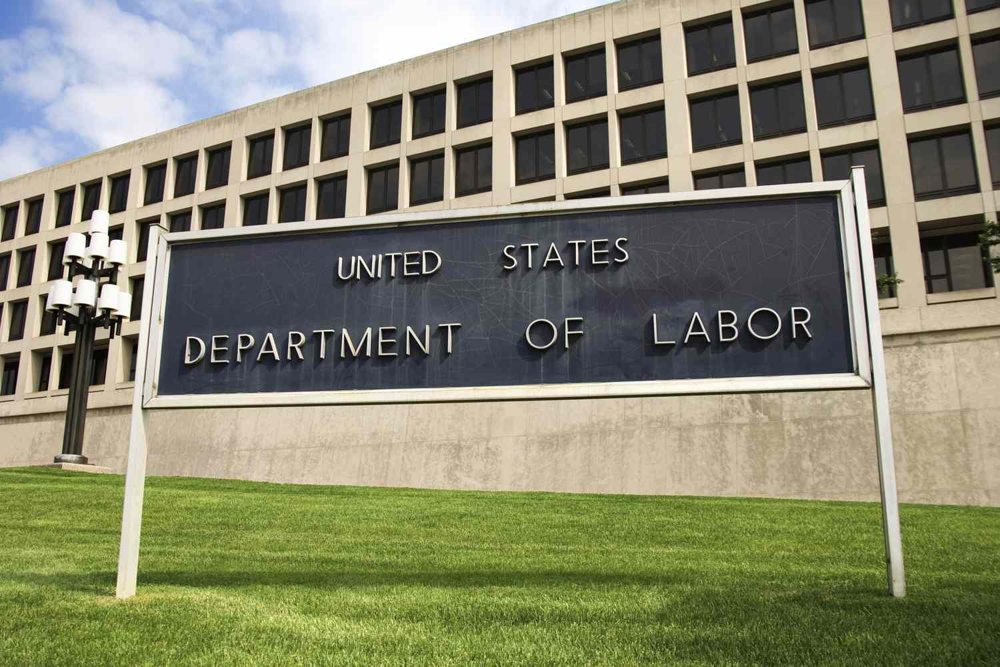

The Department of Labor (DOL) plays a pivotal role in the legislative and regulatory landscape of the United States, primarily focusing on enforcing labor laws designed to protect workers' rights and ensure fair workplace practices. Established in 1913, the DOL has continuously adapted its focus to respond to the changing needs of the workforce and economy. Over the years, the department has overseen the implementation and enforcement of key labor laws, addressing issues such as wages, working hours, safety, and benefits. These efforts have been instrumental in securing basic rights and protections for workers across various industries.

In recent years, the interplay between traditional labor markets and modern automated trading systems has prompted new discussions about the DOL's role. The rise of algorithmic trading, which employs computer algorithms to execute trading orders, has revolutionized financial markets and influenced broader economic policies. This technological advancement poses unique challenges and opportunities for labor markets, necessitating a nuanced understanding of the regulatory frameworks that govern both traditional and emerging sectors. The DOL's capacity to adapt to these changes is critical, as it influences workforce stability and the equitable treatment of employees.

The exploration of labor rights, workplace regulations, and algorithmic trading's influence on economic landscapes is vital for understanding the DOL's broader impact. These dimensions highlight the department's role in balancing economic innovation with the preservation of worker protections. As we move forward, the DOL's ability to predict and respond to future challenges, particularly those posed by technological advances, remains crucial. This article seeks to provide an insightful overview of the DOL's historical development, its current functions, and potential future roles, offering a comprehensive understanding of its ongoing impact in a rapidly changing economic environment.

## Table of Contents

## The Founding and Evolution of the Department of Labor (DOL)

The establishment of the Department of Labor (DOL) in 1913 marked a pivotal moment in the history of labor rights in the United States. This development was largely born out of the labor movement's efforts in the late 19th and early 20th centuries. During this period, labor leaders were adamant about creating a governmental body dedicated to addressing labor issues, which were becoming increasingly complex due to industrialization and economic expansion. The DOL was specifically tasked with promoting the welfare of employees, improving working conditions, and advancing opportunities for profitable employment.

One of the key figures in the formative years of the DOL was William B. Wilson, who became the first Secretary of Labor. A former coal miner and union leader, Wilson's background provided him with a unique perspective on the challenges faced by workers. Under his leadership, the department started laying down the foundations of its mission, focusing on mediation between labor and management, and advocating for fair labor standards and practices.

The DOL's trajectory over the decades can be seen in several historical milestones. Throughout the 20th century, the department played a significant role in labor disputes, often acting as a mediator to resolve conflicts between workers and employers. The DOL's efforts were crucial in promoting workforce welfare, especially during periods of economic upheaval like the Great Depression, where it helped implement policies to support unemployed workers and stabilize labor markets.

Moreover, the DOL has been instrumental in shaping employment regulations. This includes the formulation and enforcement of laws designed to safeguard worker rights, improve safety conditions, and ensure fair pay. For example, the Fair Labor Standards Act of 1938, which established a federal minimum wage and overtime pay, was one of the landmark legislations that underscored the DOL's influence and commitment to enhancing labor standards.

In summary, the founding and evolution of the Department of Labor reflect a century-long commitment to addressing the complexities of the labor market, championing workers' rights, and navigating the changing landscapes of workforce welfare and employment regulations.

## Understanding Major Labor Laws Enforced by the DOL

The Department of Labor (DOL) plays a vital role in enforcing labor laws aimed at maintaining a fair and secure workplace environment. Among these critical regulations is the Fair Labor Standards Act (FLSA), which was enacted in 1938. The FLSA sets crucial standards for minimum wage, overtime pay, and youth employment. It requires that non-exempt employees receive at least the federal minimum wage for every hour worked and mandates overtime pay at a rate of one and a half times the regular pay for hours exceeding 40 in a workweek. The FLSA seeks to curb labor exploitation and promote equitable wages, ensuring that workers are justly compensated for their labor.

Safety at the workplace is another primary concern addressed by the Occupational Safety and Health Act of 1970 (OSHA). This act obligates employers to provide work conditions free from serious hazards. OSHA empowers the DOL to set and enforce workplace safety standards, conduct inspections, and offer training, outreach, education, and assistance. The goal is to prevent workplace injuries, illnesses, and fatalities by advocating for comprehensive safety measures and practices.

The Family and Medical Leave Act (FMLA), passed in 1993, complements these efforts by safeguarding employees' rights to balance work with family and health needs. The FMLA entitles eligible employees to unpaid, job-protected leave for specified family and medical reasons, such as the birth of a child, adoption, personal or family illness, or military exigencies. This ensures employees can attend to personal and familial obligations without fear of losing their employment.

Each of these laws illustrates the DOL's dedication to promoting fairness, dignity, and respect in the workforce. By enforcing these regulations, the DOL underscores its commitment to securing not only economic justice but also fostering a humane workplace culture that prioritizes employee well-being.

## The DOL's Role in Modern Job Market Dynamics

The Department of Labor (DOL) plays a crucial role in maintaining a balanced job market by implementing and managing regulatory and support frameworks. This involves creating policies that ensure fair employment practices and promoting conditions that attract and sustain a productive workforce. The DOL's approach is multifaceted, addressing issues unique to various industries while also adapting to broader economic pressures.

Global economic trends significantly impact labor markets, and the DOL must adapt its strategies to keep pace. For instance, globalization has led to increased competition, prompting shifts in employment patterns as companies outsource or automate jobs. To address these shifts, the DOL works to ensure that policies accommodate the needs of both employers and employees, promoting workforce stability. This involves supporting retraining programs, advocating for fair wages, and ensuring workers' rights are protected in the face of evolving market demands.

The DOL also assumes a significant role in monitoring unemployment rates. In doing so, it identifies economic vulnerabilities and implements measures to counteract rising unemployment. Through its extensive data collection and analysis, the DOL can forecast labor trends and guide policymakers in creating conditions conducive to job creation. Additionally, the department is involved in facilitating new employment opportunities by supporting initiatives that encourage entrepreneurship and by working with other government agencies to foster economic growth.

To this end, the DOL actively engages with employers and employees to ensure the implementation of its policies is effective and responsive to the changing economic landscape. This engagement not only helps mitigate unemployment but also ensures that the workforce is prepared for new and emerging job sectors. By providing guidance and resources, the DOL helps workers transition to these new opportunities, thereby maintaining a dynamic and resilient job market.

Moreover, the DOL's role extends to enforcing compliance with labor laws, thus ensuring that workplaces remain safe and equitable. As the job market evolves, the department continuously updates regulations to reflect new labor realities, such as those introduced by technologies like [artificial intelligence](/wiki/ai-artificial-intelligence) and automation. This regulatory oversight helps balance the benefits of innovation with the need for worker protection and fair labor practices.

Through these efforts, the DOL ensures a balanced job market that can withstand economic fluctuations and technological advancements, ultimately safeguarding both economic stability and workforce welfare.

## Algorithmic Trading and Its Impact on Labor Markets

Algorithmic trading, the use of computers programmed with specific trading strategies to execute orders in financial markets, has become increasingly prominent. This method leverages algorithms to analyze market data rapidly and execute trades at speeds unattainable by humans, offering an efficient alternative to traditional trading. As technology evolves, the influence of [algorithmic trading](/wiki/algorithmic-trading) extends beyond financial markets, significantly impacting labor markets, particularly in finance sectors.

Automated trading systems are reshaping employment patterns within the finance industry. The proliferation of algorithmic trading has led to a reduced demand for traditional trading roles, such as floor traders, who execute trades manually. Consequently, there is an increasing need for professionals with expertise in computer programming, data analysis, and quantitative finance. This shift necessitates the Department of Labor (DOL) to adapt regulatory oversight, ensuring fair labor practices while facilitating the transition for displaced workers.

The challenges posed by algorithmic trading include potential market [volatility](/wiki/volatility-trading-strategies) and ethical concerns around automated decision-making. Such systems can exacerbate market swings due to their high-speed trade executions, raising questions about market fairness and stability. Moreover, the opacity of algorithmic decision-making processes necessitates a regulatory framework that addresses ethical implications and transparency.

Opportunities arise from the technological advancements embedded in algorithmic trading. The finance sector has seen an increase in demand for roles related to technology and data science, offering new career paths and contributing to economic growth. The DOL is thus tasked with shaping policies that support workforce reskilling programs, equipping workers with essential skills to thrive in technology-driven environments.

The DOL's approach to managing the technological advancements related to algorithmic trading involves closely monitoring labor markets and developing policies that address these dynamic changes. By collaborating with educational institutions and industry stakeholders, the DOL aims to facilitate workforce adaptability through training initiatives and policy reforms. This ensures workers are equipped to meet the demands of the evolving financial landscape, ultimately promoting economic sustainability and innovation.

## Future Challenges and Opportunities for the DOL

As the labor market undergoes rapid transformations driven by technological advancements and globalization, the Department of Labor (DOL) faces both challenges and opportunities in its regulatory and oversight roles. The emergence of artificial intelligence (AI) and other technological innovations, such as automation and [machine learning](/wiki/machine-learning), have significant implications for workforce regulations. AI technologies could potentially render certain job categories obsolete while simultaneously creating new ones. This shift necessitates that the DOL reassess and update existing labor laws to ensure they remain relevant and protective of workers' rights. 

The increasing presence of AI in the workforce raises critical questions about job displacement and the nature of work. For example, automation could reduce the demand for routine manual and cognitive tasks, leading to job losses in sectors that are heavily reliant on such functions. At the same time, these changes may foster the creation of jobs in AI management, data analysis, and cybersecurity, requiring a workforce skilled in navigating and maintaining emerging technologies. The DOL's role in this context includes promoting training and upskilling programs to equip workers with the necessary skills to transition into these new roles. The agency might also consider collaborative partnerships with educational institutions and tech companies to ensure workers are prepared for future demands.

Moreover, the changing landscape of employment models, including the rise of gig and remote work, poses new regulatory challenges. These non-traditional employment models often lack the stability and benefits associated with standard employment contracts, such as health insurance and retirement plans. The DOL faces the task of reforming labor laws to protect gig workers’ rights and ensure their access to essential employment benefits. This involves devising strategies for classifying and safeguarding non-traditional workers under existing labor frameworks.

In addressing these trends, the DOL might adopt strategies designed to enhance flexibility within labor laws. One approach could involve categorizing employment relationships in a way that recognizes the diverse nature of current work practices. Another potential strategy is implementing regular, data-driven reviews of labor trends and policy impacts. By establishing feedback loops that incorporate real-time labor market data and analysis, the DOL can iterate on policy measures swiftly, adapting them to dynamic conditions.

Finally, upholding workers’ rights amidst these changes remains paramount. Safeguarding fundamental labor standards, such as fair wages, safe working conditions, and non-discrimination, in the face of technological disruption is crucial. The DOL is tasked with ensuring that these rights are not compromised by new employment models or technological changes. This commitment requires vigilance in enforcing existing regulations and a proactive stance in anticipating emerging workforce issues.

In summary, the future challenges and opportunities faced by the DOL stem from technological changes and evolving labor market dynamics. By adopting a forward-looking approach and implementing adaptable regulatory strategies, the DOL can continue to protect workers while fostering a resilient and equitable labor market.

## Conclusion

The Department of Labor (DOL) plays an essential role in reinforcing labor laws and ensuring the protection of workers across various sectors. By enforcing key regulations, the DOL helps maintain fair labor standards, safe working conditions, and equitable treatment for employees, thereby forming the backbone of a stable and just economy. The department's responsibilities are diverse, ranging from setting minimum wage standards to ensuring workplace safety, all of which support the broader objective of safeguarding workers' rights.

In today's rapidly evolving economic landscape, the interplay between labor regulations and technological innovations, such as algorithmic trading, presents both challenges and opportunities. Algorithmic trading has revolutionized financial markets through automation and high-speed transactions, impacting employment patterns within these sectors. The DOL's ongoing adaptation is critical to ensuring that these technological advances do not compromise labor rights or employment fairness. This requires a proactive approach to regulation, encouraging the inclusion of technologies that enhance efficiency while safeguarding against potential employment disruptions.

Looking ahead, the necessity for continuous adaptation and vigilance is paramount for the DOL to address future challenges in the labor market. The rise of artificial intelligence and other technological advancements necessitates an ongoing review and enhancement of labor laws to accommodate shifting employment models. The DOL's strategies must focus on not only adapting existing policies but also developing new ones that anticipate and mitigate the impacts of these innovations.

Promoting informed discourse on labor policies is essential for understanding their impacts on economic frameworks and individual livelihoods. By fostering dialogue, the DOL can ensure that policies reflect the changing realities of the workplace and maintain their relevance. This dialogue should include stakeholders from diverse sectors to provide a comprehensive view of the labor market and help align policies with the broader economic objectives.

Ultimately, the DOL's commitment to upholding labor laws and protecting workers is crucial in navigating the complexities of modern economies. By balancing the demands of technological innovation with the need for robust labor protections, the DOL can contribute to a fair and secure future for all workers.

## References & Further Reading

[1]: ["The Fair Labor Standards Act of 1938, as amended"](https://www.dol.gov/sites/dolgov/files/WHD/publications/WH1318.pdf) - U.S. Department of Labor

[2]: ["Occupational Safety and Health Act of 1970"](https://www.osha.gov/laws-regs/oshact/completeoshact/) - U.S. Department of Labor

[3]: ["Family and Medical Leave Act (FMLA)"](https://www.dol.gov/general/topic/benefits-leave/fmla) - U.S. Department of Labor

[4]: Getmansky Sherman, M., Lo, A. W., & Healy, J. (2015). ["Hedge Funds: A Dynamic Industry In Transition."](https://www.nber.org/system/files/working_papers/w21449/w21449.pdf) CFA Institute Research Foundation

[5]: Hendershott, T., & Riordan, R. (2013). ["Algorithmic Trading and the Market for Liquidity."](https://www.jstor.org/stable/43303831) Journal of Financial and Quantitative Analysis

[6]: MacKenzie, D. A. (2006). ["An Engine, Not a Camera: How Financial Models Shape Markets."](https://academic.oup.com/mit-press-scholarship-online/book/20588) MIT Press

[7]: ["Advances in Financial Machine Learning"](https://www.amazon.com/Advances-Financial-Machine-Learning-Marcos/dp/1119482089) by Marcos Lopez de Prado

[8]: ["Quantitative Trading: How to Build Your Own Algorithmic Trading Business"](https://www.amazon.com/Quantitative-Trading-Build-Algorithmic-Business/dp/0470284889) by Ernest P. Chan