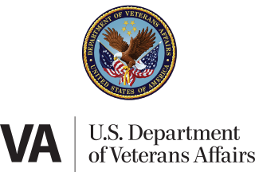

## Table of Contents

## What is the United States Department of Veterans Affairs?

The United States Department of Veterans Affairs, often called the VA, is a government agency that helps people who have served in the military. It provides many services like health care, benefits, and support to veterans and their families. The VA makes sure that veterans get the help they need after they finish serving in the military.

The VA runs hospitals and clinics all over the country where veterans can get medical care. They also give out money benefits to veterans who are disabled or need help because of their service. The VA helps veterans find jobs, go to school, and even get homes. It's a big organization that works hard to take care of those who have served the country.

## When was the Department of Veterans Affairs established?

The Department of Veterans Affairs was established on March 15, 1989. Before that, it was part of a smaller agency called the Veterans Administration, which started in 1930. The change to a full department showed how important it was to take care of veterans.

The new department was created to make sure veterans got better services and more attention from the government. It brought together different parts of the government that helped veterans, like health care, benefits, and memorial affairs, into one big organization. This made it easier for veterans to get the help they needed.

## What are the main services provided by the VA?

The VA provides many important services to help veterans. One of the main services is health care. The VA runs hospitals and clinics all over the country where veterans can get medical treatment. They take care of everything from regular check-ups to big surgeries. Veterans can also get help with mental health issues, like PTSD, which can happen after serving in the military.

Another big service the VA offers is benefits. This includes money help for veterans who are disabled because of their service. The VA also gives money to veterans who need help with things like housing or education. They can help veterans go to school or find a job. These benefits are important because they help veterans have a good life after they finish serving.

The VA also helps with memorial affairs. This means they take care of national cemeteries where veterans can be buried with honor. They also help families plan funerals and give them support during hard times. All these services show how the VA works hard to take care of veterans and their families.

## How is the Department of Veterans Affairs structured?

The Department of Veterans Affairs is run by the Secretary of Veterans Affairs, who is chosen by the President. The Secretary is in charge of the whole department and makes sure it works well. The VA is split into three big parts: the Veterans Health Administration (VHA), the Veterans Benefits Administration (VBA), and the National Cemetery Administration (NCA). Each part has its own leader who reports to the Secretary.

The Veterans Health Administration is the biggest part of the VA. It runs all the hospitals and clinics where veterans get health care. The Veterans Benefits Administration helps veterans get money and other benefits they need. This includes help with disabilities, education, and housing. The National Cemetery Administration takes care of the national cemeteries where veterans can be buried. All these parts work together to help veterans and their families.

The VA also has smaller offices that help with things like research, information technology, and making sure the department follows the law. These offices support the three main parts of the VA. Together, all these parts make sure veterans get the help they need after serving in the military.

## Who is eligible for VA benefits?

Veterans who served in the military, naval, or air service and were discharged under conditions other than dishonorable are usually eligible for VA benefits. This includes people who served in the Army, Navy, Air Force, Marine Corps, Coast Guard, and even the National Guard or Reserves if they were called to active duty. Veterans who were injured or became sick because of their service can get disability benefits. Also, veterans who served during certain wars or times can get special benefits.

Family members of veterans can also get some benefits. For example, the spouse, surviving spouse, and children of a veteran might be able to get money help, health care, or education benefits. If a veteran dies, their family can get help with funeral costs and burial in a national cemetery. The VA looks at each person's situation to see what benefits they can get, so it's good for veterans and their families to check what they might be eligible for.

## How does one apply for VA benefits?

To apply for VA benefits, you can start by visiting the VA's official website. There, you can find a lot of information about the different benefits you might be eligible for. You can apply online through the VA's eBenefits portal. You will need to fill out forms and provide documents like your military discharge papers, called a DD Form 214, and any medical records that show your service-related issues. If you need help, you can call the VA or visit a local VA office where someone can help you with the application.

Once you submit your application, the VA will review it to see if you qualify for the benefits you asked for. This can take some time, so be patient. If you need help while you wait, you can contact the VA or a Veterans Service Organization. They can help you understand the process and answer any questions you have. If your application is approved, you will start getting the benefits you need, like money help, health care, or education support. If it's denied, you can appeal the decision and ask the VA to look at your case again.

## What is the VA healthcare system and how does it work?

The VA healthcare system is a big network of hospitals and clinics that help veterans get medical care. It's run by the Veterans Health Administration, which is part of the Department of Veterans Affairs. Veterans can go to these places to see doctors, get medicine, and have surgeries. The VA tries to make sure that veterans can get the care they need close to where they live. They also have special programs to help with mental health issues, like PTSD, which can happen after serving in the military.

To use the VA healthcare system, veterans need to enroll first. They can do this by filling out an application online, by mail, or in person at a VA facility. When they apply, they need to show their military discharge papers and any medical records that show their service-related health issues. Once enrolled, veterans can make appointments and get care at VA hospitals and clinics. The VA tries to make the process easy so veterans can focus on getting better.

## What educational benefits does the VA offer to veterans?

The VA offers educational benefits to help veterans go to school or learn new skills. One of the main programs is the GI Bill, which gives money to veterans to pay for college, training, or even flight school. There are different types of GI Bills, like the Post-9/11 GI Bill, which helps veterans who served after September 11, 2001. Veterans can use this money to pay for tuition, housing, and books. The VA also has the Montgomery GI Bill for those who served before that date.

Another program is the Vocational Rehabilitation and Employment (VR&E) service, which helps veterans with service-connected disabilities. This program can pay for school, training, or even starting a business. It's all about helping veterans find good jobs and have a good life after the military. Veterans can work with a counselor to make a plan that fits their needs and goals. These educational benefits show how the VA wants to help veterans succeed in their lives after serving.

## How does the VA support housing for veterans?

The VA helps veterans find a place to live by offering different housing programs. One big program is the VA home loan, which helps veterans buy a house with no down payment and good interest rates. This makes it easier for veterans to own a home. The VA also has the Specially Adapted Housing (SAH) grant for veterans with certain disabilities. This grant helps them change their homes to fit their needs, like adding ramps or special bathrooms.

Another way the VA supports housing is through the Supportive Services for Veteran Families (SSVF) program. This program gives money and help to veterans who are homeless or at risk of losing their homes. It can pay for things like rent, moving costs, and even child care. The VA works with local groups to make sure veterans get the help they need to stay in their homes or find new ones. These programs show how the VA wants to make sure veterans have a safe place to live.

## What role does the VA play in veterans' employment?

The VA helps veterans find jobs by offering different programs and services. One big program is the Vocational Rehabilitation and Employment (VR&E) service. This program helps veterans with service-connected disabilities find good jobs. Veterans can work with a counselor to make a plan that fits their needs and goals. The plan might include going to school, getting job training, or even starting a business. The VA wants to make sure veterans can have a good career after they leave the military.

The VA also works with other groups to help veterans find work. They have job fairs and workshops where veterans can meet employers and learn about job opportunities. The VA's Transition Assistance Program (TAP) helps veterans get ready to leave the military and start a new job. It teaches them about resumes, interviews, and how to find work. All these efforts show how the VA wants to help veterans succeed in their lives after serving.

## How does the VA address mental health issues among veterans?

The VA works hard to help veterans with mental health problems like PTSD, depression, and anxiety. They have special programs and services to make sure veterans can get the care they need. The VA runs mental health clinics where veterans can see doctors and therapists. They also have special groups and treatments that are made just for veterans. The VA knows that mental health is very important, so they try to make it easy for veterans to get help when they need it.

The VA also helps veterans with things like suicide prevention. They have a Veterans Crisis Line that veterans can call anytime, day or night, if they are feeling really bad. The VA also works with other groups to help veterans who are homeless or have a hard time finding help. They want to make sure that no veteran feels alone or without support. By offering all these services, the VA shows that they care about the mental health of veterans and want to help them live better lives.

## What are some of the current challenges and reforms facing the VA?

The VA faces some big challenges right now. One big problem is long wait times for veterans to get health care. Sometimes, veterans have to wait a long time to see a doctor, which can be hard for them. Another challenge is making sure all veterans know about the benefits they can get. Some veterans don't know what help they can get, so they miss out on important services. The VA also has to deal with a lot of paperwork and old computer systems, which can make things slow and hard to manage.

To fix these problems, the VA is trying to make some changes. They are working on new ways to make health care faster and easier for veterans. This includes using new technology and hiring more doctors and nurses. The VA is also trying to tell more veterans about the benefits they can get, so more people can use them. They are working on making their computer systems better, so things can run more smoothly. These changes are important to help the VA take better care of veterans.

## References & Further Reading

[1]: Bergstra, J., Bardenet, R., Bengio, Y., & Kégl, B. (2011). ["Algorithms for Hyper-Parameter Optimization."](https://dl.acm.org/doi/10.5555/2986459.2986743) Advances in Neural Information Processing Systems 24.

[2]: ["Advances in Financial Machine Learning"](https://www.amazon.com/Advances-Financial-Machine-Learning-Marcos/dp/1119482089) by Marcos Lopez de Prado

[3]: ["Evidence-Based Technical Analysis: Applying the Scientific Method and Statistical Inference to Trading Signals"](https://www.amazon.com/Evidence-Based-Technical-Analysis-Scientific-Statistical/dp/0470008741) by David Aronson

[4]: ["Machine Learning for Algorithmic Trading"](https://github.com/stefan-jansen/machine-learning-for-trading) by Stefan Jansen

[5]: ["Quantitative Trading: How to Build Your Own Algorithmic Trading Business"](https://www.amazon.com/Quantitative-Trading-Build-Algorithmic-Business/dp/1119800064) by Ernest P. Chan