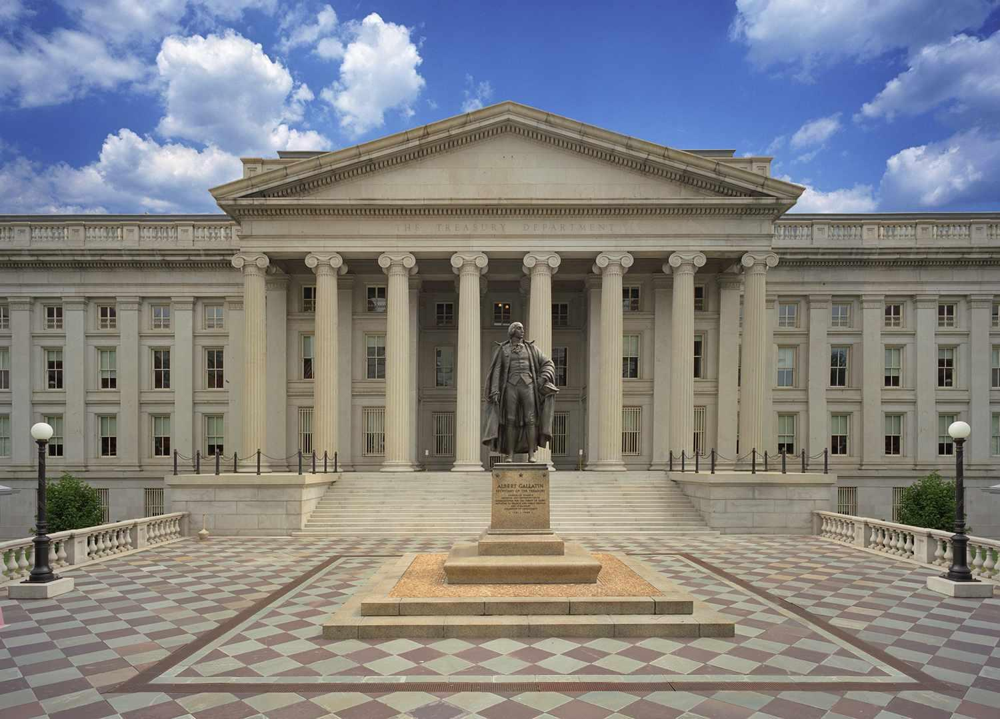

The U.S. Department of the Treasury plays a pivotal role in managing the financial and economic stability of the United States. Established by Congress in 1789, the Treasury Department has been instrumental in formulating policies that foster economic growth and ensure financial security. Over the years, it has expanded its responsibilities to include a vast array of functions critical to the nation's financial well-being.

This article provides an exploration of the diverse functions of the Treasury Department, including its historical significance and the innovative practices it employs to efficiently manage the nation’s financial resources. The integration of sophisticated technologies like algorithmic trading is a testament to its evolving role in the fast-paced financial markets. Algorithmic trading involves using complex mathematical models for executing trades with high speed and accuracy, offering advantages such as reduced transaction costs and improved market liquidity.

Understanding the multifaceted role of the Treasury is crucial for recognizing its impact on both domestic and international financial landscapes. The department's policies not only influence national economic strategies but also affect global economic stability and growth initiatives. As digital technology continues to evolve, the Treasury’s integration of advanced tools ensures it remains at the forefront of financial innovation.

Moreover, the Treasury's engagement in enhancing financial stability, fostering global economic growth, and safeguarding national security through financial intelligence operations is notable. The Office of Foreign Assets Control (OFAC), for example, plays a crucial role in blocking assets and imposing trade restrictions to counter international threats. Such efforts highlight the Treasury's commitment to maintaining the integrity and security of the national financial system while encouraging responsible global economic practices.

## Table of Contents

## History of the U.S. Treasury

The U.S. Department of the Treasury was founded during the first session of Congress in 1789. Alexander Hamilton, the inaugural Secretary of the Treasury, played a pivotal role in shaping the economic foundation of the newly constituted United States. Hamilton's strategic initiatives, notably his advocacy for the federal assumption of state debts incurred during the Revolutionary War and the establishment of the Bank of the United States, were instrumental in laying the groundwork for contemporary fiscal policy. These measures not only aimed to stabilize the national economy but also sought to enhance federal authority by centralizing financial power.

Throughout its history, the Treasury has demonstrated resilience and adaptability in response to varying economic challenges. During the Great Depression, for instance, the Treasury took significant steps to restore economic stability, including the implementation of Federal Reserve policies and managing large-scale public works programs. As globalization advanced, the Treasury assumed a crucial role in regulating an increasingly interconnected global economy. This included forming and enforcing policies that address international trade, exchange rates, and financial market stability.

In tandem with its evolving role, the Treasury's responsibilities have significantly expanded. Initially tasked with managing government revenue and monetary policy, the Treasury's duties have come to encompass the manufacturing of currency through the Bureau of Engraving and Printing and the United States Mint. Additionally, it plays a key regulatory role in the taxation system, working through the Internal Revenue Service to collect taxes and enforce federal tax laws. Over time, the Treasury has also been endowed with the authority to enforce federal financial laws through various bureaus and offices, ensuring compliance and integrity within the financial system.

These historical developments illustrate the transformative nature of the Treasury's mission and underscore its adaptability in maintaining fiscal order and economic security across different periods in American history.

## Key Functions of the Treasury

The U.S. Department of the Treasury is entrusted with several critical responsibilities that support the financial foundation and governance of the United States. Among its primary duties is managing federal finances, a complex task involving the oversight of government revenue and expenditure to ensure economic stability. This process includes the formulation of policies to regulate the nation's treasury and manage the flow of funds.

Collecting taxes, duties, and other monies owed to the federal government constitutes another significant function. Through the Internal Revenue Service (IRS) and other agencies, the Treasury efficiently administers tax laws and collects federal taxes, crucial for funding government operations and public services.

In addition to revenue collection, the Treasury is responsible for producing currency and coinage to facilitate transactions and support economic activities. The Bureau of Engraving and Printing and the United States Mint are specifically tasked with this mandate, producing and distributing currency and coinage that meet the public's demand.

The Treasury also supervises national banks and institutions to uphold the financial system's stability and integrity. It provides guidance on both domestic and international economic policies, reflecting its integral advisor role in crafting regulations and fiscal strategies. Moreover, the Treasury enforces federal finance and tax laws, ensuring compliance and legal conformity across financial dealings.

Managing public debt is another pivotal function of the Treasury. By issuing securities, such as Treasury bonds, notes, and bills, the department finances government operations and provides investment options for both domestic and international investors. This process helps maintain the nation’s creditworthiness and supports [liquidity](/wiki/liquidity-risk-premium) in financial markets.

Additionally, the Treasury plays a vital role in maintaining the country’s financial infrastructure. It collaborates with other federal agencies and financial institutions to enhance the resilience and efficiency of financial systems, employing modern technologies and practices to adapt to evolving market dynamics.

Lastly, the Treasury actively engages with international financial institutions to promote global economic stability and growth. Through collaboration with entities such as the International Monetary Fund (IMF) and the World Bank, the department influences international economic policy and addresses global financial challenges, thereby fostering economic cooperation and integration.

## Algorithmic Trading and Financial Innovation

Algorithmic trading represents a significant leap in the evolution of financial market operations. It leverages intricate algorithms and mathematical models to automate trade executions, thereby enhancing both the speed and precision with which trading activities are conducted. This method is particularly notable for its ability to lower transaction costs by reducing the need for manual intervention and for its role in augmenting market liquidity by enabling higher trading volumes.

The U.S. Department of the Treasury recognizes the transformative potential of [algorithmic trading](/wiki/algorithmic-trading), as well as the inherent challenges it poses. The Treasury, in collaboration with other regulatory entities, devotes considerable effort to overseeing this domain, ensuring that it aligns with established financial regulations and ethical standards. This involves rigorous monitoring to prevent the occurrence of market manipulation or financial fraud, which can arise from the misuse of algorithmic techniques.

Regulation of algorithmic trading often requires partnerships with organizations such as the Securities and Exchange Commission (SEC) and the Commodity Futures Trading Commission (CFTC). These bodies work together to craft regulatory frameworks that accommodate technological advancements in trading while upholding market integrity.

Moreover, the Treasury supports initiatives that promote the responsible use of algorithmic systems. By fostering technological innovation within a regulated framework, the Treasury aims to harness the benefits of algorithmic trading while minimizing its risks. This involves continuous evaluation and adaptation of regulatory practices in response to the evolving dynamics of financial markets.

In conclusion, the Treasury's involvement in algorithmic trading and financial innovation underscores its commitment to maintaining robust, transparent, and fair financial markets. The goal is to ensure that technological advancements contribute positively to economic stability and growth, setting a precedent for responsible financial governance in an increasingly automated world.

## The Treasury's Role in Financial Security and Compliance

The U.S. Department of the Treasury plays a critical role in ensuring financial security and enforcing compliance through a set of comprehensive strategies. These strategies are essential for maintaining the integrity and stability of both domestic and international financial systems.

One of the primary mechanisms utilized by the Treasury is the implementation of economic sanctions. Sanctions serve as a tool for influencing foreign governments and entities that engage in activities deemed threatening to national security or international peace. By targeting financial institutions, businesses, and individuals, the Treasury can effectively block access to financial resources and networks, thereby constraining undesirable behaviors.

These efforts are largely managed by the Treasury's Office of Foreign Assets Control (OFAC). OFAC is responsible for administering and enforcing economic and trade sanctions based on U.S. foreign policy and national security goals. It effectively blocks the assets of, and imposes trade restrictions on, targeted entities such as terrorist organizations and countries contravening international norms. This regulatory measure not only deters illegal actions but also signals the U.S.’s commitment to global security.

The Treasury enhances its efforts by collaborating extensively with other federal agencies and international partners. This collaboration is vital in the fight against complex financial crimes like money laundering and terrorism financing. By sharing intelligence and resources across borders, the Treasury can effectively identify illegal financial activities and shut down illicit networks before they can cause harm.

To ensure adherence to financial regulations, the Treasury conducts regular audits and employs various regulatory tools. These measures help safeguard the financial system against exploitation by ensuring that financial institutions comply with federal laws. Robust compliance frameworks are in place to detect and prevent financial crimes. Institutions found in breach of these laws face significant penalties, including fines and restrictions.

The ongoing commitment to financial security and regulatory compliance demonstrates the Treasury’s vital role in protecting not only the U.S. economy but also contributing to global economic stability. As financial crimes continue to evolve, the Treasury remains steadfast in its resolve to adapt and implement necessary measures to counter emerging threats.

## Conclusion

The U.S. Department of the Treasury plays a crucial role in ensuring the financial and economic stability of the nation. By managing public finances efficiently, it supports sustainable economic growth and reinforces national security. The Treasury's ability to adapt to emerging challenges is evident in its integration of algorithmic trading and other financial innovations, which highlight its commitment to leveraging technology for better governance. As interconnected global financial systems evolve rapidly, the Treasury's function in safeguarding and advancing a stable economic environment becomes increasingly significant. By coordinating with both domestic and international institutions, the Treasury continues to uphold its central responsibility of maintaining a secure financial framework that benefits not only the United States but also contributes to global economic prosperity.

## References & Further Reading

[1]: Bergstra, J., Bardenet, R., Bengio, Y., & Kégl, B. (2011). ["Algorithms for Hyper-Parameter Optimization."](https://dl.acm.org/doi/10.5555/2986459.2986743) Advances in Neural Information Processing Systems 24.

[2]: ["Advances in Financial Machine Learning"](https://www.amazon.com/Advances-Financial-Machine-Learning-Marcos/dp/1119482089) by Marcos Lopez de Prado

[3]: ["Evidence-Based Technical Analysis: Applying the Scientific Method and Statistical Inference to Trading Signals"](https://www.amazon.com/Evidence-Based-Technical-Analysis-Scientific-Statistical/dp/0470008741) by David Aronson

[4]: ["Machine Learning for Algorithmic Trading"](https://github.com/stefan-jansen/machine-learning-for-trading) by Stefan Jansen

[5]: ["Quantitative Trading: How to Build Your Own Algorithmic Trading Business"](https://www.amazon.com/Quantitative-Trading-Build-Algorithmic-Business/dp/1119800064) by Ernest P. Chan