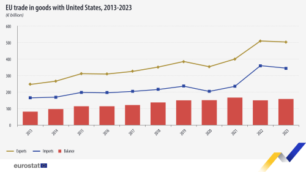

## Table of Contents

## What is the total trade volume between the United States and the European Union?

The total trade volume between the United States and the European Union is very large. In 2022, the trade in goods and services between these two regions was worth about $1.3 trillion. This number shows how important the economic relationship is between the US and the EU.

The trade includes many different products and services. The US exports things like machinery, aircraft, and vehicles to the EU. On the other hand, the EU sends pharmaceuticals, machinery, and vehicles to the US. This exchange helps both economies grow and creates jobs in both regions.

## Which goods and services are primarily traded between the US and the EU?

The main things the US sends to the EU are machinery, aircraft, vehicles, and agricultural products like soybeans and corn. These goods are important for the EU's industries and help feed its population. The US also exports a lot of services, especially in areas like finance, insurance, and technology. These services help EU businesses run smoothly and grow.

On the other hand, the EU sends a lot of pharmaceuticals, machinery, vehicles, and chemicals to the US. These products are essential for the US's healthcare and manufacturing sectors. The EU also exports services, with a focus on transportation, travel, and telecommunications. These services make it easier for people and businesses in the US to connect and move around.

Overall, the trade between the US and the EU is very diverse. It includes both goods and services that are crucial for both regions. This exchange helps both economies stay strong and supports jobs on both sides of the Atlantic.

## How has the trade volume between the US and the EU changed over the past decade?

Over the past decade, the trade volume between the United States and the European Union has seen some ups and downs but has generally grown. In 2012, the total trade in goods and services was around $1 trillion. By 2022, this had increased to about $1.3 trillion. This growth shows that both regions have become more important to each other's economies over time. Factors like economic growth, changes in technology, and trade agreements have all played a role in this increase.

There have been some years where trade dipped a bit, like during the global economic slowdowns or when there were trade disputes. For example, in 2018 and 2019, trade tensions between the US and the EU led to a slight decrease in trade volume. However, these dips were usually followed by recovery as both sides worked to resolve their differences. Overall, the long-term trend has been one of growth, reflecting the strong economic ties and mutual benefits that come from trading with each other.

## What are the main factors influencing the US-EU trade volume?

Several things affect how much the US and the EU trade with each other. One big factor is the overall health of their economies. When the US and EU economies are doing well, people and businesses have more money to spend on goods and services from each other. Another important factor is trade policies and agreements. If the US and EU have good trade deals, it's easier and cheaper for them to trade, which can increase the trade volume. On the other hand, if there are trade disputes or tariffs, it can make trading harder and reduce the amount of trade.

Changes in technology also play a role. New technology can make it easier to produce and transport goods, which can lead to more trade. For example, better shipping methods or digital services can help increase the trade volume. Finally, global events like economic crises or pandemics can impact trade. During tough times, trade might go down because people and businesses are more cautious about spending. But when things get better, trade usually picks up again.

## How do tariffs and trade agreements affect the US-EU trade volume?

Tariffs and trade agreements have a big impact on how much the US and EU trade with each other. Tariffs are like taxes on goods that come from another country. If the US puts high tariffs on EU goods, it makes those goods more expensive for Americans to buy. This can lead to less trade because people might choose to buy cheaper things made in the US instead. On the other hand, if the EU puts high tariffs on US goods, it can make it harder for American companies to sell their products in Europe, which also reduces trade.

Trade agreements are deals between countries that can make trading easier. When the US and EU have good trade agreements, they can lower or remove tariffs, making it cheaper to trade. This usually leads to more trade because it's easier for businesses to sell their goods and services in each other's markets. For example, if the US and EU agree to lower tariffs on cars, more cars might be traded between them. But if there are no good trade agreements, or if there are trade disputes, it can make trading harder and reduce the trade volume.

## What role do multinational corporations play in the US-EU trade?

Multinational corporations are really important for trade between the US and the EU. These big companies have offices and factories in both places. They make things in one country and sell them in the other. For example, a car company might make cars in the US and then sell them in Europe. This helps increase the amount of trade because these companies are always moving goods and services back and forth.

These companies also help create jobs in both the US and the EU. When a multinational company sets up a factory in Europe, it hires people there. The same goes for the US. This not only boosts trade but also helps the economies of both regions grow. Plus, these companies often work together with local businesses, which can lead to even more trade and economic growth.

## How does the US-EU trade volume compare to their trade with other global regions?

The trade between the US and the EU is huge compared to their trade with other parts of the world. In 2022, the US and EU traded about $1.3 trillion worth of goods and services. This is much more than the US trades with countries like China, where the trade volume was around $750 billion in the same year. The EU also trades a lot with China, but the volume is less than what they do with the US, coming in at around $800 billion. So, the US-EU trade is the biggest trade relationship for both regions.

The reasons for this big trade volume are strong economic ties and shared values between the US and EU. They have a lot of trade agreements that make it easier to buy and sell things. Plus, they have similar laws and standards, which helps businesses work together smoothly. Compared to other regions, the US and EU have been trading a lot for a long time, and this trade keeps growing. This makes their trade relationship special and much bigger than what they have with other parts of the world.

## What are the economic impacts of US-EU trade on both regions?

The trade between the US and the EU helps both places a lot. It makes their economies stronger because they can sell more things to each other. When the US sends cars or airplanes to the EU, it helps American companies make more money and hire more people. The same thing happens when the EU sends medicines or machines to the US. This trade creates jobs and helps businesses grow in both regions. It also means that people in the US and EU can buy more things at better prices because there's more competition.

This trade also helps both regions work together better. They share technology and ideas, which can lead to new inventions and better ways of doing things. For example, if a US company works with an EU company, they might come up with a new way to make cars that's better for the environment. This kind of cooperation can make both economies more innovative and competitive. Overall, the US-EU trade is really important for keeping their economies strong and helping them grow.

## How do political relations between the US and EU influence their trade volume?

Political relations between the US and EU can really affect how much they trade with each other. When the US and EU get along well, they can make good trade deals that make it easier and cheaper to buy and sell things. This usually leads to more trade because businesses can work together more easily. For example, if the leaders of both places agree on things like tariffs and rules, it helps companies trade more.

But if there are problems between the US and EU, it can make trading harder. If they argue about things like taxes on goods or rules about how things should be made, it can lead to less trade. For instance, if the US puts high taxes on EU goods because they're not happy with something, it makes those goods more expensive in the US. This can make people buy less from the EU, which means less trade. So, good political relations help trade grow, while bad relations can make it shrink.

## What are the current trends and future projections for US-EU trade volume?

Right now, the trade between the US and the EU is growing. In 2022, they traded about $1.3 trillion worth of goods and services. This is more than they traded in the past, and it shows that their economies are getting more connected. Even though there have been some ups and downs, like during trade disputes or global economic problems, the overall trend is that trade is going up. This is because both places have strong economies and they keep making new trade deals that help them trade more.

Looking into the future, experts think that the US-EU trade will keep growing. They believe that as technology gets better and new trade agreements are made, it will be easier for businesses in the US and EU to work together. This could mean more trade in things like green technology and digital services. But, things like political disagreements or big global events could still affect how much they trade. Overall, the future looks bright for US-EU trade, as long as they keep working together and solving any problems that come up.

## How do specific industries, such as technology or agriculture, contribute to the overall trade volume?

The technology industry plays a big role in the trade between the US and the EU. The US sends a lot of tech products like computers, software, and digital services to the EU. These things help EU businesses work better and stay connected. On the other hand, the EU also sends tech products to the US, like machinery and telecom equipment. This back-and-forth trade in technology helps both places grow their tech industries and creates jobs. As technology keeps getting better, the trade in this area is likely to keep growing.

Agriculture is another important part of the US-EU trade. The US exports a lot of farm products like soybeans, corn, and meat to the EU. These foods help feed people in Europe and support their food industry. The EU also sends some agricultural products to the US, like wine and cheese. This trade in food helps both regions have a variety of products to choose from and supports farmers on both sides. As people keep wanting more and different kinds of food, the trade in agriculture will stay important for the US and EU.

## What are the challenges and opportunities for increasing the US-EU trade volume in the future?

There are some challenges that could make it harder for the US and EU to trade more in the future. One big challenge is political disagreements. If the leaders of the US and EU can't agree on things like tariffs or rules, it can make trading harder. Another challenge is global events like economic crises or pandemics. These can slow down trade because people and businesses might not have as much money to spend. Also, if new technology makes it easier to make things at home instead of trading, that could affect how much they trade too.

But there are also a lot of opportunities for the US and EU to trade more. One big opportunity is new trade agreements. If they can make good deals that lower taxes on goods and make it easier to trade, it could lead to more trade. Another opportunity is in new industries like green technology and digital services. As these areas grow, there will be more things for the US and EU to trade. Plus, as their economies keep getting stronger, people and businesses will have more money to spend on each other's goods and services. This could help the trade between the US and EU keep growing in the future.

## References & Further Reading

[1]: European Commission. (2021). ["EU Trade Relations with the United States."](https://policy.trade.ec.europa.eu/eu-trade-relationships-country-and-region/countries-and-regions/united-states_en)

[2]: Office of the United States Trade Representative. (2021). ["U.S.-EU Trade."](https://ustr.gov/about-us/policy-offices/press-office/reports-and-publications/2021)

[3]: European Federation of Pharmaceutical Industries and Associations (EFPIA). (2021). ["The Pharmaceutical Industry in Figures."](https://www.efpia.eu/publications/downloads/efpia/the-pharmaceutical-industry-in-figures-2021/)

[4]: U.S. Department of Commerce, International Trade Administration. (2021). ["Industry Data & Analysis."](https://www.trade.gov/report/2021-ita-us-exporter-database)

[5]: WTO Dispute Settlement Body. ["The Boeing and Airbus Disputes."](https://www.intereconomics.eu/contents/year/2010/number/5/article/the-airbus-boeing-dispute-implications-of-the-wto-boeing-decision.html)

[6]: FinTech Global. ["Algorithmic Trading and High-Frequency Trading Strategies."](https://www.fintechdemand.com/insights/finance/revolutionizing-trading-with-algorithmic-trading/)

[7]: ["The Volatility of Algorithmic Trading"](https://aisel.aisnet.org/cgi/viewcontent.cgi?article=1006&context=wi2011) on Investopedia

[8]: ["Securing The Future Of Europe In The Era Of Algorithmic Trading."](https://www.tandfonline.com/doi/full/10.1080/09662839.2022.2101885) World Economic Forum

[9]: U.S.-EU Trade & Technology Council. ["About the TTC."](https://www.state.gov/u-s-eu-trade-and-technology-council-ttc/)