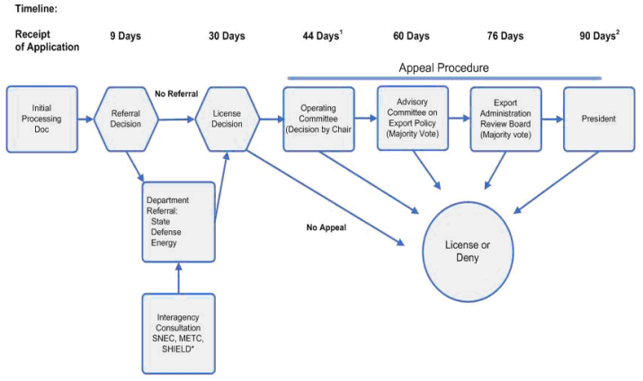

## Table of Contents

## What are export restrictions and why are they important for the United States?

Export restrictions are rules that a country puts in place to control what products, technology, or information can be sent to other countries. In the United States, these restrictions are important because they help protect national security, prevent the spread of weapons, and stop dangerous technology from getting into the wrong hands. For example, the U.S. might restrict the export of certain military equipment or advanced technology to make sure it doesn't end up with countries or groups that could use it against the U.S. or its allies.

These restrictions are also important for the U.S. economy. By controlling what can be exported, the government can help protect American businesses from unfair competition and maintain a strong economy. For instance, if a U.S. company has developed a new technology, export controls can prevent that technology from being copied or used by competitors in other countries. This helps keep American companies strong and innovative, which is good for the overall economy.

## What are the main goals of U.S. export control policies?

The main goals of U.S. export control policies are to protect national security and prevent the spread of dangerous weapons and technology. The U.S. government wants to make sure that military equipment, advanced technology, and sensitive information do not end up in the hands of countries or groups that could use them against the U.S. or its allies. By controlling what can be exported, the U.S. can stop these items from being used to harm its own security or the security of other friendly nations.

Another important goal is to support the U.S. economy. Export controls help protect American businesses from unfair competition by preventing the export of new technologies that could be copied or used by competitors in other countries. This helps keep U.S. companies strong and innovative, which is good for the overall economy. By maintaining these controls, the U.S. can ensure that its businesses continue to grow and contribute to a healthy economic environment.

## Which government agencies are responsible for enforcing export restrictions in the U.S.?

The main government agency responsible for enforcing export restrictions in the U.S. is the Department of Commerce. Within the Department of Commerce, the Bureau of Industry and Security (BIS) plays a key role. The BIS manages the Export Administration Regulations (EAR), which control the export of dual-use items. These are items that can be used for both civilian and military purposes. The BIS works to make sure that these items do not end up in the wrong hands and that U.S. businesses are protected.

Another important agency is the Department of State. The Directorate of Defense Trade Controls (DDTC) within the Department of State is in charge of the International Traffic in Arms Regulations (ITAR). These regulations control the export of defense articles and services. The DDTC makes sure that military equipment and technology do not get exported to countries or groups that could use them against the U.S. or its allies. Together, these agencies help keep the country safe and support the economy by enforcing export restrictions.

## What is the Export Administration Regulations (EAR) and what does it cover?

The Export Administration Regulations (EAR) is a set of rules made by the U.S. Department of Commerce. These rules control the export of items that can be used for both civilian and military purposes. These items are called dual-use items. The EAR helps make sure that these items do not end up in the wrong hands and that they do not harm U.S. national security.

The EAR covers a wide range of products, technology, and software. This includes things like computers, chemicals, and telecommunications equipment. The rules say that anyone who wants to export these items needs to get a license from the government first. This helps the U.S. keep track of where these items are going and make sure they are not used in ways that could hurt the country or its allies.

## What is the International Traffic in Arms Regulations (ITAR) and how does it differ from EAR?

The International Traffic in Arms Regulations (ITAR) is a set of rules from the U.S. Department of State. These rules control the export and import of defense-related items and services. This includes things like weapons, military equipment, and technology that can be used for defense purposes. ITAR makes sure that these items do not get into the hands of countries or groups that might use them against the U.S. or its allies. Anyone who wants to export these items needs to get a license from the government first.

ITAR and the Export Administration Regulations (EAR) are different because they cover different types of items. ITAR focuses on defense articles and services, which are specifically designed for military use. On the other hand, EAR covers dual-use items, which can be used for both civilian and military purposes. While ITAR is managed by the Department of State, EAR is managed by the Department of Commerce. Both sets of rules are important for keeping the U.S. safe and supporting its economy, but they work in different ways to control what can be exported.

## How do U.S. export restrictions affect international trade and global business operations?

U.S. export restrictions can make international trade more complicated for businesses. When a company wants to send products, technology, or information to another country, they have to follow the rules set by the U.S. government. This means they might need to get special licenses before they can export certain items. This can slow down the process and add extra costs. Companies have to be careful to follow these rules, or they could face big fines or other punishments. This can make it harder for them to do business with other countries and can affect how they plan their global operations.

On the other hand, these restrictions can also help protect U.S. businesses and the economy. By controlling what can be exported, the U.S. government helps stop other countries from copying or using American technology in ways that could hurt U.S. companies. This can give American businesses an advantage in the global market. It also helps keep the U.S. safe by making sure dangerous items don't end up in the wrong hands. So, while export restrictions can make international trade more challenging, they also play an important role in protecting national security and supporting the U.S. economy.

## What are the key differences between export controls and economic sanctions?

Export controls and economic sanctions are both ways that countries try to control what happens in other countries, but they work in different ways. Export controls are rules that a country puts in place to control what products, technology, or information can be sent to other countries. In the U.S., these rules are used to protect national security and stop dangerous technology from getting into the wrong hands. For example, the U.S. might restrict the export of certain military equipment or advanced technology to make sure it doesn't end up with countries or groups that could use it against the U.S. or its allies.

Economic sanctions, on the other hand, are actions taken by one country to punish or influence another country's behavior. These can include things like stopping trade, freezing bank accounts, or limiting travel. The goal of economic sanctions is to put pressure on a country to change its actions or policies. For example, the U.S. might use economic sanctions to try to stop a country from developing nuclear weapons or to protest human rights abuses. While export controls focus on controlling specific items, economic sanctions are broader and can affect an entire country's economy.

## How are export licenses obtained and what criteria must be met to receive one?

To get an export license in the U.S., a company or person needs to apply to the right government agency. If the item they want to export is covered by the Export Administration Regulations (EAR), they apply to the Department of Commerce. If it's covered by the International Traffic in Arms Regulations (ITAR), they apply to the Department of State. The application usually asks for details about the item, where it's going, who will receive it, and why it's being exported. The government then reviews the application to make sure it follows the rules and doesn't harm U.S. security or interests.

To receive an export license, the applicant must meet certain criteria. The government looks at whether the export could harm U.S. national security, foreign policy, or the economy. They also check if the item might be used to make weapons or for other dangerous purposes. If the item is going to a country that the U.S. has concerns about, that can affect the decision too. The goal is to make sure that only safe and legal exports happen, so the government takes its time to review each application carefully.

## What are the penalties for violating U.S. export restrictions?

Violating U.S. export restrictions can lead to serious penalties. If a company or person breaks the rules, they might have to pay big fines. The fines can be a lot of money, sometimes millions of dollars. The government can also take away the right to export anything in the future. This can hurt a business a lot because they won't be able to sell their products to other countries.

In some cases, breaking export rules can even lead to jail time. If the violation is seen as very serious, the people involved might go to prison. This is more likely if the violation harmed U.S. national security or helped dangerous groups. The government takes these rules very seriously to keep the country safe, so the penalties are strict to make sure people follow the law.

## How do emerging technologies like AI and cybersecurity influence U.S. export control policies?

Emerging technologies like AI and cybersecurity are changing how the U.S. thinks about export controls. These technologies can be used for both good and bad things. For example, AI can help with medical research but also be used to make weapons smarter. Because of this, the U.S. government wants to make sure these technologies don't end up in the wrong hands. They are updating their rules to keep a closer eye on AI and cybersecurity exports. This means companies that work with these technologies need to be more careful and might need special licenses to export them.

The U.S. is also working with other countries to set up rules for these new technologies. They want to make sure everyone is playing by the same rules so that no country gets an unfair advantage. This can make things more complicated for businesses because they have to follow not just U.S. rules but also international agreements. But it's important for keeping the world safe and making sure these powerful technologies are used in the right way.

## What role do multilateral export control regimes play in U.S. export policy?

Multilateral export control regimes are groups of countries that work together to control the export of certain items. These groups help the U.S. make sure that dangerous technology and weapons don't end up in the wrong hands. By working with other countries, the U.S. can set up rules that everyone follows. This makes it harder for bad actors to get around the rules by going to a country with weaker controls. Some important groups the U.S. works with include the Wassenaar Arrangement, the Nuclear Suppliers Group, and the Missile Technology Control Regime.

These regimes are important because they help the U.S. protect its national security and support its foreign policy goals. When countries agree on export controls, it's easier to stop the spread of dangerous technology. This cooperation also helps the U.S. build stronger relationships with other countries. By working together, they can tackle global problems like terrorism and the spread of weapons of mass destruction. This makes the world safer and helps the U.S. achieve its goals more effectively.

## How have recent geopolitical events influenced changes in U.S. export restrictions?

Recent geopolitical events have made the U.S. change its export restrictions. For example, tensions with countries like China and Russia have led the U.S. to be more careful about what technology and products it lets go to these places. The U.S. wants to stop these countries from getting technology that could be used against it or its allies. So, the government has added more rules and made it harder to export certain items to these countries. This is to protect national security and keep the U.S. safe.

Another big event that changed U.S. export restrictions was the war in Ukraine. When Russia invaded Ukraine, the U.S. and its allies put strong export controls on Russia. They wanted to stop Russia from getting the things it needed to keep fighting. This included things like technology, electronics, and even oil and gas equipment. By doing this, the U.S. hoped to put pressure on Russia and help Ukraine. These changes show how the U.S. uses export controls to respond to big events happening around the world.

## References & Further Reading

[1]: Bureau of Industry and Security. ["Commerce Control List Overview and the Country Chart"](https://www.ecfr.gov/current/title-15/subtitle-B/chapter-VII/subchapter-C/part-738). U.S. Department of Commerce.

[2]: Office of Foreign Assets Control. ["OFAC Regulations for the Financial Community"](https://ofac.treasury.gov/media/16151/download?inline). U.S. Department of the Treasury.

[3]: Fischer, A., & Begg, J. (2022). ["U.S. Export Controls and Economic Sanctions,"](https://onlinelibrary.wiley.com/doi/full/10.1111/roie.12724) Third Edition.

[4]: Council on Foreign Relations. ["US Trade Policy"](https://www.cfr.org/article/us-trade-policy-crossroads). 

[5]: Directorate of Defense Trade Controls. ["International Traffic in Arms Regulations (ITAR)"](https://www.state.gov/bureaus-offices/under-secretary-for-arms-control-and-international-security-affairs/bureau-of-political-military-affairs/directorate-of-defense-trade-controls-pm-ddtc/). U.S. Department of State.

[6]: Trujillo, J. C., & Ray, S. (2019). ["Navigating U.S. Export Controls and Economic Sanctions in 2019"](https://pubmed.ncbi.nlm.nih.gov/31474560/). International Practitioner’s Workshop.

[7]: Missile Technology Control Regime. ["Missile Technology Control Regime (MTCR): Objectives and Key Elements,"](https://www.state.gov/remarks-and-releases-bureau-of-international-security-and-nonproliferation/missile-technology-control-regime-mtcr-frequently-asked-questions/) homepage.

[8]: Wassenaar Arrangement. ["The Wassenaar Arrangement on Export Controls for Conventional Arms and Dual-Use Goods and Technologies,"](https://www.wassenaar.org/) homepage. 

[9]: BIS Annual Report. ["U.S. Department of Commerce Bureau of Industry and Security Annual Report,"](https://www.bis.doc.gov/index.php/about-bis/newsroom/publications) Fiscal Year 2018. 

[10]: Lester, S. (2018). ["International Trade Law and U.S. National Security Export Controls: Managing New Threats"](https://scholar.google.com/citations?user=sV0XTVUAAAAJ&hl=en). Georgetown University Law Center.