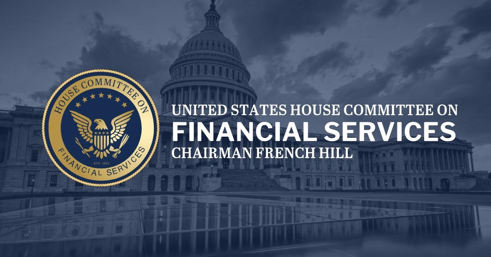

Algorithmic trading has fundamentally reshaped the landscape of financial markets around the world. Utilizing sophisticated computer algorithms to execute trades at speeds and frequencies beyond human capability, it has introduced both remarkable efficiencies and significant regulatory challenges. In the United States, managing the implications of this high-speed trading environment falls significantly within the purview of the financial regulatory framework. At the heart of this framework is the U.S. House Financial Services Committee, a crucial entity in overseeing and legislating developments within the financial services sector.

Established as a congressional entity, the U.S. House Financial Services Committee has the formidable task of monitoring and crafting legislation relevant to the financial industry. Its mandate spans a broad spectrum of financial activities, encompassing everything from banking to securities and exchanges. As financial technologies evolve rapidly, so too does the Committee's role in understanding and regulating them. Algorithmic trading, as a dominant force in today's financial markets, is subject to the Committee's scrutiny to ensure these innovative practices serve investors' interests and maintain market integrity.

Understanding the operations and influence of the U.S. House Financial Services Committee is essential for industry stakeholders. The Committee's oversight is vital not only for crafting policies that govern financial markets but also in addressing the potential risks associated with algorithmic trading, such as market manipulation and systemic instability. This article provides an exploration of the Committee's significant work, focusing on its supervision of algorithmic trading and its broader impact on the financial services industry. The goal is to elucidate how this integral component of the U.S. legislative framework influences financial innovation while striving to maintain an equitable and transparent market environment.

## Table of Contents

## What is the U.S. House Financial Services Committee?

The U.S. House Financial Services Committee is a pivotal congressional entity responsible for overseeing the financial services sector and crafting pertinent legislation. This committee initially emerged in 1865 as the Committee on Banking and Currency, reflecting its original focus on banking issues. However, as the financial landscape evolved, the committee was renamed in 1968 to the U.S. House Financial Services Committee, indicating its broadened mandate to encompass a wider array of financial services. 

The committee holds jurisdiction over key federal financial institutions and regulatory bodies. This includes oversight of the Department of the Treasury, which manages the U.S. government's finances and economic policies; the Federal Reserve, which is responsible for monetary policy and regulating banks; and the Securities and Exchange Commission (SEC), which enforces laws against market manipulation and protects investors. The committee's responsibilities also extend to other financial areas such as housing finance, urban development, insurance, international finance, and securities. 

The broader purview of the committee allows it to address and adapt to evolving financial challenges, including technological advancements like algorithmic trading. Through its legislative and oversight functions, the committee seeks to ensure a stable, secure, and transparent financial environment, aligning regulatory frameworks with the innovations and complexities of the modern financial ecosystem.

## The Committee's Role in Financial Oversight

The U.S. House Financial Services Committee plays a significant role in safeguarding the financial stability and accountability of the U.S. economy. This responsibility extends across various vital sectors, including housing affordability, urban development, securities and exchanges, and the insurance industry. 

One of the Committee's primary concerns is housing affordability and urban development. It seeks to address issues such as the availability of affordable housing, the influence of market forces on housing prices, and the effectiveness of public policies related to urban development. Through its legislative and oversight functions, the Committee examines proposed policies and funding levels for federal housing programs to improve access to affordable homes and support urban renewal projects.

In the securities and exchanges sector, the Committee is tasked with overseeing the functioning of financial markets to ensure they operate effectively, transparently, and with integrity. This involves monitoring the activities of financial institutions and regulators, including the Securities and Exchange Commission (SEC), to ensure that markets are free from fraud, manipulation, and excessive risk-taking. The Committee regularly reviews regulations affecting securities markets and trading practices to promote investor confidence and foster a sound financial system.

The insurance industry also falls under the Committee's jurisdiction. The Committee evaluates the regulatory framework surrounding insurance companies to ensure these entities remain solvent and capable of meeting their policyholder commitments. It further scrutinizes the adequacy of consumer protections and the overall competitiveness of the insurance market.

As financial technologies continue to progress, including advancements such as [algorithmic trading](/wiki/algorithmic-trading), the Committee must adapt its oversight to encompass these innovations. Algorithmic trading involves the use of complex algorithms to make buy and sell decisions at velocities and frequencies beyond human capability, significantly impacting market dynamics. The Committee's role in this context is to ensure that the adoption of such technologies does not compromise market fairness or transparency. By monitoring the impacts of algorithmic trading and advocating for regulations that address associated risks—such as market manipulation and system failures—the Committee seeks to maintain robust protections for investors while encouraging technological advancements that benefit the market as a whole.

Ultimately, the Committee's active involvement across these diverse areas of financial oversight is essential to maintaining a stable and accountable U.S. financial system. By continuously evaluating and updating regulatory measures, the Committee aims to protect the interests of both consumers and investors, fostering an environment conducive to sustainable economic growth.

## Algorithmic Trading: An Overview

Algorithmic trading, commonly referred to as algo trading, employs sophisticated computer programs to execute trades based on predefined rules and conditions. By automating the trading process, these algorithms significantly enhance the speed and efficiency with which trades are conducted, often completing them in fractions of a second. This rapid execution capability allows algorithmic trading to dominate modern financial markets, where it constitutes a substantial portion of the overall trading [volume](/wiki/volume-trading-strategy).

One of the primary advantages of algorithmic trading is its ability to increase market [liquidity](/wiki/liquidity-risk-premium). By continuously placing buy and sell orders, algorithms help narrow bid-ask spreads, thereby facilitating smoother transactions and improving market depth. Additionally, algorithmic trading can lead to lower transaction costs. This efficiency is often achieved by executing trades at optimal prices and minimizing market impact through strategies such as slicing larger orders into smaller, less conspicuous parts. 

Despite these benefits, algorithmic trading poses several risks. Market manipulation is one concern; traders can deploy algorithms to engage in deceptive practices like spoofing, where false orders are placed to mislead other market participants about demand or supply levels. Furthermore, algorithmic trading is susceptible to triggering or amplifying flash crashes—rapid, severe market declines followed by swift recoveries. This phenomenon occurs when automated trading leads to a cascade of sell orders, often exacerbated by high-frequency trading algorithms acting on similar signals.

In conclusion, while algorithmic trading offers numerous advantages in terms of speed, efficiency, and cost reduction, it is crucial for stakeholders to remain vigilant about its inherent risks, including potential market disturbances and manipulative practices.

## The Committee's Work on Algorithmic Trading

The Financial Services Committee plays a critical role in shaping policies that address both the risks and benefits associated with algorithmic trading. Given the transformative impact of these trading technologies on financial markets, the Committee’s legislative initiatives are directed toward enhancing market transparency and protecting investors from potential exploitation. It seeks to tackle issues related to market manipulation, systemic risks, and the amplification of price movements due to high-speed trading. These initiatives are essential to ensuring the integrity and stability of financial markets.

One of the key legislative efforts by the Committee involves crafting rules that mandate rigorous disclosure requirements from firms engaged in algorithmic trading. By requiring detailed information on trading algorithms and the logic that governs them, the Committee aims to unveil potential vulnerabilities and prevent exploitative practices. Transparency serves as a deterrent against practices like spoofing, where traders manipulate markets by placing deceptive orders with no intention of executing them.

Moreover, the Committee is actively working on initiatives to ensure that firms using algorithmic trading adhere to existing financial regulations while maintaining technological neutrality. This involves creating a regulatory environment that does not stifle innovation but insists on compliance with fundamental market protections. Recent efforts entail harmonizing regulations across federal agencies such as the Securities and Exchange Commission (SEC) and the Commodity Futures Trading Commission (CFTC) to ensure that firms are subject to consistent regulatory standards, thereby facilitating a level playing field.

The emphasis on technological neutrality is particularly significant, as it implies that legislative measures should not favor one technology over another, allowing for healthy competition and innovation in the financial sector. This approach enables firms to leverage advancements in technology to improve market efficiency, reduce transaction costs, and foster a more liquid trading environment.

In summary, the Financial Services Committee’s work on algorithmic trading involves a balanced regulatory strategy that promotes transparency, ensures compliance, and allows for technological advancement within a robust framework of investor protection and market integrity. This outlook not only addresses current challenges in algorithmic trading but also positions the U.S. financial industry to adapt to future technological developments.

## Recent Legislative Actions and Debates

In recent sessions, the U.S. House Financial Services Committee has actively worked to address the complexities surrounding the digital asset sector, which in turn impacts markets engaged in algorithmic trading. This legislative activity includes passing several bills aimed at providing much-needed clarity and framework for both digital currencies and the platforms that facilitate their trade. Among these measures are attempts to increase transparency within trading environments and ensure market participants operate under a fair and regulated system. 

A significant component of the Committee's work involves balancing the dual objectives of fostering innovation while safeguarding the financial markets against systemic risks. This balancing act is particularly vital as digital assets can introduce new vulnerabilities such as cyber threats and fraud while offering unprecedented opportunities for technological advancement and financial inclusion. The debate continues regarding how regulators can maintain oversight without stifling the rapid pace of innovation characteristic of this sector. 

To this end, the Committee's role is not only legislative but also analytical; it frequently assesses exceptions to existing regulations and considers nuanced impacts of new technologies. For instance, algorithmic trading strategies, while contributing positively to liquidity and efficiency, can also lead to issues such as market manipulation and flash crashes. Therefore, the Committee's reports and analyses strive to understand these risks comprehensively, ensuring that new exemptions or regulations do not inadvertently destabilize markets.

Such proactive measures by the U.S. House Financial Services Committee underscore its commitment to maintaining financial market stability. By staying at the cutting edge of financial technological trends and challenges, the Committee helps ensure a robust framework that protects investors and supports a dynamic marketplace. Stakeholders engaged in algorithmic trading and digital assets must remain attuned to these legislative developments, as they hold substantial implications for market operations and compliance requirements.

## Conclusion

The U.S. House Financial Services Committee remains at the forefront of regulating the complex and evolving financial services sector. As financial technologies continually advance, the Committee's role in fostering innovation while ensuring market integrity is crucial. This dual mandate necessitates a careful balance between encouraging technological advancements and imposing necessary regulations to protect the stability of financial markets.

Stakeholders and market participants must stay informed about the Committee's actions as they navigate an environment increasingly influenced by technologies such as algorithmic trading. Awareness and understanding of the legislative developments led by the Committee are vital for effectively managing the risks and opportunities that come with these innovations. 

Through its ongoing work, the Committee demonstrates its commitment to maintaining transparent and efficient markets, which is integral not only for investor protection but also for the broader health of the U.S. financial system. As such, active engagement with and understanding of the Committee’s initiatives enable stakeholders to better align with regulatory expectations and leverage emerging technologies responsibly.

## References & Further Reading

[1]: ["Regulation of Algorithmic Trading: A Comparative Assessment of the US and European Union Trading Regimes"](https://papers.ssrn.com/sol3/papers.cfm?abstract_id=3765882) by Markus Brunnermeier, Andrew Glyn, and David Aikman

[2]: Lopez de Prado, M. (2018). ["Advances in Financial Machine Learning"](https://www.amazon.com/Advances-Financial-Machine-Learning-Marcos/dp/1119482089) Wiley.

[3]: Chan, E. P. (2009). ["Quantitative Trading: How to Build Your Own Algorithmic Trading Business"](https://github.com/ftvision/quant_trading_echan_book) Wiley.

[4]: Jansen, S. (2020). ["Machine Learning for Algorithmic Trading"](https://github.com/stefan-jansen/machine-learning-for-trading) Packt Publishing.

[5]: Powell, J., & Azoulay, S. (2017). ["The Impact of Algorithms on Trading Benefits and Risks."](https://news.harvard.edu/gazette/story/2020/11/risks-and-benefits-of-an-ai-revolution-in-medicine/) CFA Institute Market Integrity Insights.