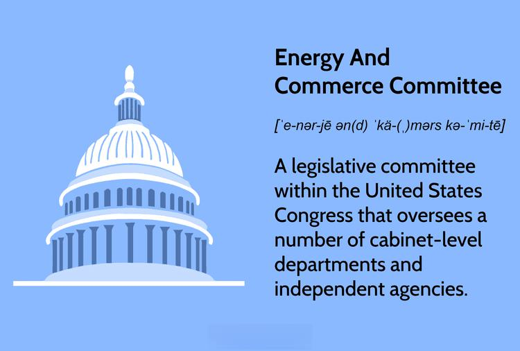

The Energy and Commerce Committee represents a cornerstone of legislative functions within the U.S. House of Representatives, wielding substantial influence in shaping policy across numerous critical domains. The committee's purview spans energy, commerce, and technology, amongst other sectors, which positions it as a vital player in guiding congressional oversight and legislative initiatives that impact the nation's economic framework. This article offers insights into the committee's historical trajectory, current responsibilities, and its engagement with algorithmic trading, a transformative element in modern financial markets.

Algorithmic trading, characterized by the use of automated and pre-set trading commands, exemplifies the significant intersections of finance and technology that the committee must navigate. By understanding how the Energy and Commerce Committee functions and influences these domains, stakeholders can appreciate its profound effects on the economy and technological progress. As the committee's decisions extend beyond national confines, they also resonate on a global scale, influencing international regulatory standards and market practices.

Exploring the committee's historical evolution, its expansive jurisdiction, and its key role in legislative frameworks reveals its significance in contemporary governance and policy-making. The Energy and Commerce Committee is pivotal not only in ensuring regulatory rigor but also in fostering innovation, balancing advancements with effective oversight to maintain public trust and market stability. This article will guide readers through the intricate operations and legislative impacts of one of the most influential committees within the U.S. legislative system.

## Table of Contents

## The Historical Context of the Energy and Commerce Committee

Established in 1795, the Energy and Commerce Committee of the U.S. House of Representatives holds the distinction of being the oldest standing committee within the chamber. Initially, it was created as the Committee on Commerce and Manufactures, a reflection of its original mandate to address issues related to commerce and the burgeoning industrial landscape of the nation. Over the centuries, the committee's scope and functions have evolved significantly, allowing it to adapt to the ever-changing legislative requirements of the United States.

In 1981, a significant transformation occurred when the committee was renamed the Energy and Commerce Committee. This change marked its modern commitment to overseeing both energy policy and regulating commerce, areas that have become increasingly intertwined with technological advancements and economic shifts. The renaming symbolized a broadened focus that includes not only traditional commerce but also emerging issues in energy and technology.

Throughout its long history, the committee has played a crucial role in shaping legislative developments across a wide array of sectors: from health and environmental standards to communication technologies and digital commerce. Its influence is evident in the comprehensive legislative frameworks it has helped develop, which underpin many modern regulatory practices. The committee's legislative efforts have been pivotal in promoting economic growth, protecting public health, and fostering technological innovation.

The historical evolution of the Energy and Commerce Committee provides essential insights into its current responsibilities and influence. By adapting its focus and expanding its legislative agenda, the committee has maintained its relevance and effectiveness in addressing contemporary challenges. Its enduring significance lies in its ability to impact diverse sectors that are fundamental to both national interests and global economic trends.

## Current Jurisdiction and Responsibilities

The Energy and Commerce Committee is a powerful entity within the U.S. House of Representatives, holding jurisdiction over a wide array of cabinet-level departments and independent bodies. Key departments under its purview include the Department of Energy, which focuses on policies regarding the nation's energy supplies, the Department of Health and Human Services tasked with protecting the health of Americans, and the Environmental Protection Agency responsible for protecting human health and the environment.

Additionally, the committee has oversight of significant regulatory agencies such as the Federal Trade Commission (FTC), which enforces antitrust law and promotes consumer protection; the Food and Drug Administration (FDA), which supervises food and pharmaceutical safety; and the Federal Communications Commission (FCC), which regulates interstate communications.

The committee's operations are structured through six subcommittees. These subcommittees specialize in critical areas: Health, focusing on public health and biomedical research; Environment and Climate Change, addressing environmental regulations; Energy, covering energy resources and policy; Digital Commerce and Consumer Protection, which handles issues related to consumer protection and digital markets; Communications and Technology, concerning telecommunications and technology policy; and Oversight and Investigations, which ensures accountability of government programs.

This extensive jurisdiction means that the Energy and Commerce Committee frequently engages in legislative oversight across a spectrum of issues such as healthcare reform, environmental policy, and digital innovation. This broad authority allows the committee to influence market regulations, guide technological advancements, and establish public health standards. Consequently, the committee's actions have significant impacts, shaping the landscape of commerce and technology both nationally and, by extension, globally.

## Algorithmic Trading and Legislative Oversight

Algorithmic trading involves the execution of trades in financial markets using automated systems that follow predefined instructions for variables like timing, price, and quantity. This technological innovation has significantly reshaped how trades are conducted, offering increased speed, efficiency, and the potential for reduced transaction costs. However, [algorithmic trading](/wiki/algorithmic-trading) also presents challenges, such as the potential for market manipulation, flash crashes, and systemic risks.

The Energy and Commerce Committee plays a crucial role by overseeing regulatory bodies such as the Federal Trade Commission (FTC) and the Securities and Exchange Commission (SEC). These bodies are tasked with ensuring that financial markets operate transparently and fairly, making their regulation of algorithmic trading essential to maintaining market integrity. For instance, the SEC is instrumental in addressing concerns with high-frequency trading ([HFT](/wiki/high-frequency-trading-strategies)), a form of algorithmic trading that can lead to excessive [volatility](/wiki/volatility-trading-strategies).

Regulating algorithmic trading requires a sophisticated understanding of both technological advancements and market dynamics. The Energy and Commerce Committee evaluates these trends and oversees legislative responses to ensure that financial markets are not only innovative but also safeguarded against abuses. One method of regulation involves the development of rules that limit the speed of trades or impose additional reporting requirements to prevent unfair competitive advantages.

Balancing innovation and regulation is a complex task. On one hand, algorithmic trading can contribute to market [liquidity](/wiki/liquidity-risk-premium) and efficiency. On the other hand, without proper oversight, it risks creating vulnerabilities that could undermine market stability. The committee's work aims to foster an environment where technological progress can thrive, while also implementing robust safeguards to protect market participants from potential risks.

In summary, the role of the Energy and Commerce Committee in the oversight of algorithmic trading is vital. By continuously monitoring technological and market trends, the committee influences legislative approaches that seek to balance innovation with systemic safety, thus playing a key role in maintaining the integrity and functionality of financial markets.

## Key Legislative Acts and Initiatives

The Algorithmic Accountability Act is a pivotal legislative effort illustrating the Energy and Commerce Committee's commitment to addressing advancements and associated risks in automated decision-making systems, including those employed in algorithmic trading. This act was introduced as a measure to broaden regulatory oversight by mandating the Federal Trade Commission (FTC) to conduct comprehensive impact assessments on automated systems. The goal is to ascertain any potential biases, errors, or adverse effects these systems could introduce, thereby safeguarding market integrity and protecting consumers.

In the context of algorithmic trading, there is a critical necessity to maintain transparency and control against automated trading strategies that might exploit market dynamics, leading to unfair advantages or systemic risks. Algorithmic trading operates on complex algorithms that analyze vast quantities of data and execute trades at speeds beyond human capability, potentially impacting the stability of financial markets. Legislative measures like the Algorithmic Accountability Act reflect the committee's proactive approach to ensuring that the development and deployment of such technology occur within a framework that does not compromise economic security or consumer trust.

Such legislative initiatives underscore the committee's agility in responding to technological innovations and their broader implications on the economy and commerce. By advocating for rigorous evaluations and controls on automated decision-making systems, the committee aims to mitigate risks associated with unchecked automated processes, which could manifest as biased outcomes or algorithmic errors adversely affecting market operations and consumer rights.

The Energy and Commerce Committee's legislative endeavors continue to evolve, adapting to contemporary challenges presented by technological advancements. Through the introduction and promotion of acts like the Algorithmic Accountability Act, the committee endeavors to balance the fostering of innovation with the imperative to protect public and economic interests. This dynamic legal framework is essential to navigate the complexities of modern financial and digital ecosystems, ensuring responsible and equitable use of technology.

## Conclusion

The Energy and Commerce Committee remains integral to legislative supervision across multiple sectors that define the U.S. economic and technological landscape. Its actions regarding algorithmic trading underscore the critical balance between technological progression and regulatory oversight. With algorithmic trading becoming increasingly prevalent in financial markets, the committee's role in ensuring these systems operate transparently and ethically is crucial. This involves scrutinizing the implications of trading algorithms to prevent market abuses and support a fair trading environment. 

By fostering a legislative environment conducive to innovation, while also safeguarding public and market integrity, the committee plays a pivotal role in maintaining national and international economic stability. It assists in crafting policies that both expedite technological advances and mitigate potential risks associated with these innovations. The ongoing efforts and legislative measures initiated by the committee will continue to shape the future trajectory of commerce and technology.

Staying informed about the committee’s activities is vital for stakeholders in energy, commerce, and technology sectors. As the committee navigates the complexities of modern markets and technological evolutions, its decisions will have lasting impacts on industry standards and practices. Therefore, stakeholders must remain engaged and responsive to the committee's developments to align with regulatory changes and leverage opportunities for growth and innovation.

## References & Further Reading

[1]: U.S. House of Representatives Committee on Energy and Commerce. ["About."](https://energycommerce.house.gov/)

[2]: Securities and Exchange Commission (SEC). ["SEC Regulation of Algorithmic Trading."](https://www.sec.gov/rules-regulations/statutes-regulations/rules-regulations-securities-exchange-commission-major-securities-laws)

[3]: Harris, L. (2013). ["Trading and Exchanges: Market Microstructure for Practitioners."](https://www.amazon.com/Trading-Exchanges-Market-Microstructure-Practitioners/dp/0195144708) Oxford University Press.

[4]: Steiner, J. ("Algorithmic Regulation: Algorithms as Regulation." Duke Law & Technology Review, 2012.)

[5]: Clary, Fisher. ["History and Jurisdiction of the Energy and Commerce Committee."](https://democrats-energycommerce.house.gov/about-ec/jurisdiction)

[6]: U.S. Federal Trade Commission (FTC). ["Big Data: A Tool for Inclusion or Exclusion? Understanding the Issues."](https://www.ftc.gov/reports/big-data-tool-inclusion-or-exclusion-understanding-issues-ftc-report) (FTC Report, 2016).

[7]: Lopez de Prado, M. (2018). ["Advances in Financial Machine Learning."](https://www.amazon.com/Advances-Financial-Machine-Learning-Marcos/dp/1119482089) Wiley.