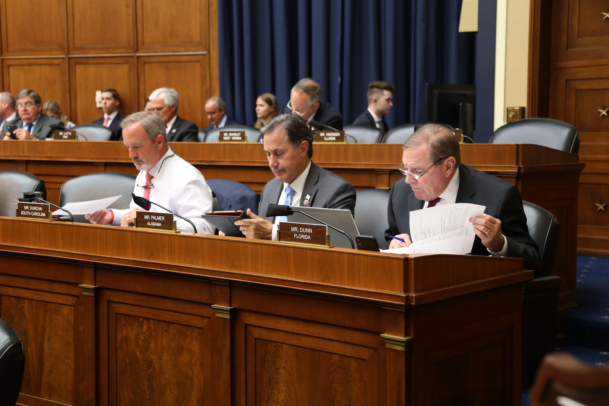

## Table of Contents

## What is the United States House Energy and Commerce Committee?

The United States House Energy and Commerce Committee is a group of people in the U.S. government who work on laws about energy and business. They are part of the House of Representatives, which is one part of the U.S. Congress. The committee looks at things like how we use energy, how we protect the environment, and how businesses work. They also make sure that the rules for TV, internet, and phones are fair.

This committee is very important because it helps make decisions that affect everyone in the country. They work on big issues like making sure we have enough energy, keeping the air and water clean, and making sure that medicines are safe. The committee listens to experts, holds meetings, and then suggests new laws to the whole House of Representatives. If the House agrees, these laws can help change how we live and work.

## What is the history of the Energy and Commerce Committee?

The Energy and Commerce Committee started a long time ago, in 1795. Back then, it was called the Committee on Commerce and Manufactures. It was one of the first committees in the U.S. House of Representatives. The committee was made to help make rules about trade and businesses. Over the years, the committee changed its name and what it worked on. In 1819, it became the Committee on Commerce, and it started to look at more things like transportation and how we move goods around.

In the 1970s, the committee got a new name, the Energy and Commerce Committee. This happened because people started to care more about energy and how we use it. The committee began to work on laws about oil, gas, and other energy sources. It also started to look at health care and how to keep people safe. Today, the committee is very important because it helps make rules about energy, the environment, health, and how businesses work. It has grown a lot since it started and now covers many big issues that affect everyone in the country.

## What are the main responsibilities of the Energy and Commerce Committee?

The Energy and Commerce Committee has a big job. They make rules about energy, like how we use oil, gas, and electricity. They also work on keeping the environment clean, like making sure the air and water are safe. The committee looks at how businesses work and tries to make sure they follow fair rules. They also make laws about TV, internet, and phones to make sure everyone can use them fairly.

Another important job of the committee is to work on health care. They make rules about medicines and hospitals to keep people safe and healthy. The committee listens to experts and holds meetings to learn about these topics. Then, they suggest new laws to the whole House of Representatives. If the House agrees, these laws can change how we live and work, making sure we have enough energy, a clean environment, and good health care.

## Who are the current members of the Energy and Commerce Committee?

The Energy and Commerce Committee has many members from both the Republican and Democratic parties. The chair of the committee is Cathy McMorris Rodgers from Washington, and the ranking member is Frank Pallone Jr. from New Jersey. Other Republican members include people like Brett Guthrie from Kentucky, Morgan Griffith from Virginia, and Gus Bilirakis from Florida. On the Democratic side, members include Diana DeGette from Colorado, Jan Schakowsky from Illinois, and Anna Eshoo from California.

There are also many other members who work on the committee. Some Republican members are Larry Bucshon from Indiana, Bill Johnson from Ohio, and Bob Latta from Ohio. Democratic members include Mike Doyle from Pennsylvania, Kathy Castor from Florida, and Paul Tonko from New York. These members come from different parts of the country and work together to make important decisions about energy, health care, and business rules.

## How is the leadership of the Energy and Commerce Committee structured?

The leadership of the Energy and Commerce Committee is made up of a chair and a ranking member. The chair is from the party that has more members in the House of Representatives. Right now, the chair is Cathy McMorris Rodgers from Washington. She leads the committee and decides what they will work on. The ranking member is from the party that has fewer members in the House. Currently, the ranking member is Frank Pallone Jr. from New Jersey. He helps make sure that the other party's ideas are heard and considered.

The committee also has subcommittees, which are smaller groups that focus on specific topics. Each subcommittee has its own chair and ranking member. These leaders help guide the work of their subcommittees and report back to the full committee. The subcommittees cover areas like energy, health, and technology. The leaders of the subcommittees work closely with the chair and ranking member of the full committee to make sure everyone's ideas are considered and to help make important decisions.

## What subcommittees fall under the Energy and Commerce Committee?

The Energy and Commerce Committee has several subcommittees that focus on different topics. These subcommittees help the main committee by looking at specific issues in more detail. Some of the subcommittees are the Subcommittee on Energy, which works on laws about oil, gas, and electricity, and the Subcommittee on Environment and Climate Change, which focuses on keeping the air and water clean. There's also the Subcommittee on Health, which makes rules about hospitals and medicines to keep people safe and healthy.

Another important subcommittee is the Subcommittee on Communications and Technology, which looks at rules for TV, internet, and phones. The Subcommittee on Consumer Protection and Commerce works on making sure businesses follow fair rules and protect customers. Lastly, the Subcommittee on Oversight and Investigations checks to make sure that laws are being followed and that the government is doing its job right. Each subcommittee has its own chair and ranking member who lead the work and report back to the full committee.

## How does the Energy and Commerce Committee influence energy policy?

The Energy and Commerce Committee has a big say in how we use energy in the United States. They make rules about oil, gas, and electricity. The committee looks at how we can use these energy sources better and make sure we have enough for everyone. They also work on new ideas like solar and wind power to help the environment. When the committee thinks a new rule is needed, they suggest it to the whole House of Representatives. If the House agrees, the rule can become a law that changes how we use energy.

The committee also checks to make sure energy companies are following the rules. They hold meetings where experts talk about energy issues. This helps the committee understand what is working and what needs to change. By doing this, the Energy and Commerce Committee helps make sure we have good energy policies that keep the lights on and protect the planet.

## What role does the Energy and Commerce Committee play in health care legislation?

The Energy and Commerce Committee has a big job when it comes to health care laws. They make rules about hospitals, medicines, and how to keep people healthy. The committee looks at things like how to make sure medicines are safe and how to help people who can't afford health care. They listen to experts and hold meetings to learn about health issues. This helps them understand what needs to change to make health care better for everyone.

When the committee thinks a new health care rule is needed, they suggest it to the whole House of Representatives. If the House agrees, the rule can become a law that changes how we get health care. The committee also checks to make sure that health care rules are being followed. By doing this, the Energy and Commerce Committee helps make sure we have good health care laws that keep people safe and healthy.

## How does the Energy and Commerce Committee impact telecommunications policy?

The Energy and Commerce Committee helps make rules about TV, internet, and phones. They want to make sure everyone can use these services fairly. The committee looks at how to keep these services working well and how to protect people's privacy when they use them. They listen to experts and hold meetings to learn about what is happening in the world of telecommunications.

When the committee thinks a new rule is needed, they suggest it to the whole House of Representatives. If the House agrees, the rule can become a law that changes how we use TV, internet, and phones. The committee also checks to make sure that companies are following the rules. By doing this, the Energy and Commerce Committee helps make sure we have good rules for telecommunications that help everyone.

## What are some notable pieces of legislation passed by the Energy and Commerce Committee?

The Energy and Commerce Committee has helped pass many important laws. One big one is the Affordable Care Act, also called Obamacare. This law helps more people get health care. It makes sure that insurance companies can't say no to people just because they are sick. The committee worked hard to make this law happen, listening to experts and holding meetings to get it right.

Another important law is the Clean Air Act. This law helps keep the air clean by setting rules for factories and cars. The committee made sure this law was strong enough to protect the environment. They also helped pass the Telecommunications Act of 1996, which changed the rules for TV, internet, and phones. This law made it easier for new companies to start and helped make sure everyone could use these services fairly.

## How does the Energy and Commerce Committee interact with other congressional committees?

The Energy and Commerce Committee works with other committees in Congress to make laws. They often talk to committees like the Ways and Means Committee, which makes rules about taxes, and the Natural Resources Committee, which looks after parks and wildlife. When they are working on a new law, they might need help from these other committees. For example, if they are making a new rule about energy, they might need to talk to the Ways and Means Committee about how to pay for it.

Sometimes, the Energy and Commerce Committee and other committees have to work together on big issues. They might hold joint meetings or share information to make sure their laws work well together. This helps them make better rules that cover all the important parts of a problem. By working with other committees, the Energy and Commerce Committee can make sure their laws are strong and help everyone.

## What are the current challenges and future directions for the Energy and Commerce Committee?

The Energy and Commerce Committee faces many challenges right now. One big challenge is figuring out how to make sure we have enough energy while also protecting the environment. People want to use more clean energy like solar and wind power, but it's hard to change from using oil and gas. The committee also has to deal with making health care better and cheaper for everyone. This is a big job because health care is very important and can be very expensive. Another challenge is keeping up with new technology in TV, internet, and phones. The committee needs to make rules that protect people's privacy and make sure everyone can use these services fairly.

Looking to the future, the Energy and Commerce Committee will need to keep working on these challenges. They will need to find new ways to use energy that are good for the environment and make sure everyone can get the energy they need. The committee will also need to keep working on health care laws to make sure they help people stay healthy without costing too much. As technology keeps changing, the committee will need to make new rules to keep up. By working together and listening to experts, the Energy and Commerce Committee can help make good laws that help everyone in the country.

## References & Further Reading

[1]: U.S. House of Representatives Committee on Energy and Commerce. ["About."](https://energycommerce.house.gov/)

[2]: Securities and Exchange Commission (SEC). ["SEC Regulation of Algorithmic Trading."](https://www.sec.gov/rules-regulations/statutes-regulations/rules-regulations-securities-exchange-commission-major-securities-laws)

[3]: Harris, L. (2013). ["Trading and Exchanges: Market Microstructure for Practitioners."](https://www.amazon.com/Trading-Exchanges-Market-Microstructure-Practitioners/dp/0195144708) Oxford University Press.

[4]: Steiner, J. ("Algorithmic Regulation: Algorithms as Regulation." Duke Law & Technology Review, 2012.)

[5]: Clary, Fisher. ["History and Jurisdiction of the Energy and Commerce Committee."](https://democrats-energycommerce.house.gov/about-ec/jurisdiction)

[6]: U.S. Federal Trade Commission (FTC). ["Big Data: A Tool for Inclusion or Exclusion? Understanding the Issues."](https://www.ftc.gov/reports/big-data-tool-inclusion-or-exclusion-understanding-issues-ftc-report) (FTC Report, 2016).

[7]: Lopez de Prado, M. (2018). ["Advances in Financial Machine Learning."](https://www.amazon.com/Advances-Financial-Machine-Learning-Marcos/dp/1119482089) Wiley.