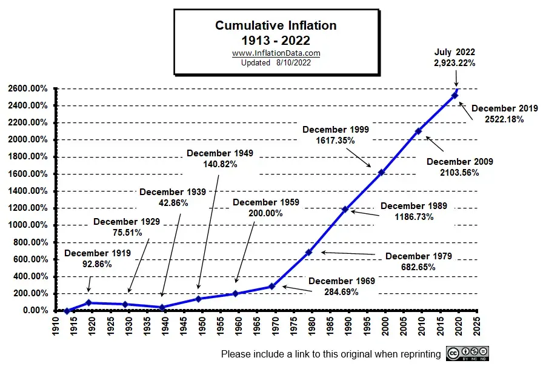

## Table of Contents

## What is inflation and why is it important to understand its history?

Inflation is when the prices of things we buy, like food and toys, go up over time. It means that the money we have can buy less than it used to. For example, if a candy bar cost $1 last year and now it costs $1.10, that's inflation. It happens because the amount of money in the economy grows faster than the amount of stuff we can buy with it.

Understanding the history of inflation is important because it helps us see patterns and learn from the past. If we know what caused inflation to go up or down in the past, we can make better choices today. For example, if a country had very high inflation before because it printed too much money, we can be careful not to do that again. This knowledge helps governments and people plan for the future and manage their money better.

## How is the inflation rate calculated in the United States?

The inflation rate in the United States is calculated using the Consumer Price Index, or CPI. The CPI measures the average change over time in the prices paid by urban consumers for a market basket of consumer goods and services, such as food, transportation, and medical care. To calculate the CPI, the U.S. Bureau of Labor Statistics collects price data from thousands of businesses and households across the country. They then compare these prices to a base period to see how much prices have changed.

To find the inflation rate, you take the CPI for the current period and subtract the CPI from the previous period. Then, you divide that number by the CPI from the previous period and multiply by 100 to get a percentage. For example, if the CPI was 250 last year and it's 260 this year, the inflation rate would be calculated as follows: (260 - 250) / 250 * 100 = 4%. This means the inflation rate for the year is 4%. This simple calculation helps everyone understand how much more expensive things have become over time.

## What was the average inflation rate in the United States from 1929 to 2024?

The average inflation rate in the United States from 1929 to 2024 was about 3.1% per year. This number comes from looking at the Consumer Price Index (CPI) over all those years. The CPI measures how much prices for things like food, clothes, and other stuff go up. By taking the CPI for each year and figuring out the average increase, we get this 3.1% number. It's important to remember that inflation rates can go up and down a lot from year to year, so this average gives us a general idea of what happened over the whole time.

During this period, the United States went through many big changes and events that affected inflation. For example, there was the Great Depression in the 1930s when prices actually went down, which is called deflation. Then, after World War II, there were times of high inflation in the 1970s and 1980s. More recently, inflation has been pretty stable but started to go up again around 2021. Understanding the average inflation rate helps us see how the cost of living has changed over almost a century and can help us plan for the future.

## What were the highest and lowest annual inflation rates during this period, and when did they occur?

The highest annual inflation rate in the United States from 1929 to 2024 was about 18.2% in 1918. This happened right after World War I when the economy was trying to adjust after the war. Prices for many things went up a lot because the government had been spending a lot of money during the war, and now there was more money chasing fewer goods. This high inflation rate made everything more expensive very quickly, and it was tough for people to keep up with the rising costs.

The lowest annual inflation rate during this time was actually a deflation rate of about -10.3% in 1932. This happened during the Great Depression, which was a very hard time for the economy. Many people lost their jobs, and there was not much money being spent. Because of this, prices actually went down, which is what we call deflation. Deflation can be tough too because people might wait to buy things hoping prices will keep falling, which can make the economy even worse.

## How did the Great Depression impact inflation rates in the 1930s?

The Great Depression had a big impact on inflation rates in the 1930s. During this time, the United States went through a very tough economic period where many people lost their jobs and businesses closed down. Because people didn't have much money to spend, the demand for goods and services dropped a lot. This led to prices falling instead of going up, which is called deflation. The lowest deflation rate during the Great Depression was about -10.3% in 1932. This meant that things were getting cheaper, but it also made the economic situation worse because people waited to buy things, hoping prices would keep falling.

As the Great Depression continued, the government tried different ways to help the economy recover. In 1933, President Franklin D. Roosevelt started the New Deal, which included programs to create jobs and help people. These efforts slowly started to bring prices back up, but it took a long time for the economy to fully recover. By the end of the 1930s, inflation rates were still low, but they were no longer in deflation. Understanding how the Great Depression affected inflation helps us see how important it is for the government to manage the economy carefully during tough times.

## What effect did World War II have on inflation rates in the United States?

World War II had a big effect on inflation rates in the United States. During the war, the government spent a lot of money on things like weapons, ships, and soldiers. This spending put more money into the economy, but because so many resources were being used for the war, there weren't as many goods for people to buy. This caused prices to go up, and inflation rates started to climb. By the end of the war in 1945, the inflation rate was about 2.3%, which was higher than in the years before the war.

After World War II ended, the U.S. had to adjust to peacetime. The government stopped spending as much on the war, but there was still a lot of money in people's pockets from the war-time economy. This extra money, along with the need to rebuild and produce more consumer goods, kept pushing prices up. In the years right after the war, inflation rates stayed high, reaching about 14.4% in 1946 and 8.8% in 1947. It took some time for the economy to stabilize and for inflation to come back down to more normal levels.

## How did the oil crises of the 1970s influence inflation rates?

The oil crises of the 1970s had a big impact on inflation rates in the United States. In 1973, some countries that produced oil decided to stop selling it to the U.S. because they were upset about the country's support for Israel during a war. This caused the price of oil to go way up, and because oil is used to make and transport so many things, the prices of lots of other stuff went up too. This led to higher inflation rates, with the rate reaching about 11% in 1974.

Another oil crisis happened in 1979 when there was a revolution in Iran, which also made oil prices go up a lot. This second crisis made inflation even worse because prices were already high from the first crisis. In 1980, the inflation rate hit a peak of about 13.5%. The high cost of oil made everything more expensive, and people had to pay more for gas, heating their homes, and buying things that needed oil to be made or moved. These oil crises showed how important oil is to the economy and how big changes in its price can cause big changes in inflation.

## What were the key factors contributing to the high inflation rates during the late 1970s and early 1980s?

The high inflation rates during the late 1970s and early 1980s were mainly caused by the oil crises that happened in 1973 and 1979. In 1973, some countries that produced oil stopped selling it to the U.S. because they were upset about the country's support for Israel during a war. This made the price of oil go way up, and because oil is used to make and move so many things, the prices of lots of other stuff went up too. This led to higher inflation rates, with the rate reaching about 11% in 1974. Then, in 1979, there was another oil crisis because of a revolution in Iran, which made oil prices go up even more. This second crisis made inflation even worse because prices were already high from the first crisis. In 1980, the inflation rate hit a peak of about 13.5%.

Another big factor that contributed to the high inflation rates during this time was the way the government handled the economy. The government was spending a lot of money, which put more money into people's pockets. At the same time, the Federal Reserve, which controls the money supply, was not raising interest rates enough to keep inflation in check. This meant there was too much money chasing too few goods, which pushed prices up even more. The combination of high oil prices and loose government spending policies created a situation where inflation kept going up, making it hard for people to keep up with the rising costs of living.

## How have monetary policies, such as those implemented by the Federal Reserve, affected inflation rates over the decades?

The Federal Reserve, which is like the boss of money in the United States, has a big job when it comes to controlling inflation. Over the years, they've used something called monetary policy to try and keep inflation at a good level. One way they do this is by changing interest rates. When they think inflation is getting too high, they might raise interest rates to make borrowing money more expensive. This can slow down spending and help bring prices down. On the other hand, if they think inflation is too low, they might lower interest rates to make borrowing cheaper, which can encourage people to spend more and help the economy grow.

During different times, the Federal Reserve's actions have had different effects on inflation. In the 1970s and early 1980s, when inflation was very high because of the oil crises, the Federal Reserve, led by Paul Volcker, decided to raise interest rates a lot. This made borrowing very expensive and slowed down the economy, but it also helped bring inflation down. In more recent years, like after the 2008 financial crisis and during the COVID-19 pandemic, the Federal Reserve kept interest rates low and even used other tools like buying bonds to help the economy. These actions helped keep inflation in check for a while, but as the economy recovered, inflation started to rise again, showing how tricky it can be to balance everything just right.

## What role did technological advancements and globalization play in moderating inflation rates from the 1990s onwards?

From the 1990s onwards, technological advancements helped keep inflation rates lower. New technologies like the internet and computers made it easier for businesses to work more efficiently. This meant they could produce more stuff without needing to raise prices as much. For example, online shopping let people compare prices easily, which made companies keep their prices competitive. Also, new tech helped make things like phones and computers cheaper over time, which helped keep overall prices from going up too fast.

Globalization also played a big part in keeping inflation down. It meant that countries could trade with each other more easily, and companies could move their factories to places where it was cheaper to make things. This brought down the cost of making stuff, which helped keep prices lower for people buying things. For example, a lot of products we use every day, like clothes and electronics, are made in countries where labor is less expensive. This global trade helped keep inflation rates more stable and lower than they might have been without it.

## How did the 2008 financial crisis and subsequent economic policies impact inflation rates?

The 2008 financial crisis caused a big drop in inflation rates because it made the economy slow down a lot. People were losing jobs and not spending as much money, so there wasn't as much demand for things. This made prices go up slower than usual, and in some places, prices even went down a little bit. To help the economy recover, the government and the Federal Reserve started doing things like spending more money and lowering interest rates. These actions helped keep inflation from falling too much, but it took a while for the economy to get back on track.

After the crisis, the Federal Reserve kept interest rates really low for a long time to help the economy grow again. They also started buying a lot of bonds, which is another way to put more money into the economy. These policies helped bring inflation back up to more normal levels, but it was a slow process. By keeping inflation stable and low, the Federal Reserve tried to make sure the economy was recovering without prices going up too fast. This careful balancing act showed how important it is to manage inflation to help the economy heal after a big shock like the 2008 financial crisis.

## What are the current trends in inflation rates as of 2024, and what are the forecasts for the near future?

As of 2024, inflation rates in the United States have been going up. After staying pretty low for a while, prices started to rise faster in 2021 and have kept going up since then. By 2024, the inflation rate is around 3.5%, which is higher than the Federal Reserve's target of 2%. This increase in inflation is because of things like supply chain problems, higher wages, and more demand for goods and services as the economy keeps recovering from the COVID-19 pandemic. People are feeling the pinch because everything from groceries to rent is costing more.

Looking into the near future, experts think inflation might start to slow down a bit. They expect it to go down to around 2.5% by the end of 2025. This is because the Federal Reserve is trying to control inflation by raising interest rates a little bit. Also, supply chains are getting better, and some of the big jumps in prices are starting to level off. But, it's hard to predict exactly what will happen because things like global events and changes in the economy can always affect inflation. So, while things might get a bit easier, people should still be ready for some ups and downs in prices.

## What is the understanding of inflation and economic data?

Inflation is the rate at which the general level of prices for goods and services rises, eroding purchasing power. It is commonly measured using indices such as the Consumer Price Index (CPI) and the Personal Consumption Expenditures (PCE). The CPI tracks changes in the price level of a basket of consumer goods and services purchased by households, representing a practical gauge of inflation experienced by consumers. The formula for CPI is:

$$
\text{CPI} = \left( \frac{\text{Cost of Market Basket in Current Year}}{\text{Cost of Market Basket in Base Year}} \right) \times 100
$$

Personal Consumption Expenditures (PCE), on the other hand, reflect changes in the price of goods and services consumed by individuals and is broader in scope than CPI. Unlike CPI, the PCE is chained, meaning it considers changes in consumer behavior and the substitution of goods.

Historical trends in U.S. inflation have been influenced by various economic events and policies. During the Great Depression (1929-1939), the U.S. experienced deflation, where the inflation rate was negative due to a collapse in consumer demand and confidence. Post-World War II, the economy entered a phase of prosperity, with moderate inflation aiding recovery and growth. However, the 1970s witnessed a surge in inflation due to oil shocks and expansive fiscal policies, a period known as "stagflation," characterized by high inflation and unemployment.

In recent decades, especially the 1990s and 2000s, the U.S. enjoyed relatively low and stable inflation rates, largely attributed to effective monetary policies by the Federal Reserve and globalization. However, the COVID-19 pandemic introduced significant [volatility](/wiki/volatility-trading-strategies), with initially low inflation due to decreased demand and later spikes as supply chains were disrupted.

Inflation serves as a critical indicator of economic health. Moderate inflation is often associated with a growing economy, as it encourages spending and investment. However, high inflation diminishes purchasing power and can lead to uncertainty, while deflation can trigger reduced consumer spending as individuals delay purchases in anticipation of lower future prices. Consequently, inflation data informs policymakers in devising strategies to maintain economic stability. Understanding inflation through historical trends and indexes like CPI and PCE is essential for making informed economic decisions and anticipating future economic conditions.

## What is the Role of Monetary Policy?

The Federal Reserve plays a crucial role in managing inflation in the United States through the implementation of monetary policy. The primary objective is to maintain price stability, usually defined by an annual inflation target rate of around 2%. This target is essential for fostering optimal economic conditions, promoting sustainable growth, and maximizing employment.

### Interest Rate Adjustments

One of the most vital tools at the Federal Reserve's disposal is the manipulation of interest rates, primarily through the Federal Funds Rate. By adjusting this rate, the Federal Reserve can influence economic activity as follows:

- **Increasing Interest Rates**: In periods of high inflation, the Federal Reserve may opt to raise interest rates. Higher rates make borrowing more expensive, which tends to reduce consumer spending and business investment. This contraction in demand helps to moderate price increases, thereby lowering inflation.

$$
\text{Cost of borrowing} = \text{Loan amount} \times \frac{\text{Interest rate}}{100}
$$

- **Decreasing Interest Rates**: Conversely, to stimulate the economy when inflation is low, the Federal Reserve can reduce interest rates. This makes loans cheaper, encouraging spending and investment, which can increase demand and help combat deflationary pressures.

### Open Market Operations

In addition to adjusting interest rates, open market operations (OMOs) are another vital tool used by the Federal Reserve to manage money supply and inflation. By buying or selling government securities in the open market, the Federal Reserve can directly inject or withdraw [liquidity](/wiki/liquidity-risk-premium), influencing overall economic activity.

- **Buying Securities**: When the Federal Reserve purchases government securities, it effectively increases the money supply. Banks have more capital to lend, which can lower interest rates and stimulate spending and investment, potentially raising inflation if the economy is underperforming.

- **Selling Securities**: Selling government securities has the opposite effect. It reduces the money supply, leading to higher interest rates, which can cool down an overheated economy and reign in excessive inflation.

### Additional Tools

Although [interest rate](/wiki/interest-rate-trading-strategies) adjustments and OMOs are the primary mechanisms used, other tools such as the discount rate and reserve requirements are also part of the Federal Reserve's arsenal. The discount rate refers to the interest rate applied to short-term loans taken by financial institutions from the Federal Reserve's discount window, while reserve requirements determine the minimum reserves each bank must hold. Altering these can further influence lending and monetary conditions as needed to achieve inflation targets.

In summary, through a careful combination of these tools, the Federal Reserve aims to manage inflation effectively, ensuring economic stability and confidence across various markets. Maintaining inflation within the target range not only stabilizes prices but also supports ongoing economic prosperity.

## References & Further Reading

[1]: U.S. Bureau of Labor Statistics. (n.d.). ["Consumer Price Index (CPI) Database."](https://www.bls.gov/cpi/)

[2]: Federal Reserve. (n.d.). ["Monetary Policy and Economic Research."](https://www.federalreserve.gov/publications/2022-ar-monetary-policy.htm)

[3]: U.S. Bureau of Economic Analysis. (n.d.). ["Personal Consumption Expenditures Price Index."](https://www.bea.gov/news/2024/personal-income-and-outlays-september-2024)

[4]: Federal Reserve Bank of St. Louis. (n.d.). ["FRED Economic Data."](https://fred.stlouisfed.org/)

[5]: Romer, C. D. (1992). ["What Ended the Great Depression?"](https://eml.berkeley.edu/~cromer/Reprints/What%20Ended%20the%20Great%20Depression.pdf) The Journal of Economic History.

[6]: Shiller, R. J. (1990). ["The Great Depression as a Watershed: International Capital Mobility over the Long Run."](https://www.nber.org/papers/w5960)90158-Z) European Economic Review.

[7]: Greenspan, A. (2007). ["The Age of Turbulence: Adventures in a New World."](https://en.wikipedia.org/wiki/The_Age_of_Turbulence) Penguin Press.

[8]: Historical Statistics of the United States, Millennial Edition Online. (n.d.). ["Retrieved from Cambridge University Press."](https://hsus.cambridge.org/HSUSWeb/HSUSEntryServlet)

[9]: Mishkin, F. S. (2007). ["Monetary Policy Strategy."](https://direct.mit.edu/books/edited-volume/3276/Monetary-Policy-Strategy) The MIT Press.

[10]: Siegel, J. (1994). ["Stocks for the Long Run."](https://en.wikipedia.org/wiki/Stocks_for_the_Long_Run) McGraw-Hill.

[11]: Taylor, J. B. (1993). ["Discretion versus Policy Rules in Practice."](https://web.stanford.edu/~johntayl/Onlinepaperscombinedbyyear/1993/Discretion_versus_Policy_Rules_in_Practice.pdf)90009-L) Carnegie-Rochester Conference Series on Public Policy.