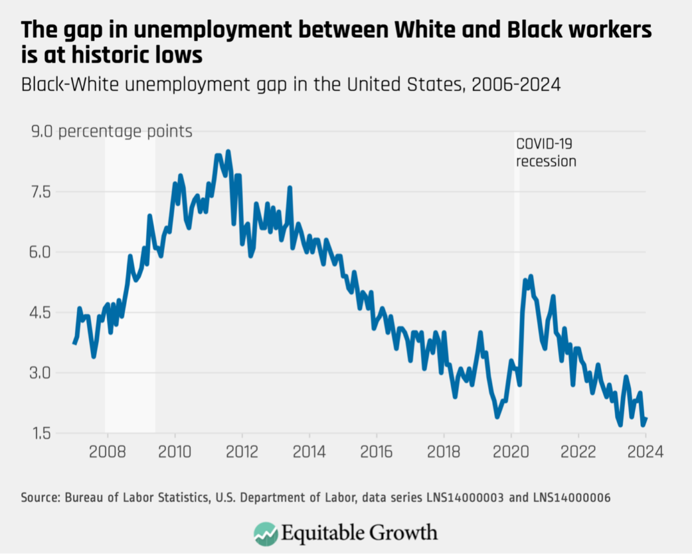

The economic recovery of the U.S. labor market has been a focal point of analysis following the unprecedented global disruption caused by the COVID-19 pandemic. The pandemic triggered a severe contraction in economic activity worldwide, leading to widespread job losses and significant changes in labor markets across the globe. In the United States, the pandemic-induced recession initially led to a sharp decline in employment as businesses shuttered and economic uncertainty soared. However, as vaccine distribution expanded and economic reopening commenced, the U.S. labor market demonstrated a notably rapid recovery compared to previous recessions.

The COVID-19 pandemic's impact on job markets was not uniform, and the United States experienced a particularly volatile employment trajectory. Initially, millions of jobs were lost, especially in sectors like leisure and hospitality, which depend heavily on face-to-face interactions. Despite the significant setbacks, the recovery phase, characterized by a strong rebound in employment numbers, has been accelerated by a combination of factors, including robust fiscal and monetary policies.



Historically, labor market recoveries from recessions have varied in pace and magnitude. For instance, the recovery from the Great Recession of 2008 was laborious and protracted, characterized by slow job growth over several years. In contrast, the pandemic recovery witnessed a faster rebound due largely to swift governmental interventions and the adaptability of businesses to remote work and technology-driven solutions. The U.S. labor market's ability to recoup lost jobs at a rapid pace underscores a resilience not seen in previous downturns.

In analyzing these dynamics, algorithmic trading and data science techniques have emerged as critical tools for understanding labor market trends and economic indicators. Originally developed for financial markets, algorithmic systems are increasingly applied to analyze large datasets, offering insights into employment patterns, economic activity, and future projections. With the capability to process real-time data and predict potential trends, algorithmic models can enhance the accuracy and depth of labor market analyses, thereby informing stakeholders and policymakers of underlying economic conditions.

Such technological advancements signify an evolving approach to labor market analysis, highlighting the importance of adapting to and leveraging contemporary analytical tools to grasp the complexities of the post-pandemic economic landscape. As the U.S. labor market continues to evolve, understanding these dynamics will be crucial for ensuring sustained economic stability and growth.

## Table of Contents

## Overview of the U.S. Labor Market Recovery

The U.S. labor market experienced significant fluctuations due to the COVID-19 pandemic, with both notable job losses and subsequent recovery phases. At the pandemic's onset, the U.S. economy saw unprecedented job losses, with the unemployment rate soaring to a peak of 14.8% in April 2020. This was primarily driven by the obligatory shutdown of non-essential businesses and severe restrictions on in-person interactions. Sectors such as leisure and hospitality were among the hardest hit due to the immediate cessation of travel, dining, and entertainment activities. In contrast, sectors like business services and e-commerce saw a faster recovery due to increased demand and adaptability, with e-commerce seeing a substantial surge as consumers shifted to online shopping channels for their needs.

As the pandemic progressed, recovery efforts became apparent with the gradual reopening of the economy and the rollout of vaccinations. Notably, by 2022, employment levels had surpassed pre-pandemic numbers, a testament to the labor market's resilience and adaptability. According to the U.S. Bureau of Labor Statistics, nonfarm payroll employment had regained its losses by early 2022, and certain sectors had significantly expanded. For instance, the business services sector not only recovered but experienced employment growth beyond pre-crisis levels due to increased demand for technology-driven solutions.

The recovery was not homogenous across all sectors and was significantly influenced by governmental policies and interventions. The U.S. government introduced several measures, including the Coronavirus Aid, Relief, and Economic Security (CARES) Act, which provided financial assistance to individuals and businesses, helping to stabilize the labor market. Additionally, the Paycheck Protection Program (PPP) incentivized businesses to retain employees, contributing to the gradual decline in unemployment rates.

Moreover, job openings in the U.S. surged post-pandemic, indicating a robust demand for labor and a dynamic job market. As of mid-2022, job openings were reported to be consistently above 10 million, highlighting a strong demand across various sectors. This surge can be attributed to factors such as pent-up consumer demand, changes in consumer behavior, and the acceleration of digital transformation across industries.

In summary, the U.S. labor market's recovery post-COVID-19 has been influenced by diverse sectorial impacts, robust governmental interventions, and evolving economic demands, leading to employment levels that surpass pre-pandemic figures and significant job openings across multiple sectors.

## Demographic Trends in Employment

The recovery of the U.S. labor market post-COVID-19 has exhibited significant variation across different racial and demographic groups. A detailed analysis reveals the complexities in employment trends among Black, Latino, White, and Asian workers.

The labor market faced disproportionate impacts during the pandemic. Black and Latino workers experienced higher unemployment rates compared to White and Asian workers, a reflection of their overrepresentation in industries severely impacted by COVID-19, such as retail, hospitality, and transportation. Recovery efforts have shown progress, yet disparities remain. For instance, as of 2023, employment rates for Black workers have seen substantial improvement, yet still lag slightly behind those of their White counterparts. Latino workers have demonstrated strong recovery signs, partly due to the rebound in sectors like construction and services where they are prominently employed.

Asian workers experienced lower unemployment rates compared to Black and Latino workers during the pandemic, which is attributed to a greater representation in sectors like tech and finance, which were less affected. However, they faced unique challenges, including bias and discrimination exacerbated by the pandemic. As a result, while their employment levels have recovered, addressing workplace equity remains critical.

Gender disparities in employment became pronounced during the pandemic, with women experiencing greater job losses than men. This was largely due to the disruptions in sectors such as education and healthcare, as well as increased caregiving responsibilities. Although there has been notable recovery in female employment, women, especially those of Black and Latina descent, face higher hurdles in the job market. Factors include childcare responsibilities and wage disparities, which were accentuated during the pandemic. 

These racial and gender disparities have meaningful implications on long-term labor market trends. The demographic shifts and uneven recovery emphasize the need for policies targeting workforce inclusivity and equity. Changes in demographics also affect workforce composition, with implications for sectors poised for growth, such as technology and green energy. The labor market must adapt to these shifts, necessitating investment in education and training to equip underrepresented groups with the skills needed for future employment demands.

To facilitate a comprehensive understanding, analyzing data with tools such as Python can provide insights into these demographic trends:

```python
import pandas as pd

# Sample data representing employment changes
data = {
    'Group': ['Black', 'Latino', 'White', 'Asian'],
    'PrePandemicEmployment': [100, 150, 200, 120],
    'PostPandemicEmployment': [95, 145, 210, 118]
}

df = pd.DataFrame(data)
df['EmploymentChange'] = (df['PostPandemicEmployment'] / df['PrePandemicEmployment']) - 1

print(df)
```

This code allows one to calculate employment changes as percentages, aiding in the visualization and strategic planning necessary for addressing demographic disparities in employment recovery.

## Wage Growth and Challenges

Since 2020, wage growth in the United States has experienced notable fluctuations, driven by various economic forces. Initially, the recovery period following the COVID-19 pandemic saw an increase in wage levels as businesses sought to attract and retain workers amid labor shortages. However, these nominal wage gains have been significantly impacted by rising inflation, resulting in relatively modest real wage growth.

### Impact of Inflation on Real Wages

Inflation, measured by the Consumer Price Index (CPI), has outpaced nominal wage growth in several instances since 2020, effectively reducing the purchasing power of workers. For instance, if wage growth is given by $W$ and inflation by $I$, real wage growth can be calculated as:

$$
\text{Real Wage Growth} = W - I
$$

In 2021 and 2022, although nominal wages increased, inflation rates reaching as high as 7% annually in some periods eroded these gains. This discrepancy has been evident across various sectors, with essential goods becoming more expensive and negating wage increments.

### Challenges Faced by Construction and Professional Service Workers

The construction industry, characterized by seasonal and project-based employment, has faced significant challenges due to fluctuating demand and increased material costs. Workers in this sector have experienced limited wage growth as companies grappled with higher operational costs and unpredictable project timelines.

Professional service workers, encompassing fields such as finance, legal, and consulting services, have also faced wage growth challenges. Despite high demand for services, inflation has eroded potential wage increases. Rising operational costs and a competitive landscape have pressured firms to balance wage hikes with profitability.

### Wage Disparities and Their Influence on Economic Recovery

Wage disparities across different sectors and demographic groups have remained a prominent concern, influencing both economic recovery and employee satisfaction. Such disparities can be attributed to differences in skill levels, geographic location, and industry-specific demand.

For example, lower-wage sectors such as retail and hospitality have seen a quicker rebound in employment, yet wage growth has lagged behind inflation, causing dissatisfaction among workers. Conversely, sectors like technology and finance have witnessed stronger wage growth, contributing to broader economic recovery. This uneven landscape underscores the complex nature of wage dynamics in post-pandemic recovery.

Wage disparities also impact consumer spending patterns, a critical driver of economic growth. When workers earn less in real terms, their spending power diminishes, potentially stalling economic recovery efforts. Therefore, addressing wage disparities is essential for fostering long-term economic stability and enhancing overall employment satisfaction.

## Role of Algorithmic Trading in Labor Market Analysis

Algorithmic trading, traditionally used in financial markets for executing trades at optimal prices and times, has broadened its application to include the analysis of economic trends, such as those observable in the labor market. It leverages sophisticated algorithms to process large datasets, identifying patterns and anomalies that may not be easily discernible through conventional analysis.

In the context of labor market analysis, algorithmic models can provide significant insights into employment data by mining vast amounts of economic and labor-related [statistics](/wiki/bayesian-statistics). These models are designed to handle high-frequency data, making them particularly useful in capturing real-time fluctuations and trends in employment. This capability is crucial for predicting future labor market movements and for informing policy decisions.

Algorithmic models utilize [machine learning](/wiki/machine-learning) techniques to enhance their predictive capabilities. For example, regression models, decision trees, and neural networks can be applied to forecast employment trends based on historical data. These models can incorporate various economic indicators, such as GDP growth rates, inflation, and interest rates, to refine predictions about employment levels.

One concrete implementation of [algorithmic trading](/wiki/algorithmic-trading) in labor market analysis is using these models to interpret monthly job reports released by the U.S. Bureau of Labor Statistics. By analyzing the non-farm payroll data, unemployment rates, and sector-specific employment changes, algorithms can generate forecasts about the labor market’s trajectory. Consider the following Python example:

```python
import pandas as pd
from sklearn.linear_model import LinearRegression
from sklearn.model_selection import train_test_split

# Sample dataset: Assume df is a DataFrame containing labor market data
# with columns ['month', 'gdp_growth', 'inflation', 'interest_rate', 'employment_level']

# Prepare the dataset
features = df[['gdp_growth', 'inflation', 'interest_rate']]
target = df['employment_level']

# Split the data
X_train, X_test, y_train, y_test = train_test_split(features, target, test_size=0.2, random_state=42)

# Initialize and train the model
model = LinearRegression()
model.fit(X_train, y_train)

# Predict future employment levels
predictions = model.predict(X_test)
```

In this example, a linear regression model predicts employment levels based on economic indicators. The model can then be fine-tuned with more data to improve its predictive accuracy.

Algorithms also have potential in understanding employment fluctuations and economic signals. They can assess job market dynamism by identifying patterns in job creation and destruction, analyzing occupational shifts, and studying labor force participation trends. By doing so, algorithmic trading models contribute to a nuanced understanding of the intricate relationships within economic ecosystems.

Overall, the integration of algorithmic trading methodologies into labor market analysis presents a potent tool for policymakers, businesses, and researchers aiming to navigate the complexities of modern economic landscapes. These models enhance the predictive power and analytical depth of traditional economic assessments, offering a more detailed and timely perspective on labor market dynamics.

## Future Economic Outlook and Employment Trends

The future economic outlook of the U.S. labor market is influenced by multiple converging factors, including technological advancements, automation, and government policies. These elements will shape the evolution of employment trends, potentially redefining traditional labor roles and introducing new dynamics into the workforce.

Technological advances and automation will continue to play a significant role in reshaping the labor market. Automation and [artificial intelligence](/wiki/ai-artificial-intelligence) (AI) are expected to alter job structures across various industries, with tasks that involve routine and manual processes being the most susceptible to automation. A study by McKinsey Global Institute suggests that by 2030, up to 14% of the global workforce may need to switch occupational categories as a result of automation. Consequently, the demand for workers in fields related to data analysis, machine learning, and cybersecurity is expected to rise. To stay competitive, the workforce must adapt by upskilling and reskilling, focusing on cultivating skills that are less likely to be automated, such as creativity, problem-solving, and interpersonal communication.

Government policies will also heavily influence future employment rates and economic stability. Policies that incentivize innovation and technology adoption, while also providing social safety nets and workforce training programs, can facilitate smoother transitions for displaced workers. For instance, policies encouraging investment in education and vocational training can prepare workers for emerging roles in technology-driven sectors. Furthermore, fiscal policies targeting economic inequalities can help stabilize consumer demand and promote sustainable economic growth. The effects of policy interventions will largely depend on the balance they strike between fostering technological advancement and ensuring workforce inclusivity and protection.

To maintain robust labor market conditions, several strategies can be implemented. Continuous investment in education and skill development should be prioritized, aligning curricula with the demands of a technology-oriented job market. Collaboration between government bodies, educational institutions, and industries can ensure the relevance of training programs. Additionally, fostering an entrepreneurial environment can stimulate job creation and support economic diversification. Encouraging flexible work arrangements may also help accommodate a more diverse workforce and enhance labor market participation rates.

In conclusion, the prospective landscape of the U.S. labor market involves navigating the challenges and opportunities presented by technological progress, automation, and policy changes. Proactive measures in education, workforce training, and inclusive policy-making will be crucial in adapting to these transformations, ensuring that the labor market remains resilient and dynamic.

## Conclusion

The recovery of the U.S. labor market post the COVID-19 pandemic has been rapid and multifaceted, showcasing resilience across various sectors. The roles of different demographic groups, shifts in employment levels, and the impact of government interventions have been crucial in shaping this trajectory. Notably, sectors that faced the brunt of the pandemic, such as leisure and hospitality, have witnessed varied recovery speeds, while industries like e-commerce have thrived. Such diversity in recovery underscores the complexity of economic rebounds.

Understanding these trends demands a deep dive into labor market data. Algorithmic trading, traditionally associated with financial markets, offers robust analytical capabilities that extend to economic data analysis. By using sophisticated algorithms, market participants and policymakers can gain valuable insights into employment trends, wage dynamics, and economic indicators, enhancing decision-making processes.

As we look to the future, adapting to shifting employment trends and economic conditions remains crucial. Technological advancements and data-driven strategies will continue to play a pivotal role in understanding these complex environments. By leveraging technology, stakeholders can make informed decisions to ensure sustainable labor market conditions and stability.

## References & Further Reading

[1]: ["U.S. Bureau of Labor Statistics"](https://www.bls.gov/) - An authoritative source for U.S. labor market data, including employment trends and statistics.

[2]: ["The Future of Work in America: People and Places, Today and Tomorrow"](https://www.mckinsey.com/~/media/McKinsey/Featured%20Insights/Future%20of%20Organizations/The%20future%20of%20work%20in%20America%20People%20and%20places%20today%20and%20tomorrow/MGI-The-Future-of-Work-in-America-Report-July-2019.ashx) by McKinsey Global Institute - This report discusses employment trends and the impact of automation and technological advancements on the labor market.

[3]: ["The Impact of COVID-19 on Employment and Jobs"](https://www.bls.gov/opub/btn/volume-11/how-did-employment-change-during-the-covid-19-pandemic.htm) by OECD - A detailed analysis of how the COVID-19 pandemic affected global and U.S. employment.

[4]: ["Advances in Financial Machine Learning"](https://www.amazon.com/Advances-Financial-Machine-Learning-Marcos/dp/1119482089) by Marcos Lopez de Prado - A comprehensive book on applying machine learning techniques to financial and economic data analysis.

[5]: ["COVID-19's Impact on the Labor Market: A Global Overview"](https://www.imf.org/en/Publications/WP/Issues/2021/04/15/COVID-19s-Impact-on-the-Labor-Market-A-Global-Overview-and-Recovery-Options-50299) by IMF - This paper offers insights into the COVID-19 pandemic's impact on labor markets worldwide, including the U.S.

[6]: ["U.S. Economic Policy Response to the Pandemic"](https://altinvest.wharton.upenn.edu/wp-content/uploads/2021/02/Economic-and-Financial-Policy-Responses-to-the-COVID-19-Pandemic.pdf) by the Council on Foreign Relations - Details on how various U.S. policy measures helped stabilize and recover the labor market during and after the pandemic.