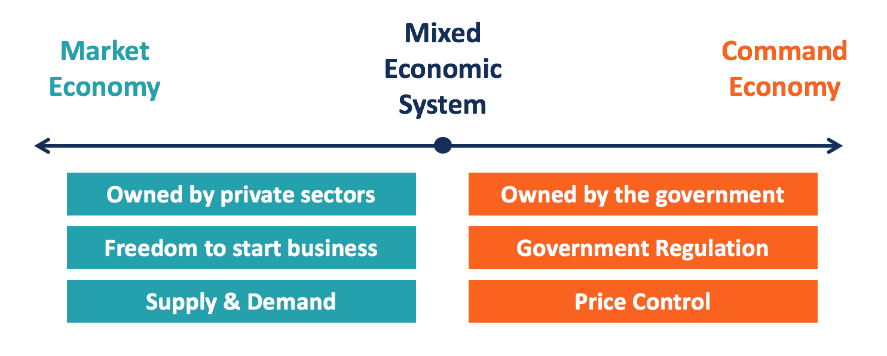

## Table of Contents

## What is a market economy?

A market economy is a type of economic system where the prices of goods and services are determined by the forces of supply and demand. In this system, individuals and businesses make decisions about what to produce, how much to produce, and at what price to sell, based on what they think will be profitable. The government has a limited role and mainly focuses on protecting property rights and ensuring fair competition.

In a market economy, consumers have the power to influence what is produced by choosing what to buy. If many people want a certain product, businesses will produce more of it, and the price might go up. On the other hand, if fewer people want a product, businesses will produce less, and the price might go down. This system encourages competition, which can lead to better products and lower prices for consumers. However, it can also result in income inequality and may not always provide for everyone's needs, especially those who cannot afford to buy what they need.

## What is a mixed economy?

A mixed economy is a system that combines parts of both market and command economies. In a mixed economy, the government and private businesses both play important roles. The government might control some industries, like healthcare or education, to make sure everyone can get these services. At the same time, private businesses can operate freely in other areas, like making cars or selling clothes. This mix helps balance the benefits of a free market with the need to take care of everyone in society.

In a mixed economy, the government can step in to fix problems that the market can't solve on its own. For example, if a business is polluting the environment, the government can make rules to stop it. The government can also help people who are struggling by providing things like unemployment benefits or public housing. By doing these things, a mixed economy tries to make sure that the economy grows and that people's lives get better, not just a few rich people.

## What are the key characteristics of the United States' economy?

The United States has a mixed economy, which means it combines features of both a market economy and a command economy. In the U.S., private businesses and individuals make most of the decisions about what to produce, how much to produce, and what prices to charge. This is similar to a market economy where supply and demand set the prices. However, the government also plays a big role. It makes rules to protect workers, the environment, and to make sure businesses compete fairly. The government also provides services like public education, healthcare for the elderly and poor, and helps people who can't find jobs.

Another key characteristic of the U.S. economy is its focus on innovation and technology. The country is home to many of the world's leading tech companies and is known for its advancements in fields like computers, medicine, and space exploration. This focus on innovation helps the economy grow and creates many high-paying jobs. At the same time, the U.S. economy is very large and diverse, with industries ranging from farming and manufacturing to finance and entertainment. This diversity helps the economy stay strong even when one part is struggling.

Despite its strengths, the U.S. economy also faces challenges. One big issue is income inequality, where the rich get richer and the poor stay poor. The government tries to help with programs like welfare and food stamps, but it's a big problem. Another challenge is the national debt, which is the money the government owes. It keeps growing, and some people worry about how it will be paid back. Overall, the U.S. economy is a mix of private freedom and government help, with a strong focus on innovation and diversity, but it also has its share of problems to solve.

## How does the U.S. government intervene in the economy?

The U.S. government intervenes in the economy in many ways to help it run smoothly and to take care of people. One big way is by making rules, or regulations, to make sure businesses play fair and don't hurt people or the environment. For example, the government might set rules about how much pollution a factory can make or how workers should be treated. This helps keep the economy safe and fair for everyone. The government also steps in to help people who are struggling. It does this by giving money to people who can't find jobs, helping families buy food, and making sure everyone can go to school.

Another way the government helps the economy is by spending money on big projects, like building roads and bridges. This not only creates jobs but also makes it easier for businesses to move their goods around the country. The government also tries to keep the economy growing by changing taxes and interest rates. If the economy is growing too fast and prices are going up a lot, the government might raise taxes or interest rates to slow things down. If the economy is not growing enough, the government might lower taxes or interest rates to help it grow faster. By doing all these things, the government tries to make sure the economy works well for everyone.

## What role do private businesses play in the U.S. economy?

Private businesses are a big part of the U.S. economy. They make most of the things people buy, like cars, clothes, and food. They also provide services, like fixing cars or cutting hair. These businesses decide what to make and sell based on what they think people want. If people want more of something, businesses will make more of it. This helps the economy grow because it creates jobs and makes things people need.

Private businesses also help the economy by competing with each other. When businesses compete, they try to make better products or sell them for less money. This is good for people because they get better stuff for less. But businesses also need to make money, so they try to find new ways to do things better and cheaper. This can lead to new inventions and new ways of doing things, which makes the whole economy stronger.

## How does the U.S. economy balance between free market and government control?

The U.S. economy tries to balance between letting businesses do what they want and having the government step in to help. In a free market, businesses decide what to make and sell based on what people want. They compete with each other to make better products and lower prices. This helps the economy grow and creates jobs. But sometimes, businesses might do things that hurt people or the environment, like polluting or treating workers badly. That's when the government steps in to make rules to stop these problems.

The government also helps people who are struggling by giving them money or services like healthcare and education. This makes sure everyone has a chance to do well, not just the rich. The government can also spend money on big projects like roads and bridges, which creates jobs and helps businesses move their goods. By changing taxes and interest rates, the government can help the economy grow faster or slow down if it's growing too fast. This balance between free market and government control helps the U.S. economy stay strong and fair for everyone.

## What are some examples of government regulations in the U.S. economy?

The U.S. government makes many rules to keep the economy fair and safe. One example is the Environmental Protection Agency (EPA), which sets rules to stop businesses from polluting the air and water. This helps keep the environment clean and safe for everyone. Another example is the Occupational Safety and Health Administration (OSHA), which makes sure workplaces are safe for workers. OSHA sets rules about things like wearing safety gear and making sure machines are safe to use.

The government also has rules to make sure businesses compete fairly. The Federal Trade Commission (FTC) stops companies from doing things like lying in ads or working together to raise prices. This helps keep prices fair for people. The Securities and Exchange Commission (SEC) makes rules for the stock market to stop people from cheating and to make sure companies tell the truth about their money. These rules help keep the economy honest and fair for everyone.

## How do social welfare programs in the U.S. reflect elements of a mixed economy?

Social welfare programs in the U.S. show how the country mixes a free market with government help. In a free market, businesses decide what to make and sell, and people decide what to buy. But not everyone can always buy what they need. That's where the government steps in with social welfare programs. These programs, like food stamps and unemployment benefits, help people who are struggling. They make sure everyone has enough to eat and a place to live, even if they can't find a job or make enough money.

These programs are a big part of the U.S. mixed economy because they balance the freedom of the market with the need to take care of everyone. The government uses taxes to pay for these programs, which means everyone helps a little bit to make sure no one goes without. By doing this, the U.S. tries to make sure the economy works well for everyone, not just the people who can afford to buy everything they need. This mix of market freedom and government help is what makes the U.S. economy a mixed economy.

## What economic theories support the U.S. being classified as a market economy?

The U.S. is often seen as a market economy because it follows the ideas of classical and neoclassical economic theories. These theories say that when people and businesses can make their own choices about what to buy and sell, the economy works best. In the U.S., businesses decide what to make and sell based on what they think people want. If people want more of something, businesses will make more of it. This is called supply and demand. It helps the economy grow because it creates jobs and makes things people need.

Even though the U.S. has a lot of government rules and programs, the basic idea of a market economy is still there. The government steps in to make sure businesses play fair and to help people who are struggling, but most of the time, businesses and people can make their own choices. This mix of market freedom and government help is why some people still call the U.S. a market economy, even though it's really a mixed economy. The focus on letting the market work on its own, with some help from the government, is what makes the U.S. economy strong and growing.

## What economic theories support the U.S. being classified as a mixed economy?

The U.S. is seen as a mixed economy because it mixes ideas from both market and command economies. In a market economy, businesses and people make their own choices about what to buy and sell. This is based on the ideas of classical and neoclassical economics, which say that when people can make their own choices, the economy works best. But the U.S. also uses ideas from Keynesian economics, which says the government should step in to help the economy when it's not doing well. The government does this by spending money on big projects, like building roads, and by helping people who are struggling with programs like food stamps and unemployment benefits.

This mix of market freedom and government help is what makes the U.S. a mixed economy. The government makes rules to make sure businesses play fair and don't hurt people or the environment. It also helps people who can't find jobs or make enough money. At the same time, businesses can still make their own choices about what to make and sell. This balance helps the economy grow and makes sure everyone has a chance to do well, not just the rich. By using ideas from both market and command economies, the U.S. tries to make its economy strong and fair for everyone.

## How have historical economic policies in the U.S. shifted the balance between market and mixed economy characteristics?

Over time, the U.S. has changed its economic policies to find a good balance between a market economy and a mixed economy. In the early days, the U.S. was more like a market economy. Businesses could do what they wanted, and the government didn't get involved much. But during the Great Depression in the 1930s, things got really bad. People lost their jobs and couldn't buy what they needed. So, the government started to help more. It made programs like Social Security to help old people and unemployed people. This was a big shift towards a mixed economy because the government was now helping people more.

After World War II, the U.S. kept using these ideas. The government made more rules to make sure businesses played fair and didn't hurt people or the environment. It also kept helping people who were struggling with programs like food stamps and Medicare. But at the same time, the U.S. still let businesses make their own choices about what to make and sell. This mix of market freedom and government help has kept changing over the years. Sometimes, the government helps more, like during big economic problems. Other times, it lets the market do more. This balance has helped the U.S. economy stay strong and grow, while also trying to make sure everyone has a chance to do well.

## What are the current debates among economists about the classification of the U.S. economy as either market or mixed?

Economists often argue about whether the U.S. economy should be called a market economy or a mixed economy. Some economists say it's a market economy because businesses and people can make their own choices about what to buy and sell. They think the government should stay out of the way and let the market work on its own. These economists believe that when businesses compete, it helps the economy grow and makes things better for everyone. They worry that too much government help can slow down the economy and make businesses less free.

But other economists say the U.S. is a mixed economy because the government plays a big role in helping people and making rules. They think the government needs to step in to make sure everyone has a chance to do well, not just the rich. These economists believe that programs like food stamps and Medicare are important to help people who are struggling. They also think the government should make rules to stop businesses from hurting people or the environment. This mix of market freedom and government help is what makes the U.S. economy strong and fair, they argue.

The debate keeps going because the U.S. economy is always changing. Sometimes, the government helps more, like during big economic problems. Other times, it lets the market do more. This balance is what makes the U.S. economy hard to classify as just a market or mixed economy. But most economists agree that the U.S. economy is a mix of both, trying to find the best way to grow and help everyone.

## References & Further Reading

[1]: Hasbrouck, J., & Saar, G. (2009). ["Technology and Liquidity Provision: The Blurring of Traditional Definitions."](https://www.sciencedirect.com/science/article/pii/S1386418108000220) Journal of Financial Markets.

[2]: U.S. Securities and Exchange Commission. ["Staff Report on Algorithmic Trading in U.S. Capital Markets."](https://www.sec.gov/file/staff-report-algorithmic-trading-us-capital-markets) 

[3]: Lopez de Prado, M. (2018). ["Advances in Financial Machine Learning."](https://www.amazon.com/Advances-Financial-Machine-Learning-Marcos/dp/1119482089) Wiley.

[4]: Jansen, S. (2020). ["Machine Learning for Algorithmic Trading."](https://github.com/stefan-jansen/machine-learning-for-trading) Packt Publishing.

[5]: Chan, E. P. (2009). ["Quantitative Trading: How to Build Your Own Algorithmic Trading Business."](https://github.com/ftvision/quant_trading_echan_book) Wiley.

[6]: Aronson, D. R. (2007). ["Evidence-Based Technical Analysis: Applying the Scientific Method and Statistical Inference to Trading Signals."](https://onlinelibrary.wiley.com/doi/book/10.1002/9781118268315) Wiley.