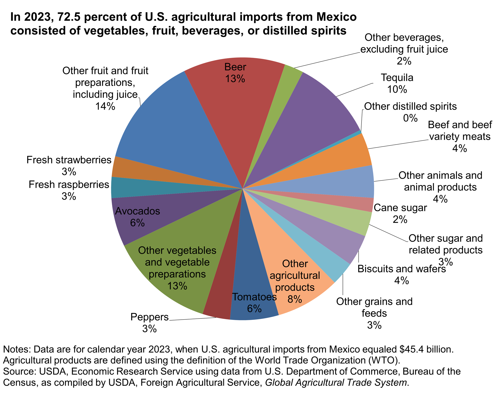

The international trade landscape is dynamic and multifaceted, characterized by the flow of goods and services across borders. Within this landscape, the trade relationship between the United States and Mexico stands out as particularly significant due to the nations' proximity and closely linked economic partnerships. This connection is underscored by Mexico's status as the United States' second-largest trading partner in 2022. That year, the bilateral trade between the two countries amounted to approximately $863.4 billion, reflecting the substantial economic interaction and integration of markets that benefit both nations.

A key development in this relationship was the implementation of the United States-Mexico-Canada Agreement (USMCA) in 2020. This agreement replaced the former North American Free Trade Agreement (NAFTA), updating and reinforcing trade regulations and policies to reflect modern economic practices and challenges. The USMCA aimed to create a more balanced and reciprocal trading environment, fostering further enhancements in trade relationships among the three countries, particularly between the U.S. and Mexico.

The U.S.-Mexico trade relationship involves a wide array of goods and services, ranging from automobiles and electronics to agricultural products and energy resources. This comprehensive trade network not only supports economic growth but also creates jobs and expands market access for businesses and consumers in both countries. The importance of this trade partnership is amplified by its complexity, involving sophisticated supply chains and logistical operations that span both nations.

Furthermore, the evolving nature of international trade has seen the integration of advanced technologies such as algorithmic trading, which enhances the efficiency and speed of trade operations. Algorithmic trading systems, by rapidly processing vast amounts of data and market information, play a crucial role in optimizing supply chain logistics and managing risks associated with currency fluctuations and market volatility. This integration aligns with the broader digital transformation observed in global trade practices, aiming to streamline transactions and enhance transparency.

In conclusion, the trade between the United States and Mexico is a cornerstone of economic growth for both nations, rooted not only in historical connections but also in opportunities for future development. As they continue to navigate the complexities of the international trade landscape, the actions taken by both countries to embrace technological advancements and develop cooperative policy frameworks will be instrumental in maintaining a resilient and thriving trade relationship.

## Table of Contents

## U.S. Imports from Mexico: Key Goods

Vehicles and parts represent the largest category of U.S. imports from Mexico, with a value exceeding $130.9 billion in 2022. This sector is a crucial element of trade between the two nations as American automakers often manufacture cars and car parts in Mexico due to its proximity and cost-effectiveness. The integration of automotive supply chains across borders facilitates efficiency in production and distribution, making Mexico a significant player in the American automotive market.

Electrical equipment and components, including computer and communications equipment, constitute another substantial segment of imports. Valued at over $37.7 billion, these imports underscore the technological interdependence between the U.S. and Mexico. The increasing demand for electronics in both personal and commercial markets drives this import activity.

In the energy sector, the U.S. imported $20.7 billion worth of oil and gas from Mexico in 2022. Energy trade remains a critical aspect of the bilateral relationship, with Mexico providing a considerable share of [crude oil](/wiki/crude-oil) to the U.S. market. This relationship is bolstered by geographical proximity and established infrastructure, facilitating the continuous flow of energy resources.

Other essential imports from Mexico include audio and video equipment, beverages such as tequila, and medical and specialized equipment. These categories reflect a diverse trade portfolio that caters to various consumer needs in the U.S., from entertainment technology to healthcare supplies.

The overall composition of U.S. imports from Mexico highlights a balanced and multifaceted trade relationship, driven by mutual economic interests and complemented by shared industrial strengths.

## Impact of U.S.-Mexico Trade on Both Economies

The trade relationship between the United States and Mexico is a pivotal component of both nations' economies, underpinning job creation, consumer affordability, and economic integration. This bilateral trade supports a vast number of industries and affects millions of workers, as it allows both countries to specialize in the production of goods where they hold a comparative advantage. Consequently, this specialization leads to cost efficiencies that benefit consumers through more affordable goods.

A crucial element of this economic relationship is the potential for Mexico to soon overtake Canada as the United States' largest trade partner. This shift is driven primarily by escalating demand and deepening economic integration between the two countries. As both nations become more tightly interwoven, the enhancement of supply chain networks is paramount, particularly in sectors such as automotive and electronics where cross-border collaboration is indispensable. The automotive sector, for instance, is marked by intricate supply chains that crisscross national boundaries, involving components manufactured in Mexico that are then assembled into final products in the United States.

However, the trade dynamics are not without challenges. Tariffs and trade barriers can introduce complexities into this relationship, frequently resulting in increased costs for consumers and inviting the possibility of retaliatory measures. These barriers disrupt supply chains, lead to inefficiencies, and can strain economic ties. For policymakers, understanding these dynamics is essential to fostering a stable and mutually beneficial trade environment.

Both nations must consider the implications of such barriers and work collaboratively to minimize their impact, ensuring the smooth flow of goods and services across the border. This cooperative approach not only fortifies economic resilience but also enhances the potential for continued growth and prosperity through sustained trade engagement.

## The Role of Algorithmic Trading in International Trade

Algorithmic trading plays a significant role in enhancing the efficiency and speed of executing trade orders across international borders, including in the U.S.-Mexico trade relationship. The adoption of algorithmic systems in this context has led to substantial improvements in the operations of supply chains, providing several key advantages.

Firstly, [algorithmic trading](/wiki/algorithmic-trading) processes large datasets and market information to help firms make informed decisions. By leveraging advanced algorithms, businesses involved in cross-border trade can manage risks effectively and optimize supply chain logistics. This involves using predictive analytics to forecast demand and supply conditions, thereby ensuring that inventory levels are managed efficiently. For example, algorithms can be designed to analyze historical market data, identifying patterns that suggest optimal times for placing orders, thereby reducing holding costs and minimizing inefficiencies in the supply chain.

Secondly, algorithmic trading plays a vital role in addressing fluctuations in currency exchange rates, which are often a crucial [factor](/wiki/factor-investing) in international trade operations. Exchange rate [volatility](/wiki/volatility-trading-strategies) can significantly impact the cost of transactions between the U.S. and Mexico. Algorithms can be utilized to analyze real-time data and historical trends to predict currency movements, allowing firms to strategize their currency exchanges and hedge against potential risks. This financial maneuvering helps stabilize costs and maintain competitive pricing for goods and services traded across borders.

Moreover, the use of algorithmic trading aligns with the broader digital transformation occurring in the global trade ecosystem. By automating transactions and increasing transparency, these systems streamline operations, making international trade more efficient and less prone to human error. The algorithms employed can assess various market conditions and execute trades at optimal times, ensuring that both pricing and timing align with strategic business objectives. Such technology integration not only enhances operational efficiency but also improves regulatory compliance by providing detailed transaction records that are easily auditable.

Overall, algorithmic trading is instrumental in modernizing international trade between the U.S. and Mexico, aligning with the global trends of digitalization and automation. By improving decision-making processes, stabilizing currency exchange challenges, and ensuring operational transparency, algorithmic trading contributes significantly to the robustness and efficacy of trade relations. As such, businesses that embrace these technological advancements can better navigate the complexities of international markets, positioning themselves for sustained success in the competitive global arena.

## Challenges and Opportunities

The U.S.-Mexico trade relationship is a pivotal driver of economic activity for both nations, yet it faces multiple challenges. Political shifts, such as changes in leadership or policy priorities in either country, can create uncertainties that affect trade dynamics. Regulatory changes, including amendments to trade agreements or shifts in environmental standards, can also introduce complexities. Additionally, global economic policies, including tariffs and sanctions imposed by other nations, can impact trade flows between the U.S. and Mexico. Such challenges necessitate proactive strategies to mitigate potential disruptions.

Despite these challenges, significant opportunities exist to expand trade between the U.S. and Mexico. Emerging sectors, such as renewable energy, present lucrative opportunities for collaboration. As global demand for sustainable energy solutions increases, both nations can explore joint ventures and investments in solar, wind, and other renewable energy technologies. Technology transfers can further promote innovation by facilitating the exchange of expertise and best practices across various industries, thereby enhancing competitiveness.

Smart infrastructure is another promising area for expansion. As both countries seek to modernize their infrastructure, there is potential for partnerships in developing intelligent transportation systems, advanced telecommunications, and other high-tech infrastructure projects. Leveraging logistics technology and data analytics can significantly enhance trade efficiencies. By implementing advanced tracking systems, predictive analytics, and automated logistics solutions, both countries can streamline supply chain operations, reduce costs, and improve the reliability of cross-border trade.

To address trade disputes amicably, both countries can adopt a collaborative approach through dialogue and negotiation. Establishing bilateral committees and using data-driven insights can help resolve conflicts and maintain the stability of the trade relationship. By addressing challenges and seizing opportunities in sectors like renewable energy, smart infrastructure, and logistics technology, the U.S. and Mexico can foster a robust and resilient trade partnership that benefits both economies.

## Conclusion

The trade between the United States and Mexico is a cornerstone of economic growth for both nations, reflecting deep-rooted ties and potential for future expansion. With both countries interlinked through substantial economic partnerships, strategic planning and cooperation are paramount as they navigate the complexities of the global trade environment. By actively embracing technological advancements, such as algorithmic trading and data analytics, both countries can optimize supply chain efficiencies and manage trade risks more effectively.

Furthermore, nurturing policy frameworks that promote trade while addressing regulatory and economic challenges will ensure mutual benefits. Policies aimed at reducing trade barriers and fostering innovation can create a fertile ground for economic growth and stability. The ongoing evolution of international trade dynamics requires both nations to remain adaptable and forward-thinking.

Continuous dialogue and collaboration between the United States and Mexico are crucial to maintaining a resilient trade relationship. Engagement in diplomatic and economic discussions can facilitate resolutions to potential disputes and cement partnerships in emerging sectors, such as renewable energy and smart infrastructure. By working together and leveraging shared resources and expertise, the trade relationship between these two countries can thrive amidst global changes, securing economic prosperity for future generations.

## References & Further Reading

[1]: Bown, C. P. (2020). ["Will US tariffs push Mexico's economy into recession?"](https://scholar.google.com/citations?user=Jij5CJ0AAAAJ&hl=en) VoxEU.org.

[2]: Villareal, M. A., & Fergusson, I. F. (2017). ["The United States-Mexico-Canada Agreement (USMCA)"](https://crsreports.congress.gov/product/pdf/R/R44981/17) Congressional Research Service.

[3]: ["International Economics"](https://en.wikipedia.org/wiki/International_economics) by Paul Krugman and Maurice Obstfeld.

[4]: Gantz, D. A. (2020). ["United States-Mexico-Canada Agreement (USMCA)"](https://www.amazon.com/Introduction-United-States-Mexico-Canada-Agreement-Understanding/dp/1800884540), The National Law Review.

[5]: López de Prado, M. (2018). ["Advances in Financial Machine Learning"](https://www.amazon.com/Advances-Financial-Machine-Learning-Marcos/dp/1119482089) Wiley.

[6]: Aronson, D. R. (2007). ["Evidence-Based Technical Analysis: Applying the Scientific Method and Statistical Inference to Trading Signals"](https://onlinelibrary.wiley.com/doi/book/10.1002/9781118268315) Wiley.

[7]: Jansen, S. (2020). ["Machine Learning for Algorithmic Trading"](https://github.com/stefan-jansen/machine-learning-for-trading) Packt Publishing.

[8]: Chan, E. P. (2008). ["Quantitative Trading: How to Build Your Own Algorithmic Trading Business"](https://github.com/ftvision/quant_trading_echan_book) Wiley.