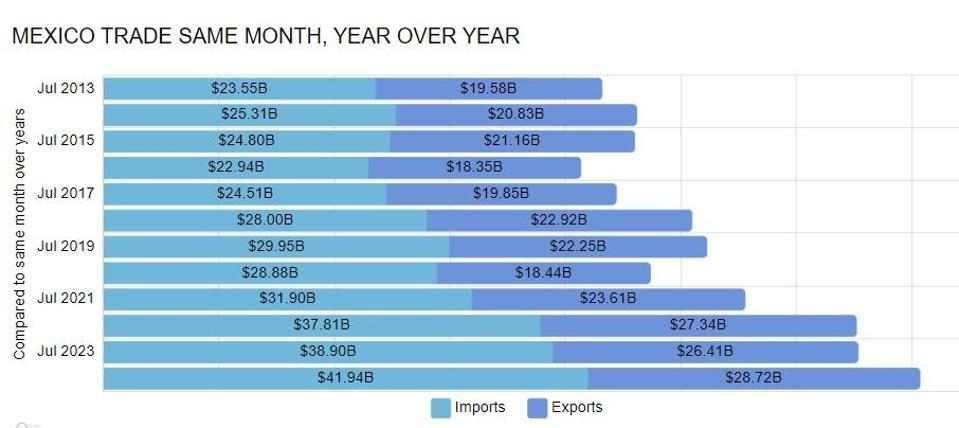

The global financial market has been significantly reshaped by technological innovations, with a notable influence observed in trading activities. One of the most impactful advancements in this sphere is algorithmic trading. This method involves the use of computers to execute trades based on a set of predefined instructions, often achieving results that would be impossible for human traders to match due to speed and precision. As algorithmic trading dominates the financial landscape, its implications reach beyond domestic markets, affecting international trade dynamics.

The trade relationship between Mexico and the United States is a prime example where technology, particularly algorithmic trading, plays a crucial role. Recognized as one of the most significant bilateral trade interactions globally, the exchange between these two nations sees billions of dollars in goods and services traded annually. As of 2023, Mexico stands as the United States' leading trading partner, reflecting the robustness and complexity of their economic interactions.



Algorithmic trading introduces several key advantages to the U.S.-Mexico trade system. This technology enhances the efficiency and speed of transactions, allowing traders on both sides of the border to react swiftly to market changes and economic signals. This agility is particularly essential in high-frequency trading scenarios where decision-making within microseconds can substantially impact trading outcomes.

In this context, algorithmic trading not only optimizes efficiencies but also transforms traditional trading dynamics. By analyzing large datasets and market trends, algorithmic systems provide better market predictions, reducing transaction costs and enhancing competitiveness. These advancements underscore a shift in the way international trade is conducted, highlighting the growing interdependence of technological and economic strategies.

This article will investigate the impact of algorithmic trading on trade volumes between Mexico and the United States, examining how such technological innovations are shaping trade dynamics and what they signify for both nations.

## Table of Contents

## An Overview of U.S.-Mexico Trade Relations

Mexico and the United States have long standing trade relations, characterized by deep economic integration and significant bilateral exchange of goods and services. Each country ranks as one of the other's top trading partners, underscoring the critical nature of their economic interdependence. This strong partnership was institutionalized and expanded through trade agreements like the North American Free Trade Agreement (NAFTA), which was in effect from 1994 until it was replaced in 2020 by the United States-Mexico-Canada Agreement (USMCA). These agreements have reduced trade barriers, eliminated tariffs, and established common regulatory standards, contributing to increasingly robust trade volumes. 

The economic bond between these two nations has been tested by geopolitical tensions and shifting trade policies. Despite these challenges, the trade [volume](/wiki/volume-trading-strategy) has exhibited remarkable resilience. The adaptability of this partnership is partly attributed to the flexible frameworks provided by NAFTA and USMCA, which facilitate adjustments to new economic conditions. This resilience ensures sustained economic interaction, even amidst external pressures such as global supply chain disruptions or political changes.

As of 2023, Mexico surpassed other nations to become the United States' leading trading partner. This milestone reflects the dynamic evolution of their trade relationship, culminating in record trade values. The surge in trade figures is a testament to the effectiveness of collaborative economic policies and the strategic importance of Mexico in the broader framework of U.S. trade strategy. The United States imports from Mexico a wide range of goods, including vehicles, machinery, agricultural products, and manufactured commodities, while exporting automobiles, electrical machinery, mineral fuels, and plastics, among others, to Mexico. These exchanges are fundamental to the economic prosperity of both nations.

Statistical data from recent years highlights the scale of these exchanges. For instance, in 2023, the total trade volume between the U.S. and Mexico reached unprecedented heights. This growth trajectory underscores the increasing economic synergy and the potential for further expansion in the future. Through sustained cooperation and mutual economic interests, the U.S.-Mexico trade relationship remains a cornerstone of both nations' economic strategies, reflecting a complex yet cohesive integration necessitating ongoing policy attention and innovation.

## Algorithmic Trading: Transforming Trade Dynamics

Algorithmic trading employs sophisticated algorithms designed to execute trades at remarkable speeds and volumes that transcend human capabilities. This method is particularly beneficial in high-frequency trading ([HFT](/wiki/high-frequency-trading-strategies)) situations, where trading decisions must occur within microseconds. The U.S.-Mexico trade context has increasingly adopted [algorithmic trading](/wiki/algorithmic-trading) systems to optimize trade efficiencies and manage significant transaction volumes effectively.

One of the principal advantages of algorithmic trading is its ability to conduct transactional operations with minimal human intervention, thereby reducing the likelihood of human errors and enhancing the speed at which trades are executed. In high-frequency trading, this rapid decision-making capacity is crucial because market conditions can fluctuate in milliseconds. The result is that trades can be placed in optimal market conditions, capturing fleeting opportunities that manual trading processes might miss.

In the U.S.-Mexico trade context, algorithmic trading enhances the management of large transaction volumes by improving the accuracy and efficiency of trade executions. The technology enables traders to harness market data to predict price movements more accurately, using historical and real-time data analysis to forecast trends and execute trades accordingly. This predictive capability reduces transaction costs by timing the market efficiently and minimizing the need for unnecessary trades, which can incur additional expenses.

Moreover, algorithmic trading systems adapt swiftly to changes in market conditions, which is vital amidst varying factors such as fluctuating exchange rates, tariffs, and geopolitical developments. Advanced algorithms integrate these variables into trading strategies, allowing for rapid adjustments in trading volumes and directions in response to economic signals.

The growing reliance on algorithmic trading within U.S.-Mexico trade underscores its transformative impact on trade dynamics, offering enhanced market predictions and significant reductions in transaction costs. As the technology continues to evolve, it is anticipated that its role in cross-border trading efficiencies will expand, providing further opportunities for economic collaboration and growth between the two nations.

## Impact on Trade Volumes Between Mexico and the United States

Algorithmic trading has significantly impacted the trade volumes between Mexico and the United States. This trading methodology relies on sophisticated algorithms capable of processing market information at high speeds, allowing for swift adaptations to changing market conditions. The flexibility of these algorithms has resulted in dynamic trade adjustments for both imports and exports across the two nations.

One major advantage of algorithmic trading is its ability to incorporate various economic factors into trading strategies almost instantaneously. Variables such as exchange rates, tariffs, and geopolitical developments are seamlessly integrated into trading algorithms, enabling traders to make informed decisions quickly. This real-time data processing allows algorithms to adjust trading volumes more accurately and efficiently, optimizing the timing and execution of trades.

Furthermore, the application of algorithmic trading has led to a dynamic trade environment. The ability of algorithms to react promptly to economic signals means that trade volumes can be rapidly adjusted in line with prevailing market conditions. For example, in response to fluctuations in the exchange rate between the Mexican Peso and the U.S. Dollar, algorithmic systems can recalibrate trading strategies to exploit advantageous currency valuations. Similarly, when tariffs are imposed or lifted, algorithms can reassess the economic landscape and adjust trade transactions accordingly.

To illustrate this, the following Python code snippet shows how a simple algorithm might adjust trading volumes based on exchange rate changes:

```python
def adjust_trade_volume(current_volume, exchange_rate_change):
    adjustment_factor = 1 + (exchange_rate_change / 100)
    new_volume = current_volume * adjustment_factor
    return new_volume

# Example: If the current trade volume is 1,000 units and the exchange rate changes by +2%
current_volume = 1000
exchange_rate_change = 2
new_volume = adjust_trade_volume(current_volume, exchange_rate_change)
print(f"The adjusted trade volume is {new_volume} units.")
```

In this hypothetical scenario, a 2% increase in the exchange rate would result in an adjusted trade volume that reflects the new economic condition. Although this is a simplified example, in practice, algorithmic trading systems incorporate far more complex models and data points. 

Overall, algorithmic trading is reshaping the trade dynamics between Mexico and the United States by facilitating rapid responses to market changes, improving decision-making, and ultimately enhancing trade efficiencies. This technological advancement underscores the evolving nature of international trade and its increasing reliance on sophisticated algorithms for optimal performance.

## Challenges and Opportunities in Algorithmic Trading

Algorithmic trading has significantly transformed trading practices, yet it is not without its set of challenges and opportunities. One of the primary concerns is the potential for increased market [volatility](/wiki/volatility-trading-strategies). This occurs when trading algorithms, executing large orders at high frequencies, react simultaneously to market signals, potentially leading to rapid price changes that destabilize the market. For instance, statistical [arbitrage](/wiki/arbitrage) strategies that exploit short-term market inefficiencies can amplify price swings if a sudden influx of similar algorithmic responses occurs.

There is also the risk that algorithms might malfunction, resulting in substantial economic repercussions. Software bugs, errors in parameter settings, or unexpected market conditions can all lead to erroneous trades being executed. A famous example is the "Flash Crash" of May 6, 2010, when the Dow Jones Industrial Average plunged nearly 1,000 points within minutes, due in part to high-frequency trading algorithms malfunctioning. This incident underscored the necessity of fail-safe mechanisms and stringent testing of algorithmic systems.

Despite these challenges, algorithmic trading offers immense opportunities. Advances in data analytics and [machine learning](/wiki/machine-learning) are enhancing the sophistication and accuracy of trading algorithms. These technologies empower algorithms to process large datasets more effectively, improving market predictions and trading outcomes. For example, machine learning models can identify complex patterns in historical trade data, allowing algorithms to make more informed trading decisions.

Moreover, enhancing collaboration and knowledge exchange between financial institutions in Mexico and the U.S. may lead to improved efficiencies in cross-border trading. Such partnerships could involve sharing best practices in algorithm development or co-developing new algorithmic systems tailored to the specifics of U.S.-Mexico trade relations. By leveraging each other's strengths, both countries can optimize their trading strategies, potentially reducing costs and increasing profit margins.

Overall, the future of algorithmic trading in international markets looks promising, provided the associated risks are managed effectively. Balancing technological innovation with robust regulatory frameworks will be essential for mitigating potential downsides while maximizing the benefits.

## Conclusion

The integration of algorithmic trading within the trade relationship between the United States and Mexico is actively shaping a new era of international trading relationships. This technology enables more sophisticated, data-driven trading strategies that enhance trade efficiency, offering substantial benefits. By leveraging algorithms, traders can achieve faster execution speeds and better market predictions, which lead to reduced transaction costs and optimized trade flows.

Despite these advancements, challenges persist. Algorithmic trading can potentially increase market volatility, and there is always the risk of system malfunctions, which could have severe economic repercussions. Moreover, as computational trading strategies become more common, ensuring that they are not used in manipulative ways remains a priority.

As both nations continue to advance and incorporate new technologies into their economic strategies, algorithmic trading will likely become even more integral to their interactions. The benefits, such as improved accuracy in market predictions and more adaptive responses to economic signals, make the technology indispensable. 

However, stakeholders must exercise caution. Balancing technological progress with adequate regulatory frameworks is crucial to mitigating potential risks, such as reckless trading activities or market abuses. Ensuring that these systems operate transparently and ethically will be key to maximizing benefits while safeguarding economic stability. As this technological evolution progresses, collaborative approaches between Mexican and U.S. financial institutions could further streamline cross-border transactions, fostering a robust trading partnership between the two nations.

## References & Further Reading

[1]: Hasbrouck, J., & Saar, G. (2013). ["Low-latency trading."](https://www.sciencedirect.com/science/article/abs/pii/S1386418113000165) The Review of Financial Studies, 26(9), 2093-2136.

[2]: Lopez de Prado, M. (2018). ["Advances in Financial Machine Learning."](https://www.amazon.com/Advances-Financial-Machine-Learning-Marcos/dp/1119482089) Wiley.

[3]: Harris, L. (2003). ["Trading & Exchanges: Market Microstructure for Practitioners."](https://www.amazon.com/Trading-Exchanges-Market-Microstructure-Practitioners/dp/0195144708) Oxford University Press.

[4]: Aldridge, I. (2013). ["High-Frequency Trading: A Practical Guide to Algorithmic Strategies and Trading Systems."](https://www.amazon.com/High-Frequency-Trading-Practical-Algorithmic-Strategies/dp/1118343506) Wiley.

[5]: Chan, E. (2008). ["Quantitative Trading: How to Build Your Own Algorithmic Trading Business."](https://github.com/ftvision/quant_trading_echan_book) Wiley.