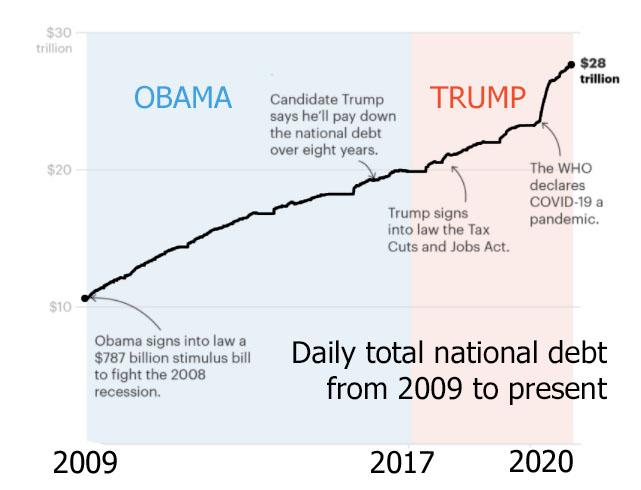

National debt represents a crucial component in the formulation and execution of economic policies and decisions. It serves as a barometer of a country's fiscal health and influences both domestic and international economic strategies. Understanding the historical context of the U.S. national debt is vital, as it provides insight into how the country's financial position has evolved over time and under various administrations. The trajectory of national debt is shaped by complex interactions between governmental fiscal policies, economic conditions, and global events.

U.S. national debt has shifted significantly during different presidential terms, reflecting changes in policies, economic scenarios, and responses to major national and international challenges. Each administration's fiscal strategies, whether aimed at economic growth, war financing, or welfare expansion, have impacted debt levels differently. Analyzing these variations provides a comprehensive understanding of how political ideologies and policies have historically influenced debt.

Modern financial technologies, particularly algorithmic trading, have brought innovative changes in debt management. These technologies enable highly efficient and sophisticated methods for handling large volumes of financial transactions, optimizing national debt portfolios, and managing risks. By leveraging computational algorithms, governments and financial institutions can enhance decision-making processes in bond and treasury markets.

This article seeks to explore the historical context and progression of U.S. national debt, its management under various presidential administrations, and the influence of advanced financial technologies on debt strategies. It aims to provide insights into the complexities of national debt dynamics and offers projections on future trends and challenges in debt management. The article encourages understanding diverse strategies to aid informed discussion and policy-making regarding national debt issues.

## Table of Contents

## A Brief History of U.S. National Debt

The origins of the U.S. national debt trace back to the early years of the nation, beginning with the financial commitments made during the American Revolutionary War. In 1790, the newly-formed federal government assumed approximately $75 million in debt, inherited from the states and war-related expenses. This marked the inception of the national debt as a foundational element of American financial policy, setting precedents for how future debts would be managed and structured.

Throughout its history, the national debt has been significantly influenced by wars, economic policies, and financial crises. Large-scale military conflicts such as the Civil War, World War I, and World War II resulted in substantial increases in national debt due to the immense costs associated with war preparations and operations. For instance, the national debt soared to over $24 billion by the end of World War I and experienced another sharp increase during World War II, reaching nearly $260 billion.

Economic policies have also played a critical role in shaping the trajectory of national debt. The New Deal programs initiated by President Franklin D. Roosevelt in response to the Great Depression required extensive federal spending, which further added to the national debt. Similarly, the Reagan Administration's tax cuts and defense spending in the 1980s contributed to a significant rise in the debt levels.

Major legislative acts have had profound impacts on national debt management across decades. The creation of the Federal Reserve System in 1913 transformed the federal government's ability to manage the debt by establishing a centralized banking system. The Budget and Accounting Act of 1921 institutionalized federal budgeting processes, allowing for more structured debt management. More recently, the Budget Control Act of 2011 sought to improve fiscal discipline and control the growth of debt through budget caps and sequestration measures.

Trends in national debt reveal patterns of increases and decreases over time, driven by economic conditions, political ideologies, and external factors. The debt tends to rise during economic downturns and periods of war, while occasionally stabilizing or declining during peacetime prosperity. However, the overall trajectory has been upward, particularly in recent decades, with debt levels reaching unprecedented heights due, in part, to policy responses to the global financial crisis of 2008 and the COVID-19 pandemic.

The impact of national debt extends beyond domestic policies, influencing the United States' role in international finance and its relationships with other nations. High levels of debt can affect the country's credit rating, interest rates, and economic stability, which in turn have implications for global markets. Additionally, the U.S. national debt is held by a diverse set of domestic and international investors, including foreign governments, which highlights the interconnected nature of global economic systems.

Understanding the historical context of U.S. national debt provides insight into its complex nature and the continuous challenges faced by policymakers in managing sustainable fiscal frameworks.

## U.S. National Debt by Presidential Administration

The examination of U.S. national debt reveals how different presidential administrations have approached fiscal policy and economic challenges, impacting national debt levels over time. This section explores the notable changes in national debt during key presidential terms, highlighting significant fiscal policies and reforms that have influenced debt levels.

During George Washington's presidency, the foundation of the U.S. national debt was established, mainly due to debts incurred during the Revolutionary War. This set the stage for subsequent administrations to manage and strategize around national debt. The formation of new fiscal policies, including the creation of the First Bank of the United States, was critical in addressing early debts.

The Civil War under Abraham Lincoln marked a significant increase in national debt, as the government financed the war effort. The issuance of government bonds and the introduction of the "greenback" currency were pivotal in these efforts.

In the 20th century, Franklin D. Roosevelt's New Deal policies and World War II expenditures caused another substantial rise in national debt. The war efforts in both World War I and II necessitated massive government spending, funded mainly by borrowing.

The post-war era saw national debt continue to rise with fluctuations due to various fiscal policies. Ronald Reagan's presidency in the 1980s brought about a conservative economic approach with significant tax cuts and increased military spending, which contributed to a surge in the national debt. The formula capturing debt growth during this era might refer to:

$$
\text{Debt Growth} = \text{Initial Debt} \times \left(1 + \frac{\text{Budget Deficit}}{\text{GDP}}\right)^t
$$

Where $t$ represents the time period.

More recent administrations have managed debt levels under differing economic ideologies. Under George W. Bush, national debt saw a remarkable increase due to tax cuts, the War on Terror, and the Medicare prescription drug benefit. The subsequent financial crisis of 2008 further intensified debt accumulation. Barack Obama inherited these conditions and sought stimulus packages to mitigate the Great Recession, increasing the debt further.

Contrasting approaches were observed during the Clinton administration, where fiscal discipline and economic growth during the 1990s led to budget surpluses, reducing the debt-to-GDP ratio. This era is often cited as an example of effective debt management.

Presidents such as Lyndon B. Johnson and Richard Nixon also contributed to shifts in national debt, with programs like the Great Society and the Vietnam War impacting fiscal balance. Furthermore, significant legislative acts, such as the Gramm-Rudman-Hollings Act during Reagan’s term, aimed to control and reduce deficits, illustrating the legislative impact on debt management.

Analyzing debt changes offers insight into how political ideologies, whether liberal or conservative, influence national debt strategy. Presidential policies reflect broader economic philosophies, balancing fiscal responsibility with national needs.

Ultimately, the varying success of debt management policies depends on external economic factors, political will, and the ability to adapt to unforeseen challenges. Assessing the past provides a foundation for understanding future debt dynamics and the potential impact of evolving fiscal philosophies.

## Understanding the National Debt Dynamics

Understanding the national debt dynamics involves examining its key components, particularly the distinction between public debt and intragovernmental holdings. Public debt consists of securities held by individuals, corporations, local governments, and foreign governments, accounting for a substantial portion of the national debt. Intragovernmental holdings, on the other hand, are debts held by federal government accounts, primarily trust funds like Social Security and Medicare. Understanding these components is crucial for assessing the debt's impact on the economy and developing strategies for effective management.

Interest rates significantly influence national debt obligations as they determine the cost of borrowing. When interest rates rise, the cost of servicing existing debt increases, potentially exacerbating fiscal deficits. Conversely, lower interest rates can ease the burden of debt repayment, allowing for more flexible fiscal policies. The formula for calculating the interest payment on national debt is:

$$
\text{Interest Payment} = \text{Debt} \times \text{Interest Rate}
$$

Economic indicators, including GDP growth rates, inflation, employment figures, and trade balances, also play a role in the fluctuations of national debt. For example, strong GDP growth can increase government revenues through higher tax collections, potentially reducing the need for borrowing. Inflation can erode the real value of debt, making it easier to manage, while employment rates influence tax revenues and social support expenditures. A high trade deficit might necessitate additional borrowing to maintain fiscal balance.

The Federal Reserve plays a critical role in debt management through its monetary policy decisions, which affect interest rates. The Federal Open Market Committee (FOMC) adjusts the federal funds rate to influence economic conditions, thereby impacting the cost of government borrowing. Furthermore, the Federal Reserve can engage in open market operations, including purchasing or selling government securities, to influence the supply of money and interest rates directly.

Managing national debt presents numerous challenges and opportunities. Challenges include maintaining sustainable debt levels, avoiding crowding out private investment, ensuring intergenerational equity, and minimizing the economic risks associated with high debt. Opportunities may arise from utilizing periods of low interest rates to refinance or strategically manage the debt portfolio, adopting fiscal policies that stimulate economic growth, and implementing technological innovations to improve debt tracking and forecasting.

In conclusion, understanding national debt dynamics is essential for devising effective fiscal strategies. Monitoring the interaction between public and intragovernmental debt, assessing the impact of interest rates, leveraging economic indicators, and considering the Federal Reserve's influence are critical components in managing the complex landscape of national debt.

## The Role of Algorithmic Trading in Debt Markets

Algorithmic trading refers to the use of computer algorithms to automate and optimize trade execution, traditionally used in equity markets but increasingly prevalent in bond and treasury markets. The evolution of [algorithmic trading](/wiki/algorithmic-trading) has been driven by advancements in technology, increased availability of high-frequency data, and the quest for improved trading efficiencies. These algorithms are designed to make decisions regarding the timing, price, and quantity of orders, minimizing manual intervention and capitalizing on market inefficiencies.

In bond and treasury markets, algorithmic trading has revolutionized how trades are executed. The algorithms can process vast amounts of market data in real time, enhancing the speed and precision of trade execution. This rapid processing capability is crucial for navigating the complexities of today’s financial markets, where [interest rate](/wiki/interest-rate-trading-strategies) fluctuations and geopolitical events can significantly impact bond prices. By utilizing algorithmic trading, institutional investors, including those managing national debt portfolios, can achieve better price execution and manage large trade orders more effectively without causing significant market impact.

Optimization of national debt portfolios with algorithms involves leveraging data-driven insights to minimize borrowing costs and manage debt maturity profiles efficiently. Algorithms can perform sophisticated analyses to determine the optimal structure of a debt portfolio, considering factors such as interest rate projections, risk tolerance levels, and [liquidity](/wiki/liquidity-risk-premium) needs. They can address questions such as when to issue new debt, which debt instruments to choose, and how to manage interest rate exposure.

The benefits of algorithmic trading in the context of national debt include increased efficiency and enhanced risk management. The ability to execute trades swiftly reduces transaction costs and the likelihood of adverse price movements. Algorithms also facilitate better risk management by incorporating predictive analytics and financial models to forecast potential market scenarios and hedge against unfavorable outcomes. This capacity for anticipatory action is vital for maintaining the stability of national debt portfolios amidst volatile economic conditions.

However, the adoption of algorithmic trading is not without controversy. Ethical considerations arise due to the potential for algorithms to exacerbate market [volatility](/wiki/volatility-trading-strategies) or engage in manipulative practices, such as quote stuffing or spoofing. Additionally, the reliance on complex algorithms raises concerns about transparency and accountability, especially when these systems operate with minimal human oversight. The "flash crash" incident of May 2010, where the Dow Jones Industrial Average plummeted nearly 1,000 points within minutes before recovering, underscores the potential risks associated with high-frequency algorithmic trading.

As algorithmic trading becomes more integral to debt markets, regulatory scrutiny and ethical considerations will play a crucial role in shaping its future development. To ensure fair and stable market environments, regulations may need to address issues such as algorithm testing and monitoring, system robustness, and the ethical implications of automated decision-making in financial markets.

## Future Prospects and Challenges in U.S. National Debt Management

Projecting the future trends of the U.S. national debt requires a comprehensive understanding of current fiscal policies and their implications. Fiscal policies, including federal spending, tax legislation, and economic stimulus measures, play a crucial role in shaping debt trajectories. For example, tax cuts can lead to increased deficits if they are not offset by corresponding reductions in government expenditures. Conversely, policies promoting economic growth can enhance tax revenues, potentially stabilizing debt levels.

Technological advancements and innovations are increasingly important in future debt strategies. Algorithmic trading, [machine learning](/wiki/machine-learning), and big data analytics provide tools for optimizing debt portfolio management by enhancing market efficiency and risk management. These technologies can refine decision-making processes, allowing policymakers to forecast economic scenarios and devise informed strategies for debt issuance and repayment schedules. For instance, implementing blockchain technology can increase transparency and reduce transaction costs in government securities markets.

Policy reforms are vital in addressing national debt sustainability. A balanced approach combining expenditure control and revenue enhancement can mitigate debt accrual. Proposals like modifying entitlement programs, implementing progressive taxation, or eliminating tax loopholes could lead to significant changes in the U.S. debt framework. The impacts of such reforms should be thoroughly analyzed, considering both their short-term economic stimuli and long-term fiscal sustainability.

Global economic trends significantly influence U.S. debt dynamics. Factors such as fluctuating commodity prices, changes in global interest rates, and international trade agreements can affect the cost of borrowing and the value of the dollar. For instance, higher global interest rates might increase borrowing costs, pressuring national debt levels. Similarly, geopolitical developments and trade tensions can impact economic growth, influencing revenue collection and expenditure needs.

Sustainable debt management strategies are essential for maintaining economic stability. These strategies include maintaining a stable debt-to-GDP ratio, implementing fiscal policies to stimulate economic growth, and ensuring that debt servicing costs remain manageable. One approach is to establish fiscal rules that mandate specific targets for budget deficits or debt levels, helping guide policy decisions. Additionally, the United States can diversify its funding sources to protect against market volatility, leveraging domestic and international markets.

In conclusion, managing the U.S. national debt amidst a dynamically changing economic landscape requires a multifaceted approach. Leveraging technology and innovation, implementing thoughtful policy reforms, and monitoring global economic trends are key to fostering sustainable debt management and ensuring fiscal health in the future.

## Conclusion

The national debt of the United States has been shaped by historical events, policy decisions, and evolving economic conditions. Over time, significant insights have emerged regarding how debt levels have been influenced by these factors. Historically, periods of war, economic recession, and substantial legislative reforms have prompted notable changes in the national debt. Understanding the past provides a crucial perspective on how the debt has evolved alongside national priorities and economic shifts.

Presidential policies have often played a critical role in shaping debt trajectories. Fiscal strategies, including taxation policies and governmental spending, vary significantly between different administrations. These variations highlight an ongoing tension between political ideologies, with some administrations advocating for increased spending to stimulate growth, while others emphasize austerity to reduce debt levels. Analyzing these patterns helps illuminate the nuanced relationship between political leadership and economic outcomes.

Algorithmic trading presents transformative potential in the management of national debt. By harnessing the power of algorithms, governments can optimize their debt portfolios, enhancing efficiency and reducing risk. These technologies can process vast amounts of data swiftly, allowing for dynamic adjustments to debt strategies in response to market fluctuations. Despite their advantages, these systems also raise ethical questions and concerns about market manipulation, necessitating judicious oversight and regulation.

Looking ahead, the future of U.S. national debt management will likely be influenced by a confluence of technological advancements, global economic trends, and domestic policy reforms. Innovations in finance could offer new tools for optimizing debt strategies, but they will also require robust frameworks to ensure responsible use. It is imperative for policymakers, economists, and stakeholders to engage in informed discussions, seeking sustainable solutions that balance economic growth with fiscal responsibility. Such collaborative efforts are essential to navigate the challenges and opportunities inherent in managing the nation's debt.

## References & Further Reading

[1]: Flandreau, M., & Sussman, N. (2005). "Old Sins: Exchange Clauses and European Foreign Lending in the 19th Century." *Oxford Review of Economic Policy*, 21(4), 88-108.

[2]: Hall, R. E., & Sargent, T. J. (2011). ["Interest Rates and Money in the Measurement of Monetary Policy."](https://www.aeaweb.org/articles?id=10.1257/mac.3.3.192) National Bureau of Economic Research.

[3]: López de Prado, M. (2018). ["Advances in Financial Machine Learning."](https://books.google.com/books/about/Advances_in_Financial_Machine_Learning.html?id=oU9KDwAAQBAJ) John Wiley & Sons.

[4]: Reinhart, C. M., & Rogoff, K. S. (2009). ["This Time is Different: Eight Centuries of Financial Folly."](https://www.nber.org/system/files/working_papers/w13882/w13882.pdf) Princeton University Press.

[5]: Taylor, J. B. (2013). ["The Federal Reserve and the Financial Crisis."](https://press.princeton.edu/books/paperback/9780691165578/the-federal-reserve-and-the-financial-crisis) University of Chicago Press.

[6]: Aronson, D. R. (2006). ["Evidence-Based Technical Analysis: Applying the Scientific Method and Statistical Inference to Trading Signals."](https://www.amazon.com/Evidence-Based-Technical-Analysis-Scientific-Statistical/dp/0470008741) John Wiley & Sons.

[7]: Chan, E. (2009). ["Quantitative Trading: How to Build Your Own Algorithmic Trading Business."](https://github.com/ftvision/quant_trading_echan_book) John Wiley & Sons. 

[8]: Jansen, S. (2020). ["Machine Learning for Algorithmic Trading."](https://github.com/stefan-jansen/machine-learning-for-trading) Packt Publishing.